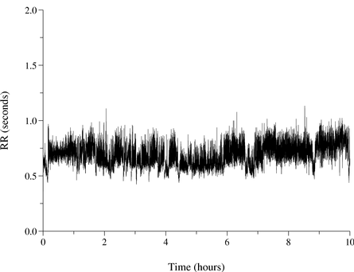
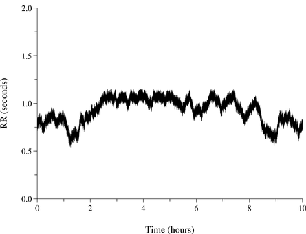

# RR Interval Time Series Modeling: The PhysioNet/Computing in Cardiology Challenge 2002 

### George Moody

## Announcements

**Algorithms from the PhysioNet/CinC Challenge 2002** (Sept. 26, 2002,
midnight)

The [RR interval time series
models](#files) that were entered into
event 1 of the [PhysioNet/Computers in Cardiology Challenge
2002](/2002/) are now available for study. Each of the ten
models is implemented as a self-contained C program that can generate a
synthetic RR interval time series of at least 24 hours’ duration.

**Results from the PhysioNet/CinC Challenge 2002** (May 9, 2002,
midnight)

The [top scores](top-scores) for the
PhysioNet/Computers in Cardiology Challenge 2002 have now been posted.
Congratulations to the winners, and thanks to all who participated!

**Event 2 of the PhysioNet/CinC Challenge 2002** (April 24, 2002,
midnight)

Event 2 of the [PhysioNet/Computers in Cardiology Challenge
2002](/2002/) has now begun. You are invited to match wits
with participants in event 1, who have created a variety of realistic
models of interbeat (RR) interval time series. Can you spot the
simulations hidden among the real data in the challenge dataset?

**PhysioNet/CinC Challenge 2002** (Feb. 14, 2002, midnight)

We are pleased to announce the latest in our annual series of
[PhysioNet/Computers in Cardiology
Challenges](../). The topic for this
challenge is [RR interval time series
modeling](2002/). Can you create a model
that produces realistic short-term and long-term variations in interbeat
intervals? Can you distinguish between synthetic and real RR interval
time series? Take the challenge!

### Citations

When using this resource, please cite the following publications:
<!-- todo -->

- The PhysioNet resource: [Goldberger, A., Amaral, L., Glass, L., Hausdorff, J., Ivanov, P. C., Mark, R., … & Stanley, H. E. (2000). PhysioBank, PhysioToolkit, and PhysioNet: Components of a new research resource for complex physiologic signals. Circulation [Online]. 101 (23), pp. e215-e220](https://www.ahajournals.org/doi/full/10.1161/01.CIR.101.23.e215)

### Introduction

We are pleased to announce the third in our annual series of
[challenges](/) from PhysioNet and
[Computers in Cardiology](http://www.cinc.org/). We received many
suggestions for challenge topics, and encourage you to [contact
us](https://moody-challenge.physionet.org/about/) with further suggestions. We
chose the topic for this year’s challenge not only for its intrinsic
interest, but also because it is quite different from the previous two
challenges.

Heart rate variability has attracted much attention from researchers
since the early 1980s. It has long been understood that a metronomic
heart rate is pathological, and that the healthy heart is influenced by
multiple neural and hormonal inputs that result in variations in
interbeat (RR) intervals, at time scales ranging from less than a second
to 24 hours. Even after 20 years of study, new analytic techniques
continue to reveal properties of the time series of RR intervals. Much
research in this area aims to discover or to explain how specific
changes in variability can be related to specific pathologies.

Given how much is known about heart rate variability, it might be
thought that simulating a realistic sequence of RR intervals would be an
easy task. The intricate interdependencies of variations at different
scales, however, make it difficult to create a simulation of sufficient
realism to mislead an experienced observer, and it may be even harder to
deceive a program designed to quantify these subtle features.

Each of the figures below shows a 10 hour time series of RR intervals at
the same scale (the range of heart rates is roughly 70 to 120 bpm in
each case). Can you identify which of these time series is synthetic?





It may be difficult to identify the synthetic data based on the figures;
you may download the RR interval time series in text form for [series
1](rr1.txt) and [series
2](rr2.txt) if you wish to inspect the data in
more detail. (Click [here](answer) for the
answer.)

Our challenge is therefore twofold: Can you construct a simulation of
the RR interval time series spanning a full 24 hours with sufficient
verisimilitude to be taken as real? Can you classify a mixed set of real
and simulated RR interval time series? As in previous challenges, we
awarded prizes of US\$500 to the most successful entrant in each of two
events.

### Organization of the Challenge

During the first eight weeks of the challenge, participants in event 1
created software that can generate synthetic RR interval time series.
Participants entered event 1 of the challenge by submitting a generator
(model) in source form by email (see the rules below). The period for
submitting entries for event 1 ended at noon GMT on Monday, 22 April
2002; no late entries can be accepted. We created two synthetic 24-hour
RR interval time series using each generator entered into the challenge.
We also created a number of additional synthetic series using generators
not entered into the challenge.

We have provided an approximately equal number of real 24-hour RR
interval time series. These were derived from long-term ECG recordings
of adults between the ages of 20 and 50 who have no known cardiac
abnormalities, similar to those included in the [MIT-BIH Normal Sinus
Rhythm Database](https://physionet.org/content/nsrdb/1.0.0/).
These recordings typically begin and
end in the early morning (within an hour or two of the subject’s
awakening). Small numbers of ectopic beats are common in such
recordings, as are short intervals of artifacts that may cause false
beat detections or missed beat detections. We have excluded recordings
with significant amounts of noise or ectopy.

The synthetic and real series have been assigned random identification
numbers in the challenge dataset, which was posted on PhysioNet on
Wednesday, 24 April 2002, marking the start of event 2.

Participants in event 2 have classified each series in the challenge
dataset as real, synthetic, or unknown (see the rules below). An
autoscorer received entries submitted using a web browser, and returned
scores by email to participants.

To qualify for an award in either event 1 or event 2, participants must
have submitted a valid set of classifications to the autoscorer no later
than noon GMT on Tuesday, 30 April 2002. All of the event 1 participants
did so.

To be eligible for an award, participants in event 1 were also required
to submit an abstract describing their work to [Computers in Cardiology
2002](http://www.cinc.org/), using the topic **D1 SYSTEMS: Heart rate
variability** when submitting their abstracts. Participants in event 2
were encouraged but not required to do this as well. **The abstract
submission deadline has now passed and no further abstracts may be
submitted.**

At Computers in Cardiology 2002 (in Memphis, 22-25 September 2002), a
prize of US\$500 was awarded to the top-scoring eligible participant in
each event. Immediately following the conference, the sources for the
models submitted for event 1 were posted on PhysioNet
([here](https://archive.physionet.org/challenge/2002/generators/)). We welcome
contributions of software for classifying series in event 2.

Members and affiliates of our research groups at MIT, Boston University,
Harvard Medical School, Beth Israel Deaconess Medical Center, and McGill
University are not eligible for awards, although all are welcome to
participate.

### Event 1 - Generating RR Interval Series

Participants in this event created and submitted programs that can
generate at least two distinct 24-hour simulated RR interval time
series. The qualified participant whose generator produces the most
realistic time series, as defined below, received an award of US\$500
(see the challenge results).

To avoid bias, the realism of the series was judged by the challenge
participants themselves, in event 2. The most recent set of
classifications from each qualified participant in event 2 received by
noon GMT on 30 April 2002 was used to score the generators. Participants
who have entered more than one generator will receive a separate score
for each generator.

*Update (25 February 2002):* The overall accuracy, $$a$$, of each event 2
participant (defined as the number of correct classifications made by
that participant divided by the number of series to be classified)
defines a weight

$$w=(a-0.5)^2+0.05$$

given to that participant’s classifications. Each generator receives
$$2w$$ points for each “real” classification if $$a>0.5$$,
$$2w$$ points
for each “synthetic” classification if $$a\leq 0.5$$, and $$w$$ points for
each “unknown” classification.

To qualify for an award in event 1, a participant must do all of the
following:

1.  Submit a [valid entry for event 1](#valid-1) no later than noon
    GMT on Monday, 22 April 2002.
2.  Submit a [valid entry for event
    2](#event-2) no later than
    noon GMT on Tuesday, 30 April 2002.
3.  Submit an abstract describing his or her generator to [Computers in
    Cardiology](http://www.cinc.org/), no later than Friday, 3 May 2002.
4.  Attend Computers in Cardiology 2002, 22-25 September 2002, in
    Memphis, Tennessee.

**Please note point 2 above!** You *must* enter event 2 in order to
qualify for an award in event 1. This rule was intended to insure that
participants in event 1 received feedback on the success of their
generators before the CinC abstract deadline.

Each participant was allowed to submit up to five generators, and each
was treated as a separate entry. Participants were permitted to replace
any of their previous entries with an improved version at any time until
noon GMT on Monday, 22 April 2002.

A prize of US\$500 will be awarded to the qualified participant whose
generator has received the highest score. If a tie had occured, scores
for the tying generators only would have been recalculated using all
classifications (not only the final classifications) from each qualified
participant. If a tie had remained, the date and time of submission
would have been the final tiebreaker.

### <a name="valid-1"></a>How to Submit a Valid Entry for Event 1

**The deadline for submitting entries for event 1 has passed, and no
more entries can be accepted.** If you have missed the deadline,
however, we encourage you to submit your generator anyway. If there is
sufficient interest, we will rerun the challenge at a later date.

Begin by downloading [`rrgen.c`](rrgen.c), which contains an example generator.

You will need to write functions in standard (ANSI/ISO) C to replace the
`initialize` and generate functions in the example:

-   `initialize` is called once, before generate is called the first time.
    Its first argument is a 32-bit (long) integer, which will be given a
    different random value each time this program is run as part of the
    challenge. Its second argument specifies the length of the
    simulation, in seconds.
-   `generate` is called once per RR interval. It should return the length
    of the next (simulated) RR interval in seconds.

In the challenge, your generator will be used to generate two series
that should be different (otherwise they will be rather easy to
recognize as synthesized!). Use the arguments to `initialize` to set up
the initial conditions for your simulation. You might use the first
argument as a seed for a random number generator as in the example.

If you prefer, you can do the entire simulation within `initialize`,
saving the results to an array; then generate can return one value from
the array each time it is invoked by main. Make sure the array is long
enough if you take this approach; you can use the second argument of
`initialize` to help determine the array length.

Although the challenge will be based on 24-hour simulations, make sure
that your generator can create longer time series (of at least 48
hours).

You may, if necessary:

-   define additional functions
-   define global variables
-   include other ANSI/ISO C standard header (`.h`) files
-   allocate memory as needed using `malloc` or similar functions
-   invoke other functions from the ANSI/ISO C standard library and math
    library
-   create temporary files in the current directory

If you create temporary files, do so within the current directory only,
and use file names beginning with `temp`. Any files created will be
removed between runs (you cannot save information from one run to use in
another).

You may not:

-   modify `main`
-   write to the standard output (`main` does this, but your code may not)
-   use `chdir` or any other means to change the current directory
-   invoke `fork`, `system`, or any of the `exec` family of functions to start
    another program or another process
-   incorporate portions of real (physiologic) RR interval sequences in
    the output
-   incorporate code or data that cannot be made freely available after
    the conclusion of the Challenge

All code will be reviewed before being compiled or run. Please keep your
code neat. If we can’t figure out what your program does, we won’t run
it!

All code must compile cleanly using:

    gcc -Wall rrgen.c -lm

There must be no errors or warnings of any kind.

Your program must run to completion within a reasonable time. A
reasonable time is 1 minute or less for a 24-hour simulation running on
a 1 GHz Athlon under Linux; we will not disqualify programs that
slightly exceed this limit. For reference, the example program generates
24 hours of simulated data in roughly 0.2 seconds, so if your program is
no more than about 300 times slower than the example, it should be fine.

All programs entered will be posted with full credit to their authors on
PhysioNet following the conclusion of the Challenge, and will be made
freely available under the [GPL](http://www.gnu.org/licenses/gpl.txt)
(or another [open source license](https://opensource.org/licenses/)
if you prefer).

Test your entry before submitting it. Don’t forget to include your
name, affiliation, and email address in the comment block at the top of
the file. Once you are ready, send a copy of your program (source only;
do not send binaries) via email to
[webmaster@physionet.org](mailto:webmaster@physionet.org?subject=rrgen.c)
with a subject line of rrgen.c. Please send the source file as plain
text, not as HTML or as a word-processor formatted attachment.

Participants received an email confirmation of their entry once it had
been reviewed. If a generator failed to meet any of the requirements for
a valid entry, participants were advised that the email would indicate
in general terms the nature of the problem (e.g., compilation error),
but that they would be responsible for debugging their programs. Several
entries that arrived shortly before the deadline had very minor
problems, which were corrected by the challenge organizer and returned
to their authors for review. Each generator that met all requirements
for a valid entry was assigned an entry number, which was indicated in
the email confirmation.

## Event 2: Classification

Participants in this event attempt to determine which members of the
[challenge dataset](../#files) of RR interval time
series are synthesized, and which are real.

Participants will classify each series as real, simulated, or unknown,
and will submit their classifications to an autoscorer. Scores will be
returned by email. Each correct classification increases the score by 2
points, and each incorrect classification reduces the score by 1 point.
The qualified participant who received the highest final score (see
below) received an award of US\$500. Since a tie occurred, the date and
time of submission is the tiebreaker.

To qualify for an award in event 2, a participant must do all of the
following:

1.  Submit a valid entry for event 2 no later than noon GMT on Tuesday,
    30 April 2002.
2.  Attend Computers in Cardiology 2002, 22-25 September 2002, in
    Memphis, Tennessee.

Participants in event 2 were encouraged but not required to submit an
abstract describing their methods of classifying the challenge dataset
to Computers in Cardiology 2002, no later than Friday, 3 May 2002.

Participants may submit up to five sets of classifications, but only the
final score received by each participant will be used to determine the
outcome of this event. (Each submission cancels any previous score;
scores are not cumulative.) Invalid submissions are not scored and do
not count against the limit of five submissions.

If you have missed the 30 April 2002 deadline for submitting your first
set of classifications, we still encourage you to participate
unofficially. If you receive a high final score, your achievement will
be recognized on this web site. If you are able to attend Computers in
Cardiology, you will have an opportunity to discuss your work informally
with other participants.

## Important Dates

All deadlines are at noon GMT unless otherwise indicated. Late entries
will not be accepted.

**Monday, 22 April 2002**
:   Deadline for submission of generators in event 1.

**Wednesday, 24 April 2002**
:   Event 2 begins when the challenge dataset, consisting of the time
    series to be classified, is posted.

**Tuesday, 30 April 2002**
:   To qualify for an award in either event, submit a valid entry in
    event 2 by noon GMT on this date.

**Friday, 3 May 2002**
:   Deadline for submission of abstracts for Computers in
    Cardiology 2002.

**Sunday-Wednesday, 22-25 September 2002**
:   Computers in Cardiology, Memphis, Tennessee

## Frequently Asked Questions

**Must I enter both events in order to participate?**

No. Event 1 is optional. Event 2 is required of all participants.

**I’ve entered both events. Do my classifications of my own synthesized
series count?**

Yes, for both events. If your generator is a good one, you may find it
difficult to identify its output, however! Attempts to “watermark”
your output so that you can identify it will be rejected.

**Does each synthesized series get its own event 1 score?**

Each series in the challenge dataset gets a partial score that reflects
how it was classified. These will be posted at the conclusion of the
challenge.

The partial scores of the two series created using each generator are
added to obtain the score for that generator. The generators’ scores
determine the winner of event 1.

**Why did you change the scoring for event 1?**

The weighting factor $$w$$ was introduced so that a generator gets
significantly more credit for misleading a really good classifier than
for misleading one whose classifications are no better than random. The
values of $$w$$ are symmetric about $$a = 0.5$$ because a classifier who
misclassifies everything is clearly able to tell the difference between
real and synthesized data despite a fundamental confusion about which is
which! We’ve added a small positive bias to $$w$$ so that even the
coin-tossers’ contributions will have a (small) effect.

**What is the significance of SPS in `rrgen.c`?**

SPS is the sampling frequency (in samples per second), which determines
how the RR intervals are quantized. All RR intervals in the real time
series have lengths that are exact multiples of (1/SPS) seconds, but
these have then been converted to a decimal representation with 3 digits
after the decimal point. If SPS is 128, for example, intervals such as
0.992, 1.000, 1.008, 1.016, and 1.023 seconds are possible in the real
time series, but intermediate values such as 1.001 or 1.002 do not
occur. `rrgen`’s main function uses SPS in a calculation to ensure that
the only RR interval values that appear in the synthesized time series
are those that can also occur in the real time series. In most cases,
you won’t need to refer to SPS explicitly in your code, but it’s there
if you need it.

The challenge dataset may include real series with a variety of sampling
frequencies between 120 and 1000 samples per second. The synthesized
series in the challenge data set will be produced using generators
compiled with a similar variety of SPS values, so that it will not be
possible to identify the real series simply by looking at the
distribution of “forbidden” RR interval values. (Update 24 April: All
of the series use the same sampling frequency, 128 samples per second.)

**I’ve already entered event 1 five times, and now I have a better
generator. Can I enter it?**

If you have previously received entry numbers for the maximum of five
generators, you may enter another generator only if you replace a
previously accepted generator. To do this, simply tell us (at the
beginning of your new entry) the entry number for the generator you wish
to replace (e.g., “This entry should replace entry number 38.”) If
your replacement is accepted, it will be assigned a new entry number;
otherwise your original entry will remain in the challenge.

**There is a limit of 5 trials in event 2, but one can try as many times
as one needs, asking friends or using different email addresses. And if
there is no limit on the number of trials, since you return immediately
the score, one can proceed by trial and error in order to detect what is
real and what is not. I wonder if I missed something.**

If you are tempted to try submitting many entries in order to learn
about the correct classifications, why not play
[Mastermind](https://www.onlinespiele-sammlung.de/mastermind/mastermindgames/lizardpoint/)
instead, where such a strategy is rewarded? We will reject obvious
attempts to circumvent the spirit of the challenge in this way.

**How old are the “normal” subjects whose RR interval time series are
included in the challenge dataset? Are they active over the 24 hours
(e.g., were the recordings taken with an ambulatory monitor) or were
they bed-bound (but otherwise healthy)?**

The normals are men and women between the ages of 20 and 50, engaged in
their usual activities of daily life. Interbeat intervals were obtained
using automated analysis (with some manual review and corrections) of
ambulatory (Holter) ECG recordings.

**Could you elaborate on the reference to “manual review and
correction” please? I am assuming that the reviewers removed ectopic
beats (those with an RR interval \<80% or \>120% of the previous RR
interval) and replaced them with a beat where an expert would have
expected one. Should we therefore not worry about generating the odd
ectopic beat (or at least removing the odd beat as if an ectopic had
occured and an expert/algorithm had removed it without replacing it)?**

No, intervals surrounding ectopic beats are not removed or otherwise
adjusted in the real time series. The challenge data set includes only
series that have very little or no ectopy. Whatever ectopic beats may be
present are marked at their times of occurrence, so that you should
expect to see (for example) a few short intervals that precede premature
atrial or ventricular beats, and long (compensatory) intervals following
premature ventricular beats.

The manual review and corrections have been applied to the original ECG
recordings, not to the interbeat interval time series. This process
typically involves visual inspection of the longest and shortest
detected intervals in each case (which tends to reveal not only ectopic
beats but also beats that were not detected automatically and detections
that were not beats). Ideally, the output of this process includes the
times of occurence of each beat, including any ectopic beats. The
interbeat interval time series are prepared from these data without
further corrections. Update 24 April: Some of the normals have not been
manually corrected.

Participants in event 1 should consider these points carefully. You may
wish to generate an interbeat interval time series that results from a
beat sequence that includes rare isolated ectopic beats and short
periods of signal loss.

### Challenge Results

This year’s challenge scoring had an unusual twist: scores for event 1
were determined by entries in event 2, and vice versa. The outcome of
event 2 was determined very quickly. Rather than continuing both events
until 20 September as originally announced, we collected event 2 entries
until the deadline for official entrants (noon GMT on 30 April) had
passed, and then determined final scores for event 1.

If you did not have a chance to submit an official entry, we encourage
you to participate anyway; you can still submit classifications of the
challenge dataset and receive an unofficial score. Unofficial event 1
entries are also welcome; if there is sufficient interest, we will run a
second round of this challenge, using new RR interval generators and a
new dataset.

Winners of each event received awards during September’s [Computers in
Cardiology](http://www.cinc.org/) conference, where participants
presented their work. The RR interval generators submitted by event 1
participants are available in the “generators” folder.

Brief descriptions of the methods used can be viewed by following the
links in the tables below to abstracts submitted by many of the entrants
for presentation at Computers in Cardiology 2002.

**Event 1 (generating RR interval series)**

The top scorers in event 1 are:

| Place   | Entry number                                              | Entrant                                                                                                                                                                                                                                             | Score |
| 1       | [192](submissions/generators/rrgen-192.c) | [DC Lin](submissions/s41-5+6)<br />Ryerson University, Toronto, Canada                                                                                                                                                          | 3.452 |
| 2       | [171](submissions/generators/rrgen-171.c) | [Dragan Gamberger, Ivan Maric, Tomislav Smuc, Gordan Bosanac, Nikola Bogunovic, Goran Krstacic](submissions/s51-5)<br /> Rudjer Boskovic Institute, Institute for Cardiovascular Prevention and Rehabilitation, Zagreb, Croatia | 1.494 |
| 3       | [142](submissions/generators/rrgen-142.c) | [Albert C-C Yang, Cheng-Hsi Chang, SS Hseu, Huey-Wen Yien](submissions/s51-2)<br />Taipei Veterans General Hospital<br />School of Medicine, National Yang-Ming University, Taipei, Taiwan                                      | 0.689 |
| 4       | [201](submissions/generators/rrgen-201.c) | [PE McSharry, GD Clifford](submissions/generators/s41-1+s51-1)<br />Dept Maths & Dept Engineering, University of Oxford, Oxford, UK                                                                                                        | 0.497 |
| 5 (tie) | [153](submissions/generators/rrgen-153.c) | Manojit Roy<br />University of Michigan, Ann Arbor, Michigan, USA                                                                                                                                                                                   | 0.202 |
| 5 (tie) | [161](submissions/generators/rrgen-161.c) | Miguel A. García-González, Juan Ramos-Castro<br /> Instrumentation and Bioengineering Division, Electronic Engineering Department, Universitat Politècnica de Catalunya, Barcelona, Spain                                                           | 0.202 |
                                                                                   
**Event 2 (classification)**

Six participants received perfect scores in event 2 before the deadline
for official entrants had passed. The winner was Albert C-C Yang, who
not only achieved a perfect score on his first attempt, but also
submitted the first entry received for event 2, only a few hours after
the challenge dataset was posted.

Perfect scores of 100 were received by:


| Date                 | Entrant                                                                                                                                                        | Entries |
| 25 Apr<br />1028 GMT | [Albert C-C Yang](submissions/s51-2)<br />National Yang-Ming University, Taipei, Taiwan                                                    | 1 |
| 25 Apr<br />1505 GMT | Sang H Yi, Seon H Kim, C Yoo, K Park<br />Inje University, Korea                                                                                               | 2 |
| 26 Apr<br />1222 GMT | [FE Smith, Emma Bowers, Philip Langley, John Allen, Alan Murray](submissions/s51-3+4)<br />Freeman Hospital, Newcastle upon Tyne, UK       | 1 |
| 26 Apr<br />1818 GMT | [N Wessel](submissions/s41-2)<br />University of Potsdam, Germany                                                                          | 1 |
| 27 Apr<br />0952 GMT | [Tomislav Smuc](submissions/s51-5)<br />Rudjer Boskovic Institute, Zagreb, Croatia                                                         | 2 |
| 28 Apr<br />1459 GMT | [H Malberg](submissions/s41-2)<br />Karlsruhe Research Center, Germany                                                                     | 1 |

Three other teams of participants, who did not receive perfect scores
before the deadline, also used novel automated methods to classify the
challenge dataset for their entries in event 2 (follow the links to read
the abstracts of the papers describing these methods):

- [GD Clifford, PE McSharry](submissions/s41-1+s51-1)\ 
  University of Oxford, Oxford, UK
- [M Costa, AL Goldberger, CK Peng](submissions/s41-3)\
  Harvard Medical School, Boston, Massachusetts, USA\
- [JC Echeverría, MS Woolfson, JA Crowe, BR Hayes-Gill](submissions/s41-4)\
  University of Nottingham, UK

## Papers

These papers were presented at Computers in Cardiology 2002.

- [RR Interval Time Series Modeling: The Physionet/Computers in
  Cardiology Challenge
  2002](http://www.cinc.org/archives/2002/pdf/125.pdf)\
  GB Moody
- [Characterizing Artefact in the Normal Human 24-Hour RR Time Series to
  Aid Identification and Artificial Replication of Circadian Variations
  in Human Beat to Beat Heart Rate using a Simple
  Threshold](http://www.cinc.org/archives/2002/pdf/129.pdf)\
  GD Clifford, PE McSharry, L Tarassenko
- [Classifying Simulated and Physiological Heart Rate Variability
  Signals](http://www.cinc.org/archives/2002/pdf/133.pdf)\
  N Wessel, H Malberg, U Meyerfeldt, A Schirdewan, J Kurths
- [Multiscale Entropy to Distinguish Physiologic and Synthetic RR Time
  Series](http://www.cinc.org/archives/2002/pdf/137.pdf)\
  M Costa, AL Goldberger, CK Peng
- [CinC Challenge 2002 Undertaken by Non-Stationary and Fractal
  Techniques](http://www.cinc.org/archives/2002/pdf/141.pdf)\
  C Echeverría, MS Woolfson, JA Crowe, BR Hayes-Gill
- [A Multifractal Inverse Problem Applied to Heart Rate Data
  Synthesis](http://www.cinc.org/archives/2002/pdf/145.pdf)\
  DC Lin, J Thevaril
- [Simulate Heart Rate Variability in Different Physiological
  Conditions](http://www.cinc.org/archives/2002/pdf/149.pdf)\
  DC Lin
- [Method for Generating an Artificial RR Tachogram of a Typical Healthy
  Human over 24-hours](http://www.cinc.org/archives/2002/pdf/225.pdf)\
  PE McSharry, G Clifford, L Tarassenko, LA Smith
- [Simulating Healthy Humans Heart Rate: a Markovian
  Model](http://www.cinc.org/archives/2002/pdf/229.pdf)\
  CC Yang, CH Chang, SS Hseu, HW Yien
- [Simulation of Cardiac RR Interval Time
  Series](http://www.cinc.org/archives/2002/pdf/233.pdf)\
  EJ Bowers, P Langley, MJ Drinnan, J Allen, FE Smith, A Murray
- [Heart Rate Variability Characteristics Required for Simulation of
  Interval Sequences](http://www.cinc.org/archives/2002/pdf/237.pdf)\
  FE Smith, EJ Bowers, P Langley, J Allen, A Murray
- [Dynamic Features of the Normal Heart Rate
  Variability](http://www.cinc.org/archives/2002/pdf/241.pdf)\
  T Smuc, I Maric, G Bosanac, D Gamberger, N Bogunovic, G Krstacic


 
## Files

### Access Policy
Anyone can access the files, as long as they conform to the terms of the
specified license.

### License (for files)
[Open Data Commons Attribution License
v1.0](https://physionet.org/content/challenge-2002/view-license/1.0.0/)

### Access the files

-   [Download the ZIP
    file](https://physionet.org/static/published-projects/challenge-2002/rr-interval-time-series-modeling-the-physionetcomputing-in-cardiology-challenge-2002-1.0.0.zip)
    (35.1 MB)

-   Access the files using the Google Cloud Storage Browser
    [here](https://console.cloud.google.com/storage/browser/challenge-2002-1.0.0.physionet.org/).
    Login with a Google account is required.

-   Access the data using the Google Cloud command line tools (please
    refer to the
    [gsutil](https://cloud.google.com/storage/docs/gsutil_install)
    documentation for guidance):

    ``` shell-command
    gsutil -m -u YOUR_PROJECT_ID cp -r gs://challenge-2002-1.0.0.physionet.org DESTINATION
    ```

-   Download the files using your terminal:

    ``` shell-command
    wget -r -N -c -np https://physionet.org/files/challenge-2002/1.0.0/
    ```
