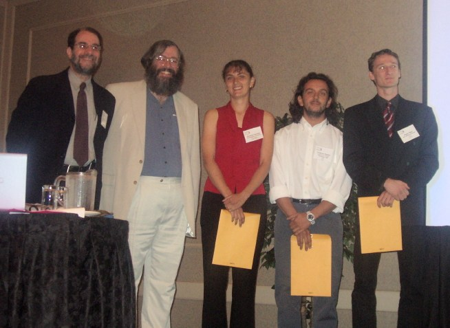

# Computers in Cardiology Challenge 2004 Top Scores (Final)

Over twenty teams participated in this year’s Challenge, on the topic
of [predicting if (or when) an episode of atrial fibrillation will
self-terminate](/2004/).

During September’s [Computers in
Cardiology](http://www.cinc.org/)
conference, we presented four awards to eligible participants in this
year’s challenge. In each event, an overall best award went to the
top-scoring team, and a “best open source” award went to the
top-scoring team among those who contributed the source code for their
entries. The overall award in event 1 was presented to Dieter Hayn and
his colleagues, and the overall award in event 2, as well as the “best
open source” awards in both events, were won by Federico Cantini and
his colleagues.

> The challenge organizers congratulate the top scorers in Challenge
> 2004.\
> Left to right: Steve Swiryn, George Moody, Simona Petrutiu, Federico
> Cantini, Dieter Hayn.

We wish to thank all those who participated in the challenge and in the
lively and illuminating discussions during the scientific sessions of
Computers in Cardiology. Brief descriptions of the methods used can be
viewed by following the links in the tables below to abstracts submitted
by the entrants for presentation at Computers in Cardiology 2004.

## Event 1 (sustained vs. self-terminating AF)

The maximum possible score in event 1 was 30. The top scorers were:

| Score               | Entrant                                                                                                                                                                                                                                                                   |
| 29 (97%)[\*](#note) | [S Petrutiu, AV Sahakian, J Ng, S Swiryn](s31-2) Northwestern University, Evanston, Illinois, USA                                                                                                                                                                |
| 28 (93%)            | [D Hayn, K Edegger, D Scherr, P Lercher, B Rotman, W Klein, G Schreier](s31-5)  ARC Seibersdorf Research GmbH  Medical University of Graz, Austria                                                                                                          |
| 27 (90%)            | [F Cantini, F Conforti, M Varanini, F Chiarugi, G Vrouchos](s31-6)  CNR Institute of Clinical Physiology, Pisa, Italy  ICS-FORTH, Heraklion, Greece  ICU-CCU Dept,. Venizeleio-Pananeio Hospital, Heraklion, Greece  [\[Software\]](https://physionet.org/files/challenge-2004/1.0.0/cantini-src/) |
| 27 (90%)            | [M Lemay, Z Ihara, JM Vesin, L Kappenberger](s91-5)  EPFL - CHUV, Lausanne, Switzerland                                                                                                                                                                          |
| 27 (90%)            | [F Castells, C Mora, R Ruiz, JJ Rieta, J Millet, C Sanchez, S Morell](s31-3)  Universidad Politécnica de Valencia  Hospital Clinico Universitario de Valencia  Universidaa de Castilla la Mancha, Cuenca, Spain                                        |
| 27 (90%)            | [F Nilsson, M Stridh, A Bollmann, L Sörnmo](s91-2)  Lund University, Sweden  Good Samaritan Hospital and Harbor-UCLA Medical Center, Los Angeles, California, USA                                                                                           |

## Event 2 (AF terminating in one minute vs. immediately)

The maximum possible score in event 1 was 20. The top scorers were:

| Score                | Entrant                                                                                                     |
| 20 (100%)[\*](#note) | [S Petrutiu, AV Sahakian, J Ng, S Swiryn](s31-2)  Northwestern University, Evanston, Illinois, USA |
| 18 (90%)             | [F Cantini, F Conforti, M Varanini, F Chiarugi, G Vrouchos](s31-6)  CNR Institute of Clinical Physiology, Pisa, Italy  ICS-FORTH, Heraklion, Greece  ICU-CCU Dept,. Venizeleio-Pananeio Hospital, Heraklion, Greece  [\[Software\]](cantini-src/)  |
| 18 (90%) | [B Logan, J Healey](s91-1)  Hewlett Packard Laboratories, Cambridge, MA, USA |
| 16 (80%) | [Q Xi, S Shkurovich](s31-4) St. Jude Medical, Sylmar, CA, USA                |
| 16 (80%) |  [D Hayn, K Edegger, D Scherr, P Lercher, B Rotman, W Klein, G Schreier](s31-5)  ARC Seibersdorf Research GmbH  Medical University of Graz, Austria |

\* The top-scoring entry in each of the two events came from
the research group of Steven Swiryn of Northwestern University, who had
contributed the
[data](https://www.physionet.org/physiobank/database/aftdb/)
used in the challenge. Although these entries were thus ineligible for
an award, Simona Petrutiu and her coauthors did not have access to any
information beyond what was available to all of the participants, and we
wish to recognize her extraordinary achievement in achieving a
near-perfect score in event 1 and a perfect score in event 2.

Four additional teams of participants also described their approaches to
the challenge:

- [AN Esgiar, PK Chakravorty](s91-3)\
  University of Al Tahadi, Sirte, Libya
- [P Langley, J Allen, EJ Bowers, MJ Drinnan, EV Garcia, ST King, T
  Olbrich, AJ Sims, FE Smith, J Wild, D Zheng, A Murray](m8-3)\
  Medical Physics Dept, Freeman Hospital, Newcastle upon Tyne, UK
- [LT Mainardi, M Matteucci, R Sassi](s91-4)\
  Dipartimento di Bioingegneria, Politecnico di Milano, Milano, Italy\
  Dipartimento di Elettronica e Informazione, Politecnico di Milano,
  Milano, Italy\
  Dipartimento di Tecnologie dell Informazione, Universit di Milano,
  Crema, Italy
- [FM Roberts, RJ Povinelli](s91-6)\
  Marquette University, Milwaukee, WI, USA

## Links:

-   Read about the [PhysioNet/Computers in Cardiology Challenge
    2004](/2004).
    Although the competition has ended, you may still submit your
    results for (unofficial) scoring.
-   For additional information about the challenge, see
    > [GB Moody, Spontaneous Termination of Atrial Fibrillation: A Challenge
    > from PhysioNet and Computers in Cardiology 2004](https://www.cinc.org/archives/2004/pdf/101.pdf). *Computers in
    > Cardiology* **31**, 2004.
-   The correct classifications are available for [event
    1](event-1-answers) and [event 2](event-2-answers). (But wait! Are
    you sure you don’t want to try the challenge first?)
-   Read about [Computers in Cardiology
    2005](http://www.cinc.org/),
    which will be held in Lyon, France, 25-28 September.
-   Read about our previous [PhysioNet/Computers in Cardiology
    Challenges](https://www.physionet.org/challenge/).
-   Do you have a data set that can help in creating a future challenge?
    Please [send us your
    ideas](/mailto:webmaster@physionet.org?subject=Topic/Data%20for%20Challenge)!
