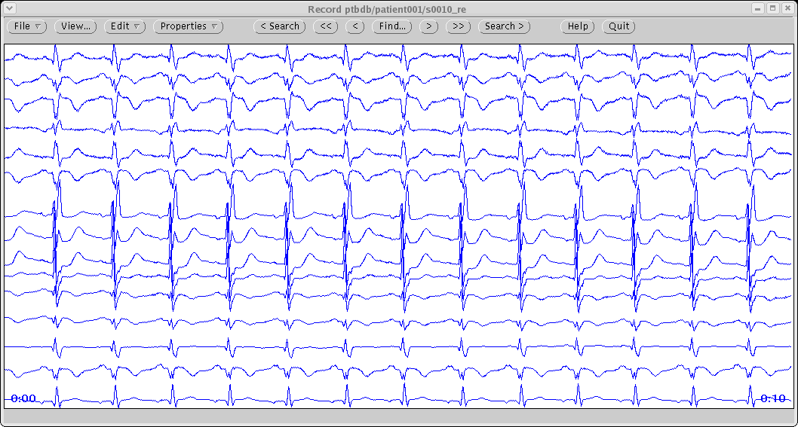
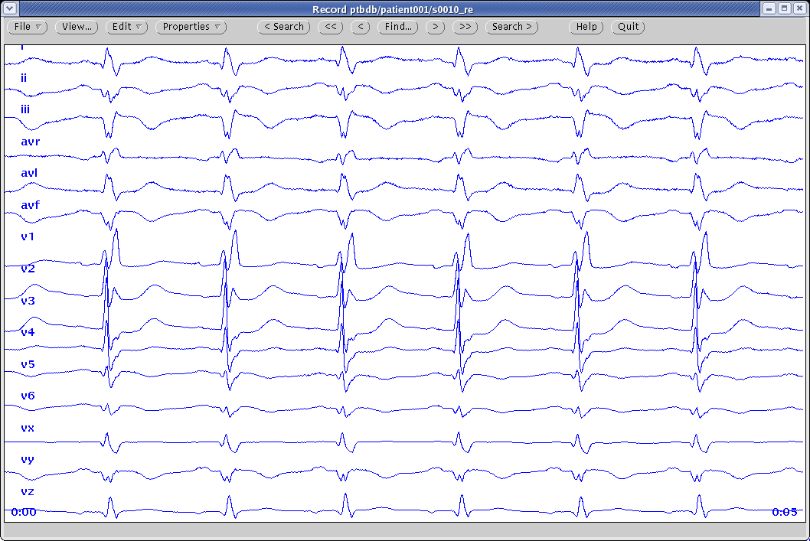
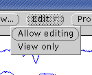
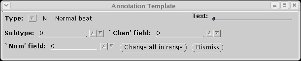
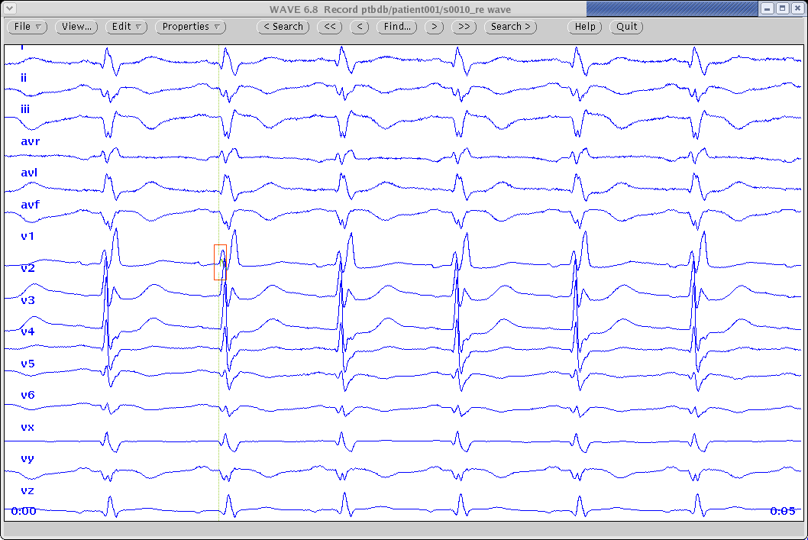

## Measuring a QT interval in Challenge 2006: an example

To illustrate what needs to be done by participants in the
PhysioNet/Computers in Cardiology Challenge 2006, let’s make a set of
manual measurements for one record (the first one in the challenge
database). From the [entry form](../template.txt), we can see that this is
the record named `patient001/s0010_re`:

    # must be measured for divisions 2 and 3.  Follow the format in this example:
    
    # Record name         PQ time  T-end time
    # patientxxx/sxxxxxxx   1519    1834
    
    # If you elect to omit measurements for a record, leave the line containing
    # the name of that record unmodified.
    
    patient001/s0010_re
    patient001/s0014lre
    patient001/s0016lre

If you wish to work through this example, begin by installing the [WFDB
Software Package](https://physionet.org/physiotools/wfdb.shtml),
which allows us to view and
measure the data directly from the PhysioNet web server. Follow the
quick-start instructions for your platform, which include installation
of an X11 server if you don’t have one already. Start the X server as
described in the quick-start instructions.

We can use the [WAVE](https://physionet.org/physiotools/wug/)
application from the WFDB
Software Package to open the record we wish to measure, by typing the
command

    wave -r ptbdb/patient001/s0010_re

The prefix `ptbdb/` tells WAVE that the record we wish to view belongs to
the PTB Database. WAVE looks for a local copy of this record first, but
unless you have already downloaded the data, WAVE will find and read the
record directly from the PhysioNet web server, beginning with the URL

    http://physionet.org/physiobank/database/ptbdb/patient001/s0010_re.hea

The suffix `.hea` specifies the (text) “header file” for the record;
WAVE reads this file first in order to find out what signals are
available, where to find the digitized signals, what format has been
used to store them, etc.

When WAVE’s main window opens, it should look similar to this:

By resizing the window, clicking the “View\...” button, and choosing
appropriate options from the View menu, and then clicking “Redraw”, we
can get an expanded view of the first few seconds of the record, like
this:  (Recommended choices on the View
menu: “markers”, “signal names”, time scale 50 mm/sec or larger.)

Let’s choose the second QRST as the representative beat in this case.
(It’s a good idea to avoid using the first beat in any record, since we
don’t know if the previous beat was typical.) We will need to make two
annotations, so we enable editing first by right-clicking on the
“Edit” button, and selecting “Allow editing” from the drop-down menu
that appears:\

Now left-click anywhere over the signals, so that the “Annotation
Template” window appears:\

For this exercise, we don’t need to set any values in the Annotation
Template, but it must be open in order to annotate the record.

Next we can point to the PQ junction in lead II (ii, the second from the
top), and middle-click at the desired location. (If the location isn’t
the one you wish, drag the marker bar to the correct location before
releasing the middle mouse button.) Doing this inserts an annotation
attached to the PQ junction, which appears as a bar across all signals:

We can insert a second annotation to mark the end of the T-wave: 

Note: neither of these markers is properly placed; the location of the
PQ junction is slightly right of the first marker, and that of the
T-wave end is to the left of the second marker. If you work through this
example, use your own judgement to get a more accurate QT interval
measurement.

Now we can exit from WAVE, and use rdann to examine the annotations we
have just made, by running the command:

    rdann -r ptbdb/patient001/s0010_re -a wave

This command types the annotations as text, like this:

    0:01.345     1345     N    0    0    0
    0:01.776     1776     N    0    0    0

Each line corresponds to one annotation. The second column contains the
times in milliseconds that we need to record in the entry form (1345 for
the PQ junction, 1776 for the T-wave end). When we transcribe them into
the form, it will look like this:

    # must be measured for divisions 2 and 3.  Follow the format in this example:
    
    # Record name         PQ time  T-end time
    # patientxxx/sxxxxxxx   1519    1834
    
    # If you elect to omit measurements for a record, leave the line containing
    # the name of that record unmodified.
    
    patient001/s0010_re   1345    1776
    patient001/s0014lre
    patient001/s0016lre

Be sure that the numbers you enter are separated from the record name
and from each other by at least one space or tab (multiple spaces and
tabs are OK, but other field separators should be avoided). Enter the
times as integer values in milliseconds (e.g., “`1345`”, not “`1.345`”).
The measured QT interval in this case is 1776 - 1345 = 431 milliseconds.
We don’t need to enter this value explicitly, because it will be
calculated from the difference between the T end and the PQ times.

For an eligible entry in division 1, we would need to repeat this
procedure for at least half of the records in the challenge database.
Before doing so, we recommend reading the [WAVE User’s
Guide](https://physionet.org/physiotools/wug/)
to learn how to use more of WAVE’s features;
considerable time savings are possible.

Before submitting your entry, be sure to fill in your name, email
address, and the division in which your entry belongs.
