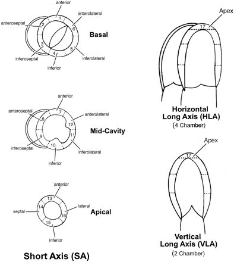
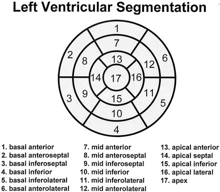

These figures are reproduced from:

> M.D. Cerqueira, N.J. Weissman, V. Dilsizian, A.K. Jacobs, S. Kaul, et al. [Standardized myocardial segmentation and nomenclature for tomographic imaging of the heart](http://circ.ahajournals.org/cgi/content/full/105/4/539) Circulation, 105:539-542, 2002. 
