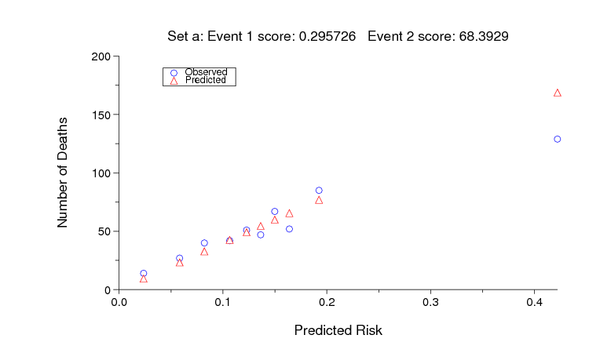

# Predicting Mortality of ICU Patients: The PhysioNet/Computing in Cardiology Challenge 2012 

### Ikaro Silva, George Moody, Roger Mark, Leo Anthony Celi

## Announcements 

**Community forum for the 2012 PhysioNet/CinC Challenge** (Sept. 1,
2012, 2:40 p.m.)

If you have any questions or comments regarding this challenge, please
post it directly in our [Community Discussion
Forum](https://groups.google.com/forum/#!forum/physionet-challenges).
This will increase transparency (benefiting all the competitors) and
ensure that all the challenge organizers see your question.

**Final scores in the PhysioNet/CinC Challenge 2012** (Aug. 31, 2012,
12:45 a.m.)

Final scores in the PhysioNet/CinC Challenge 2012 have now been posted.
Participants will present their work on the challenge, which focuses on
predicting mortality of ICU patients, at CinC 2012 in Krakow, 9-12
September.

**Submit a Phase 2 Challenge Entry Now** (June 4, 2012, 6:40 p.m.)

Phase 2 of the PhysioNet/Computing in Cardiology Challenge 2012
(Predicting mortality of ICU patients) is now open, and participants may
submit entries until 25 August. If you missed Phase 1, you are still
welcome to participate unofficially in Phase 2.

**Submit a prelminary Challenge Entry (closed 25 April)** (March 27,
2012, 2 a.m.)

Registration for the PhysioNet/Computing in Cardiology Challenge 2012 is
now open, and registered participants may submit entries. This year’s
challenge focuses on predicting mortality of ICU patients. Submit a
preliminary entry by 25 April.

**PhysioNet/Computing in Cardiology Challenge 2012 Opens** (Jan. 20,
2012, 9 p.m.)

This year’s challenge focuses on methods for predicting ICU mortality,
using a rich set of physiologic and clinical variables collected from
12,000 patients.

## Citations

When using this resource, please cite the following publications:

- The PhysioNet Challenge description paper: [Ikaro S., George M., Roger M., Leo A. C. (2012). Predicting Mortality of ICU Patients: The PhysioNet/Computing in Cardiology Challenge 2012. Computers in Cardiology 39, pp. 245-248.](https://www.cinc.org/archives/2012/pdf/0245.pdf)
- The PhysioNet resource: [Goldberger, A., Amaral, L., Glass, L., Hausdorff, J., Ivanov, P. C., Mark, R., … & Stanley, H. E. (2000). PhysioBank, PhysioToolkit, and PhysioNet: Components of a new research resource for complex physiologic signals. Circulation [Online]. 101 (23), pp. e215-e220](https://www.ahajournals.org/doi/full/10.1161/01.CIR.101.23.e215)

### Introduction

The development of methods for prediction of mortality rates in
Intensive Care Unit (ICU) populations has been motivated primarily by
the need to compare the efficacy of medications, care guidelines,
surgery, and other interventions when, as is common, it is necessary to
control for differences in severity of illness or trauma, age, and other
factors. For example, comparing overall mortality rates between trauma
units in a community hospital, a teaching hospital, and a military field
hospital is likely to reflect the differences in the patient populations
more than any differences in standards of care. Acuity scores such as
APACHE and SAPS-II are widely used to account for these differences in
the context of such studies.

By contrast, the focus of the PhysioNet/CinC Challenge 2012 is to
develop methods for patient-specific prediction of in-hospital
mortality. Participants will use information collected during the first
two days of an ICU stay to predict which patients survive their
hospitalizations, and which patients do not.

### Data for the Challenge

The data used for the challenge consist of records from 12,000 ICU
stays. All patients were adults who were admitted for a wide variety of
reasons to cardiac, medical, surgical, and trauma ICUs. ICU stays of
less than 48 hours have been excluded. Patients with DNR (do not
resuscitate) or CMO (comfort measures only) directives were not
excluded.

Four thousand records comprise *training set A*, and the remaining
records form *test sets B and C*. Outcomes are provided for the training
set records, and are withheld for the test set records.

Up to 42 variables were recorded at least once during the first 48 hours
after admission to the ICU. Not all variables are available in all
cases, however. Six of these variables are *general descriptors*
(collected on admission), and the remainder are *time series*, for which
multiple observations may be available.

Each observation has an associated *time-stamp* indicating the elapsed
time of the observation since ICU admission in each case, in hours and
minutes. Thus, for example, a time stamp of `35:19` means that the
associated observation was made 35 hours and 19 minutes after the
patient was admitted to the ICU.

Each record is stored as a comma-separated value (CSV) text file. To
simplify downloading, participants may download a zip file or tarball
containing all of training set A or test set B. Test set C will be used
for validation only and will not be made available to participants.

*Update (8 May 2012):* The extraneous ages that were present in the
previous versions of some data files have been removed, and a new
general descriptor (*ICUType*, see below) has been added in each data
file.

Five additional *outcome-related descriptors*, described below, are
known for each record. These are stored in separate CSV text files for
each of sets A, B, and C, but only those for set A are available to
challenge participants.

*All valid values for general descriptors, time series variables, and
outcome-related descriptors are non-negative* (≥ 0). A value of -1
indicates missing or unknown data (for example, if a patient’s height
was not recorded).

### General Descriptors

As noted, these six descriptors are collected at the time the patient is
admitted to the ICU. Their associated time-stamps are set to 00:00 (thus
they appear at the beginning of each patient’s record).

-   *RecordID* (a unique integer for each ICU stay)
-   *Age* (years)
-   *Gender* (0: female, or 1: male)
-   *Height* (cm)
-   *ICUType* (1: Coronary Care Unit, 2: Cardiac Surgery Recovery Unit,
-   3: Medical ICU, or 4: Surgical ICU)
-   *Weight* (kg)[\*](#weight-note)

The ICUType was added for use in Phase 2; it specifies the type of ICU
to which the patient has been admitted.

### Time Series

These 37 variables may be observed once, more than once, or not at all
in some cases:

| [Albumin](http://en.wikipedia.org/wiki/Human_serum_albumin) (g/dL)                                                   | [GCS](http://en.wikipedia.org/wiki/Glasgow_coma_score) [Glasgow Coma Score (3-15)]                                        | [Na](http://en.wikipedia.org/wiki/Serum_sodium) [Serum sodium (mEq/L)]                                                     | [SysABP](http://en.wikipedia.org/wiki/Systolic_blood_pressure) [Invasive systolic arterial blood pressure (mmHg)]   |
| [ALP](http://en.wikipedia.org/wiki/Alkaline_phosphatase) [Alkaline phosphatase (IU/L)]                               | [Glucose](http://en.wikipedia.org/wiki/Serum_glucose) [Serum glucose (mg/dL)]                                             | [NIDiasABP](http://en.wikipedia.org/wiki/Diastolic_blood_pressure) [Non-invasive diastolic arterial blood pressure (mmHg)] | [Temp](http://en.wikipedia.org/wiki/Normal_human_body_temperature) [Temperature (°C)]                               |
| [ALT](http://en.wikipedia.org/wiki/Alanine_transaminase) [Alanine transaminase (IU/L)]                               | [HCO3](http://en.wikipedia.org/wiki/Bicarbonate#Diagnostics) [Serum bicarbonate (mmol/L)]                                 | [NIMAP](http://en.wikipedia.org/wiki/Mean_arterial_pressure) [Non-invasive mean arterial blood pressure (mmHg)]            | [TropI](http://en.wikipedia.org/wiki/Troponin) [Troponin-I (μg/L)]                                                  |
| [AST](http://en.wikipedia.org/wiki/Aspartate_transaminase) [Aspartate transaminase (IU/L)]                           | [HCT](http://en.wikipedia.org/wiki/Hematocrit) [Hematocrit (%)]                                                           | [NISysABP](http://en.wikipedia.org/wiki/Systolic_blood_pressure) [Non-invasive systolic arterial blood pressure (mmHg)]    | [TropT](http://en.wikipedia.org/wiki/Troponin) [Troponin-T (μg/L)]                                                  |
| [Bilirubin](http://en.wikipedia.org/wiki/Bilirubin) (mg/dL)                                                          | [HR](http://en.wikipedia.org/wiki/Heart_rate) [Heart rate (bpm)]                                                          | [PaCO2](http://en.wikipedia.org/wiki/Arterial_blood_gas) [partial pressure of arterial CO2 (mmHg)]                         | [Urine](http://en.wikipedia.org/wiki/Fluid_balance) [Urine output (mL)]                                             |
| [BUN](http://en.wikipedia.org/wiki/BUN) [Blood urea nitrogen (mg/dL)]                                                | [K](http://en.wikipedia.org/wiki/Hypokalemia) [Serum potassium (mEq/L)]                                                   | [PaO2](http://en.wikipedia.org/wiki/Arterial_blood_gas) [Partial pressure of arterial O2 (mmHg)]                           | [WBC](http://en.wikipedia.org/wiki/Reference_ranges_for_blood_tests#Hematology) [White blood cell count (cells/nL)] |
| [Cholesterol](http://en.wikipedia.org/wiki/Cholesterol) (mg/dL)                                                      | [Lactate](http://en.wikipedia.org/wiki/Lactic_acid) (mmol/L)                                                              | [pH](http://en.wikipedia.org/wiki/Arterial_blood_gas) [Arterial pH (0-14)]                                                 |                                                                                                                     |
| [Creatinine](http://en.wikipedia.org/wiki/Serum_creatinine#Plasma_creatinine) [Serum creatinine (mg/dL)]             | [Mg](http://en.wikipedia.org/wiki/Magnesium#Biological_role) [Serum magnesium (mmol/L)]                                   | [Platelets](http://en.wikipedia.org/wiki/Platelets) (cells/nL)                                                             |                                                                                                                     |
| [DiasABP](http://en.wikipedia.org/wiki/Diastolic_blood_pressure) [Invasive diastolic arterial blood pressure (mmHg)] | [MAP](http://en.wikipedia.org/wiki/Mean_arterial_pressure) [Invasive mean arterial blood pressure (mmHg)]                 | [RespRate](http://en.wikipedia.org/wiki/Respiratory_physiology) [Respiration rate (bpm)]                                   |                                                                                                                     |
| [FiO2](http://en.wikipedia.org/wiki/FIO2) [Fractional inspired O2 (0-1)]                                             | [MechVent](http://en.wikipedia.org/wiki/Mechanical_ventilation) [Mechanical ventilation respiration (0:false, or 1:true)] | [SaO2](http://en.wikipedia.org/wiki/Arterial_blood_gas) [O2 saturation in hemoglobin (%)]                                  |                                                                                                                     |

The time series measurements are recorded in chronological order within
each record, and the associated time stamps indicate the elapsed time
since admission to the ICU. Measurements may be recorded at regular
intervals ranging from hourly to daily, or at irregular intervals as
required. Not all time series are available in all cases.

In a few cases, such as blood pressure, different measurements made
using two or more methods or sensors may be recorded with the same or
only slightly different time-stamps. Occasional outliers should be
expected as well.

<a name="weight-note"></a>[\*](#general-descriptors)Note that *Weight* is both a general descriptor (recorded on
admission) and a time series variable (often measured hourly, for
estimating fluid balance).

### Outcome-related Descriptors

The outcome-related descriptors are kept in a separate CSV text file for
each of the three record sets; as noted, only the file associated with
training set A is available to participants. Each line of the outcomes
file contains these descriptors:

-   *RecordID* (defined as above)
-   *SAPS-I score* ([Le Gall et al., 1984](http://www.ncbi.nlm.nih.gov/pubmed/6499483))
-   *SOFA score* ([Ferreira et al., 2001](http://www.ncbi.nlm.nih.gov/pubmed/11594901))
-   *Length of stay* (days)
-   *Survival* (days)
-   *In-hospital death* (0: survivor, or 1: died in-hospital)

The *Length of stay* is the number of days between the patient’s
admission to the ICU and the end of hospitalization (including any time
spent in the hospital after discharge from the ICU). If the patient’s
death was recorded (in or out of hospital), then *Survival* is the
number of days between ICU admission and death; otherwise, *Survival* is
assigned the value -1. Since patients who spent less than 48 hours in
the ICU have been excluded, *Length of stay* and *Survival* never have
the values 0 or 1 in the challenge data sets. Given these definitions
and constraints,

$$\begin{aligned}
\text{Survival}&>\text{Length of stay}&\implies&\text{Survivor} \\
\text{Survival}&=-1&\implies&\text{Survivor} \\
2\leq\text{Survival}&\leq \text{Length of stay}&\implies&\text{In-hospital death}
\end{aligned}$$

### Entering the Challenge

To begin, we recommend studying the training set as preparation for the
Challenge itself. In particular, note that the SAPS-I score can be
calculated readily from the time series, as the sample entries below do.
To succeed in the Challenge, you should aim to outperform the sample
entries (see Software below).

All entries in the Challenge must be in the form of source code that
analyses a single Challenge record, producing a prediction (0: survival,
or 1: in-hospital death) and an estimate of the risk of death (as a
number between 0 and 1, where 0 is certain survival and 1 is certain
death).

Your entry may be written in portable (ANSI/ISO) C or MATLAB/Octave
m-code; other languages, such as Java, Perl, and R, may be acceptable
(see special requirements for entries in other languages below), but
please ask us first, and do so no later than **7 April 2012**. Entries
must accept properly-formatted input and produce properly-formatted
output, either as physionet2012.m does (if written in m-code), or as
physionet2012.c does (otherwise).

Acceptable entries are evaluated and scored by PhysioNet using an
automated test framework, two versions of which are also available to
participants for testing their entries unofficially prior to submitting
them. The framework starts execution of an entry, supplies data from a
single Challenge record, and collects the entry’s analysis for that
record; this process is a “run”. The framework performs a separate run
for each of the 4000 records in set B or set C.

*Entries will be restarted for each run (each test record); they may not
store information for use in later runs (for example, by writing files
to be read later, or, in MATLAB entries, by setting global variables).
Entries may include files that may be read but not modified during the
test.*

Awards will be presented to the most successful eligible participants
during [Computing in Cardiology](http://www.cinc.org/) (CinC) 2012. To
be eligible for an award, you must:

1.  Submit a preliminary Challenge entry via PhysioNet no later than
    **25 April 2012**. (The period before this deadline is Phase 1.) You
    may submit **up to five Phase 1 entries** before this deadline. (Use
    them or lose them!) Each entry will receive scores for set B.
2.  Submit an acceptable abstract on your work on the Challenge to
    [Computing in Cardiology](http://www.cinc.org/) no later than **1
    May 2012**. *Include a pair of set B scores for at least one
    preliminary entry in your abstract.* Please select “PhysioNet/CinC
    Challenge” as the topic of your abstract, so it can be identified
    easily by the abstract review committee.
3.  Submit a final Challenge entry via PhysioNet during Phase 2 (on or
    after **1 June** but no later than **25 August 2012**). You may
    submit **up to five Phase 2 entries** between 26 April and 25
    August. Each entry will receive scores for set B.
4.  Select one of your previously submitted Phase 1 or Phase 2 entries
    for testing using set C. If you have not made a choice before **26
    August 2012**, we will test the entry that received the best event 1
    score for set B. The set C scores will determine the final rankings
    of the entries, with the top-ranked entries in each event eligible
    for awards.
5.  Submit a full (4-page) paper on your work on the Challenge to CinC
    no later than **1 September 2012**.
6.  Attend CinC 2012 (**9-12 September 2012**, in Krakow, Poland) and
    present your work there.

An important goal of this Challenge, and of others in the annual series
of PhysioNet/CinC Challenges, is to accelerate progress on the Challenge
questions, not only during the limited period of the Challenge, but also
afterward. In pursuit of this goal, we strongly encourage participants
to submit open-source entries that will be made freely available after
the conclusion of the Challenge via PhysioNet. If your entry is not
intended as an open-source entry, please state this clearly within its
first few lines.

Eligible authors of the entries that receive the best set C scores in
each Challenge event will receive award certificates during the closing
plenary session of CinC on 12 September 2012. In recognition of their
contributions to further work on the Challenge problem, eligible authors
of the open-source entries that receive the best set C scores will also
receive monetary awards. No team or individual will receive more than
one such monetary award.  

### Sample entries, test frameworks, and sample results

We have provided sample entries written in MATLAB m-code and in C, test
frameworks that can be used for batch-processing a set of Challenge data
using a sample entry or your own entry, code for calculating unofficial
scores, as well as the outputs of the sample entries for set A. Use this
software to test your entry before submitting it, to verify that it can
accept properly-formatted input and produce properly-formatted output.
If you wish, you may incorporate code from the sample entries within
your own entry, but you will have to add something of your own creation
in order to succeed in the Challenge!

Participants may find the MATLAB and C functions for calculating SAPS-I
scores to be useful. The calculated SAPS scores do not always match
those given in the outcomes file, however.  

**For participants developing entries using MATLAB:**

A valid entry written in m-code must be a function named physionet2012,
with this signature:

    [risk,prediction]=physionet2012(time,param,value)

The function must be able to run this way within the test framework,
genresults.m (below), on a 64-bit GNU/Linux platform running MATLAB
R2010b (or a later version). See genresults.m for definitions of the
input and output variables. With prior approval, your entry may use most
MATLAB toolboxes.

`physionet2012.m`
:   Sample Challenge entry (requires `saps_score.m` below, and the MATLAB
    statistics toolbox)

`saps_score.m`
:   MATLAB function to calculate SAPS I score

`genresults.m`
:   Test framework for MATLAB m-code entries. This code can also
    calculate (unofficial) scores for set A; to do so, you will need the
    known outcomes (`Outcomes-a.txt`, above) and `lemeshow.m` (below).

`lemeshow.m`
:   MATLAB function for calculating unofficial event 2 scores

`Sample-SetA.txt`
:   Output of `physionet2012.m` for training set A, as collected by
    `genresults.m`

Scores calculated by `lemeshow.m` may differ slightly from the official
scores (calculated using `score.c,` below) due to differences in rounding.
Scores calculated by `score.c` will be used to determine the final
rankings.  

**For participants developing entries using C or (with prior approval)
another language:**

A valid entry written in any language other than m-code must be provided
in source form with instructions (a commented Makefile would be ideal)
for producing an executable program named physionet2012 from the source
file(s). The executable program must be able to run in this way within
the test framework on a 64-bit GNU/Linux platform:

    physionet2012 <input-file >output-file

i.e, reading the contents of *input-file* (a Challenge data file such as
`set-b/142675.txt`) from its standard input, and writing its analysis of
the input to its standard output, as a single newline-terminated line in
this format:

    142675,0,0.123

where the three fields are the RecordID, the binary prediction, and the
risk estimate, as described below.

`physionet2012.c`
:   C source for a sample Challenge entry (must be compiled together
    with `saps_score.c` below)

`saps_score.c`
:   C source for a function to calculate SAPS I score

`genresults.sh`
:   Test framework for entries not written in m-code; requires a shell
    (command-line interpreter) such as sh or bash. This code can also
    calculate (unofficial) scores for set A; to do so, you will need the
    known outcomes (`Outcomes-a.txt`, above) and a compiled version of
    `score.c` (below).

`score.c`
:   C source for a program for calculating event 1 and event 2 scores

`plotresults.sh`
:   Shell script for generating a risk decile plot as shown below
    (requires plt and ImageMagick)

`Outputs-a.txt`
:   Output of `physionet2012.c` for training set A, as collected by
    `genresults.sh`

`results-a-c.png`
:   Output of `plotresults.sh` for `physionet2012.c` evaluated on set A

**For participants developing entries in R:**

Download the sample R entry (`physionet2012.R`) and the first data file
from set A (`132539.txt`) into your working directory, then test the
sample R entry by running it using `Rscript`, like this:

    Rscript physionet2012.R <132539.txt >output.txt

This creates an output file `output.txt`, containing one line:

    132539,0,0.5

The sample R entry doesn’t analyze the input; it simply reads it and
produces a correctly-formatted output line. Use `physionet2012.R` as a
model for your R-code. You can test your entry on set A using
`genresults.sh` if you replace this line in it:

    ./physionet2012 <$R >>$OUT

with this one:

    Rscript physionet2012.R <$R >>$OUT

### Challenge Scoring

As in previous challenges, participants may compete in multiple events:

Entries must output both predictions and risk estimates, but if you do
not wish to compete in one of the two events your entry may output any
acceptable values for that event.

**Scoring for Event 1** is based on 2 metrics: Sensitivity (**Se**) and
positive predictivity(**+P**). We define the numbers of true positives
(**TP**), false positives (**FP**), false negatives (**FN**), and true
negatives (**TN**) as below:

<table>
	<tbody>
		<tr>
			<td colspan="2" rowspan="2" style="text-align: center;"><strong>Outcome</strong></td>
			<td colspan="2"><em>Observed</em></td>
		</tr>
		<tr>
			<td>Death</td>
			<td>Survivor</td>
		</tr>
		<tr>
			<td rowspan="2" style="text-align: center;"><em>Predicted</em></td>
			<td>Death</td>
			<td><strong>TP</strong></td>
			<td><strong>FP</strong></td>
		</tr>
		<tr>
			<td>Survivor</td>
			<td><strong>FN</strong></td>
			<td><strong>TN</strong></td>
		</tr>
	</tbody>
</table>

Using these definitions, the 2 metrics and the scoring for Event 1 are
given by:

| **Se = TP / (TP + FN)**   | \[the fraction of in-hospital deaths that are predicted\]     |
| **+P = TP / (TP + FP)** | \[the fraction of correct predictions of in-hospital deaths\] |
| **Score1 = min(Se,+P)** | \[the minimum of Sensitivity and positive predictivity\]      |

The sample MATLAB entry based on SAPS-1 earns an unofficial Event 1
score of 0.296 on set A, whereas random guessing yields a score of
0.139. A perfect (and almost certainly unattainable) Event 1 score is 1,
so there is much room for improvement on the sample entry.

**Scoring for Event 2** is based on the Hosmer-Lemeshow $$\text{H}$$
statistic (a
common measure of model calibration), and on the spread, $$\text{D}$$, of risk
estimates.

To calculate the $$\text{H}$$ statistic for a given entry, the in-hospital
mortality risks predicted by that entry are first sorted and the
corresponding records are binned into deciles designated by 
$$g = 1,2,3,\dots,10$$. Thus the first decile ($$g = 1$$)
of the 4000-record set B
contains the 400 records with the lowest predicted risk, the second
decile contains the next 400 records, etc. The $$\text{H}$$ statistic is then
calculated as:

$$\text{H} = \sum\limits_{g = 1}^{10}\frac{(\text{O}_{g} - \text{E}_{g})^{2}}{\text{N}_{g}\pi_{g}(1 - \pi_{g}) + 0.001}$$

where for each decile $$g$$, $$\text{O}_g$$ is the observed number of in-hospital
deaths, $$\text{E}_g$$ is the predicted number of deaths, $$\text{N}_g$$
is the number
of records (400), and $$\pi_g$$ is the mean estimated risk for records in
the decile. This definition is modified as shown with respect to the
standard definition of H by the addition of 0.001 in the denominator; we
do this to avoid division by zero if $$\pi_g$$ is zero or one. This can
occur if an entry estimates a risk of zero (or one) for 400 or more
records in a set; the effect of doing so, regardless of accuracy, will
cause a substantial increase in $$\text{H}$$ (lower values are better), so we
strongly recommend *not* allowing your entry to output risk values below
about 0.01 or above about 0.99.

To be useful as input to medical decisions for individual patients, risk
estimates should accurately reflect individual patient risks, rather
than simply the risk for the entire population of patients. For this
reason, the event 2 score is also based on the range of risks,
specifically on the difference, D, between the mean risk estimates in
the top and bottom deciles from the H calculation ($$\pi_{10}-\pi_{1}$$). The
event 2 score is thus the *range-normalized H statistic*, defined as
$$\text{H}/\text{D}$$.

Files `lemeshow.m` (in Octave/MATLAB m-code) and `score.c` (in C) define
functions that calculate $$\text{H}/\text{D}$$ as defined above.

The sample MATLAB entry based on SAPS-1 achieves an unofficial Event 2
score of 68 on set A, and random guessing scores 9666. As for Event 1,
an ideal score (0 in this case) is almost certainly unattainable, but it
should be possible to improve on the sample entry. The figure below
shows the observed and predicted numbers of deaths for each decile of
risk assigned by the sample MATLAB entry for set A.
 


### Frequently asked questions about the Challenge

**Can I submit an entry written in ...?**

We would really like to say yes! What will determine our answer is
whether it is practical and reasonably efficient for us to evaluate your
entry, and you can help us by testing and documenting the procedure
needed to do so thoroughly.

If you can show us how to run your entry in an unmodified copy of our
test framework for entries written in C, using only compilers,
interpreters, libraries, and other standard components that are freely
available for GNU/Linux, we encourage you to submit code written in the
language of your choice. We will accept entries written in Java, Perl,
or R under these conditions, and (if you ask nicely) we will consider
adding other languages to this short list.

Please give us as much extra time as possible to review entries not
written in C or m-code.

**Would it still be possible to participate if we send you code that is
compiled and tested to run on the destination hardware and OS?**

Sorry, no. We do not require participants to submit open-source entries,
but we will not test executables that we have not compiled ourselves
from source code that we have inspected.

**If I don’t submit all 5 preliminary (Phase 1) entries, can I add the
unused ones to my quota of 5 Phase 2 entries?**

No. We are trying to encourage both experimentation with multiple
approaches and sustained effort. In past Challenges some participants
have used their entire allowance of entries before the first deadline,
and others have saved their entries until hours before the final
deadline. The most successful participants have usually reflected on
each set of results, refining their ideas (and not merely their decision
thresholds) before submitting the next entry. This approach yields
better results, and it also allows us to review your entries and provide
scores more rapidly than if we receive a large fraction of them just
before the deadlines.

**Will it be possible to outperform the sample entries based on
SAPS-I?**

Yes, certainly. SAPS-I uses fewer than half of the variables provided in
the Challenge data sets, and only the first half (24 of 48 hours) of
those. There is plenty of room for improvement in both events.

**Why are the scores for the C and m-code sample entries different?**

The scores are different because the two sample entries are not exactly
the same algorithm. The SAPS calculations are very similar, but the C
version makes use of data with time stamp of `24:00` (i.e., exactly 24
hours from the start) and the m-code version stops at `23:59`. This
accounts for the very slight difference in the event 1 scores even
though both entries use the same decision threshold. The risk estimates
(which determine the event 2 scores) are completely different; the
m-code entry uses a function that was fitted to the observed
distribution of risk in set A, and the C entry uses a lookup table that
is not optimized at all.

**Why didn’t you choose \[my favorite statistic\] as a scoring
metric?**

Fund another award and we will consider adding another event!

No single measure can summarize all of the important aspects of
performance on the Challenge problem in a single number; that’s why we
have multiple events. Since scoring metrics inevitably influence how
participants design and refine their entries, we have chosen metrics
that provide incentives to make *useful* predictions. Many alternatives
would reward trivial and clinically irrelevant strategies; for example,
one can obtain a high overall accuracy by predicting that all patients
will survive, but such a predictor is of no value whatsoever.

**What is the precise deadline for Phase 1? What happens if I can’t
figure out how to submit a valid entry by then?**

On the off-chance that someone on Baker or Howard Islands in the
mid-Pacific, or on a ship at sea between longitudes 172.5° W and 180°,
submits an entry just before midnight local time on 25 April, and in
order to be fair to everyone else, the deadline for phase 1 was noon GMT
on 26 April; at that time, the software that collects entries stopped
doing so.

The deadline is one of several that are important if you would like to
be eligible for the Challenge awards (see
[above](#entering-the-challenge)
who wishes to participate without eligibility for awards is welcome to
join in unofficially during Phase 2 (1 June through 25 August).

### Suggested readings on acuity scores and mortality prediction

**APACHE (1981)**
 -  Knaus WA, Zimmerman JE, Wagner DP, Draper EA, Lawrence DE. [APACHE -
    acute physiology and chronic health evaluation: A physiologically
    based classification
    system](http://www.ncbi.nlm.nih.gov/pubmed/7261642). *Critical Care
    Medicine* **9**(8):591-597 (1981 Aug).

**SAPS-I (1984)**
 -  Le Gall JR, Loirat P, Alperovitch A, Glaser P, Granthil C, Mathieu
    D, Mercier P, Thomas R, Villers D. [A simplified acute physiology
    score for ICU patients](http://www.ncbi.nlm.nih.gov/pubmed/6499483).
    *Critical Care Medicine* **12**(11):975-977 (1984 Nov).

**MPM-I (1985)**
 -  Lemeshow S, Teres D, Pastides H, Avrunin JS, Steingrub JS. [A method
    for predicting survival and mortality of ICU patients using
    objectively derived
    weights](http://www.ncbi.nlm.nih.gov/pubmed/4006490). *Critical Care
    Medicine* **13**(7):519-525 (1985 Jul).

**APACHE II (1985)**
 -  Knaus WA, Draper EA, Wagner DP, Zimmerman JE. [APACHE II: a severity
    of disease classification
    system](http://www.ncbi.nlm.nih.gov/pubmed/3928249). *Critical Care
    Medicine* **13**(10):818-29 (1985 Oct).

**APACHE III (1991)**
 -  Knaus WA, Wagner DP, Draper EA, Zimmerman JE, Bergner M, Bastos PG,
    Sirio CA, Murphy DJ, Lotring T, Damiano A, et al. [The APACHE III
    prognostic system. Risk prediction of hospital mortality for
    critically ill hospitalized
    adults](http://www.ncbi.nlm.nih.gov/pubmed/1959406). *Chest*
    **100**(6):1619-1636 (1991 Dec).

**MPM II (1993)**
 -  Lemeshow S, Teres D, Klar J, Avrunin JS, Gehlbach SH, Rapoport J.
    [Mortality Probability Models (MPM II) based on an international
    cohort of intensive care unit
    patients](http://www.ncbi.nlm.nih.gov/pubmed/8230626). *JAMA*
    **270**(20):2478-86 (1993 Nov 24).

**SAPS-II (1993)**
 -  Le Gall JR, Lemeshow S, Saulnier F. [A new simplified acute
    physiology score (SAPS II) based on a European/North American
    multicenter study](http://www.ncbi.nlm.nih.gov/pubmed/8254858).
    *JAMA* **270**(24):2957-2963 (1993 Dec 22-29).

**Elixhauser Comorbidity Index (1998)**
 -  Elixhauser A, Steiner C, Harris DR, Coffey RM. [Comorbidity measures
    for use with administrative data](http://www.jstor.org/pss/3766985).
    *Med Care* **36**(1):8-27 (1998 Jan).

**SOFA (2001)**
 -  Ferreira, FL, Bota DP, Bross A, Mélot C, Vincent JL. [Serial
    evaluation of the SOFA score to predict outcome in critically ill
    patients](http://www.ncbi.nlm.nih.gov/pubmed/11594901). *JAMA*
    **286**(14):1754-1758 (2001 Oct 10).

**SAPS 3 (2005)**
 -  Metnitz PGH, Moreno RP, Almeida E, Jordan B, Bauer P, Abizanda
    Campos R, Iapichino G, Edbrooke D, Capuzzo M, Le Gall JR. [SAPS
    3---From evaluation of the patient to evaluation of the intensive
    care unit. Part 1: Objectives, methods and cohort
    description](http://www.springerlink.com/content/t78746238246416j/fulltext.pdf).
    *Intensive Care Med* **31**:1336-1344 (2005).
 -  Moreno RP, Metnitz PGH, Almeida E, Jordan B, Bauer P, Abizanda
    Campos R, Iapichino G, Edbrooke D, Capuzzo M, Le Gall JR. [SAPS
    3---From evaluation of the patient to evaluation of the intensive
    care unit. Part 2: Development of a prognostic model for hospital
    mortality at ICU
    admission](http://www.springerlink.com/content/k101329015377474/fulltext.pdf).
    *Intensive Care Med* **31**:1345-1355 (2005).

**\[Event-based method\] (2006)**
 -  Silva A, Cortez P, Santos MF, Gomes L, Neves J. [Mortality
    assessment in intensive care units via adverse events using
    artificial neural
    networks](http://www.ncbi.nlm.nih.gov/pubmed/16213693). *Artificial
    Intelligence in Medicine* **36**(3):223-234 (2006 Mar).

**APACHE IV (2006)**
 -  Zimmerman JE, Kramer AA, McNair DS, Malila FM. [Acute Physiology and
    Chronic Health Evaluation (APACHE) IV: hospital mortality assessment
    for today\'s critically ill
    patients](http://www.ncbi.nlm.nih.gov/pubmed/16540951). *Critical
    Care Medicine* **34**(5):1297-310 (2006 May).

**MPM0-III (2007)**
 -  Higgins TL, Teres D, Copes WS, Nathanson BH, Stark M, Kramer AA.
    [Assessing contemporary intensive care unit outcome: an updated
    Mortality Probability Admission Model
    (MPM0-III)](http://www.ncbi.nlm.nih.gov/pubmed/17255863). *Critical
    Care Medicine* **35**(3):827-835 (2007 Mar).

**\[Real-time method\] (2009)**
 -  Hug CW, Szolovits P. [ICU Acuity: Real-time models versus daily
    models](http://www.ncbi.nlm.nih.gov/pmc/articles/PMC2815497/). *AMIA
    Annual Symposium Proceedings*, 260-264 (2009).

### Event 1
The goal is to predict in-hospital *mortality* with the greatest
accuracy using a binary classifier. For this event, your entry must
output a prediction (0: survival, or 1: in-hospital death) for each
patient.

### Event 2
The goal is to predict in-hospital *mortality percentage* (risk)
within each decile range with the greatest accuracy. For this event,
your entry must output a risk estimate between 0 and 1 for each
patient.
 

### Challenge Results

Following the final deadline for submission of entries on 25 August
2012, each participant selected (or allowed the organizers to select) a
previously submitted entry to be evaluated using Challenge test set C,
which was used for validation only and not made available to
participants. Scores obtained in the set C evaluations determined the
final ranks shown below.

**Event 1 (binary prediction of survival or in-hospital death)**

| Participant                                                                                                 | Score  |
|-------------------------------------------------------------------------------------------------------------|--------|
| Alistair Johnson, Nic Dunkley, Louis Mayaud, Athanasios Tsanas, Andrew Kramer, Gari Clifford                | 0.5353 |
| Luca Citi, Riccardo Barbieri                                                                                | 0.5345 |
| Srinivasan Vairavan, Larry Eshelman, Syed Haider, Abigail Flower, Adam Seiver                               | 0.5009 |
| Martin Macas, Michal Huptych, Jakub Kuzilek                                                                 | 0.4928 |
| Henian Xia, Brian Daley, Adam Petrie, Xiaopeng Zhao                                                         | 0.4923 |
| Steven L Hamilton, James R Hamilton                                                                         | 0.4872 |
| Natalia M Arzeno, Joyce C Ho, Cheng H Lee                                                                   | 0.4821 |
| Chih-Chun Chia, Gyemin Lee, Zahi Karam, Alexander Van Esbroeck, Sean McMillan, Ilan Rubinfeld, Zeeshan Syed | 0.4564 |
| Alexandros Pantelopoulos                                                                                    | 0.4544 |
| Deep Bera, Mithun Manjnath Nayak                                                                            | 0.4513 |
| ***Sample and random predictors***                                                                          |        |
| SAPS-I (in m-code)                                                                                          | 0.3125 |
| SAPS-I (in C)                                                                                               | 0.3097 |
| 86% randomly predicted to survive                                                                           | 0.1386 |

The top 10 (of 28) participants in event 1 are listed above. The score
is the smaller of sensitivity (the fraction of in-hospital deaths that
are predicted) and positive predictivity (the fraction of predictions of
in-hospital deaths that are correct). The range is 0 (worst) to 1
(ideal).

**Event 2 (estimation of in-hospital mortality risk)**

| Participant                                                                                  | Score   |
|----------------------------------------------------------------------------------------------|---------|
| Luca Citi, Riccardo Barbieri                                                                 | 17.88   |
| Tongbi Kang, Yilun Su, Lianying Ji                                                           | 20.58   |
| Martin Macas, Michal Huptych, Jakub Kuzilek                                                  | 24.70   |
| Chidube Ezeozue                                                                              | 24.93   |
| Alistair Johnson, Nic Dunkley, Louis Mayaud, Athanasios Tsanas, Andrew Kramer, Gari Clifford | 29.86   |
| Mehmet Kayaalp                                                                               | 36.38   |
| Tom Pollard, Demetrio Martinez                                                               | 38.23   |
| Deep Bera, Mithun Manjnath Nayak                                                             | 45.01   |
| Antonio Bosnjak, Guillermo Montilla                                                          | 48.61   |
| Natalia M Arzeno, Joyce C Ho, Cheng H Lee                                                    | 51.69   |
| **Sample and random predictors**                                                             |         |
| SAPS-I (in m-code)                                                                           | 68.58   |
| SAPS-I (in C)                                                                                | 35.21   |
| 86% randomly predicted to survive                                                            | 10137.7 |

The top 10 (of 23) participants in event 2 are listed above; 5
participants in event 1 did not enter event 2. The score is a
range-normalized Hosmer-Lemeshow H statistic, which approaches an ideal
value of 0 as risk is estimated more accurately and over a broader
range; see Challenge scoring for details.

### Papers

Participants in the Challenge presented their work at [*Computers in
Cardiology 2012*](http://www.cinc.org/). The papers have been made
available by their authors under the terms of the Creative Commons
Attribution License 3.0
([CCAL](http://creativecommons.org/licenses/by/3.0/)). See [this
page](papers) for
a list of the papers. We wish to thank all of the authors for their
contributions.

### Access policy
Anyone can access the files, as long as they conform to the terms of the
specified license.

### License (for files)
[Open Data Commons Attribution License
v1.0](https://physionet.org/content/challenge-2012/view-license/1.0.0/)

##### Corresponding Author 

*You must be logged in to view the contact information.*

## Files

##### Access the files

-   [Download the ZIP
    file](https://physionet.org/static/published-projects/challenge-2012/predicting-mortality-of-icu-patients-the-physionetcomputing-in-cardiology-challenge-2012-1.0.0.zip)
    (1.8 GB)

-   Access the files using the Google Cloud Storage Browser
    [here](https://console.cloud.google.com/storage/browser/challenge-2012-1.0.0.physionet.org/).
    Login with a Google account is required.

-   Access the data using the Google Cloud command line tools (please
    refer to the
    [gsutil](https://cloud.google.com/storage/docs/gsutil_install)
    documentation for guidance):

    ``` shell-command
    gsutil -m -u YOUR_PROJECT_ID cp -r gs://challenge-2012-1.0.0.physionet.org DESTINATION
    ```

-   Download the files using your terminal:

    ``` shell-command
    wget -r -N -c -np https://physionet.org/files/challenge-2012/1.0.0/
    ```
---

PhysioNet is a repository of freely-available medical research data,
managed by the MIT Laboratory for Computational Physiology.

Supported by the [National Institute of Biomedical Imaging and
Bioengineering (NIBIB)](https://www.nibib.nih.gov/)
under NIH grant number R01EB030362.

[Back](../)
