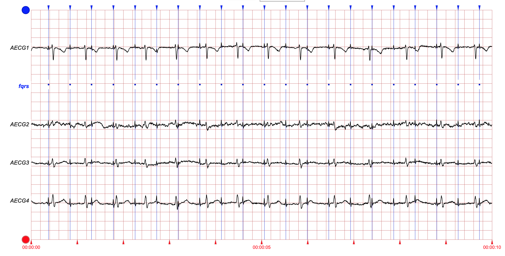

# Noninvasive Fetal ECG: The PhysioNet/Computing in Cardiology Challenge 2013 

### Ikaro Silva, Joachim Behar, Reza Sameni, Tingting Zhu, Gari D. Clifford, George Moody

## Announcements

**Community forum for the 2013 PhysioNet/CinC Challenge** (Oct. 25,
2013, 2:38 p.m.)

If you have any questions or comments regarding this challenge, please
post it directly in our [Community Discussion
Forum](https://groups.google.com/forum/#!forum/physionet-challenges).
This will increase transparency (benefiting all the competitors) and
ensure that all the challenge organizers see your question.

**Noninvasive Fetal ECG: Results of the Challenge** (Oct. 24, 2013, 3
p.m.)

Over 60 teams of participants from around the world participated in the
PhysioNet/CinC Challenge 2013 on the subject of noninvasive fetal ECG.
The final scores of the top-ranking teams have been posted. Also
available are the slides presented by the 28 participants who discussed
their work during sessions dedicated to the Challenge at Computing in
Cardiology 2013 in Zaragoza, Spain.

**Scores and papers posted for the 2013 PhysioNet/CinC Challenge**
(Oct. 24, 2013, 2:36 p.m.)

Top scores have been [posted in the Challenge
Overview](/content/challenge-2013/1.0.0/). Participants’ [CinC 2013
papers about the
Challenge](/files/challenge-2013/1.0.0/papers/index.html) and the
top [open-source
entries](/static/published-projects/challenge-2013/1.0.0/sources/) have
also been posted.

**PhysioNet/CinC Challenge 2013: Phase 2 underway** (Aug. 2, 2013, 2:30
p.m.)

Participants in the PhysioNet/CinC Challenge 2013 may submit Phase 2
entries from now until noon GMT on 25 August. An autoscorer returns
instant results for events 4 and 5. Following the deadline, final scores
for all entries will be available, and participants will have a week to
submit a single Phase 3 entry.

**Test Data for Challenge 2013 Posted** (April 2, 2013, 7 p.m.)

The open test set B (100 one-minute noninvasive fetal ECG recordings)
for Challenge 2013 is now available, together with a supplement of 50
additional recordings in training set A.

**PhysioNet/Computing in Cardiology Challenge 2013 Opens** (Feb. 21,
2013, 2 p.m.)

This year’s challenge invites participants to develop software capable
of detecting fetal QRS complexes in multichannel noninvasive ECG
recordings, making accurate estimates of fetal heart rate, RR intervals,
and QT intervals. An annotated training set of 25 one-minute recordings
is available now; a sample entry, software for scoring, and test
recordings will be available shortly.

## Citations

When using this resource, please cite the following publications:

- The PhysioNet Challenge description paper: [Ikaro S., Joachim B., Reza S., Tingting Z., Julien O., Gari D. C., & George B. M. (2013). Noninvasive Fetal ECG: the PhysioNet/Computing in Cardiology Challenge 2013. Computers in Cardiology 40, pp. 149–152.](http://www.cinc.org/archives/2013/pdf/0149.pdf)
- The PhysioNet resource: [Goldberger, A., Amaral, L., Glass, L., Hausdorff, J., Ivanov, P. C., Mark, R., … & Stanley, H. E. (2000). PhysioBank, PhysioToolkit, and PhysioNet: Components of a new research resource for complex physiologic signals. Circulation [Online]. 101 (23), pp. e215-e220](https://www.ahajournals.org/doi/full/10.1161/01.CIR.101.23.e215)

### Introduction

Since the late 19th century, decelerations of fetal heart rate have been
known to be associated with fetal distress. Intermittent observations of
fetal heart sounds (auscultation) became standard clinical practice by
the mid-20th century. The first fetal heart rate (FHR) monitors were
developed more than 50 years ago, and became widely available by the
mid-1970s. Continuous FHR monitoring was expected to result in dramatic
reduction of undiagnosed fetal hypoxia, but disillusionment rapidly set
in as studies showed that the outputs of FHR monitors were often
unreliable and difficult to interpret, resulting in increased rates of
Caesarean deliveries of healthy infants, with little evidence that
reductions in adverse outcomes were attributable to the use of FHR
monitors (see [[FHR History]](#fhr-history)).

Improved accuracy in FHR estimation has been achieved through use of
more sophisticated signal processing techniques applied to more reliable
signals. These improvements, coupled with a better understanding of the
limitations of fetal monitoring, have led to wider acceptance. There
remains a great deal of room for improvement, however. The most accurate
method for measuring FHR is direct fetal electrocardiographic (FECG)
monitoring using a fetal scalp electrode. This is possible only in
labor, however, and is not common in current clinical practice because
of its associated risks.

Noninvasive FECG monitoring makes use of electrodes placed on the
mother’s abdomen. This method can be used throughout the second half of
pregnancy and is of negligible risk, but it is often difficult to detect
the fetal QRS complexes in ECG signals obtained in this way, since the
maternal ECG is usually of greater amplitude in them.



**Figure 1.** Four simultaneous noninvasive fetal ECG signals, acquired
using electrodes placed on the mother’s abdomen, containing both the
fetal and the maternal ECGs. The maternal QRS complexes (not marked)
are larger than the fetal QRS complexes (marked in blue). 

Other features of the direct fetal ECG, such as FHR variability and
fetal QT interval, may be useful independent indicators of fetal status.
There are no accepted techniques for assessing such features from
noninvasive FECG, however. Before such techniques can be developed, it
will be necessary to establish accurate methods for locating QRS
complexes and for estimating the QT interval in noninvasive FECG.

The aim of this year’s PhysioNet/Computing in Cardiology Challenge is
to encourage development of accurate algorithms for locating QRS
complexes and estimating the QT interval in noninvasive FECG signals.
Using carefully reviewed reference QRS annotations and QT intervals as a
gold standard, based on simultaneous direct FECG when possible, the
challenge is designed to measure and compare the performance of
participants’ algorithms objectively. Multiple challenge events are
designed to test basic FHR estimation accuracy, as well as accuracy in
measurement of inter-beat (RR) and QT intervals needed as a basis for
derivation of other FECG features.

### Challenge Data Sets

Data for the challenge consist of a collection of one-minute fetal ECG
recordings. Each recording includes four noninvasive abdominal signals
as illustrated above (figure 1). The data were obtained from multiple
sources using a variety of instrumentation with differing frequency
response, resolution, and configuration, although in all cases they are
presented as 1000 samples per signal per second.

In each case, reference annotations marking the locations of each fetal
QRS complex were produced, usually with reference to a direct FECG
signal, acquired from a fetal scalp electrode. The direct signals are
not included in the challenge data sets, however.

As in recent challenges, the data have been divided into three sets:

-   **Learning (training) set A**: includes noninvasive fetal ECG
    signals, as well as the reference annotations for them (for
    participants’ use only; not used to score or rank challenge
    entries)
-   **Open test set B**: noninvasive signals only (reference annotations
    withheld; for evaluation of challenge entries in events 4, 5, and 6)
-   **Hidden test set C**: unpublished records (reserved for evaluation
    of open-source challenge entries in events 1, 2, and 3)

Note that the training data set (set A) does not include examples of all
of the sources included in the test sets. It will be necessary to design
methods for addressing the challenge that are sufficiently flexible to
work with data that have recording characteristics that are similar, but
not identical, to those in the training set. This feature of the
challenge data is intended to encourage participants to develop
approaches that are compatible with the variety of devices and signals
encountered in clinical practice, and to allow us to assess how
successfully participants have been able to accomplish this goal.

Explore training set A and test set B using LightWAVE, our new waveform
and annotation viewer. Sets A and B are also available for downloading:

-   [set-a.tar.gz](https://physionet.org/content/challenge-2013/1.0.0/set-a.tar.gz) (initial set of 25 set A records),
    [set-a-ext.tar.gz](https://physionet.org/content/challenge-2013/1.0.0/set-a-ext.tar.gz)
    (supplementary set of 50 more set A records), and
    [set-b.tar.gz](https://physionet.org/contentent/challenge-2013/1.0.0/set-b.tar.gz) (test set
    B, 100 records): tarballs containing records in
    PhysioBank-compatible format, for use with open-source WFDB software
    from PhysioNet
-   [set-a-text.tar.gz](https://physionet.org/contentent/challenge-2013/1.0.0/set-a-text.tar.gz)
    (initial set of 25 set A records),
    [set-a-ext-text.tar.gz](https://physionet.org/contentent/challenge-2013/1.0.0/set-a-ext-text.tar.gz)
    (supplementary set of 50 more set A records), and
    [set-b-text.tar.gz](https://physionet.org/contentent/challenge-2013/1.0.0/set-b-text.tar.gz)
    (test set B, 100 records): tarballs containing records in text CSV
    format

These files are also available as zip archives
([set-a.zip](https://physionet.org/contentent/challenge-2013/1.0.0/set-a.zip),
[set-a-text.zip](https://physionet.org/contentent/challenge-2013/1.0.0/set-a-text.zip),
[set-a-ext.zip](https://physionet.org/contentent/challenge-2013/1.0.0/set-a-ext.zip),
[set-a-ext-text.zip](https://physionet.org/contentent/challenge-2013/1.0.0/set-a-ext-text.zip),
[set-b.zip](https://physionet.org/contentent/challenge-2013/1.0.0/set-b.zip), and
[set-b-text.zip](https://physionet.org/contentent/challenge-2013/1.0.0/set-b-text.zip)). The
PhysioBank-compatible files are available individually at set-a and
set-b. All five versions contain the same data.

Reference QT interval measurements are in preparation; those for records
in set A will be made available to participants when they are complete.

The challenge is to produce a set of annotations and a QT interval
measurement that matches the hidden references as nearly as possible,
for each record in set B or C.

### Reference annotations, heart rates, and RR and QT intervals

Using the direct FECG when possible, reference annotations marking the
locations of the fetal QRS complexes (denoted by **N**) have been
derived by crowd-sourcing using a mixture of experts, volunteers, and
algorithms.

These reference annotations have been processed to derive the *reference
RR interval time series* (the intervals between successive **N**
annotations).

The reference RR interval time series have been processed further to
derive the *reference heart rate (HR)* time series. Each HR measurement
is determined by a widely-used IPFM-based method over a 6-second window
(i.e., by the number of reference RR intervals falling within a 6-second
interval, including fractional intervals that fall only partly within
the interval). Successive windows overlap by 50% (3 seconds), but the
first and last windows in each one-minute record are omitted (since the
lengths of the initial and final RR interval in the record are unknown),
and any windows that include a gap in the RR interval series are
likewise omitted. Thus there are at most 16 HR measurements per
one-minute record.

A single *reference QT interval measurement* is produced for each record
for which the direct ECG is available. Using the reference QRS
annotations to time-align the direct fetal ECG waveforms, the median
fetal cardiac cycle is computed, and the reference QT interval is
measured manually by inspection of the median cycle. The software used
to compute the median cycle is available in source form to participants.

### Test annotations, heart rates, RR and QT intervals

Participants create software that annotates a challenge record with
reference to the noninvasive ECG signals only. *Important: Software
created for the challenge should annotate only one record and then
exit.* In the challenge, it should not be assumed that any other records
are available for reference at run-time.

An entry must produce a *test annotation file* for any record presented
to it, in the same format as the reference annotation files. (Either the
PhysioBank-compatible binary format, as in the `\*.fqrs` files provided
for set A, or the text format, as in the `\*.fqrs.txt` files for set A, is
acceptable.) The challenge organizers will derive *test RR and HR time
series* from the test annotation files, using the same software that was
used to derive the reference RR and HR time series. This software is
available for participants’ use in development and self-evaluation of
their challenge entries.

Optionally, participants’ algorithms may compute a *test QT interval
measurement* for each record, and append that measurement to the test
annotation file as shown in the example. It may be advantageous to make
such a measurement using a method similar to that used for the reference
QT interval measurements, but participants are free to use any method of
their choice. Note that QT interval durations will vary among the four
noninvasive signals; the challenge is to match (as closely as possible)
the reference QT interval measured from the direct signal, which is not
available except in the learning set. This will not be easy!

### Challenge Events and Scoring

This year’s challenge is structured as three pairs of events. Events 1,
2, and 3 are the major events for which monetary awards will be given to
the top-ranked participants; they require submission of open-source
entries to be tested by the challenge organizers using test set C.
Events 4, 5, and 6 are minor events in which the participants submit
their entries’ annotation files for each record in test set B;
non-monetary awards will be given to the top-ranked participants in
these events.

**Events 1 and 4: Fetal heart rate measurement**

In these events, the goal is to produce a set of **N** annotations
that can be used to construct a test FHR time series that closely
matches the reference FHR time series, for each recording in the
test set. For each reference FHR measurement, a matching test FHR
measurement is chosen. If there is no matching FHR measurement, an
FHR of zero is used instead.

Scores in these events are computed from the differences between
matching reference and test FHR measurements, calculated over the
entire test set (C for event 1, B for event 4).

**Events 2 and 5: Fetal RR interval measurement**

In these events, the goal is to produce a set of **N** annotations
that can be used to construct a test RR interval time series that
closely matches the reference RR interval time series, for each
recording in the test set. For each reference RR interval, a
matching test RR interval is chosen. Matching intervals must begin
within 100 milliseconds of each other; if there is no matching test
interval, an interval of zero is used instead.

Scores in these events are computed from the differences between
matching reference and test RR intervals, calculated over the entire
test set (C for event 2, B for event 5).

**Event 3: Fetal QT interval measurement**

In this event, the goal is to produce an estimate of the median QT
interval for each recording in the test set.

Scores in this event are calculated from the differences between
matching reference and test QT intervals, calculated over the test
set C. Since direct ECG signals, hence reference QT intervals, are
not available for all records in the test set, some records will not
be scored. Entries should make test QT interval measurements for all
records if their authors wish to participate in event 3, since we
will not publish a list of records that will be scored for this
event.

We originally planned and announced an event 6 for QT interval
measurement on test set B. This event has been cancelled. Reliable
reference fetal QT measurements are available for only a subset of
challenge records, and we planned to score events 3 and 6 using only
these records. Since there were fewer such records than anticipated,
it was necessary to allocate these records to sets A and C only;
hence we are unable to score event 6 since there are no reliable
means of determining reference QT intervals for the set B records.

### Entering the Challenge

To begin, we recommend studying the learning set as preparation for the
Challenge itself. A sample entry that can be used as a model for your
entries, and software for scoring your entries using the learning set,
are available here (in preliminary versions,
[physionet2013.m](https://content/challenge-2013/1.0.0/physionet2013.m) and
[genresults.m](https://content/challenge-2013/1.0.0/genresults.m), for MATLAB).
*Scores obtained from learning set data are not used for ranking
entries, however!*  We provide the scoring software so that participants
can verify that they are able to prepare properly formatted entries. In
general, participants should expect that official scores obtained using
the test sets will differ from unofficial scores obtained using the
learning set, especially if the algorithms have been (over)trained.

**All entries** must include (or be able to produce) annotation files in
the format of the reference annotation files provided for set A.

**Open-source entries** must include the sources for the software used
to produce the annotations. As in the sample entries, your entry must
write the annotations to standard output rather than to a file; our test
framework captures the standard output of your entry for processing.
Your entry may be written in portable (ANSI/ISO) C or MATLAB/Octave
m-code; other languages, such as C++, Java, Perl, Python, and R, may be
acceptable, and your entry may make use of open-source libraries that
are available for Linux, but please ask us first, and do so no later
than **7 April 2013**.

Participants submitting open-source entries are entered into events 1
and 2, and into event 3 if their entries include QT measurements. These
entries will be run on set C by the challenge organizers; scores will be
returned as soon as possible after submission, but participants should
expect that scoring will require a day or two (possibly longer near the
major deadlines).

Participants submitting set B annotations (“closed-source entries”)
are entered into events 4 and 5, and into event 6 if their entries
include QT measurements.

Participants may submit both open-source entries and closed-source
entries, but **the total number of entries from any participant or team
is limited to 8 (3 in Phase 1, and 5 in Phase 2, as described below)**.

Awards will be presented to the most successful eligible participants
during [Computing in Cardiology](http://www.cinc.org/) (CinC) 2013. To
be eligible for an award, you must:  

1.  Join PhysioNet if you are not already a member, and follow the link
    to “PhysioNet/CinC Challenge 2013” to register as a participant.
    Joining the project creates a Challenge Participant Page for you,
    where you will submit your entries and receive your scores.
2.  Submit a preliminary Challenge entry via PhysioNetWorks no later
    than **25 April 2013**. (The period before this deadline is Phase
    1.) You may submit **up to three Phase 1 entries** before this
    deadline, at most **one entry per week**. (Use them or lose them!)
3.  Submit an acceptable abstract on your work on the Challenge to
    Computing in Cardiology no later than **1 May 2013**. *Include an
    event 1 test set score (and optionally an event 2 test set score)
    for at least one Phase 1 entry in your abstract.* Please select
    “PhysioNet/CinC Challenge” as the topic of your abstract, so it
    can be identified easily by the abstract review committee.
4.  Submit a final Challenge entry via PhysioNetWorks during Phase 2 (on
    or after **1 June** but no later than **25 August 2013**). You may
    submit **up to five Phase 2 entries** between 1 June and 25 August,
    at most **one entry per week**.
5.  The test set scores (from either Phase 1 or Phase 2) will determine
    the final rankings of the entries, with the top-ranked entries in
    each event eligible for awards.
6.  Submit a full (4-page) paper on your work on the Challenge to CinC
    no later than **9 September 2013**.
7.  Attend CinC 2013 (**22-25 September 2013**, in Zaragoza, Spain) and
    present your work there.

An important goal of this Challenge, and of others in the annual series
of PhysioNet/CinC Challenges, is to accelerate progress on the Challenge
questions, not only during the limited period of the Challenge, but also
afterward. In pursuit of this goal, we strongly encourage participants
to submit open-source entries that will be made freely available after
the conclusion of the Challenge via PhysioNet.

Eligible authors of the entries that receive the best test set scores in
each Challenge event will receive award certificates during the closing
plenary session of CinC on 25 September 2013. In recognition of their
contributions to further work on the Challenge problems, eligible
authors of the open-source entries that receive the best test set scores
will also receive monetary awards. No team or individual will receive
more than one such monetary award.

### Frequently asked questions about the Challenge

**If I don’t submit all 3 preliminary (Phase 1) entries, can I add the
unused ones to my quota of 5 Phase 2 entries?**

No. We are trying to encourage both experimentation with multiple
approaches and sustained effort. In past Challenges some participants
have used their entire allowance of entries before the first deadline,
and others have saved their entries until hours before the final
deadline. The most successful participants have usually reflected on
each set of results, refining their ideas (and not merely their decision
thresholds) before submitting the next entry. This approach yields
better results, and it also allows us to review your entries and provide
scores more rapidly than if we receive a large fraction of them just
before the deadlines.

**Should annotations be written to files? The rules are not clear.**

The output for each 1-minute test record should be a file of
annotations.

If you enter the open-source events (1, 2, and 3), your entry must be in
the form of software. We will run your software on each of the records
in the hidden test set (set C), and redirect its standard output to a
file for each test record. The requirement to write to standard output
rather than to a named file allows us to run your software in a secure
“sandbox” environment, which is necessary to make it practical for us
to conduct these events.

If you enter the other events (4, 5, and 6), your entry should be a set
of annotation files that you will create yourself by running your
software using each of the records in the open test set (set B). Since
you will run your software yourself for these events, it may create the
files directly, or (as for the open-source events) it can write the
annotations to its standard output and you can capture that standard
output in a file.

See [What is a “standard input” or a “standard
output”?](https://physionet.org/faq.shtml#stdio) if this is confusing.

An additional point of potential confusion is that we have provided
reference annotation files for the training set (set A) in both .fqrs
(PhysioBank- compatible binary) and .fqrs.txt (text) formats. We expect
that most participants will find it easier to generate text-format
output, but we will accept either format.

**Do the numbers in the .fqrs files refer to the line numbers in the MS
Excel files, or do they refer to the time values in column A of the MS
Excel files?**

There are no MS Excel files in the challenge data sets.

The .fqrs.txt files contain times of occurrence of fetal QRS complexes
in the respective records. Each number is the elapsed time in
milliseconds from the beginning of the record to a fetal QRS. The .csv
files contain five columns; the first two lines describe the contents of
these columns and the units. Beginning on the third line, the first
column contains the elapsed time in seconds from the beginning of the
record to the time of observation of the samples of the four signals in
the remaining columns. So, for example, the first number in a01.fqrs.txt
is 355, and this marks a fetal QRS that occurs 355 milliseconds after
the beginning of record a01. The corresponding samples are those in the
line of a0.csv that begins with 0.355 (which is the 358th line in
a0.csv, since the first two lines are column headers and the third line
begins with 0.000).

The .fqrs files contain the same information as the .fqrs.txt files, but
in the binary format that is used throughout PhysioBank for annotation
files. It is readable using software in the WFDB software package, but
not using MS Excel. Similarly, the .dat files contain the same
information as the .csv files, but in a binary PhysioBank- and
WFDB-compatible format that cannot be read using MS Excel.

**What does ‘`-`’ mean in the .csv files?**

**What does ‘`-32768`’ mean in the .dat files?**

The special value ‘`-`’ appears in the .csv files, and the special value
‘`-32768`’ appears in the .dat files, when the output of the A/D converter
is invalid (for example, if the analog signal is out of the input range
of the ADC, or if the transducer or cables are disconnected). Samples
with this special value indicate that no valid observation of the signal
was recorded during that sampling interval; you may either ignore them
or use the information that the signal was lost as a contribution to an
assessment of the quality of the signal.

**Why are there separate events for fetal HR (1 and 4) and fetal RR (2
and 5)? How could there be any difference in the outcomes of these
events?**

It’s likely that rankings for events 1 and 2 (or 4 and 5) will be
correlated, but it is quite possible to obtain good results in event 1
and poor results in event 2 or vice versa.

An entry that detects fQRSs but does not determine their locations
accurately will score well on event 1 and poorly on event 2. This might
happen if the numbers of false negatives (missed fQRSs) and false
positives (extra detections) are nearly equal, as would be expected of
an optimized fQRS detector in the presence of significant noise; the FHR
would be fairly accurate but the FRR intervals would not be.

An entry that includes a high-specificity fQRS detector may make many
more false negative errors than false positive errors in the presence of
significant noise; it will underestimate FHR and thus will score poorly
on event 1, but if it is able to determine accurate locations for
consecutive true positive detections, it will score well on event 2.

**For entries in the open-source events, must I submit the source code,
or just a statement of what software was used?**

Participants in the open-source events (1, 2, and 3) must supply the
sources (i.e., the actual source code, not just a reference to it) for
their entries. We will publish a selection of these entries on PhysioNet
after the conclusion of the challenge, with full credit to their
authors.

**May I submit an open-source entry (for events 1, 2, and 3) that
includes functions that will not be published?**

Sorry, no. The open-source events require complete open-source entries,
because our aim is to advance the state of the art by encouraging the
development and publication of software that others can use, adapt to
their needs, and develop further if they wish.

Participants are free to make use of open-source implementations of
functions in open-source challenge entries. Open-source implementations
of common functions such as cross-correlation are easy to find.
Open-source QRS detection functions (suitable for finding the maternal
QRS complexes) are also available (for example, see gqrs, sqrs, or wqrs
in the WFDB software package).

Each participant-team may submit up to 10 entries, and they can be any
mixture of open-source and non-open-source entries.

**How can I score my entry in MATLAB or Windows?**

Note: before running this new tool please make sure that the directory
in which you are running it on has been properly and fully backed up.
The scoring procedure requires a JAR file, that can be obtained by
downloading and installing the WFDB App Toolbox for MATLAB.

The scoring requires that all the data and annotations for one set be
stored in the same directory. For instance, in scoring record a01, the
following files are necessary at the testing directory:

-   `a01.dat` - WFDB Binary Data File (provided by PhysioNet)
-   `a01.hea` - WFDB Header File (provided by PhysioNet)
-   `a01.fqrs` - WFDB Binary Annotation File (provided by PhysioNet)
-   `a01.entry1` - WFDB Binary Annotation File (generated by the user)

NON-MATLAB Users can score their entries by running the following
command from a terminal or command prompt (assuming the WFDB App toobox
was installed at /home/foo/wfdb and the annotation data reside in
/home/foo/pn2013/data):

               java -cp "/home/foo/wfdb/mcode/wfdb-app-JVM6-0-0-2.jar" org.physionet.wfdb.Score2013 a01 /home/foo/pn2013/data/ fqrs entry1

This will score your entry using Java’s virtual machine.

MATLAB Users can score their individual entries by running the following
command from the MATLAB prompt (assuming same installation as the
example above ):
       
              cd /home/foo/pn2013/data;
              [score1,score1]=score2013('a01','fqrs','entry1')

Alternatively, MATLAB users can also run the genresults.m script that
scores all the files in that directory (writing the output of
physionet2013.m into WFDB annotation binaries files).

Note for Windows users: The scoring procedure requires Administrator
privileges in order to generate some temporary cache files. To run the
scoring procedure in MATLAB or at the command prompt, before you start
the MATLAB or command prompt make sure you right click on it and select
the “run as Administrator” option. 

### Acknowledgments

The challenge organizers wish to thank Joachim Behar, Gari Clifford,
Marcelino Martinez, Dawid Roj, Reza Sameni, Anton Tokarev, and their
colleagues for their generous contributions of data and expertise in
support of this challenge.

### References

<a name="fhr-history"></a>**\[FHR History\]**:

 - Jenkins HML. [Thirty years of electronic intrapartum fetal heart rate monitoring: discussion paper](http://www.ncbi.nlm.nih.gov/pmc/articles/PMC1292086/pdf/jrsocmed00151-0028.pdf). J R Soc Med 1989 Apr; 82(4):210-214.
 -  Kennedy RG. [Electronic fetal heart rate monitoring: retrospective reflections on a twentieth-century technology](http://www.ncbi.nlm.nih.gov/pmc/articles/PMC1296699/). J R Soc Med 1998 May; 91(5): 244--250.

<a name="fecg"></a>**\[FECG\]:**

 - Neilson JP. [Fetal electrocardiogram (ECG) for fetal monitoring during labour](http://www.ncbi.nlm.nih.gov/pubmed/22513897). Cochrane Database Syst Rev. 2012 Apr 18;4:CD000116.
 -  Sameni R, Clifford GD. [A review of fetal ECG signal processing; issues and promising directions](http://www.ncbi.nlm.nih.gov/pmc/articles/PMC3100207/). Open Pacing Electrophysiol Ther J. 2010 Jan; 3:4--20.

<a name="fetal-qt-interval"></a>**\[Fetal QT interval\]:**

 - Oudijk MA, Kwee A, Visser GH, Blad S, Meijboom EJ, Rosén KG. [The effects of intrapartum hypoxia on the fetal QT interval](http://onlinelibrary.wiley.com/doi/10.1111/j.1471-0528.2004.00178.x/full). BJOG 2004 Jul; 111(7)656-660.

<a name="ipfm"></a>**\[IPFM\]:**

 - Berger RD, Akselrod S, Gordon D, Cohen RJ. [An efficient algorithm for spectral analysis of heart rate variability](http://ieeexplore.ieee.org/xpl/articleDetails.jsp?arnumber=4122420). IEEE TBME 1986;9:900-904.

### Challenge Results

Over 60 teams participated in the 2013 Challenge on noninvasive fetal
ECG. Below are the scores of the top-ranked teams. (Only 6 teams
participated in event 3, and only 2 produced entries that could be
scored.) Each team was allowed to submit up to 11 entries; the scores
shown below are the best (lowest) received by each team for any of their
entries.

**Event 1 (Fetal heart rate estimation, evaluated using hidden test set
C)**

The score for each record was the mean squared error (in bpm^2^) between
the fetal heart rate signals estimated from the reference and test
annotations. The aggregate score was the mean of the scores for each
record.


| Participant                                                                                                | Score     |
| Maurizio Varanini, Gennaro Tartarisco, Lucia Billeci, Alberto Macerata, Giovanni Pioggia and Rita Balocchi | 187.091   |
| Piotr Podziemski and Jan Gierałtowski                                                                      | 255.989   |
| Rui Rodrigues                                                                                              | 278.755   |
| Luigi Yuri Di Marco, Alberto Marzo and Alejandro Frangi                                                    | 380.853   |
| Jakub Kuzilek and Lenka Lhotska                                                                            | 492.412   |
| Joseph McBride, Brent McFerrin, Craig Towers and Xiaopeng Zhao (unofficial)                                | 505.634   |
| Aruna Deogire and Satish Hamde (unofficial)                                                                | 580.284   |
| Alessia Dessì, Danilo Pani and Luigi Raffo                                                                 | 684.158   |
| Tian Wenlong (unofficial)                                                                                  | 931.156   |
| Joachim Behar, Julien Oster and Gari Clifford (unofficial)                                                 | (179.439) |


**Event 2 (Fetal RR interval estimation, evaluated using hidden test set
C)**

The score for each record was the root mean squared difference (in ms)
between corresponding reference and test RR intervals. The aggregate
score was the mean of the scores for each record.


 |
| Participant                                                                                                |  Score |
| Maurizio Varanini, Gennaro Tartarisco, Lucia Billeci, Alberto Macerata, Giovanni Pioggia and Rita Balocchi | 20.975 |
| Piotr Podziemski and Jan Gierałtowski                                                                      | 25.059 |
| Luigi Yuri Di Marco, Alberto Marzo and Alejandro Frangi                                                    | 26.085 |
| Rui Rodrigues                                                                                              | 28.201 |
| Joseph McBride, Brent McFerrin, Craig Towers and Xiaopeng Zhao (unofficial)                                | 29.680 |
| Jakub Kuzilek and Lenka Lhotska                                                                            | 33.200 |
| Akshay Dhawan (unofficial)                                                                                 | 39.667 |
| Andrea Fanelli, Giovanni Magenes and Maria Gabriella Signorini (unofficial)                                | 42.859 |
| Alessia Dessì, Danilo Pani and Luigi Raffo                                                                 | 47.990 |
| Joachim Behar, Julien Oster and Gari Clifford (unofficial)                                                 | (20.793) |

**Event 3 (Fetal QT interval estimation, evaluated using hidden test set
C)**

For each record, the median FQT interval was estimated. The aggregate
score was the root mean squared difference (in ms) between the reference
and test FQT intervals for all records.

| Participant                                                | Score    |
| Piotr Podziemski and Jan Gierałtowski                      | 152.71   |
| Joachim Behar, Julien Oster and Gari Clifford (unofficial) | (153.07) |

**Event 4 (Fetal heart rate estimation, evaluated using open test set
B)**

The score for each record was the mean squared error (in bpm^2^) between
the fetal heart rate signals estimated from the reference and test
annotations. The aggregate score was the mean of the scores for each
record.

| Participant                                                                                                            | Score |
| Fernando Andreotti, Maik Riedl, Tilo Himmelsbach, Daniel Wedekind, Sebastian Zaunseder, Niels Wessel and Hagen Malberg | 18.803 |
| Jukka A Lipponen and Mika P Tarvainen                                                                                  | 28.893 |
| Maurizio Varanini, Gennaro Tartarisco, Lucia Billeci, Alberto Macerata, Giovanni Pioggia and Rita Balocchi             | 33.952 |
| Masoumeh Haghpanahi and David A Borkholder                                                                             | 50.063 |
| Minnan Xu-Wilson, Eric Carlson, Limei Cheng and Srinivasan Vairavan                                                    | 52.496 |
| Ali Ghaffari, Seyyed Abbas Atyabi, Mohammad Javad Mollakazemi, Maryam Niknami and Ali Soleiman                         | 63.750 |
| Mantas Lukoševičius and Vaidotas Marozas                                                                               | 66.327 |
| Martin Kropf, Günter Schreier, Robert Modre-Osprian and Dieter Hayn                                                    | 82.438 |
| Joachim Behar, Julien Oster and Gari Clifford (unofficial)                                                             | (29.619) |

**Event 5 (Fetal RR interval estimation, evaluated using open test set
B)**

The score for each record was the root mean squared difference (in ms)
between corresponding reference and test RR intervals. The aggregate
score was the mean of the scores for each record.

| Participant                                                                                                            | Score |
| Fernando Andreotti, Maik Riedl, Tilo Himmelsbach, Daniel Wedekind, Sebastian Zaunseder, Niels Wessel and Hagen Malberg | 4.337 |
| Jukka A Lipponen and Mika P Tarvainen                                                                                  | 4.844 |
| Maurizio Varanini, Gennaro Tartarisco, Lucia Billeci, Alberto Macerata, Giovanni Pioggia and Rita Balocchi             | 5.098 |
| Martin Kropf, Günter Schreier, Robert Modre-Osprian and Dieter Hayn                                                    | 7.354 |
| Mantas Lukoševičius and Vaidotas Marozas                                                                               | 8.239 |
| Masoumeh Haghpanahi and David A Borkholder                                                                             | 9.062 |
| Christoph Maier and Hartmut Dickhaus                                                                                   | 9.326 |
| Minnan Xu-Wilson, Eric Carlson, Limei Cheng and Srinivasan Vairavan                                                    | 10.618 |
| Vito Starc                                                                                                             | 10.920 |
| Joachim Behar, Julien Oster and Gari Clifford (unofficial)                                                             | (4.672) |

### How the entries were scored

Entries were scored using
[tach](https://physionet.org/physiotools/wag/tach-1.htm),
[mxm](https://physionet.org/physiotools/wag/mxm-1.htm),
[ann2rr](https://physionet.org/physiotools/wag/ann2rr-1.htm), and custom
software developed for the challenge. For each event, the software
processed the reference annotations and the test annotations (i.e.,
those generated by the participant's entry) to obtain a score for each
test record, then calculated an average score for all records in the
test set.

Participants had access to [training set
A](https://physionet.org/physiobank/database/challenge/2013/set-a/)
(both signals and reference annotations) and [open test set
B](https://physionet.org/physiobank/database/challenge/2013/set-a/)
(signals only); these data sets remain freely available. Reference
annotations for set B, and both the signals and annotations for hidden
test set C, will be kept hidden, to allow fair comparisons between
entries submitted during the challenge and those developed in followup
studies by challenge participants as well as other interested
researchers.

### Note on unofficial participants

Teams listed above as “unofficial” participated in the Challenge and
achieved excellent results.

Entries from the team of Joachim Behar, Julien Oster, and Gari Clifford
were unofficial since their authors were among the challenge organizers,
and had major roles in developing the challenge questions and data sets.

Other teams listed as unofficial were unable to attend CinC 2013 and
discuss their work, a condition of eligibility for Challenge awards.

### Papers

Several papers were presented at [*Computers in Cardiology
2013*](http://www.cinc.org/). These papers have been made available by
their authors under the terms of the Creative Commons Attribution
License 3.0 ([CCAL](http://creativecommons.org/licenses/by/3.0/)).
See [this
page](https://physionet.org/files/challenge-2013/1.0.0/papers/index.html) for
a list of the papers. We wish to thank all of the authors for their
contributions.

### Access Policy

Anyone can access the files, as long as they conform to the terms of the
specified license.

### License (for files)
[Open Data Commons Attribution License
v1.0](/content/challenge-2013/view-license/1.0.0/)

## Files

Total uncompressed size: 0 B.

##### Access the files

-   [Download the ZIP
    file](https://physionet.org/static/published-projects/challenge-2013/1.0.0/sources/)
    (280.8 MB)
-   Access the files using the Google Cloud Storage Browser
    [here](https://console.cloud.google.com/storage/browser/challenge-2013-1.0.0.physionet.org/).
    Login with a Google account is required.
-   Access the data using the Google Cloud command line tools (please
    refer to the
    [gsutil](https://cloud.google.com/storage/docs/gsutil_install)
    documentation for guidance):
    ``` shell-command
    gsutil -m -u YOUR_PROJECT_ID cp -r gs://challenge-2013-1.0.0.physionet.org DESTINATION
    ```
-   Download the files using your terminal:
    ``` shell-command
    wget -r -N -c -np https://physionet.org/files/challenge-2013/1.0.0/
    ```

---

PhysioNet is a repository of freely-available medical research data,
managed by the MIT Laboratory for Computational Physiology.

Supported by the [National Institute of Biomedical Imaging and
Bioengineering (NIBIB)](https://www.nibib.nih.gov/)
under NIH grant number R01EB030362.

[Back](../)
