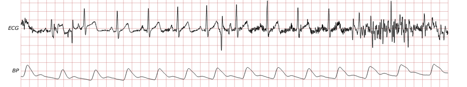

# Robust Detection of Heart Beats in Multimodal Data: The PhysioNet/Computing in Cardiology Challenge 2014 

### George Moody, Benjamin Moody, Ikaro Silva

## Announcements

**Final results for the 2014 PhysioNet/CinC Challenge** (April 15,
2015, 2:28 p.m.)

The top results of the follow-up entries as well as all entries from
phases I-III (at the end of February 2015) were achieved by *Urska
Pangerc (93.64), Alistair Johnson (91.50), Sachin Vernekar (90.97),
Christoph Hoog Antink (90.70), and Abid Rahman (90.16)*. The
complete [updated
rankings](rankings-20150413) are now
available including follow-up entries as well as all entries from phases
I-III.

**Official results for Phase III of the 2014 PhysioNet/CinC Challenge**
(Sept. 9, 2014, 2:31 p.m.)

The top official results in Phase III were achieved by *Alistair Johnson
(87.9), Teo Soo-Kng (86.7), Thomas De Cooman (86.6), Jan Gierałtowski
(86.4), Marcus Vollmer (86.2)*.

**Preparing your talk for Computing in Cardiology 2014** (Aug. 21,
2014, 2:26 p.m.)

Information on how to prepare your talk for Computing in Cardiology is
described [here](/content/challenge-2014/1.0.0/talk-instructions.txt).

**Official results for Phase II of the 2014 PhysioNet/CinC Challenge** (June 25, 2014, 2:22 p.m.)

The top official results in Phase II were achieved by *Thomas De Cooman
(86.2), Marcus Vollmer (86.1), Urska Pangerc (85.2), Filip Plesinger
(85.0), and Alistair Johnson (84.6)*.

**Official results for Phase I of the 2014 PhysioNet/CinC Challenge**
*(April 17, 2014, 2:19 p.m.)*

The top official results in Phase I were achieved by *Marcus Vollmer
(93.2), Urska Pangerc (89.2), Lars Johannesen (88.9), Quan Ding (88.9),
and Teo Soo-Kng (88.7)*. Several other high-scoring entries were
disqualified for reasons described in the FAQs.

## Citations

When using this resource, please use the following publications:

- The PhysioNet Challenge description paper: [Moody G, Moody B, Silva I. "Robust Detection of Heart Beats in Multimodal Data: The PhysioNet/Computing in Cardiology Challenge 2014," *2014 Computing in Cardiology Conference (CinC),* Cambridge, MA, United States of America, pp. 549-550.](https://www.cinc.org/archives/2014/pdf/0549.pdf)
- The PhysioNet resource: [Goldberger, A., Amaral, L., Glass, L., Hausdorff, J., Ivanov, P. C., Mark, R., … & Stanley, H. E. (2000). PhysioBank, PhysioToolkit, and PhysioNet: Components of a new research resource for complex physiologic signals. Circulation [Online]. 101 (23), pp. e215-e220](https://www.ahajournals.org/doi/full/10.1161/01.CIR.101.23.e215)

Papers presented at *[Computers in Cardiology
2014](http://www.cinc.org/) *have been made available by their authors
under the terms of the Creative Commons Attribution License 3.0
([CCAL](http://creativecommons.org/licenses/by/3.0/)). See [this
page](papers) for
a list of the papers. We wish to thank all of the authors for their
contributions.

### Introduction

This challenge aims to encourage the exploration of robust methods for
locating heart beats in continuous long-term data from bedside monitors
and similar devices that record not only ECG but usually other
physiologic signals as well, including pulsatile signals that directly
reflect cardiac activity, and other signals that may have few or no
observable markers of heart beats. Our goal is to accelerate development
of *open-source research tools* that can reliably, efficiently, and
automatically analyze data such as that contained in the MIMIC-II
Waveform Database, making use of all relevant information.

Most existing beat detectors are QRS detectors, operating on the ECG. In
this challenge as in many clinical and research settings, although the
ECG is usually available, its quality may vary considerably over time,
and on occasion the ECG may be missing entirely. Thus even an excellent
QRS detector is not sufficient to be a successful challenge entry, since
examination of pulsatile signals such as continuous blood pressure (BP)
and photoplethysmograms (PPGs) can help to fill in the gaps. Even
signals that are not acquired as indicators of cardiac activity, such as
EEG signals, are often contaminated by ECG components that can be
detected and exploited. In most subjects, the observed relationships
between respiration and heart rate can be used to model heart rate, and
together with nearby context derived from ECG or other cardiac signals,
these models can predict beat locations from respiratory signals.



### Rules and Deadlines

All deadlines occur at noon GMT
([UTC](https://en.wikipedia.org/wiki/Coordinated_Universal_Time)) on the
dates mentioned below. If you do not know the difference between GMT and
your local time, find out what it is *before* the deadline!

The Challenge will take place in three phases, with a week-long hiatus
between phases I and II, and a shorter hiatus between phases II and III.
The week-long hiatus is necessary to ensure that all Phase I entries can
be scored before the CinC abstract deadline (see below); the shorter
hiatus is to allow all Phase II entries to be scored before Phase III
begins. Entries will not be accepted during either hiatus.

|            | *Start at noon GMT on* | *Entry limit* | *End at noon GMT on*       |
| Phase I    | 7 January              | 5             | 7 April                    |
| \[Hiatus\] | 7 April                | 0             | 16 April                   |
| Phase II   | 16 April               | 5             | 22 ~~15~~ June             |
| \[Hiatus\] | 22 ~~15~~ June         | 0             | 23 ~~16~~ June             |
| Phase III  | 23 ~~16~~ June         | 5             | 15 August (final deadline) |

All entries must be received no later than the end of Phase III (**noon
GMT on Friday, 15 August 2014**). In the interest of fairness to all
participants, late entries will not be accepted or scored.

Each participant may receive scores for up to five entries submitted
during each of phases I, II, and III. Unused entries may *not* be
carried over to later phases. Entries that cannot be scored (because of
missing components, improper formatting, or excessive run time) are not
counted against the entry limits.

**To encourage collaboration among participants**, we will publish each
participant’s most successful entry, and its ranking, at the start of
Phase II on 16 April and Phase III on 23 ~~16~~ June. Study these
entries as the Challenge continues, and learn from them; then form
alliances with other participants whose ideas may complement yours.

The authors of the top entries at the ends of Phases I, II, and III will
receive awards of up to US\$1000 during the closing ceremony of
[Computing in Cardiology 2014](http://web.cinc.org/2014/), on Wednesday
afternoon, 10 September 2014, in Cambridge, Massachusetts.

To be eligible for an award, you must do all of the following:

1.  Submit at least one entry that can be scored before the phase I
    deadline **(noon GMT on Monday, 7 April 2014)**.
2.  Submit an acceptable abstract (about 300 words) on your work on the
    Challenge to [Computing in Cardiology](http://web.cinc.org/2014/) no
    later than **14 April 2014**. Include the overall score for at least
    one phase I entry in your abstract. Please select \"PhysioNet/CinC
    Challenge\" as the topic of your abstract, so it can be identified
    easily by the abstract review committee. You will be notified if
    your abstract has been accepted by email from CinC during the first
    week in June.
3.  Submit a full (4-page) paper on your work on the Challenge to CinC
    no later than **1 September 2014**.
4.  Attend CinC 2014 (**7-10 September 2014**) and present your work
    there.

For each of Phases I and II, we will award US\$300 to the first-place
team, \$200 to the second-place team, and \$100 to each of the third-,
fourth-, and fifth-place teams. For Phase III, these awards will be
\$400, \$300, and \$200 respectively. Eligible teams may receive at most
one award for each phase.

*Please note that the CinC abstract deadline is more than two weeks
earlier in 2014 than its traditional date!*

### Challenge Data

Data for this Challenge are 10-minute (or occasionally shorter) excerpts
(“records”) of longer multiparameter recordings of human adults,
including patients with a wide range of problems as well as healthy
volunteers. Each record contains four to eight signals; the first is an
ECG signal in each case, but the others are a variety of simultaneously
recorded physiologic signals that may be useful for robust beat
detection. Signals have been digitized at rates between 120 and 1000
samples per second; in any given record, however, all signals are
sampled at the same, fixed frequency.

A **training data set** for this challenge is available for study. It is
a set of 100 records, named 100, 101, \..., 199, and it is provided in
the [“Files” section](#files) below. You may wish to explore these records
visually using LightWAVE. This data set is also available for download
as a zip archive and as a tarball (about 111 MB in either format).

A new **augmented training set**, consisting of 100 records from the
original test set has been released. The annotations were not
generated from any specific channel and there was no fixed fiducial
point, since some of the annotations were placed manually. The
annotations include only beat labels and do not differentiate between
beat types (all annotated beats were arbitrarily set to normal, $$N$$
beats).

The training set includes many records that can be processed without
errors by the sample entry using the ECG only, but others will pose
serious difficulty unless your entry makes good use of available
information in the other signals; a few of the difficult records are
112, 133, 169, and 188.

A set of *reference beat annotations* for the training set is also
available. In this Challenge, reference beat annotations represent the
preponderance of expert opinions about the locations of the observed (or
imputed) QRS complexes in the ECG signal.

A separate **hidden test data set** has been assembled for evaluating
Challenge entries. Performance of the challenge entries on this hidden
test set determines their rankings and thus the winners of the
Challenge. The test set will not be available for study by participants,
in order to avoid the possibility that entries will be “tuned”
(optimized for high performance) on the test data and that the results
will therefore be less predictive of performance on unknown data.
Previously unused records will be added to the hidden data set at the
start of Phases II and III.

**Important differences between the training set and the test set:** The
training set is intended to give participants an opportunity to see some
of the problems their entries will face in the challenge, and to give us
a way to verify that submitted entries are working as their authors
intend. The performance of challenge entries on the training set does
not contribute in any way to their scores and ranks in the Challenge.

The test set contains a wider variety of signals than in the training
set. A successful entry needs to be able to discover their relationships
and exploit features that can predict beat locations. Unlike the
training set (sampled at a uniform 250 samples per second per signal),
signals in the test set have been sampled at rates between 120 and 1000
samples per second.

### Entering the Challenge

To participate in the challenge, you will need to create software that
is able to read the test data and record the times of occurrence of the
beats in PhysioBank-compatible annotation files, without user
interaction, in our test environment. A sample entry ([entry.tar.gz](entry.tar.gz) or
[entry.zip](entry.zip)) that demonstrates how this can be done is available to help
you get started. It must be possible to run your software on GNU/Linux
using open-source components only.

*It is not necessary to develop your entry using a Linux platform.* The
sample entry runs on FreeBSD, Mac OS X, and MS-Windows as well as
GNU/Linux. If you avoid the use of platform-specific code and libraries,
your entry should be able to run in our GNU/Linux test environment.

You may use any programming language (or combination of languages)
supported using open source compilers or interpreters on GNU/Linux,
including C, C++, Fortran, Haskell, Java, Octave, Perl, Python, and R.
Other languages may be available.

Your entry must be able to run from beginning to end without requiring
user interaction. It doesn’t need, and should not require, a graphical
user interface.

Your entry should attempt to locate all of the beats in its input,
starting from the beginning of each recording. **No learning period is
allowed;** missing the first beat or the last one will affect your score
to the same extent as missing any other beat. Locating every beat, even
at the beginning of a recording, is difficult in real-time clinical
applications. For off-line analysis of recorded data for research as
well as some clinical applications, however, there is no need for
real-time analysis per se. In this challenge, there are no real-time
constraints or limitations with respect to decision delay. Your code may
read any portion of the input record, even the entire record, before
recording any beat locations. Its analysis can be sequential or
non-sequential, forwards, backwards, etc.

Your entry\'s annotations do not need to be placed at the precise
locations of the reference beat annotations; in order to be counted as
correct, they may be located anywhere within 150 ms of a reference
annotation. Note, however, that all of the reference annotations are
aligned with respect to the observed or expected QRS locations; thus,
for example, if a blood pressure (BP) waveform was used to locate a beat
that could not be observed directly in the ECG because of noise or
signal loss, the reference annotation for that beat would be located at
the expected position of the QRS complex, based on nearby measurements
of the delay between the QRS complex and the BP waveform feature used
for beat detection. Since this delay can easily exceed 150 ms, your
entry needs to make similar adjustments to beat locations when it relies
on non-ECG signals.

The output annotation files must contain annotations in time order, but
you don’t need to worry about this point unless your entry attempts to
generate annotation files without using the WFDB library. The WFDB
library’s `wfdbquit` function (which should be invoked to close open
files) sorts annotations automatically so that they are written in time
order in the annotation file.

To handle signals sampled at varying frequencies, you may use the WFDB
library’s sampfreq function to determine the sampling frequency of the
input signals, and then adjust any parameters that depend on the
sampling frequency accordingly; see `gqrs.c` in the sample entry for an
example. Alternatively, you can use the WFDB library’s setsampfreq
function to force the input data to be resampled at your preferred
sampling frequency; see wabp.c for an example of this approach. The
first approach is preferred, since it does not introduce resampling
noise, and it will be faster than the second, but the differences are
likely to be minor.

### Preparing an entry for the challenge

When you submit your entry, it must include your software in *source
form*, as well as a complete set of the 100 annotation files that you
have created by running your software, using the training data set as
input, and a pair of *scripts* (batch files) that can be used to
replicate the annotation files in our test environment, given your
software in source form, and the test data set. Since entries are tested
and scored automatically, it is essential to submit them in a format
that can be understood by our literal-minded autoscorer. Please follow
the guidelines in this section very carefully!

Participants should download the sample entry ([entry.tar.gz](entry.tar.gz) or
[entry.zip](entry.zip). Entries should mimic the layout of the sample entry;
specifically, they must contain:

-   `setup.sh`, a bash script run once before any other code from the
    entry; use this to compile your code as needed
-   `next.sh`, a bash script run once per training or test record; it
    should analyze the record using your code, saving the results as a
    *beat annotation file* with the annotator name qrs
-   `AUTHORS`, a plain text file listing the members of your team who
    contributed to your code, and their affiliations
-   `sources/`, a directory containing your code in source form; this
    should include sources for any custom or non-standard libraries
    needed (and setup.sh should include commands for building and
    linking any such libraries to your code)
-   `challenge/2014/set-p/`, a directory containing the annotation files
    for each record in the training set; these must be named `100.qrs`,
    `101.qrs`, \..., `199.qrs`. These files are used for validation only,
    not for ranking entries (see below).

See the comments in the sample entry’s `setup.sh` and `next.sh` to learn
how to customize these scripts for your entry.

See `gqrs.c` for an example of how to read the data and generate
annotation files in the correct format using the WFDB library functions
`wfdbinit`, `getvec`, `putann`, and `wfdbquit`. The WFDB library, and simpler
examples of its use, can be found in the [WFDB Software Package](http://physionet.org/physiotools/matlab/wfdb-app-matlab/).

**If your preferred programming language is MATLAB or Octave m-code:**

In order to submit an entry written in m-code successfully, it must be
able to run using GNU Octave.

A sample entry written in Octave m-code is available
[here](#files). The entry
illustrates how to install and use the WFDB Toolbox for MATLAB and
Octave to read the Challenge data and to write beat annotation files.

We verify that your code is working as you intended, by comparing the
annotation files that you submit with your entry with annotation files
produced by your code running in our test environment using the same
inputs. If your code passes this validation test, it is then evaluated
and scored using a large *hidden test data set*, and these scores
determine the ranking of the entries and the outcome of the Challenge.

In addition to the *required* components, your entry may include a file
named DRYRUN. If this file is present, your entry is not evaluated using
the hidden test data, and it will not be counted against your limit of
five entries per phase; you will receive either a confirmation of
success or a diagnostic report, but no scores. Use this feature to
verify that none of the required components are missing, that your
setup.sh script works in the test environment, and that your next.sh
script produces the expected output for the training data within the
time limits.

### Submitting an entry

Please do not submit entries by email; they will not be read or scored.

All submissions must be made via the PhysioNet/CinC Challenge 2014
project on PhysioNetWorks. Make a free personal account for yourself and
log in at <https://physionet.org/users/>, then click on the
PhysioNet/CinC Challenge 2014 link in the Projects section of your
PhysioNetWorks home page. Join the project at any time while the
Challenge is open to create your participant page.

Upload your entry for automated scoring using the form on your
participant page. Note that it must be named `entry.tar.gz` or `entry.zip`,
and its contents must be laid out as described in the previous section.
Improperly-formatted entries, including entries that are missing
required components, will not be scored.

### Test environment

Entries are evaluated in a GNU/Linux environment (64-bit Debian 7.3
“Wheezy”), with a typical set of open-source software development
compilers, interpreters, libraries, plugins, and utilities (including
`gcc`, `gfortran`, `ghc`, `java`, `make`, `octave`, `perl`, `python`, and `R`.
We will
consider reasonable requests to add other packages from the Debian
stable repository to the test environment at any time during the first
four weeks of each Challenge phase.

**Additions to the test environment:** `armadillo` and `boost` libraries (13
January); `liboctave-dev` (30 January); `gsl-bin` (3 February);
[octave-statistics](https://packages.debian.org/wheezy/octave-statistics)
(15 March); `imagemagick`, `imagemagick-common`, `libdjvulibre-text`,
`libdjvulibre21`, `libexiv2-12`, `libilmbase6`, `liblensfun-data`, `liblensfun0`,
`liblqr-1-0:amd64`, `libmagickcore5:amd64`, `libmagickcore5-extra:amd64`,
`libmagickwand5:amd64`, `libnetpbm10`, `libopenexr6`, `netpbm`, `octave-control`,
`octave-general`, `octave-image`, `octave-miscellaneous`, `octave-optim`,
`octave-signal`, `octave-specfun`, `octave-struct`, `ufraw-batch`, `units` (22
April)

In addition to these standard Debian packages, the test environment
includes the [WFDB Software Package](http://physionet.org/physiotools/matlab/wfdb-app-matlab/) including the WFDB library. The WFDB
library can be linked with C or C++ code using `-lwfdb` as an option to
gcc, as illustrated in `setup.sh` in the sample entry. *Your entry will
not have access to a network connection*.

Evaluation of your entry will be conducted by a supervisor script that
looks similar to this pseudocode:

```
stage 1:
    unpack entry.tar.gz or entry.zip, report error and exit if unable to do so
    check that all required components are present, report error and exit if
      any are missing
    run "setup.sh", report error and exit if it fails or needs more than five
      minutes

stage 2:
    for each record R in the training set
        run "next.sh R", report error and exit if it fails or needs more than
          40 20 seconds
        compare R.qrs with the copy of R.qrs from entry.tar.gz or entry.zip,
          report error and exit if they are different
    exit if the entry includes a file named "DRYRUN"

stage 3:
    set cumulative run time to zero
    for each record R in the hidden test set
        run "next.sh R";  if its running time reaches 40 20 seconds, or if it
          fails, interrupt it and create an empty R.qrs
        update cumulative run time, report error and exit if more than 1 hour

stage 4:
    for each record R in the hidden test set
        compare R.qrs with the reference annotations, count TP, FN, FP
        remove any files created by next.sh
    calculate and report gross and average Se and +P, and overall score
    exit
```

The supervisor script keeps track of the time needed by your `setup.sh`
and `next.sh` scripts in order to avoid spending an excessive amount of
time attempting to run a misbehaving entry. An error exit will result in
no score for the entry, and the entry will not count against your limit
of five entries in each phase of the Challenge. Most entries will not
approach the time limits; in our test environment, the sample entry’s
`setup.sh` requires only a second or two, and its `next.sh` processes a
10-minute record in about 35 milliseconds. We will consider reasonable
requests to adjust the time limits on a case-by-case basis.

Additional details are available [here](sandbox), together with instructions for creating a replica of our test environment, which you may use for development if you wish, or for troubleshooting if needed. 

### Scoring

If your entry is properly formatted, and nothing is missing, it is
tested and scored automatically, and you will receive your scores when
the test is complete (depending on your entry’s run time, this may take
an hour or more). If you receive an error message instead, read it
carefully and correct the problem(s) before resubmitting.

The annotations generated by your code are compared beat-by-beat with
reference annotations that reflect the consensus of several expert
annotators, using [`bxb(1)`](todo) and [`sumstats(1)`](todo)
from the WFDB Software Package.
As noted above, no learning period is allowed (bxb is run with the `-f 0`
option so that comparison begins with the first annotation in each
record).

Your entry’s scores are reported as gross and average sensitivity, and
gross and average positive predictivity (four numbers, each between 0
and 100; see below). For purposes of ranking, we average these four
performance statistics together with equal weight to obtain an overall
score. The top-ranked entry will have the highest overall score.

### Beat-by-beat comparison and calculation of performance statistics

The `bxb` application matches your entry’s annotations (“test
annotations”) with reference annotations to count, for each record in
the test data set, the numbers of correctly-detected beats (true
positives, or $$\textit{TP}$$), missed beats (false negatives,
or $$\textit{FN}$$), and detections
of non-beats (false positives, or $$\textit{FP}$$).
To match a reference annotation,
a test annotation must be located within 150 ms of the reference
annotation, and must be the nearest test annotation to the reference
annotation.

In this challenge, sensitivity ($$\textit{Se}$$) is the percentage of beats that are
true positives, and positive predictivity ($$\textit{+P}$$) is the percentage of
detections that are true positives:

$$\textit{Se} = \frac{100 \cdot \textit{TP}}{\textit{TP} + \textit{FN}}$$

$$\textit{+P} = \frac{100 \cdot \textit{TP}}{\textit{TP} + \textit{FP}}$$

*Gross* statistics are derived from the sums of all $$\textit{TP}$$, $$\textit{FP}$$, and $$\textit{FN}$$ over
the test data set; *average* statistics are the means of the statistics
calculated individually for each record of the test data set.

If an entry fails to generate an annotation file for a given test set
record, or if it does not complete its analysis of the record within the
40-second ~~20-second~~ time limit, any output it has produced is
replaced with an output annotation file that contains a single
annotation that does not match any reference annotation. In such cases,
the beat-by-beat comparison yields 1 $$\textit{FN}$$ for each beat marked in the
reference annotation file for the record, 0 $$\textit{TP}$$, and 1 $$\textit{FP}$$.
The $$\textit{Se}$$ and $$\textit{+P}$$
for the record are both 0 (affecting the average $$\textit{Se}$$ and $$\textit{+P}$$).

### Frequently asked questions about the Challenge

**How can I determine if my entry is fast enough?**

As noted above, the sample entry processes a ten-minute record in about
35 milliseconds in our test environment, or about 300 times faster than
necessary on average. Measure the run time of the sample entry on your
computer, and compare it to the run time of your entry on the same data.
If your entry requires no more than 300 times as long to run than the
sample entry on average, it is probably fast enough.

Note that the 40-second ~~20-second~~ limit per record is intended to
allow extra time for processing unusually complex records. If your
entry\'s mean run time is greater than about 10 seconds per record in
the test environment, it is unlikely to complete its processing of the
full 300-record test set in phase III within the one-hour limit.

**Can I get diagnostic output from my entry?**

Yes, in stages 1 and 2 (see above), but not in stages 3 and 4. The
general rule is that diagnostic output is available if it was produced
without access to test set data.

In stage 1, if your `setup.sh` fails (exits with non-zero status),
anything it writes to the standard output is reported and the evaluation
stops. Otherwise, no output from `setup.sh` is reported.

Similarly, in stage 2, if your next.sh fails on a *training set record*,
anything it writes to the standard output is reported and the evaluation
stops (the remaining records are not tested). Otherwise, no output from
`next.sh` is reported.

In stage 3, however, if your `next.sh` is unable to process a *test set
record* within 40 ~~20~~ seconds, it will receive poor partial scores
for that record (see above), but the evaluation will continue.

If your entry exceeds the one-hour time limit for processing the test
set in stage 3, the percentage of records completely processed within
one hour is reported. Otherwise, if your entry failed to process one or
more test set records, or if it did not complete its analysis of one or
more records within the 40-second ~~20-second~~ per-record time limit,
the numbers of failures and timeouts will be reported, along with the
scores. *No other diagnostic output relating to test set records will be
reported.*

**May I submit a binary (executable) entry without a complete set of
sources?**

Entries that do not include a complete set of sources are ineligible for
awards.

**Is MATLAB available in the test environment?**

MATLAB will be available when the scoring interface enviroment re-opens.

A working example of a Challenge entry written in m-code is available
for study and as a starting point for developing your own m-code entry.
The m-code in the sample works using either MATLAB or Octave.

**Will your test environment run multi-threaded code on multiple cores?
If so, how many cores will your test environment have and how much
memory? Will pthread libraries be pre-installed?**

See the details about the test environment
[here](https://physionet.org/challenge/sandbox/). Briefly, the VMs have
dual-core CPUs with 2GB of (shared) RAM. The complete list of
pre-installed packages includes libpth20.

**Will your linux test box have Qt installed, and if so what version?**

No. Your entry should not require a GUI since it will run
non-interactively under the control of your `setup.sh` and `next.sh`
scripts.

**Will the `wfdb` header files and libraries be pre-installed on the test
machines such that we can just `#include \<wfdb/wfdb.h>` in C code and
link with `-lwfdb`?**

Yes.

**Across the training samples there are 46 non-normal beats, variously
annotated as \"V\", \"S\", and \"Q\". Are we supposed to try to detect
and annotate aberrant beats? Would the prediction error be calculated
the same if we annotate them as normal, \"N\"?**

Yes, and yes. For this Challenge, it is not necessary to distinguish
between different types of beats, but you should try to detect all of
the beats including any abnormal beats.

**The annotated locations of the QRS complexes appear to be consistently
about midway between the peak at R and the trough at S. Is there a
reason the annotations are not located at the point closest to the
maximum R amplitude? Is there a formal definition for the location of
the QRS complex that you can specify?**

Most of the reference annotations were initially generated using a QRS
detector that placed them at the centroid of a lag-corrected filtered
version of the ECG signal. If the complexes are monophasic, these
annotations will appear at or very near the major extremum; otherwise,
they will appear at intermediate locations. This approach was chosen for
stability with respect to observed fluctuations of the mean cardiac
electrical axis that occur as a result of physical motion of the sensing
electrodes relative to the heart, such as during normal respiration.

All of the reference annotations were visually reviewed, and corrected
where necessary. Some of the initial annotations were repositioned, some
were removed, and additional annotations were added (especially when
necessary because of severe noise in, or loss of, the ECG) as a result
of these reviews. The expert annotators were able to place their
annotations as they wished.

It should be emphasized that a correct detection of a beat by a
challenge entry does not require determining the precise location of any
specific feature; it is sufficient for your software to place its beat
annotation anywhere within 150 ms of a reference beat annotation, which
will be placed within the observed or expected QRS complex in the ECG
signal.

**Is there some kind of listserv for participants to post questions and
comments?**

We hope to launch project-specific wikis on PhysioNetWorks within a few
weeks, and the Challenge project will be one of the first to make use of
this feature. Until then, please send your questions by email, and if
they are of general interest to participants, we will post them
(anonymously) and their answers here.

**May I use code or complete applications (such as gqrs or wabp) from
the WFDB Software Package in my entry?**

Yes. You are not required to reinvent anything that you can find in
existing open-source software. (The sample entry *is* `gqrs`, so you will
need to add something more in order to improve on it!)

*All* of the software that has been preinstalled in the test environment
is open-source software, and you may use any of it in your entry.

Although the Challenge rules do not impose any restrictions on the
inclusion of existing open-source code in your entry, please be careful
to abide by the original author’s license. If the license appears to
restrict how the code may be used, it may not be an open-source license.
Be sure to acknowledge the authors of any code you incorporate in your
entry, and cite the original sources in any publications that describe
or make use of your entry.

**Is a list of names of signals in the hidden test set available?**

We are not currently planning to provide such a list, but the first
signal in each record will be an ECG signal, and will usually be marked
as “ECG”. The non-ECG signals will include a variety of pulsatile
signals, often including “ABP” (radial arterial blood pressure) and
“PLETH” or “PPG” (fingertip photoplethysmogram). Your code may be
able to recognize other signals that also contain (quasi-)periodic
waveforms that have consistent relationships with the ECG. There may be
other signals such as “RESP” (respiration) that are less clearly
coupled with cardiac activity. We are hoping to attract entries that
discover relationships among the signals and exploit those relationships
where appropriate, even in situations in which the signals may be
mislabeled (yes, this is also possible --- it’s the real world!).

**Can a record contain more than one signal with the same name (for
example, two or more “ECG” signals)?**

In some cases, there may be multiple signals of the same type, but they
will never have identical names (for example, two ECG signals in the
same record will usually be labeled as “ECG0” and “ECG1”).

**What does \'\.../fstat.m shadows a core library function\' mean in my
entry\'s diagnostic output\'?**

This message appears when running an m-code entry, and it results from
the presence of the fstat function in Octave’s statistics package,
which hides a deprecated fstat function that has not yet been removed
from Octave’s core library. The warning is harmless and will not
prevent your entry from running; if your entry does not run
successfully, look for another cause.

In the very unlikely case that you wanted to use the deprecated fstat,
note that Octave’s stat function now accepts either a filename (as
always) or a file descriptor (as the deprecated fstat did previously).

**Is something wrong with training set record 116?**

This record is 1 minute and 49 seconds long, unlike the others in the
training set, almost all of which are a full 10 minutes in length. Your
entry should be able to handle occasional short records, which may also
occur in the test set.

**How can I manually install an Octave package in the test
environment?**

Remember that the test environment does not include a network interface.
You must submit any code that your entry needs as part of your
`entry.tar.gz` or `entry.zip` file, since your entry will not be able to
download anything at run time. Follow these steps:

1.  Download the required package tarball(s) from Octave-Forge and add
    them to your entry’s main directory (the same directory that
    contains `setup.sh`).

2.  Edit your `setup.sh` script, adding these commands:

        STR="${OCTAVE} \"pkg prefix ~ ~;pkg local_list ~/.octave_packages;pkg install YOUR_PACKAGE.tar.gz;quit;\""
        echo "$STR"  # optional, but helpful for diagnosing problems if they occur
        eval ${STR}

Any packages you install will remain in the test environment only until
your test run has ended; if you submit another entry later, you must
reinstall your packages if you still need them.

This FAQ was contributed by Christoph Hoog Antink. The packages that are
known to have been installed sucessfully using this method with Octave
3.6.2 during Phase I were:

-   `general-1.3.2.tar.gz`
-   `specfun-1.1.0.tar.gz`
-   `control-2.4.2.tar.gz`
-   `signal-1.2.2.tar.gz`

*Note that these four packages are now preinstalled*. If your Phase I
entry installed any of them, or any other preinstalled package, you will
need to remove the code that does so in Phases II and III, since
attempting to reinstall an installed package will result in an error,
reported in your diagnostc output like this:

    error: load_packages: A(I) = X: X must have the same size as I
    error: called from:
    error:   /usr/share/octave/3.6.2/m/pkg/pkg.m at line 2142, column 21
    error:   /usr/share/octave/3.6.2/m/pkg/pkg.m at line 401, column 7

**Is it possible to change the input sampling frequency using
setsampfreq in an m-code entry?**

The setsampfreq function is part of the WFDB library, and it is intended
to be used by applications written in C or other compiled languages that
are linked to the WFDB library. You can write your entry in one of these
languages and link it to the WFDB library.

The WFDB Toolbox for MATLAB and Octave provides an m-code interface to
many such applications. WFDB Toolbox functions allow you to run these
applications as separate processes, capturing their outputs in
MATLAB/Octave arrays. If the application calls setsampfreq, its output
(the contents of the array(s) that it fills) will reflect this; but the
effects of calling setsampfreq do not persist beyond the process in
which it is executed, and each call to a function in the Toolbox is
executed in its own process --- so this will probably not give you the
results you may be hoping for.

As noted above, you can either write your code so that it checks the
input sampling frequency and properly handles inputs of different
sampling frequencies (which is the preferred approach), or you can
resample to your desired sampling frequency. If you choose to resample,
we don\'t recommend trying to do this in m-code (it\'s computationally
intensive, and it will be too slow). Rather, write your next.sh script
so that it runs the WFDB application xform (which is preinstalled in the
test environment) to create a new record resampled at the frequency you
want, before starting Octave; then analyze the resampled record with
Octave. If you take this approach, remember that the annotation file
that your entry generates must include timestamps in the units of the
original record\'s sampling intervals, so your entry will need to
compensate for the effects of resampling.

**In which folder (directory) are the `.hea` and `.dat` input files? Should
the `.qrs` output files be written to this folder?**

Your entry is unpacked into your home directory in the test environment,
so your home directory contains your `setup.sh` and `next.sh` scripts. When
these scripts are started, the current directory is your home directory.
The `.dat` and `.hea` files are copied into your home directory after your
`setup.sh` script exits. Your `next.sh` script must write the `.qrs` files
into the same directory.

**How do you handle entries that contain proprietary (non-free) code?**

Our original plan was simply to treat any such entries as invalid. This
plan has been modified slightly for Phase I only.

It is not possible for the autoscorer to identify non-free code
automatically, and it is not feasible for us to review entries as they
arrive to determine if they contain non-free code. One purpose of the
hiatus between Phases I and II was to allow us time to review the
top-scoring entries for the presence of non-free code before announcing
the official rankings. We did not expect to discover any non-free code,
but we found that several participants had submitted entries containing
MathWorks proprietary code, and further investigation uncovered other
sources with copyright statements that did not indicate the author’s
permission to redistribute their code.

We don’t wish to revoke the provisional qualification of the authors of
these entries as official participants, especially since it appears that
inclusion of non-free code may have been inadvertent in some or all
cases --- so we have allowed these entries, if they were scored, to meet
the eligibility requirement for submitting a scorable Phase I entry.

Nevertheless, we don’t wish to give awards for entries that do not
comply with the rules; this would be unfair to the majority of
participants who were careful to follow the rules. Therefore, no awards
and no official rankings will be given for entries containing non-free
code (whether or not the code was used in the entry).

**If I use up all of my entries, can I register again using another
email address and get more entries?**

Please don’t do this! The limit on the number of entries:

-   is necessary in order to make it feasible to evaluate entries within
    a reasonable time as deadlines approach,
-   reduces the opportunities for overfitting and consequent development
    of non-generalizable solutions, and
-   is an important part of establishing a fair and level playing field
    for the Challenge.

Obviously we cannot prevent use of multiple email addresses to
circumvent the limit on entries, but we consider such behavior abusive
and disrespectful to other participants. In Phase I, we have
disqualified excess **entries**. *If we discover that this has occurred
in Phases II or III, we will disqualify offending* **participants**.

Note, however, that participants are allowed (and encouraged) to join
forces to combine the best features of complementary approaches. If you
wish to collaborate with another participant or team of participants,
each of the team members may use his or her remaining entries jointly
with other team members. **Collaborators must be particularly careful to
list all team members in their AUTHORS files to avoid
disqualification.**

**Why are my Phase II scores so much worse than my Phase I scores, for
the same code?**

The Challenge is becoming even more challenging! The Phase II test set
consists of 200 records: the 100 records in the Phase I set, and 100
additional records, many of which are considerably more difficult than
the average among the first 100. Everyone’s scores are likely to be
significantly lower in Phase II. This will happen again in Phase III,
when another 100 records are added to the test set.

**Why do not I get “output does not match” errors ?**

When I submit my entry through PhysioNetWorks I get an error message
similar to:

    Challenge 2014 entry running ...
    next.sh 100: output does not match submission
    octave --quiet --eval  "challenge('100',0); quit;" 2>&1

This error message indicates that, for whatever reason, the annotations
files created by running your entry in our Sandbox environment do not
match annotation files submitted with your entry. Please make sure that
your submission runs properly in the Sandbox bootable ISO.

We strongly recommend that you use this Sandbox environment to generate
the annotation files that you submit along with your entry. You can use
a virtual environment, such as VirtualBox, to have the ISO quickly
installed and running as a guest on your machine.

**Why does my entry seems to get hanged, printing a \'save to
\`octave-core\' complete\' error ?**

My entry never finishes running and I get a message similar to:

    core library function
    warning: time stamp for `/home/vmuser/challenge.m' is in the future
    attempting to save variables to `octave-core'...
    save to `octave-core' completeChallenge 2014 entry running ...
    next.sh 100: output does not match submission
    octave --quiet --eval  "challenge('100',0); quit;" 2>&1

You entry has timed out (the results will not be reported). The reason
you are seeing this error message is because Octave has received an
interrupt signal from the VM and is attempting to save the current state
of the workspace into a file. Currently, this prevents our monitoring
software from proceeding with the standard ‘time-out’ message. In
order to avoid this behaviour, please add the following lines of code to
the top of your ‘challenge.m’ file:

    [~,config]=wfdloadlib; %You may have this line already
    if(config.inOctave)
    crash_dumps_octave_core(0);
    end

**Where can I find more training data to test my algorithm?**

The datasets from Phase I and Phase II are a subset of the dataset of
Phase III. Therefore, it is not possible to expand the training records
by opening the Phase I and II datasets. You can use any data available
at PhysioNet to expand your training records, the pbsearch tool should
help with quickly identifying records of interest. 

**How are the records and header files loaded in the testing environment
?**

The `*.dat` and` *.hea` files used for generating the scoring on the VM
are loaded into the top directory of the unzipped entry location. These
files are *not* loaded into the \'./challenge/2014/set-p/\' directory
(where the user submitted annotation files reside). Therefore, to read
the data files correctly, please make sure your entry has either just
the record name, or the full path to the record. For example, reading a
data file from Octave, either of these methods should work (assuming
challenge.m resides on the top directory of your unzipped entry file):

    %Method 1:
    recordName='100';
    [tm,sig]=rdsamp(recordName);

    %Method 2: Using full path to record file
    recordName='100';
    recordPath=[pwd '/'];
    [tm,sig]=rdsamp([recordPath recordName]);

**How can I quickly load WFDB record data into Octave ?**

Is there an alternative to `RDSAMP.m` for quickly loading signal data into
Octave? When I try to use RDSAMP, Octave takes a few seconds to load
individual data into the workspace, is there a faster way?

You can use the WFDB2MAT command in order to convert the record data
into a `\*.mat` file, which can then be loaded into Octave’s workspace
using the LOAD command. This sequence of procedures is quicker (by
several orders of magnitude) than calling RDSAMP. For example, assuming
that WFDB2MAT is properly installed on your system (like in the Sandbox
bootable ISO), and that the record files `100.dat` and `100.hea` are in the
current directory:

    %Generate the 100m.mat and 100m.hea fiels from the *.dat and *.hea files
    system('wfdb2mat -r 100 -H');
    %Load the new file into Octave's workspace. This will create a 'val' variable containing the data
    load('100m');

Note that this will load the signal data in raw units. To convert from
raw units to physical units you will need to follow the instructions
described when running this command (ie, subtract the given ‘base’ of
a signal and divide by the given ‘gain’ of that signal).

**What were the changes to the scoring system?**

The scoring interface to the 2014 PhysioNet Challenge has been re-opened
for scoring on January 23, 2015. If you entry takes more than 12 hours
to score please contact us. Please note carefully the following
editions:

1.  The original training set has been augmented with 100 records from
    the original test set. Thus a new test, of 200 records, has been
    created that does not include these newly released records (the
    original test set had 300 records).
2.  Your scores will be calculated on this new test set of 200 records.
    When reporting your scores for the special issue on Physiological
    Measurement, please use the scores obtained from the new test set.
    In most cases, they will be higher than those generated based on the
    old test set.
3.  There will be a limit of 20 entries that can be scored between now
    and February 27, 2015. After this date, we will change this limit to
    a small fixed number of entries per month.
4.  Entries were previously limited to 40 seconds of runtime per record
    and total time of about 3 hours. This has been changed. Entries are
    now limited to 6\*10^10 CPU instructions per record and the total
    time limit has been removed. Entries that were able to complete
    within 40 seconds should finish within this limit, feedback
    statistics on the number on the number of CPU instructions used by
    your entry is provided via the web interface.

------------------------------------------------------------------------

##### Access 

**Access Policy:**\
Anyone can access the files, as long as they conform to the terms of the
specified license.

**License (for files):**\
[Open Data Commons Attribution License
v1.0](/content/challenge-2014/view-license/1.0.0/)

## Files

Total uncompressed size: 0 B.

##### Access the files

-   [Download the ZIP
    file](https://physionet.org/static/published-projects/challenge-2014/robust-detection-of-heart-beats-in-multimodal-data-the-physionetcomputing-in-cardiology-challenge-2014-1.0.0.zip)
    (506.3 MB)

-   Access the files using the Google Cloud Storage Browser
    [here](https://console.cloud.google.com/storage/browser/challenge-2014-1.0.0.physionet.org/).
    Login with a Google account is required.

-   Access the data using the Google Cloud command line tools (please
    refer to the
    [gsutil](https://cloud.google.com/storage/docs/gsutil_install)
    documentation for guidance):

    ``` shell-command
    gsutil -m -u YOUR_PROJECT_ID cp -r gs://challenge-2014-1.0.0.physionet.org DESTINATION
    ```

-   Download the files using your terminal:

    ``` shell-command
    wget -r -N -c -np https://physionet.org/files/challenge-2014/1.0.0/
    ```
---

PhysioNet is a repository of freely-available medical research data,
managed by the MIT Laboratory for Computational Physiology.

Supported by the [National Institute of Biomedical Imaging and
Bioengineering (NIBIB)](https://www.nibib.nih.gov/)
under NIH grant number R01EB030362.

[Back](../)
