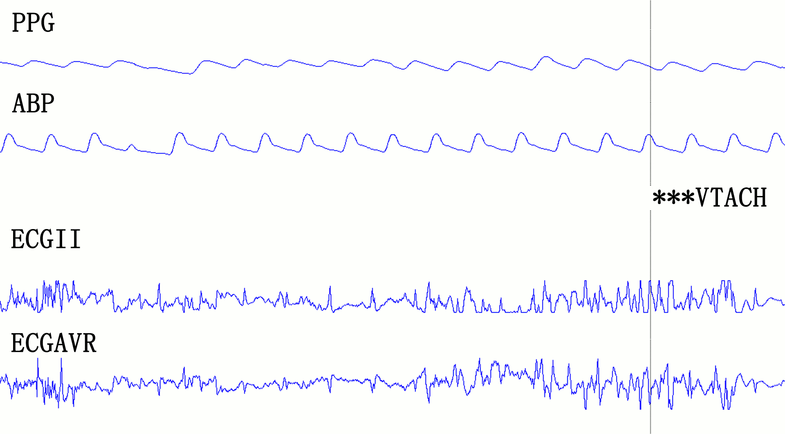

# Reducing False Arrhythmia Alarms in the ICU: The PhysioNet/Computing in Cardiology Challenge 2015 

### Gari D. Clifford, Ikaro Silva, Benjamin Moody, Roger Mark

## Announcements

**Community forum for the 2015 PhysioNet/CinC Challenge** (Jan. 5, 2016, 1:14 p.m)

If you have any questions or comments regarding this challenge, please
post it directly in our [Community Discussion
Forum](https://groups.google.com/forum/#!forum/physionet-challenges).
This will increase transparency (benefiting all the competitors) and
ensure that all the challenge organizers see your question.

**Official scores for the 2015 PhysioNet/CinC Challenge** (Jan. 4, 2016, 1:17 p.m)

The [official scores and source code for the top open-source
entries](#challenge-results) have been posted. The
winners of Event 1 were *Filip Plesinger, Petr Klimes, Josef Halamek,
and Pavel Jurak*, with a score of 81.39. In Event 2, the winners
were *Sibylle Fallet, Sasan Yazdani, and Jean-Marc Vesin*, with a score
of 85.04.

**PhysioNet/CinC Challenge 2015** (Feb. 15, 2015, midnight)

The PhysioNet/Computing in Cardiology Challenge 2015 is now open. This
year’s challenge is ‘Reducing False Arrhythmia Alarms in the ICU.’
False alarms in the ICU can lead to a disruption of care, impacting both
the patient and the clinical staff through noise disturbances,
desensitization to warnings and slowing of response times, leading to
decreased quality of care. To address this issue, competitors are
challenged to devise a method of processing all the available data to
reduce false alarms with minimal or no effect on true (vital) alarms.

## Citations

When using this resource, please cite the original publication:

[Clifford GD, Silva I, Moody B, Li Q, Kella D, Shahin A, Kooistra T,
Perry D, Mark RG. The PhysioNet/computing in cardiology challenge 2015:
reducing false arrhythmia alarms in the ICU. In 2015 Computing in
Cardiology Conference (CinC) 2015 Sep 6 (pp. 273-276).
IEEE.](https://www.cinc.org/archives/2015/pdf/0273.pdf)

Please include the standard citation for PhysioNet:

[Goldberger, A., Amaral, L., Glass, L., Hausdorff, J., Ivanov, P. C., Mark, R., … & Stanley, H. E. (2000). PhysioBank, PhysioToolkit, and PhysioNet: Components of a new research resource for complex physiologic signals. Circulation [Online]. 101 (23), pp. e215-e220](https://www.ahajournals.org/doi/full/10.1161/01.CIR.101.23.e215)

### Introduction

The 2015 PhysioNet/CinC Challenge aims to encourage the development of
algorithms to reduce the incidence of false alarms in the Intensive Care
Unit (ICU). False alarms in the ICU can lead to a disruption of care,
impacting both the patient and the clinical staff through noise
disturbances, desensitization to warnings and slowing of response times
[\[1\]](#1-chambrin), leading to decreased quality of care
\[[2](#2-donchin),[3](#3-imhoff)\].
ICU alarms produce
sound intensities above 80 dB that can lead to sleep deprivation
\[[1](#1-chambrin),[4](#4-meyer),[5](#5-parthasarathy)\],
inferior sleep structure
\[[6](#6-johnson),[7](#7-slevin)\],
stress for both patients
and staff
\[[10](#10-aj),[11](#11-ma),[12](#12-m),[13](#13-we)\]
and depressed immune systems [\[14\]](#14-s). There are
also indications that the incidence of re-hospitalization is lower if
disruptive noise levels are decreased during a patient\'s stay [\[15\]](#15-i).
Furthermore, such disruptions have been shown to have an important
effect on recovery and length of stay
\[[2](#2-donchin),[10](#10-aj)\].
In particular, cortisol
levels have been shown to be elevated (reflecting increased stress)
\[[12](#12-m),[13](#13-we)\],
and sleep disruption has been shown to lead to longer stays
in the ICU [\[5\]](#5-parthasarathy). ICU false alarm (FA) rates as high as 86% have been
reported, with between 6% and 40% of ICU alarms having been shown to be
true but clinically insignificant (requiring no immediate action)
[\[16\]](#16-st). In fact, only 2% to 9% of alarms have been found to be important
for patient management [\[17\]](#17-cl).



In this challenge we focus only on life threatening arrhythmias, namely
asystole, extreme bradycardia, extreme tachycardia, ventricular
tachycardia, and ventricular flutter/fibrillation (Table 1). Entrants
are encouraged to review previous and related work on this topic
\[[18](#18-a)-[27](#27-q)\]
and to identify key issues that have arisen in this topic in
the past.

**Table 1:** Definition of the 5 alarm types used in this challenge.

| Asystole                         | No QRS for at least 4 seconds                                         |
| Extreme Bradycardia              | Heart rate lower than 40 bpm for 5 consecutive beats                  |
| Extreme Tachycardia              | Heart rate higher than 140 bpm for 17 consecutive beats               |
| Ventricular Tachycardia          | 5 or more ventricular beats with heart rate higher than 100 bpm       |
| Ventricular Flutter/Fibrillation | Fibrillatory, flutter, or oscillatory waveform for at least 4 seconds |

### Quick Start

1.  Download the training set:
    [training.zip](https://physionet.org/content/challenge-2015/1.0.0/training.zip) and the
    sample MATLAB entry: [entry.zip](entry.zip).
2.  Develop your entry by making the following edits to
    [entry.zip](entry.zip):
    -   Modify the sample entry source code file challenge.m with your
        changes and improvements. 
    -   Modify the AUTHORS.txt file to include the names of all the team
        members.
    -   Unzip [training.zip](https://physionet.org/content/challenge-2015/1.0.0/)
        and move all its files to the top directory of your entry
        directory (where challenge.m is located.)
    -   Run your modified source code file on all the records in the
        training set by executing the script generateValidationSet.m.
        This will also build a new version of entry.zip.
    -   Optional: Include a file named DRYRUN at the top directory of
        your entry (where the AUTHORS.txt file is located) if you do not
        wish your entry to be scored and counted against your limit.
        This is useful in cases where you wish to make sure that the
        changes made do not result in any error.
3.  Submit your modified entry.zip for scoring through the
    PhysioNetWorks PhysioNet/CinC Challenge 2015 project (update:
    submissions are now closed). The contents of entry.zip must be laid
    out exactly as in the sample entry. **Improperly-formatted entries
    will not be scored.**

Join our community [Community Discussion
Forum](https://groups.google.com/g/physionet-challenges) to get the latest
challenge news, technical help, or if you would like to find partners to
collaborate with.

### Rules and deadlines

Participants may compete in multiple events:

**Event 1** The goal is to reduce the maximum number of false alarms,
while avoiding the suppression of true alarms in “real-time” (i.e.
using no information after the sounding of the alarm).

**Event 2** The goal is to reduce the maximum number of false alarms,
while avoiding the suppression of true alarms “retrospectively”, using
up to 30 seconds of data after the alarm.

Entrants may compete in one or both events, and may have an overall
total of up to 15 submitted entries (you can submit entries that run
simultaneously on both events). Each participant may receive scores for
up to five entries submitted during the unofficial phase and ten entries
at the end of the official phase. Unused entries may not be carried over
to later phases. Entries that cannot be scored (because of missing
components, improper formatting, or excessive run time) are not counted
against the entry limits.

All deadlines occur at noon GMT
([UTC](https://en.wikipedia.org/wiki/Coordinated_Universal_Time)) on the
dates mentioned below. If you do not know the difference between GMT and
your local time, find out what it is *before* the deadline!

**Table 2**: Rules and Deadlines

|                  | *Start at noon GMT on* | *Entry limit* | *End at noon GMT on* |
| Unofficial Phase | 18 February            | 5             | 10 April             |
| [Hiatus]         | 10 April               | 0             | 16 April             |
| Official Phase   | 16 April               | 10            | 12 August            |


All official entries must be received no later than the **noon GMT on
Friday, 21 August 2015**. In the interest of fairness to all
participants, late entries will not be accepted or scored. Entries that
cannot be scored (because of missing components, improper formatting, or
excessive run time) are not counted against the entry limits.

To be eligible for the open-source award, you must do all of the
following:

1.  Submit at least one open-source entry that can be scored before the
    Phase I deadline **(noon GMT on Friday, 10 April 2015)**.
2.  Submit an acceptable abstract (about 300 words) on your work on the
    Challenge to [Computing in Cardiology](http://www.cinc2015.org/) no
    later than **14 April 2015**. Include the overall score for at least
    one Phase I entry in your abstract. Please select \"PhysioNet/CinC
    Challenge\" as the topic of your abstract, so it can be identified
    easily by the abstract review committee. You will be notified if
    your abstract has been accepted by email from CinC during the first
    week in June.
3.  Submit a full (4-page) paper on your work on the Challenge to CinC
    no later than **1 September 2015**.
4.  Attend [CinC 2015](http://cinc2015.org) (**7-10 September 2015**)
    and present your work there.

Please do not submit analysis of this year\'s Challenge data to other
conferences or journals until after CinC 2015 has taken place, so the
competitors are able to discuss the results in a single forum. We expect
a special issue from the journal *Physiological Measurement* to follow
the conference and encourage all entrants (and those who missed the
opportunity to compete or attend CinC 2015) to submit extended analyses
and articles to that issue, taking into account the publications and
discussions at CinC 2015.

 

### Challenge Data

Bedside monitor data leading up to a total of 1250 life-threatening
arrhythmia alarms recorded from three of the largest intensive care
monitor manufacturers\' bedside units will be used in this challenge.
Data are sourced from four hospitals in the USA and Europe, chosen at
random (and so do not necessarily represent the true statistics for
false alarm rates for any given manufacturer or hospital which is likely
to be different based on unit-specific protocols, software versions and
unit types). The training and test sets have each been divided into two
subsets of mutually exclusive patient populations. The training set
contains 750 recordings and the test set contains 500 recordings. The
test is unavailable to the public and will remain private for the
purpose of scoring. No more than three alarms of each of the five
categories are used from any given patient, and alarms are at least 5
minutes apart (usually longer). In this way, the competition does not
address the issue of what to do with repeated alarms and how to use
information from earlier alarms. Although this could be done with the
full files from each patient, this may also a dangerous practice,
because any algorithm would propagate and compound any errors from one
alarm to the next. A team of expert annotators reviewed each alarm and
labeled it either \'true\', \'false\', or \'impossible to tell\'. The
Challenge includes only records that were reviewed by at least two
annotators, of whom a two-thirds majority agreed that the alarm was
either true or false.

An alarm was triggered 5 minutes from the beginning of each record. The
exact time of the event that triggered the alarm varies somewhat from
one record to another, but in order to meet the ANSI/AAMI EC13 Cardiac
Monitor Standards [\[28\]](#28-american), the onset of the event must be within 10
seconds of the alarm (i.e., between 4:50 and 5:00 of the record). Note
that there may have been *additional* arrhythmia events in the 5 minutes
preceding the alarm; these events have not been annotated.

In the \"real-time\" subset, each record is exactly five minutes long,
so your program does not have any information beyond what was known to
the monitor at the time the alarm was triggered. In the
\"retrospective\" subset (50% of the training set), each record contains
an additional 30 seconds of data following the time of the alarm. All
entries are assumed to be competing in the \"real-time\" category only,
information on how to change your entry to compete in the
\"retrospective\" category, or both, please see the Preparing an entry
for the challenge section. If you choose to compete in both categories,
your submitted entry will receive a two scores ( one for each category
). We invite competitors to try to make use of the additional
information provided by the retrospective records.

All signals have been resampled (using anti-alias filters) to 12 bit,
250 Hz and have had FIR band pass \[0.05 to 40Hz\] and mains notch
filters applied to remove noise. Pacemaker and other nose artifacts may
be present on the ECG. Pulsatile channels can suffer from movement
artifact, sensor disconnects and other events (such as line flushes or
coagulation in the catheter [\[25\]](#25-li)). Each recording contains two ECG
leads (which may or may not be the leads that triggered the alarm) and
one or more pulsatile waveforms (the photoplethysmogram and/or arterial
blood pressure waveform).

We have chosen not to provide the beat markers that the bedside alarm
algorithms may have used to trigger the alarm. We also note that
tachycardia and bradycardia alarms have variable thresholds, which are
sometimes adjusted at the bedside. We have also removed these for
consistency.

The Challenge data are provided in WFDB format with an
Octave/MATLAB-compatible header. You can load the data directly using
MATLAB or Octave without any special tools, but you must take care to
scale it into the correct physical units. You can also use the WFDB
MATLAB Toolbox function RDMAT; to load data in physical units; see
below.

### Sample Submission

As a starting point we have provided a fairly simple algorithm
([entry.zip](entry.zip)): one which checks
the quality of the blood pressure waveform, and (if it is acceptable)
uses it to calculate the heart rate. If no blood pressure is available
then the same process is performed on the photoplethysmogram (PPG, or
pulse oximetry waveform). If the heart rate derived from the blood
pressure (or PPG) is outside the (variable) range indicated by the
alarm, then the alarm is suppressed. In the case of asystole, we expect
our morphology based quality algorithms to report ‘low quality’ on all
pulse channels because no strong regular pulse is present. Therefore the
asystole alarm is suppressed only if the BP or PPG quality metrics we
use report a high quality value. Note that other signal quality
algorithms may not respond in the same manner.

You may want to begin with this framework, and add more intelligent
approaches, or discard it completely and start from scratch. We do not
provide it because it is necessarily a good approach, but simply because
it is an obvious one, which uses open source software and previously
described techniques. It is particularly unsuitable for VT and VF.

**NOTE:** You do not need additional software beyond MATLAB to run the sample entry or enter the competition. The sample entry has not been
tested in Octave. The sample entry uses one file access function,
RDMAT, which reads the Challenge\'s binary data and scales it
appropriately. Although this function is part of the [WFDB Toolbox for
MATLAB](http://physionet.org/physiotools/matlab/wfdb-app-matlab/), it has no dependencies and its most up-to-date version can be
found at the WFDB Toolbox repository.

### Preparing an entry for the challenge

To participate in the challenge, you will need to create software that
is able to read the test data and output the final alarm result without
user interaction in our test environment. Two sample entries
([entry.zip](entry.zip), written in
MATLAB, and [entry.tar.gz](entry.tar.gz),
written in Perl) are available to help you get started. In addition to
MATLAB, you may use any programming language (or combination of
languages) supported using open source compilers or interpreters on
GNU/Linux, including C, C++, Fortran, Haskell, Java, Octave, Perl,
Python, and R.

***If your entry requires software that is not installed in our sandbox
environment, please let us know before the end of Phase I. We will not
modify the test environment after the start of Phase II of the
challenge.***

Participants should download one of the the sample entries (entry.tar.gz
or entry.zip). Entries should have the exact layout of the sample entry;
specifically, they must contain:

-   `setup.sh`, a bash script run once before any other code from the
    entry; use this to compile your code as needed
-   `next.sh`, a bash script run once per training or test record; it
    should analyze the record using your code, saving the results as a
    *text file* for each record.
-   `answers.txt`, a text file containing the results of running your
    program on each record in the training set. These results are used
    for validation only, not for ranking entries (see below).
-   `AUTHORS.txt`, a plain text file listing the members of your team
    who contributed to your code, and their affiliations
-   `LICENSE.txt`, a text file containing the license for your software
    (the default is the [GPL](http://www.gnu.org/licenses/gpl-3.0.txt)).
    All entries are assumed to be open source and will eventually be
    released on PhysioNet (for closed source entries please see below).

See the comments in the sample entry\'s `setup.sh` and `next.sh` if you
wish to learn how to customize these scripts for your entry.

We verify that your code is working as you intended, by comparing the
answers.txt file that you submit with your entry, with answers produced
by your code running in our test environment using the same records. If
your code passes this validation test, it is then evaluated and scored
using the *hidden test data set*. The scores in the hidden data set
determines the ranking of the entries and the final outcome of the
Challenge.

In addition to the *required* components, your entry may include a file
named DRYRUN. If this file is present, your entry is not evaluated using
the hidden test data, and it will not be counted against your limit of
entries per phase; you will receive either a confirmation of success or
a diagnostic report, but no scores. Use this feature to verify that none
of the required components are missing, that your `setup.sh` script
works in the test environment, and that your next.sh script produces the
expected output for the training data within the time limits.

### Closed Source Entries

Although the competition is only for open source entries, we also accept
the submission of closed-source entries from industry or from
individuals. If you enter closed source, we will not publish your code
or score (unless you specifically request that we do so). However, the
default entry is open source (GPL), so you must explicitly indicate that
your entry is closed source by including with your entry a file called
CLOSEDSOURCE.txt and modifying `LICENSE.txt` accordingly. If you submit
an executable, it must be compiled to run in our testing environment
(Ubuntu 14.04 amd64.)

Open source entry scores will not be posted until after the close of the
Unofficial Phase, and closed source entries will not be posted. You may
choose to swap between being open source or closed source at any time up
to the end of the Unofficial Phase by inserting or removing the
`CLOSEDSOURCE.txt` file with your final entry prior to the end of the
Unofficial Phase.

### Scoring

If your entry is properly formatted, and nothing is missing, it is
tested and scored automatically, and you will receive your scores when
the test is complete (depending on your entry’s run time, this may take
an hour or more). If you receive an error message instead, read it
carefully and correct the problem(s) before resubmitting.

The scoring for this challenge will be a function of the following
variables: true positives (**TP**), false positives (**FP**), false
negatives (**FN**), and true negatives (**TN**). Where these variables
are defined as below:

**Table 3:** Scoring Statistics

<table>
    <tbody>
        <tr>
            <td colspan="2" rowspan="2" style="text-align: center;"><strong>Outcome</strong></td>
            <td colspan="2"><em>Gold Standard</em></td>
        </tr>
        <tr>
            <td>True Alarm</td>
            <td>False Alarm</td>
        </tr>
        <tr>
            <td rowspan="2" style="text-align: center;"><em>Predicted</em></td>
            <td>True Alarm</td>
            <td><strong>TP</strong></td>
            <td><strong>FP</strong></td>
        </tr>
        <tr>
            <td>False Alarm</td>
            <td><strong>FN</strong></td>
            <td><strong>TN</strong></td>
        </tr>
    </tbody>
</table>

More specifically, competitors should attempt to maximize **TP** and
**TN** while minimizing **FP** and **FN**. The scoring will weight
**FN** more heavily than the **FP**. The script score2015Challenge.m in
the sample entry, entry.zip, generates these statistics on the training
set for MATLAB based entries, but does not give you a final score. The
final scoring equation was not included with the sample entries because
was under testing during the initial stage of the challenge. If you wish
to calcualte the final score for your entry, you can do so by
implementing the equation:

 

<div>

$$Score = \frac{TP + TN}{TP + TN + FP + 5 \ast FN}$$

</div>

 

### Obtaining complimentary MATLAB licenses

[The MathWorks](http://www.mathworks.com) has kindly decided to sponsor
Physionet\'s 2015 Challenge. The MathWorks is offering to all teams that
wish to use MATLAB, complimentary licenses. User can apply for a license
and learn more about MATLAB support through The Mathwork\'s [PhysioNet
Challenge
link](https://www.mathworks.com/academia/student-competitions/physionet/?requestedDomain=www.mathworks.com&nocookie=true).
If you have questions or need technical support, please contact The
MathWorks at <academicsupport@mathworks.com>.Obtaining complimentary
MATLAB licenses.

 

### References

<a name="1-chambrin"></a>[1] Chambrin MC. Review: Alarms in the intensive care unit: how can
the number of false alarms be reduced? Critical Care. 2001 Aug;
5(4):184-8. Epub 2001 May 23.

<a name="2-donchin"></a>[2] Donchin Y, Seagull FJ. The hostile environment of the intensive care unit. Curr Opin Crit Care. 2002 Aug;8(4):316-20.

<a name="3-imhoff"></a>[3] Imhoff M, Kuhls S. Alarm algorithms in critical care monitoring. Anesth Analg., 2006 May; 102(5):1525-37.

<a name="4-meyer"></a>[4] Meyer TJ, Eveloff SE, Bauer MS, Schwartz WA, Hill NS, Millman RP. Adverse environmental conditions in the respiratory and medical ICU  settings. Chest. 1994 Apr; 105(4), 1211-16.

<a name="5-parthasarathy"></a>[5] Parthasarathy S, Tobin MJ. Sleep in the intensive care unit. Intensive Care Med. 2004 Feb; 30(2), 197-206.

<a name="6-johnson"></a>[6] Johnson AN. Neonatal response to control of noise inside the incubator. Pediatr Nurs. 2001 Nov-Dec; 27(6), 600-5.

<a name="7-slevin"></a>[7] Slevin M, Farrington N, Duffy G, Daly L, Murphy JF. Altering the NICU and measuring infants\' responses. Acta Paediatr. 2000 May; 89(5), 577-81.

<a name="10-aj"></a>[10] A.J. Cropp, L.A. Woods, D. Raney, D.L. Bredle, Name that tone. The proliferation of alarms in the intensive care unit. Chest, 105 (4)
(1994), pp. 1217-1220 Apr

<a name="11-ma"></a>[11] M.A. Novaes, A. Aronovich, M.B. Ferraz, E. Knobel, Stressors in ICU: patients’ evaluation, Intens Care Med, 23 (12) (1997), pp.
1282-1285 Dec

<a name="12-m"></a>[12] M. Topf, S. Thompson, Interactive relationships between hospital patients’ noise induced stress and other stress with sleep, Heart Lung, 30 (4) (2001), pp. 237-243 Jul-Aug

<a name="13-we"></a>[13] W.E. Morrison, E.C. Haas, D.H. Shaffner, E.S. Garrett, J.C. Fackler, Noise, stress, and annoyance in a pediatric intensive care unit, Crit Care Med, 31 (1) (2003), pp. 113-119 Jan

<a name="14-s"></a>[14] S. Berg, Impact of reduced reverberation time on sound-induced arousals during sleep, Sleep, 24 (3) (2001), pp. 289-292 May 1

<a name="15-i"></a>[15] I. Hagerman, G. Rasmanis, V. Blomkvist, R. Ulrich, C.A. Eriksen, T. Theorell, Influence of intensive coronary care acoustics on the quality of care and physiological state of patients, Int J Cardiol, 98
(2) (2005), pp. 267-270 Feb 15

<a name="16-st"></a>[16] S.T. Lawless, Crying wolf: false alarms in a pediatric intensive care unit, Crit Care Med, 22 (6) (1994), pp. 981-985 Jun

<a name="17-cl"></a>[17] C.L. Tsien, J.C. Fackler, Poor prognosis for existing monitors in the intensive care unit, Crit Care Med, 25 (4) (1997), pp. 614-619 Apr

<a name="18-a"></a>[18] A. Mäkivirta, E. Koski, A. Kari, T. Sukuvaara, The median filter as a preprocessor for a patient monitor limit alarm system in intensive
care, Comput Methods Programs Biomed, 34 (2-3) (1991), pp. 139-144 Feb-Mar

<a name="19-aboukhalil"></a>[19] Aboukhalil A, Nielsen L, Saeed M, Mark RG, Clifford GD. Reducing false alarm rates for critical arrhythmias using the arterial blood pressure waveform. J Biomed Inform 2008; 41:442.

<a name="20-borowski"></a>[20] Borowski M, Siebig S, Wrede C, Imhoff M. Reducing false alarms of intensive care online-monitoring systems: an evaluation of two signal extraction algorithms. Comput Methods Programs Biomed 2011.

<a name="21-otero"></a>[21] Otero A, Felix P, Barro S, Palacios F. Addressing the flaws of current critical alarms: a fuzzy constraint satisfaction approach. Artif Intell Med 2009;47:219.

<a name="22-zong"></a>[22] Zong W, Moody GB, Mark RG. Reduction of false arterial blood pressure alarms using signal quality assessment and relationships between the electrocardiogram and arterial blood pressure. Med Biol Eng Comput 2004;42:698.

<a name="23-li"></a>[23] Li Q, Mark RG, Clifford GD. Robust heart rate estimation from multiple asynchronous noisy sources using signal quality indices and a Kalman filter. Physiol Meas 2008;29:15.

<a name="24-li"></a>[24] Li Q, Clifford GD. Dynamic time warping and machine learning for signal quality assessment of pulsatile signals. Physiol Meas 2012;33:1491.

<a name="25-li"></a>[25] Li Q, Mark RG, Clifford GD. Artificial arterial blood pressure artifact models and an evaluation of a robust blood pressure and heart rate estimator. Biomed Eng Online 2009;8:13.

<a name="26-j"></a>[26] J Behar, J Oster, Q Li, GD Clifford, ECG signal quality during arrhythmia and its application to false alarm reduction. IEEE Transactions on Biomedical Engineering 60 (6), 1660-1666, 2013.

<a name="27-q"></a>[27] Q Li, C Rajagopalan, GD Clifford, Ventricular fibrillation and tachycardia classification using a machine learning approach, IEEE Transactions on Biomedical Engineering, 61 (6), 1607-1613, 2014.

<a name="28-american"></a>[28] American National Standard (ANSI/AAMI EC13:2002) Cardiac monitors, heart rate meters, and alarms. Arlington, VA: Association for the Advancement of Medical Instrumentation; 2002.

### Frequently asked questions about the Challenge

**Can I get diagnostic output from my entry?**

Diagnostic output is available if it was produced without access to test
set data, and if the program does not use MATLAB. Output produced by
MATLAB programs is not available (since MATLAB is not open source), and
output produced from the test set is not available (since this would
give away information about the hidden records.) If your entry does not
use MATLAB, be sure to remove the line `NEED_MATLAB=1` from setup.sh.

If your setup.sh fails (exits with non-zero status), anything it writes
to the standard output is reported and the evaluation stops. Otherwise,
no output from setup.sh is reported.

If your next.sh fails on a *training set record*, anything it writes to
the standard output is reported and the evaluation stops (the remaining
records are not tested). Otherwise, no output from next.sh is reported.

If your next.sh is unable to process a *test set record* within the time
limit, it will receive poor partial scores for that record, but the
evaluation will continue.

If your entry fails to process one or more test set records, or if it
does not complete its analysis of one or more records within the
per-record time limit, the numbers of failures and timeouts will be
reported, along with the scores. *No other diagnostic output relating to
test set records will be reported.*

**May I submit a binary (executable) entry without a complete set of
sources?**

Entries that do not include a complete set of sources are ineligible for
awards.

**What version of MATLAB and what MATLAB toolboxes are available in the
test environment?**

The test environment has MATLAB 2014b and the [WFDB Toolbox for
MATLAB](http://physionet.org/physiotools/matlab/wfdb-app-matlab/)
version 0.9.9. A list of installed MATLAB built-in toolboxes can be
found [here](https://physionet.org/challenge/2015/matlab-info). Note
that you must include the line NEED_MATLAB=1 in your setup.sh if you
wish to use MATLAB in your entry.

**If I use up all of my entries, can I register again using another
email address and get more entries?**

Please don\'t do this! The limit on the number of entries:

-   is necessary in order to make it feasible to evaluate entries within
    a reasonable time as deadlines approach,
-   reduces the opportunities for overfitting and consequent development
    of non-generalizable solutions, and
-   is an important part of establishing a fair and level playing field
    for the Challenge.

Obviously we cannot prevent use of multiple email addresses to
circumvent the limit on entries, but we consider such behavior abusive
and disrespectful to other participants. If we discover that this has
occurred, we will disqualify offending *participants* from this and
future competitions.

Note, however, that participants are allowed (and encouraged) to
collaborate in order to combine the best features of complementary
approaches. If you wish to collaborate with another participant or team
of participants, each of the team members may use the remaining entries
of whichever collaborative team has the most remaining entries. Other
than in exception circumstances, we expect that collaborators to be
unknown to each other prior to the competition, and not from the same
research group or department. *Collaborators must be particularly
careful to list all current team members in their AUTHORS files to avoid
disqualification.*

**Is it worth analyzing the ECG?**

Possibly. The monitors have excellent ECG analysis algorithms, but do
not necessarily make use of all the information available. However, you
may choose to use information in the ECG if you like. Be careful,
though, as the signal may contain significant artifacts.

**What are the alarm labels used for the 5 alarms? How are the alarms
coded?**

The alarms are coded using case sensitive strings in the following
manner:

 
**Table 4**: Alarm Coding Strings

| **Alarm Type**                   | **Coding String**         |
| Asystole                         | `Asystole`                |
| Extreme Bradycardia              | `Bradycardia`             |
| Extreme Tachycardia              | `Tachycardia`             |
| Ventricular Tachycardia          | `Ventricular_Tachycardia` |
| Ventricular Flutter/Fibrillation | `Ventricular_Flutter_Fib` |

## Challenge Results

Listed below are the top-scoring programs submitted in the
PhysioNet/Computing in Cardiology Challenge 2015. Please refer to the
AUTHORS.txt and LICENSE.txt file included with each entry for
information about attribution and licensing. For more information about
the details of these algorithms, see [the corresponding
papers](papers).

### Event 1 (Real-Time)

| Score | Authors                                                                                                                                                                                                          |
| 81.39 | [Filip Plesinger, Petr Klimes, Josef Halamek, Pavel Jurak](https://physionet.org/static/published-projects/challenge-2015/1.0.0/sources/fplesinger-210.zip)                                                     |
| 79.44 | [Vignesh Kalidas](https://physionet.org/static/published-projects/challenge-2015/1.0.0/sources/vxk106120-213.zip)                                                                                               |
| 79.02 | [Paula Couto, Ruben Ramalho, Rui Rodrigues](https://physionet.org/static/published-projects/challenge-2015/1.0.0/sources/rapr-213.zip)                                                                          |
| 76.11 | [Sibylle Fallet, Sasan Yazdani, Jean-Marc Vesin](https://physionet.org/static/published-projects/challenge-2015/1.0.0/sources/sibylle.fallet-210.zip)                                                           |
| 75.55 | [Christoph Hoog Antink, Steffen Leonhardt](https://physionet.org/static/published-projects/challenge-2015/1.0.0/sources/hoog.antink-216.zip)                                                                    |
| 75.54 | [Linda M. Eerikäinen, Joaquin Vanschoren, Michael J. Rooijakkers, Rik Vullings, Ronald M. Aarts](https://physionet.org/static/published-projects/challenge-2015/1.0.0/sources/l.m.eerikainen-209.zip)           |
| 74.48 | [Sardar Ansari, Ashwin Belle, Kayvan Najarian](https://physionet.org/static/published-projects/challenge-2015/1.0.0/sources/bellea-212.zip)                                                                     |
| 71.68 | [Chengyu Liu, Lina Zhao](https://physionet.org/static/published-projects/challenge-2015/1.0.0/sources/bestlcy-204.zip)                                                                                          |
| 69.92 | [Nadi Sadr, Jacqueline Huvanandana, Doan Trang Nguyen, Chandan Kalra, Alistair McEwan, Philip de Chazal](https://physionet.org/static/published-projects/challenge-2015/1.0.0/sources/nadi.sadr-227.zip)        |
| 67.88 | [Charalampos Tsimenidis, Alan Murray](https://physionet.org/static/published-projects/challenge-2015/1.0.0/sources/charalampos.tsimenidis-208.zip)                                                              |
| 65.19 | [Miguel Caballero, Grace Mirsky](https://physionet.org/static/published-projects/challenge-2015/1.0.0/sources/cincgrace-211.zip)                                                                                |
| 61.49 | [Teo Soo-Kng, Wong Jian Cheng, Yang Bo, Yang Feng, Zhang Tianyou, Feng Ling, Su Yi, Lim Toon Wei](https://physionet.org/static/published-projects/challenge-2015/1.0.0/sources/teosk-204.zip)                   |
| 57.72 | [Jan Gierałtowski, Kamil Ciuchciński, Iga Grzegorczyk, Katarzyna Kośna, Mateusz Soliński, Piotr Podziemski](https://physionet.org/static/published-projects/challenge-2015/1.0.0/sources/k.ciuchcinski-218.zip) |
| 55.46 | [Haidar Almubarak, Reda Albahrani](https://physionet.org/static/published-projects/challenge-2015/1.0.0/sources/h.almubarak-102.zip)                                                                            |
| 55.17 | [Adam Mahdi, Dragana Nikolic](https://physionet.org/static/published-projects/challenge-2015/1.0.0/sources/adam.mahdi-103.zip)                                                                                  |
| 53.19 | [He Runnan, Pan Jiabin, Sheng Zhiqiang](https://physionet.org/static/published-projects/challenge-2015/1.0.0/sources/493667492-208.zip)                                                                         |
| 52.85 | [Marcus Vollmer](https://physionet.org/static/published-projects/challenge-2015/1.0.0/sources/marcus.vollmer-103.zip)                                                                                           |
| 52.30 | [Ke Lu](https://physionet.org/static/published-projects/challenge-2015/1.0.0/sources/martinlu2412-101.zip)                                                                                                      |
| 51.70 | [Diego F. Collazos-Huertas, Andrés M. Álvarez-Meza, Santiago Molina-Giraldo, Germán Castellanos-Domínguez](https://physionet.org/static/published-projects/challenge-2015/1.0.0/sources/dfcollazosh-110.zip)    |
| 50.00 | [Vytautas Abromavicius, Arturas Serackis](https://physionet.org/static/published-projects/challenge-2015/1.0.0/sources/vytautas.abr-103.zip)                                                                    |
| 48.65 | [Kenneth Ball, Justin Brooks, Kay Robbins](https://physionet.org/static/published-projects/challenge-2015/1.0.0/sources/kenneth.ball-202.zip)                                                                   |
| 46.72 | [Yongwei Zhu](https://physionet.org/static/published-projects/challenge-2015/1.0.0/sources/ywzhu-103.zip)                                                                                                       |
| 46.52 | [Hai-Yan Yu, Jiang Shen](https://physionet.org/static/published-projects/challenge-2015/1.0.0/sources/yhy188-101.zip)                                                                                           |
| 45.99 | [Mohammad Javad Mollakazemi, Seyyed Abbas Atyabi, Farhad Asadi, Ali Ghaffari](https://physionet.org/static/published-projects/challenge-2015/1.0.0/sources/molakazemi.javad-103.zip)                            |

#### Event 2 (Retrospective)

| Score | Authors                                                                                                                                                                                                         |
| 85.04 | [Sibylle Fallet, Sasan Yazdani, Jean-Marc Vesin](https://physionet.org/static/published-projects/challenge-2015/1.0.0/sources/sibylle.fallet-210.zip)                                                           |
| 84.96 | [Filip Plesinger, Petr Klimes, Josef Halamek, Pavel Jurak](https://physionet.org/static/published-projects/challenge-2015/1.0.0/sources/fplesinger-210.zip)                                                     |
| 81.85 | [Vignesh Kalidas](https://physionet.org/static/published-projects/challenge-2015/1.0.0/sources/vxk106120-212.zip)                                                                                               |
| 78.28 | [Paula Couto, Ruben Ramalho, Rui Rodrigues](https://physionet.org/static/published-projects/challenge-2015/1.0.0/sources/rapr-213.zip)                                                                          |
| 76.57 | [Sardar Ansari, Ashwin Belle, Kayvan Najarian](https://physionet.org/static/published-projects/challenge-2015/1.0.0/sources/bellea-212.zip)                                                                     |
| 75.91 | [Chengyu Liu, Lina Zhao](https://physionet.org/static/published-projects/challenge-2015/1.0.0/sources/bestlcy-206.zip)                                                                                          |
| 75.52 | [Linda M. Eerikäinen, Joaquin Vanschoren, Michael J. Rooijakkers, Rik Vullings, Ronald M. Aarts](https://physionet.org/static/published-projects/challenge-2015/1.0.0/sources/l.m.eerikainen-209.zip)           |
| 75.18 | [Christoph Hoog Antink, Steffen Leonhardt](https://physionet.org/static/published-projects/challenge-2015/1.0.0/sources/hoog.antink-144.zip)                                                                    |
| 74.03 | [Nadi Sadr, Jacqueline Huvanandana, Doan Trang Nguyen, Chandan Kalra, Alistair McEwan, Philip de Chazal](https://physionet.org/static/published-projects/challenge-2015/1.0.0/sources/nadi.sadr-227.zip)        |
| 72.19 | [Miguel Caballero, Grace Mirsky](https://physionet.org/static/published-projects/challenge-2015/1.0.0/sources/cincgrace-211.zip)                                                                                |
| 68.71 | [Charalampos Tsimenidis, Alan Murray](https://physionet.org/static/published-projects/challenge-2015/1.0.0/sources/charalampos.tsimenidis-208.zip)                                                              |
| 67.65 | [Teo Soo-Kng, Wong Jian Cheng, Yang Bo, Yang Feng, Zhang Tianyou, Feng Ling, Su Yi, Lim Toon Wei](https://physionet.org/static/published-projects/challenge-2015/1.0.0/sources/teosk-209.zip)                   |
| 63.69 | [Jan Gierałtowski, Kamil Ciuchciński, Iga Grzegorczyk, Katarzyna Kośna, Mateusz Soliński, Piotr Podziemski](https://physionet.org/static/published-projects/challenge-2015/1.0.0/sources/k.ciuchcinski-218.zip) |
| 57.72 | [Adam Mahdi, Dragana Nikolic](https://physionet.org/static/published-projects/challenge-2015/1.0.0/sources/adam.mahdi-103.zip)                                                                                  |
| 54.64 | [He Runnan, Pan Jiabin, Sheng Zhiqiang](https://physionet.org/static/published-projects/challenge-2015/1.0.0/sources/493667492-204.zip)                                                                         |
| 53.85 | [Vytautas Abromavicius, Arturas Serackis](https://physionet.org/static/published-projects/challenge-2015/1.0.0/sources/vytautas.abr-103.zip)                                                                    |
| 53.21 | [Diego F. Collazos-Huertas, Andrés M. Álvarez-Meza, Santiago Molina-Giraldo, Germán Castellanos-Domínguez](https://physionet.org/static/published-projects/challenge-2015/1.0.0/sources/dfcollazosh-110.zip)    |
| 53.11 | [Marcus Vollmer](https://physionet.org/static/published-projects/challenge-2015/1.0.0/sources/marcus.vollmer-103.zip)                                                                                           |
| 52.82 | [Haidar Almubarak, Reda Albahrani](https://physionet.org/static/published-projects/challenge-2015/1.0.0/sources/h.almubarak-102.zip)                                                                            |
| 52.38 | [Kenneth Ball, Justin Brooks, Kay Robbins](https://physionet.org/static/published-projects/challenge-2015/1.0.0/sources/kenneth.ball-202.zip)                                                                   |
| 48.14 | [Ke Lu](https://physionet.org/static/published-projects/challenge-2015/1.0.0/sources/martinlu2412-101.zip)                                                                                                      |
| 47.84 | [Mohammad Javad Mollakazemi, Seyyed Abbas Atyabi, Farhad Asadi, Ali Ghaffari](https://physionet.org/static/published-projects/challenge-2015/1.0.0/sources/molakazemi.javad-103.zip)                            |

### Papers

The following paper is an introduction to the challenge topic, with a
summary of the challenge results and a discussion of their
implications. Please cite this publication when referencing the
Challenge.

> [The PhysioNet/Computing in Cardiology Challenge 2015: Reducing False
> Arrhythmia Alarms in the
> ICU](http://www.cinc.org/archives/2015/pdf/0273.pdf "0273.pdf (in new window)")\
> Gari Clifford, Ikaro Silva, Benjamin Moody, Qiao Li, Danesh Kella,
> Abdullah Shahin, Tristan Kooistra, Diane Perry, Roger Mark

Several papers were presented at [*Computing in Cardiology
2015*](http://www.cinc.org/). These papers have been made available by
their authors under the terms of the Creative Commons Attribution
License 3.0 ([CCAL](http://creativecommons.org/licenses/by/3.0/)).
See [this
page](https://physionet.org/files/challenge-2015/1.0.0/papers/index.html) for
a list of the papers. We wish to thank all of the authors for their
contributions.

##### Access 


**Access Policy:**\
Anyone can access the files, as long as they conform to the terms of the
specified license.

**License (for files):**\
[Open Data Commons Attribution License
v1.0](/content/challenge-2015/view-license/1.0.0/)

## Files

Total uncompressed size: 0 B.

##### Access the files

-   [Download the ZIP
    file](/static/published-projects/challenge-2015/reducing-false-arrhythmia-alarms-in-the-icu-the-physionetcomputing-in-cardiology-challenge-2015-1.0.0.zip)
    (352.4 MB)

-   Access the files using the Google Cloud Storage Browser
    [here](https://console.cloud.google.com/storage/browser/challenge-2015-1.0.0.physionet.org/).
    Login with a Google account is required.

-   Access the data using the Google Cloud command line tools (please
    refer to the
    [gsutil](https://cloud.google.com/storage/docs/gsutil_install)
    documentation for guidance):

    ``` shell-command
    gsutil -m -u YOUR_PROJECT_ID cp -r gs://challenge-2015-1.0.0.physionet.org DESTINATION
    ```

-   Download the files using your terminal:

    ``` shell-command
    wget -r -N -c -np https://physionet.org/files/challenge-2015/1.0.0/
    ```

---

PhysioNet is a repository of freely-available medical research data,
managed by the MIT Laboratory for Computational Physiology.

Supported by the [National Institute of Biomedical Imaging and
Bioengineering (NIBIB)](https://www.nibib.nih.gov/) under NIH grant number R01EB030362.

[Back](../)


