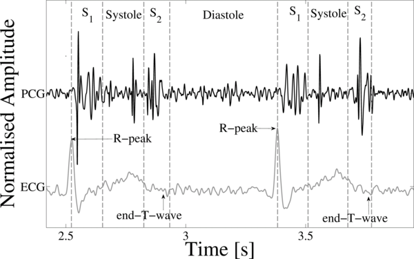

# Classification of Heart Sound Recordings: The PhysioNet/Computing in Cardiology Challenge 2016 

### Chengyu Liu, David Springer, Benjamin Moody, Ikaro Silva, Alistair Johnson, Maryam Samieinasab, Reza Sameni, Roger Mark, Gari D. Clifford

## Announcements

**Special issue of Physiological Measurement on “Recent advances in
heart sound analysis”** (Nov. 21, 2016, 12:42 p.m.)

The journal *Physiological Measurement* is hosting a special issue on
“[Recent advances in heart sound
analysis](http://iopscience.iop.org/journal/0967-3334/page/Recent-advances-in-heart-sound-analysis).”
We encourage all Challenge2016 entrants (and those who missed the
opportunity to compete or attend CinC 2016) to submit extended analyses
and articles to that issue, taking into account the publications and
discussions at CinC 2016.

**2016 CinC/PhysioNet Challenge papers** (Nov. 21, 2016, 12:38 p.m.)

[Papers](papers) and
corresponding [source
code](#sources) from the
2016 Challenge are now online.

**Sample code released for the PhysioNet/CinC Challenge 2016** (March
15, 2016, 1:44 p.m.)

[Example code](sample2016.zip) for Matlab
and Octave has been released.

**PhysioNet/CinC Challenge 2016** (March 4, 2016, 2 a.m.)

We are pleased to announce the 2016 PhysioNet/Computing in Cardiology
Challenge: Classification of Normal/Abnormal Heart Sound Recordings. For
this year’s Challenge, we have released a collection of 3,125
phonocardiograms from a variety of clinical and non-clinical sources. We
invite participants to develop algorithms to determine, based on a short
heart sound recording, whether the patient should be referred on for an
expert diagnosis.

**Community forum for the PhysioNet/CinC Challenge 2016** (March 1,
2016, 12:48 p.m.)

If you have any questions or comments regarding this challenge, please
post it directly in our [Community Discussion
Forum](https://groups.google.com/forum/#!forum/physionet-challenges).
This will increase transparency (benefiting all the competitors) and
ensure that all the challenge organizers see your question.

## Citations

When using this resource, please use the following publications:

- The PhysioNet Challenge description paper: [Clifford G, Liu C, Moody B, Springer D, Silva I, Li Q, Mark R."Classification of normal/abnormal heart sound recordings: *The PhysioNet/Computing in Cardiology Challenge 2016," 2016 Computing in Cardiology Conference (CinC),* Vancouver, BC, Canada, 2016, pp. 609-612.](https://ieeexplore.ieee.org/abstract/document/7868816)
- The paper describing the database: [Liu C, Springer D, Li Q, Moody B, Juan RA, Chorro FJ, Castells F, Roig JM, Silva I, Johnson AE, Syed Z, Schmidt SE, Papadaniil CD, Hadjileontiadis L, Naseri H, Moukadem A, Dieterlen A, Brandt C, Tang H, Samieinasab M, Samieinasab MR, Sameni R, Mark RG, Clifford GD. An open access database for the evaluation of heart sound algorithms. Physiol Meas.2016 Dec;37(12):2181-2213](https://doi.org/10.1088/0967-3334/37/12/2181)
- The PhysioNet resource: [Goldberger, A., Amaral, L., Glass, L., Hausdorff, J., Ivanov, P. C., Mark, R., … & Stanley, H. E. (2000). PhysioBank, PhysioToolkit, and PhysioNet: Components of a new research resource for complex physiologic signals. Circulation [Online]. 101 (23), pp. e215-e220](https://www.ahajournals.org/doi/full/10.1161/01.CIR.101.23.e215)

## Introduction

The 2016 PhysioNet/CinC Challenge aims to encourage the development of
algorithms to classify heart sound recordings collected from a variety
of clinical or nonclinical (such as in-home visits) environments. The
aim is to identify, from a single short recording (10-60s) from a single
precordial location, whether the subject of the recording should be
referred on for an expert diagnosis.

During the cardiac cycle, the heart firstly generates the electrical
activity and then the electrical activity causes atrial and ventricular
contractions. This in turn forces blood between the chambers of the
heart and around the body. The opening and closure of the heart valves
is associated with accelerations-decelerations of blood, giving rise to
vibrations of the entire cardiac structure (the heart sounds and
murmurs) [\[1\]](#1-leatham). These vibrations are audible at the chest wall, and
listening for specific heart sounds can give an indication of the health
of the heart. The phonocardiogram (PCG) is the graphical representation
of a heart sound recording. **Figure 1** illustrates a short section of
a PCG recording.



Figure 1. A PCG (center tracing), with simultaneously recorded ECG
(lower tracing) and the four states of the PCG recording; S1, Systole,
S2 and Diastole.
 

Four locations are most often used to listen to the heart sounds, which
are named according to the positions where the valves can be best heard:

-   Aortic area - centered at the second right intercostal space.
-   Pulmonic area - in the second intercostal space along the left
    sternal border.
-   Tricuspid area - in the fourth intercostal space along the left
    sternal edge.
-   Mitral area - at the cardiac apex, in the fifth intercostal space on
    the midclavicular line.

Fundamental heart sounds (FHSs) usually include the first (S1) and
second (S2) heart sounds. S1 occurs at the beginning of isovolumetric
ventricular contraction, when the mitral and tricuspid valves close due
to the rapid increase in pressure within the ventricles. S2 occurs at
the beginning of diastole with the closure of the aortic and pulmonic
valves. While the FHSs are the most recognizable sounds of the heart
cycle, the mechanical activity of the heart may also cause other audible
sounds, such as the third heart sound (S3), the fourth heart sound (S4),
systolic ejection click (EC), mid-systolic click (MC), diastolic sound
or opening snap (OS), as well as heart murmurs caused by the turbulent,
high-velocity flow of blood.

The segmentation of the FHSs is a first step in the automatic analysis
of heart sounds. The accurate localization of the FHSs is a prerequisite
for the identification of the systolic or diastolic regions, allowing
the subsequent classification of pathological situations in these
regions [\[2\]](#2-liang). Challenge participants could refer to the literature
\[[3](#3-liang)-[10](#10-springer)\] for a quick review of previously developed segmentation
methods.

The automated classification of pathology in heart sound recordings has
been performed for over 50 years, but still presents challenges. Gerbarg
et al were the first researchers to attempt the automatic classification
of pathology in PCGs using a threshold-based method [\[11\]](#11-gerbarg), motivated by
the need to identify children with rheumatic heart disease (RHD).
Artificial neural networks (ANNs) have been the most widely used machine
learning-based approach for heart sound classification. Typical relevant
studies grouped by the signal features as the input to the ANN
classifier include: using wavelet features [\[12\]](#12-liang), time, frequency and
complexity-based features [\[13\]](#13-schmidt), and time-frequency features [\[14\]](#14-de-vos). A
number of researchers have also applied support vector machines (SVM)
for heart sound classification in recent years. The studies can also be
divided according to the feature extraction methods, including wavelet
[\[15\]](#15-ari), time, frequency and time-frequency feature-based classifiers
[\[16\]](#16-maglogiannis). Hidden Markov models (HMM) have also been employed for pathology
classification in PCG recordings \[[17](#17-wang),[18](#18-saracoglu)\]. Clustering-based
classifiers, typically the k-nearest neighbors (kNN) algorithm
\[[19](#19-bentley),[20](#20-quinceno-manrique")\], have also been employed to classify pathology in PGCs. In
addition, many other techniques have been applied, including
threshold-based methods, decision trees [\[21\]](#21-pavlopoulos), discriminant function
analysis \[[22](#22-el-segaier),[23](#23-schmidt)\] and logistic regression.

Although a number of the current studies for heart sound classification
are flawed because of 1) good performance on carefully-selected data, 2)
lack of a separate test dataset, 3) failure to use a variety of PCG
recordings, or 4) validation only on clean recordings, these methods
have demonstrated potential to accurately detect pathology in PCG
recordings. In this Challenge, we will focus only on the accurate
classification of normal and abnormal heart sounds, especially when some
heart sounds exhibit very poor signal quality. The Challenge provides
the largest public collection of PCG recordings from a variety of
clinical and nonclinical environments, permitting challengers to develop
accurate and robust algorithms.

### Quick Start

1.  Download the validation set and the sample MATLAB entry.
2.  Develop your entry by editing the existing files:
    -   Modify the sample entry source code file `challenge.m` with your
        changes and improvements. For additional information, see the
        Preparing an Entry for the Challenge section.
    -   Modify the `AUTHORS.txt` file to include the names of all the
        team members.
    -   Unzip `validation.zip` and move the `validation` directory to
        the same directory where `challenge.m` is located.
    -   Run your modified source code file on all the records in the
        training set by executing the script `generateValidationSet.m`.
        This will also build a new version of `entry.zip`.
    -   Optional: Include a file named `DRYRUN` in the top directory of
        your entry (where the `AUTHORS.txt` file is located) if you do
        not wish your entry to be scored and counted against your limit.
        This is useful in cases where you wish to make sure that the
        changes made do not result in any error.
3.  Submit your modified entry.zip for scoring through the
    PhysioNet PhysioNet/CinC Challenge 2016 project (update: submissions
    are now closed). The contents of entry.zip must be laid out exactly
    as in the sample entry. **Improperly-formatted entries will not be
    scored.**

Join our community [Community Discussion
Forum](https://groups.google.com/forum/#!forum/physionet-challenges) to get the latest
challenge news, technical help, or if you would like to find partners to
collaborate with.

### Rules and Deadlines

Participants are asked to classify recordings as normal, abnormal (i.e.
they require further evaluation by an expert for further evaluation or
potential treatment) or too noisy or ambiguous to evaluate.

Entrants may have an overall total of up to 15 submitted entries over
both the unofficial and official phases of the competition (see Table
1). Each participant may receive scores for up to five entries submitted
during the unofficial phase and ten entries at the end of the official
phase. Unused entries may not be carried over to later phases. Entries
that cannot be scored (because of missing components, improper
formatting, or excessive run time) are not counted against the entry
limits.

All deadlines occur at noon GMT
([UTC](https://en.wikipedia.org/wiki/Coordinated_Universal_Time)) on the
dates mentioned below. If you do not know the difference between GMT and
your local time, find out what it is *before* the deadline!


|                   | *Start at noon GMT on* | *Entry limit* | *End at noon GMT on* |
| Unofficial Phase  | 1 March                | 5             | ~~10 April~~ 1 May   |
| [Hiatus]          | ~~10 April~~ 1 May     | 0             | ~~16 April~~ 7 May   |
| **Oficial Phase** | **~~16 April~~ 7 May** | **10**        | **26 August**        |

**Table 1:** Rules and deadlines

All official entries must be received no later than the **noon GMT on
Friday, 26 August 2016**. In the interest of fairness to all
participants, late entries will not be accepted or scored. Entries that
cannot be scored (because of missing components, improper formatting, or
excessive run time) are not counted against the entry limits.

To be eligible for the open-source award, you must do all of the
following:

1.  Submit at least one open-source entry that can be scored before the
    Phase I deadline **(noon GMT on Sunday, 1 May 2016)**.
2.  Submit a draft abstract about your work on the Challenge to
    [Computing in Cardiology](http://www.cinc.org/) no later than **14
    April 2016**. Please select \"PhysioNet/CinC Challenge\" as the
    topic of your abstract, so it can be identified easily by the
    abstract review committee.
3.  Submit a final abstract (about 300 words) no later than **2 May
    2016**. Include the overall score for at least one Phase I entry in
    your abstract. You will be notified if your abstract has been
    accepted by email from CinC during the first week in June.
4.  Submit a full (4-page) paper on your work on the Challenge to CinC
    no later than **1 September 2016**.
5.  Attend [CinC 2016](http://cinc2016.org) (**11-14 September 2016**)
    and present your work there.

Please do not submit analysis of this year\'s Challenge data to other
conferences or journals until after CinC 2016 has taken place, so the
competitors are able to discuss the results in a single forum. We expect
a special issue from the journal *Physiological Measurement* to follow
the conference and encourage all entrants (and those who missed the
opportunity to compete or attend CinC 2016) to submit extended analyses
and articles to that issue, taking into account the publications and
discussions at CinC 2016.

### Challenge Data

Heart sound recordings were sourced from several contributors around the
world, collected at either a clinical or nonclinical environment, from
both healthy subjects and pathological patients. The Challenge training
set consists of five databases (A through E) containing a total of 3,126
heart sound recordings, lasting from 5 seconds to just over 120 seconds.
You can [browse these
files](https://physionet.org/content/challenge-2016/#files), or download
the entire training set as a zip archive (169 MB). Updated
classification and signal quality annotations for the training set are
available in the Files section under annotations/updated.

In each of the databases, each record begins with the same letter
followed by a sequential, but random number. Files from the same patient
are unlikely to be numerically adjacent. The training and test sets have
each been divided so that they are two sets of mutually exclusive
populations (i.e., no recordings from the same subject/patient were are
in both training and test sets). Moreover, there are two data sets that
have been placed exclusively in either the training or test databases
(to ensure there are 'novel' recording types and to reduce overfitting
on the recording methods). Both the training set and the test set may be
enriched after the close of the unofficial phase. The test set is
unavailable to the public and will remain private for the purpose of
scoring.

Participants may note the existence of a validation dataset in the data
folder. This data is a copy of 300 records from the training set, and
will be used to validate entries before their evaluation on the test
set. More detail will be provided in the scoring section below.

The heart sound recordings were collected from different locations on
the body. The typical four locations are aortic area, pulmonic area,
tricuspid area and mitral area, but could be one of nine different
locations. In both training and test sets, heart sound recordings were
divided into two types: normal and abnormal heart sound recordings. The
normal recordings were from healthy subjects and the abnormal ones were
from patients with a confirmed cardiac diagnosis. The patients suffer
from a variety of illnesses (which we do not provide on a case-by-case
basis), but typically they are heart valve defects and coronary artery
disease patients. Heart valve defects include mitral valve prolapse,
mitral regurgitation, aortic stenosis and valvular surgery. All the
recordings from the patients were generally labeled as abnormal. We do
not provide more specific classification for these abnormal recordings.
Please note that both training and test sets are unbalanced, i.e., the
number of normal recordings does not equal that of abnormal recordings.
You will have to consider this when you train and test your algorithms.

Both healthy subjects and pathological patients include both children
and adults. Each subject/patient may have contributed between one and
six heart sound recordings. The recordings last from several seconds to
up to more than one hundred seconds. All recordings have been resampled
to 2,000 Hz and have been provided as .wav format. Each recording
contains only one PCG lead.

Please note that due to the uncontrolled environment of the recordings,
many recordings are corrupted by various noise sources, such as talking,
stethoscope motion, breathing and intestinal sounds. Some recordings
were difficult or even impossible to classify as normal or abnormal.
Therefore we have given the challengers the choice to classify some
recordings as 'unsure' and we penalize this in a different manner.
Therefore, your classifications for the heart sound recordings could be
three types: normal, abnormal and unsure (too noisy to know). The
detailed scoring mechanism could be found in Scoring section.

**Note:** A paper to provide a detailed description of all the heart
sound data in PhysioNet/CinC Challenge 2016 is expected to appear in the
Journal Physiological Measurement on or about July 2016. We will post a
preprint of it on this site soon to help you understand the Challenge
more thoroughly and may help in improving your submitted algorithms in
the Official Phase.

### Sample Submission

As a starting point, we have provided an example entry
([sample2016.zip](sample2016.zip)),
implemented using Matlab, which provides state of the art segmentation
and rudimentary classification. This code first segments the heart
sounds using Springer's improved version of Schmidt's method \[[5](#5-schmidt),[9](#9-springer")\],
which uses a Hidden Markov Model (HMM) that has been trained (using
database 'a' of the training set) to identify four 'states'; S1, S2,
systole and diastole. Thereafter, 20 features are extracted from the
timings of the states and a logistic regression classifier (again,
trained on database 'a' of the training data) provides the
classification of the recording as normal or abnormal. For more
information about this algorithm, see the released [Logistic
Regression-HSMM-based Heart Sound
Segmentation](https://physionet.org/physiotools/hss/) software package
on PhysioToolkit. For the segmentation annotations for the training set
from Springer's segmentation algorithm, see the annotations/springer_alg
folder in the Files section. For hand-corrected segmentation annotations
for the training set, see the annotations/hand_corrected folder and [Liu
et al., \"An open access database for the evaluation of heart sound
algorithms\", Physiol. Meas, 2016 Dec;37(12):2181-2213. doi:
10.1088/0967-3334/37/12/2181](https://pubmed.ncbi.nlm.nih.gov/27869105/)
for details.

A simpler version of this code
([sample2016b.zip](sample2016b.zip)),
using Schmidt\'s original algorithm, is faster and works in GNU Octave
as well as in Matlab.

You may want to begin with this framework, and add more intelligent
approaches, or discard it completely and start from scratch. The
features and classifier are not necessarily recommended and they are
only provided as an example benchmark approach. The beat segmentation
algorithm is, however, state of the art. We therefore suggest you
concentrate on adapting this to provide better features. Note also that
we have not optimized the training of either the HMM, the features
chosen or selected, the splitting of the data, or the classifier. We
suggest you consider these issues carefully.

### Preparing an entry for the challenge

To participate in the challenge, you will need to create software that
is able to read the test data and output the final classification result
without user interaction in our test environment. A sample entry
(sample2016.zip), written in MATLAB, is available to help you get
started. In addition to MATLAB, you may use any programming language (or
combination of languages) supported using open-source compilers or
interpreters on GNU/Linux, including C, C++, Fortran, Haskell, Java,
Octave, Perl, Python, and R.

***If your entry requires software that is not installed in our sandbox
environment, please let us know before the end of Phase I. We will not
modify the test environment after the start of Phase II of the
challenge.***

Your entry must be in the format of a `zip` or `tar.gz` archive,
containing the following files:

-   `setup.sh`, a `bash` script run once before any other code from the
    entry; use this to compile your code as needed
-   `next.sh`, a `bash` script run once per training or test record; it
    should analyze the record using your code, writing the results to
    the file `answers.txt`.
-   `answers.txt`, a text file containing the results of running your
    program on each record in the validation set. These results are used
    for checking that your program is working correctly, not for ranking
    entries (see below).
-   `AUTHORS.txt`, a plain text file listing the members of your team
    who contributed to your code, and their affiliations.
-   `LICENSE.txt`, a text file containing the license for your software.
    The sample entry is licensed under the GNU GPL. All entries are
    assumed to be open source and will eventually be released on
    PhysioNet.

See the comments in the sample entry\'s `setup.sh` and `next.sh` if you
wish to learn how to customize these scripts for your entry.

We verify that your code is working as you intended, by running it on
the validation set, which consists of approximately 10% of the training
set. We then compare the answers produced by your code with the contents
of the `answers.txt` file that you submit as part of your entry. Using a
small portion of the training set means you will know whether your code
passed or failed to run in approximately an hour or less. If your code
passes this validation test, it is then evaluated and scored using an
approximately representative 20% of the hidden test set. By selecting a
random 20% subset of the test set, not only do you receive your score in
a more timely manner, but it also prevents you from over-fitting on the
test data through multiple entries. Towards the end of the official
phase we will run your code on increasingly larger portions of the test
set. The score on the complete test set determines the ranking of the
entries and the final outcome of the Challenge.

In addition to the *required* components, your entry may include a file
named `DRYRUN`. If this file is present, your entry is not evaluated
using the hidden test data, and it will not be counted against your
limit of entries per phase; you will receive either a confirmation of
success or a diagnostic report, but no scores. Use this feature to
verify that none of the required components are missing, that your
`setup.sh` script works in the test environment, and that your `next.sh`
script produces the expected output for the training data within the
time limits.

### Scoring

If your entry is properly formatted, and nothing is missing, it is
tested and scored automatically, and you will receive your provisional
scores when the test is complete (this will take several hours,
depending on how complex your entry is). If you receive an error message
instead, read it carefully and correct the problem(s) before
resubmitting.

The overall score for your entry is computed based on the number of
records classified as normal, uncertain, or abnormal, in each of the
reference categories. These numbers are denoted by $$Nn_k$$, $$Nq_k$$, $$Na_k$$, $$An_k$$, $$Aq_k$$, $$Aa_k$$, as follows:

<!-- GitHub Markdown doesn't support a table like this -->

<table>
    <tbody>
        <tr>
            <td>&nbsp;</td>
            <td>&nbsp;</td>
            <td colspan="3" style="text-align: center;"><strong>Entry&#39;s output</strong></td>
        </tr>
        <tr>
            <td>&nbsp;</td>
            <td>&nbsp;</td>
            <td>Normal (-1)</td>
            <td>Uncertain (0)</td>
            <td>Abnormal (1)</td>
        </tr>
        <tr>
            <td rowspan="4" style="text-align: center;"><strong>Reference label</strong></td>
            <td>Normal, clean</td>
            <td><span>\(Nn_1\)</span></td>
            <td><span>\(Nq_1\)</span></td>
            <td><span>\(Na_1\)</span></td>
        </tr>
        <tr>
            <td>Normal, noisy</td>
            <td><span>\(Nn_2\)</span></td>
            <td><span>\(Nq_2\)</span></td>
            <td><span>\(Na_2\)</span></td>
        </tr>
        <tr>
            <td>Abnormal, clean</td>
            <td><span>\(An_1\)</span></td>
            <td><span>\(Aq_1\)</span></td>
            <td><span>\(Aa_1\)</span></td>
        </tr>
        <tr>
            <td>Abnormal, noisy</td>
            <td><span>\(An_2\)</span></td>
            <td><span>\(Aq_2\)</span></td>
            <td><span>\(Aa_2\)</span></td>
        </tr>
    </tbody>
</table>

Weights for the various categories are defined as follows (based on the
distribution of the *complete* test set):

$$ wa_{1} = \frac{\textrm{clean abnormal records}}{\textrm{total abnormal records}} $$

$$ wa_{2} = \frac{\textrm{noisy abnormal records}}{\textrm{total abnormal records}}$$

$$ wn_{1} = \frac{\textrm{clean normal records}}{\textrm{total normal records}}$$

$$ wn_{2} = \frac{\textrm{noisy normal records}}{\textrm{total normal records}}$$

The modified sensitivity and specificity are defined (based on a
*subset* of the test set):

$$\textit{Se} = wa_{1}\frac{Aa_{1}}{Aa_{1} + Aq_{1} + An_{1}} + wa_{2}\frac{Aa_{2} + Aq_{2}}{Aa_{2} + Aq_{2} + An_{2}}$$

$$\textit{Sp} = wn_{1}\frac{Nn_{1}}{Na_{1} + Nq_{1} + Nn_{1}} + wn_{2}\frac{Nn_{2} + Nq_{2}}{Na_{2} + Nq_{2} + Nn_{2}}$$

The overall score is then the average of these two values,
$$\frac{\textit{Se} + \textit{Sp}}{2}$$.

### Obtaining complimentary MATLAB licenses

[The MathWorks](http://www.mathworks.com) has kindly decided to sponsor
Physionet\'s 2016 Challenge both through additional prize money for the
winners and through complimentary licenses for Challenge participants
for the duration of the Challenge. User can apply for a license and
learn more about MATLAB support through The MathWorks\' [PhysioNet
Challenge
link](http://www.mathworks.com/academia/student-competitions/physionet/?requestedDomain=www.mathworks.com&nocookie=true).
If you have questions or need technical support, please contact The
MathWorks at <academicsupport@mathworks.com>.

### Challenge Results

Listed below are the top-scoring programs submitted in the
PhysioNet/Computing in Cardiology Challenge 2016. Please refer to the
AUTHORS.txt and LICENSE.txt file included with each entry for
information about attribution and licensing. For more information about
the details of these algorithms, see [the corresponding
papers](/files/challenge-2016/1.0.0/papers/index.html).

### <a name="sources"></a> Top-Scoring 2016 Challenge Entries

| Score  | Authors                                                                                                                                                                                                                                  |
| 0.8602 | [Christhian Potes, Saman Parvaneh](https://physionet.org/static/published-projects/challenge-2016/1.0.0/sources/cristhian.potes-204.zip)                                                                                                                      |
| 0.8590 | [Morteza Zabihi, Ali Bahrami Rad](https://physionet.org/static/published-projects/challenge-2016/1.0.0/sources/morteza.zabihi-208.zip)                                                                                                                        |
| 0.8520 | [Edmund Kay, Anurag Agarwal](https://physionet.org/static/published-projects/challenge-2016/1.0.0/sources/ek360-210.zip)                                                                                                                                      |
| 0.8454 | [Ignacio Diaz Bobillo](https://physionet.org/static/published-projects/challenge-2016/1.0.0/sources/ignaciod-203.zip)                                                                                                                                         |
| 0.8448 | [Masun Nabhan Homsi, Natasha Medina, Miguel Hernandez, Natacha Quintero, Gilberto Perpiñan, Andrea Quintana, Philip Warrick](https://physionet.org/static/published-projects/challenge-2016/1.0.0/sources/mnabhan-208.zip)                                    |
| 0.8415 | [Vykintas Maknickas, Algirdas Maknickas](https://physionet.org/static/published-projects/challenge-2016/1.0.0/sources/vykintas.mak-212.zip)                                                                                                                   |
| 0.8411 | [Filip Plesinger, Juraj Jurco, Josef Halamek, Pavel Jurak](https://physionet.org/static/published-projects/challenge-2016/1.0.0/sources/fplesinger-208.zip)                                                                                                   |
| 0.8399 | [Jonathan Rubin, Kumar Sricharan, Anurag Ganguli, Rui Abreu, Saigopal Nelaturi, Ion Matei](https://physionet.org/static/published-projects/challenge-2016/1.0.0/sources/jrubin01-206.zip)                                                                     |
| 0.8282 | [Chen Jiayu](https://physionet.org/static/published-projects/challenge-2016/1.0.0/sources/jiayuchen-203.zip)                                                                                                                                                  |
| 0.8263 | [Mostafa Abdollahpur, Shadi Ghiasi, Javad Molakazemi](https://physionet.org/static/published-projects/challenge-2016/1.0.0/sources/shadi1337-219.zip)                                                                                                         |
| 0.8185 | [Mingjun Zhong, Hong Tang](https://physionet.org/static/published-projects/challenge-2016/1.0.0/sources/tanghong-216.zip)                                                                                                                                     |
| 0.8150 | [Wen-jie Zhang, Shi-wen Deng, Ji-qing Han](https://physionet.org/static/published-projects/challenge-2016/1.0.0/sources/zwjhit-203.zip)                                                                                                                       |
| 0.8148 | [Li Hu](https://physionet.org/static/published-projects/challenge-2016/1.0.0/sources/lihuyeti-220.zip)                                                                                                                                                        |
| 0.8122 | [Matthias Heinzmann, Thomas Kramer, Gian Marti, Michael Tschannen, Thomas Wiatowski](https://physionet.org/static/published-projects/challenge-2016/1.0.0/sources/michaelt-213.zip)                                                                           |
| 0.8111 | [Junheng Hao, Tanachat Nilanon, Jiayu Yao](https://physionet.org/static/published-projects/challenge-2016/1.0.0/sources/tanachat.nilanon-218.zip)                                                                                                             |
| 0.8073 | [Bradley M. Whitaker](https://physionet.org/static/published-projects/challenge-2016/1.0.0/sources/b.whitaker-224.zip)                                                                                                                                        |
| 0.8028 | [Hajas Péter, Mátron Áron Goda](https://physionet.org/static/published-projects/challenge-2016/1.0.0/sources/itepsajah-212.zip)                                                                                                                               |
| 0.8018 | [Te-Chung Isaac Yang, Haowei Hsieh](https://physionet.org/static/published-projects/challenge-2016/1.0.0/sources/tcyang-201.zip)                                                                                                                              |
| 0.7998 | [Sasan Yazdani, Silas Schlatter, Jean-Marc Vesin](https://physionet.org/static/published-projects/challenge-2016/1.0.0/sources/sasan.yazdani-202.zip)                                                                                                         |
| 0.7956 | [Rohan Banerjee, Swagata Biswas, Snehasis Banerjee, Anirban Dutta Choudhury, Tanushyam Chattopadhyay, Arpan Pal, Parijat Deshpande, Kayapanda M Mandana](https://physionet.org/static/published-projects/challenge-2016/1.0.0/sources/rohan.banerjee-203.zip) |
| 0.7941 | [Nicholas Singh-Miller, Natasha Singh-Miller, Virginia Randall](https://physionet.org/static/published-projects/challenge-2016/1.0.0/sources/nicholas.singhmiller-222.zip)                                                                                    |
| 0.7869 | [Xulei Yang, Feng Yang, Like Gobeawan, Si Yong Yeo, Shuang Le , Liang Zhong, Yi Su](https://physionet.org/static/published-projects/challenge-2016/1.0.0/sources/yangx-202.zip)                                                                               |
| 0.7869 | [Heechang Ryu](https://physionet.org/static/published-projects/challenge-2016/1.0.0/sources/rhc93-205.zip)                                                                                                                                                    |
| 0.7864 | [Anthony Bouril, Darya Aleinikava, Grace M. Mirsky](https://physionet.org/static/published-projects/challenge-2016/1.0.0/sources/cincgrace-210.zip)                                                                                                           |
| 0.7854 | [Jose Javier Gonzalez, Cheng Perng Phoo, Jenna Wiens](https://physionet.org/static/published-projects/challenge-2016/1.0.0/sources/jjgo-224.zip)                                                                                                              |
| 0.7847 | [Christoph Hoog Antink, Julian Becker, Steffen Leonhardt, Marian Walter](https://physionet.org/static/published-projects/challenge-2016/1.0.0/sources/hoog.antink-213.zip)                                                                                    |
| 0.7820 | [Arijit Ukil, Soma Bandyoapdhyay, Chetanya Puri, Rituraj Singh, Arpan Pal, Ayan Mukherjee, Debayan Mukherjee](https://physionet.org/static/published-projects/challenge-2016/1.0.0/sources/chetanya.puri-211.zip)                                             |
| 0.7799 | [Adriana C. Leal, Diogo B. Nunes, Ricardo Couceiro, João Pedro Ramos, Jorge Henriques, Paulo Carvalho, César Teixeira](https://physionet.org/static/published-projects/challenge-2016/1.0.0/sources/adriana.costa.leal-205.zip)                               |
| 0.7777 | [Sachin Vernekar, Saurabh Nair, Deepu Vijaya Senan](https://physionet.org/static/published-projects/challenge-2016/1.0.0/sources/sachinvernekar50-206.tar.gz)                                                                                                 |
| 0.7773 | [I.Grzegorczyk M.Solinski, K.Stepien M.Lepek, J.Rymko A.Perka, J. Rosinski J. Gierałtowski](https://physionet.org/static/published-projects/challenge-2016/1.0.0/sources/sources/igagrze-213.zip)                                                             |
| 0.7756 | [Christian Thomae](https://physionet.org/static/published-projects/challenge-2016/1.0.0/sources/christian.thomae-216.zip)                                                                                                                                     |
| 0.7724 | [Pedro Quintana-Morales, Antonio Ravelo-García, Eduardo Hernández-Pérez, Sofía Martín-González, Juan-Luis Navarro-Mesa](https://physionet.org/static/published-projects/challenge-2016/1.0.0/sources/pquintana-202.zip)                                       |
| 0.7708 | [Tanmay Gokhale](https://physionet.org/static/published-projects/challenge-2016/1.0.0/sources/tanmay.gokhale-202.zip)                                                                                                                                         |
| 0.7611 | [Philip Langley](https://physionet.org/static/published-projects/challenge-2016/1.0.0/sources/p.langley-204.zip)                                                                                                                                              |
| 0.7561 | [Jarno Mäkelä, Heikki Väänänen](https://physionet.org/static/published-projects/challenge-2016/1.0.0/sources/jarno.makela-214.zip)                                                                                                                            |
| 0.7475 | [Rui Rodrigues](https://physionet.org/static/published-projects/challenge-2016/1.0.0/sources/rapr-201.zip)                                                                                                                                                    |
| 0.7465 | [Tamanna T. K. Munia, Alireza Akhbardeh, Farzad Khosrow-Khavar, Vahid Zakeri, Reza Fazel-Rezai, Kouhyar Tavakolian](https://physionet.org/static/published-projects/challenge-2016/1.0.0/sources/tamannatabassumkha.m-218.zip)                                |
| 0.7451 | [Teo Soo-Kng, Su Yi, Yang Bo, Feng Ling](https://physionet.org/static/published-projects/challenge-2016/1.0.0/sources/teosk-202.zip)                                                                                                                          |
| 0.7418 | [Juan L. Domínguez-Olmedo, Jacinto Mata Vázquez](https://physionet.org/static/published-projects/challenge-2016/1.0.0/sources/juan.dominguez-201.zip)                                                                                                         |
| 0.7388 | [Christopher Schölzel, Andreas Dominik](https://physionet.org/static/published-projects/challenge-2016/1.0.0/sources/christopher.schoelzel-202.zip)                                                                                                           |
| 0.7317 | [Zhao Yizhang, Yuan Cheng, Wang Lisha](https://physionet.org/static/published-projects/challenge-2016/1.0.0/sources/496101031-214.zip)                                                                                                                        |
| 0.7151 | [Xinpei Wang, Yuanyang Li](https://physionet.org/static/published-projects/challenge-2016/1.0.0/sources/sikao666-211.zip)                                                                                                                                     |
| 0.6686 | [Koh Bee Hock](https://physionet.org/static/published-projects/challenge-2016/1.0.0/sources/kohbhd-202.zip)                                                                                                                                                   |
| 0.6513 | [Yusuf Bugra Erol, Fahad Kamran](https://physionet.org/static/published-projects/challenge-2016/1.0.0/sources/fhdkmrn-205.zip)                                                                                                                                |
| 0.6377 | [Mark Gao](https://physionet.org/static/published-projects/challenge-2016/1.0.0/sources/markgao11-205.zip)                                                                                                                                                    |
| 0.5555 | [Simon Hofmann, Andreas Dominik](https://physionet.org/static/published-projects/challenge-2016/1.0.0/sources/andreas.dominik-207.tar.gz)                                                                                                                     |
| 0.5353 | [Shaaban Mahran Abbady, Jian Chen, Jennifer Lavarnge, Cheng-Yuan Ke](https://physionet.org/static/published-projects/challenge-2016/1.0.0/sources/smr5476-205.zip)                                                                                            |

### Papers

The following paper is an introduction to the challenge topic, with a
summary of the challenge results and a discussion of their
implications. Please cite this publication when referencing the
Challenge.

> [Classification of Normal/Abnormal Heart Sound Recordings: the
> PhysioNet/Computing in Cardiology Challenge
> 2016](papers/challenge2016.pdf)\
> Gari D. Clifford, Chengyu Liu, Benjamin Moody, David Springer, Ikaro
> Silva, Qiao Li, Roger G. Mark

Over 12 papers were presented at [*Computing in Cardiology
2016*](http://www.cinc.org/). These papers have been made available by
their authors under the terms of the Creative Commons Attribution
License 3.0 ([CCAL](http://creativecommons.org/licenses/by/3.0/)). They
are available [here](/files/challenge-2016/1.0.0/papers/index.html). We
wish to thank all of the authors for their contributions.

## Files

Total uncompressed size: 1.1 GB.

##### Access the files

-   [Download the ZIP
    file](https://physionet.org/static/published-projects/challenge-2016/classification-of-heart-sound-recordings-the-physionetcomputing-in-cardiology-challenge-2016-1.0.0.zip)
    (1011.4 MB)

-   Access the files using the Google Cloud Storage Browser
    [here](https://console.cloud.google.com/storage/browser/challenge-2016-1.0.0.physionet.org/).
    Login with a Google account is required.

-   Access the data using the Google Cloud command line tools (please
    refer to the
    [gsutil](https://cloud.google.com/storage/docs/gsutil_install)
    documentation for guidance):

    ``` shell-command
    gsutil -m -u YOUR_PROJECT_ID cp -r gs://challenge-2016-1.0.0.physionet.org DESTINATION
    ```

-   Download the files using your terminal:

    ``` shell-command
    wget -r -N -c -np https://physionet.org/files/challenge-2016/1.0.0/
    ```


## References

<a name="1-leatham"></a>[1]. Leatham, A. Auscultation of the heart and phonocardiography. Churchill Livingstone: 1975.

<a name="2-liang"></a>[2]. Liang, H.Y.; Sakari, L.; Iiro, H. In A heart sound segmentation algorithm using wavelet decomposition and reconstruction, Proceedings of the 19th Annual International Conference of the IEEE Engineering in Medicine and Biology Society, Chicago, IL, 1997; IEEE: Chicago, IL, pp 1630-1633.

<a name="3-liang"></a>[3]. Liang, H.; Lukkarinen, S.; Hartimo, I. In Heart sound segmentation algorithm based on heart sound envelolgram, Computing in Cardiology, 1997; IEEE: pp 105-108.

<a name="4-papadaniil"></a>[4]. Papadaniil, C.D.; Hadjileontiadis, L.J. Efficient heart sound segmentation and extraction using ensemble empirical mode decomposition and kurtosis features. IEEE J Biomed Health Inform 2014, 18, 1138-1152.

<a name="5-schmidt"></a>[5]. Schmidt, S.E.; Holst-Hansen, C.; Graff, C.; Toft, E.; Struijk, J.J. Segmentation of heart sound recordings by a duration-dependent hidden markov model. Physiol Meas 2010, 31, 513-529.

<a name="6-sedighian"></a>[6]. Sedighian P.; Subudhi, A.W.; Scalzo, F.; Asgari, S. In Pediatric heart sound segmentation using hidden markov model, Annual International Conference of the IEEE Engineering in Medicine and Biology Society, Chicago, 2014; IEEE: Chicago, pp 5490-5493.

<a name="7-syed"></a>[7]. Syed, Z.; Leeds, D.; Curtis, D.; Nesta, F.; Levine, R.A.; Guttag, J. A framework for the analysis of acoustical cardiac signals. IEEE Trans Biomed Eng 2007, 54, 651-662.

<a name="8-tang"></a>[8]. Tang, H.; Li, T.; Qiu, T.S.; Park, Y. Segmentation of heart sounds based on dynamic clustering. Biomed Signal Process Control 2012, 7, 509-516.

<a name="9-springer"></a>[9] Springer, D.B.; Tarassenko, L.; Clifford, G.D. Logistic regression-hsmm-based heart sound segmentation. IEEE Trans Biomed Eng 2015, In press.

<a name="10-springer"></a>[10] Springer, D.B.; Tarassenko, L.; Clifford, G.D. In Support vector machine hidden semi-markov model-based heart sound segmentation, Computing in Cardiology, Cambridge, MA, 2014; IEEE: Cambridge, MA, pp 625-628

<a name="11-gerbarg"></a>[11] Gerbarg, D.S.; Taranta, A.; Spagnuolo, M.; Hofler, J.J. Computer analysis of phonocardiograms. Progress in Cardiovascular Diseases 1963, 5, 393-405.

<a name="12-liang"></a>[12] Liang, H.; Hartimo, I. In A feature extraction algorithm based on wavelet packet decomposition for heart sound signals, Proceedings of the IEEE-SP International Symposium on Time-Frequency and Time-Scale Analysis, Pittsburgh, PA, 1998; IEEE: Pittsburgh, PA, pp 93-96.

<a name="13-schmidt"></a>[13] Schmidt, S.; Graebe, M.; Toft, E.; Struijk, J. No evidence of nonlinear or chaotic behavior of cardiovascular murmurs. Biomed Signal Process Control 2011, 6, 157-163.

<a name="14-de-vos"></a>[14] De Vos, J.P.; Blanckenberg, M.M. Automated pediatric cardiac auscultation. IEEE Trans Biomed Eng 2007, 54, 244-252.

<a name="15-ari"></a>[15] Ari, S.; Hembram, K.; Saha, G. Detection of cardiac abnormality from pcg signal using lms based least square svm classier,. Expert Syst Appl 2010, 37, 8019-8026.

<a name="16-maglogiannis"></a>[16] Maglogiannis, I.; Loukis, E.; Zafiropoulos, E.; Stasis, A. Support vectors machine-based identification of heart valve diseases using heart sounds. Comput Methods Programs Biomed 2009, 95, 47-61.

<a name="17-wang"></a>[17] Wang, P.; Lim, C.S.; Chauhan, S.; Foo, J.Y.; Anantharaman, V. Phonocardiographic signal analysis method using a modified hidden markov model. Ann Biomed Eng 2007, 35, 367-374.

<a name="18-saracoglu"></a>[18] Saracoglu, R. Hidden markov model-based classification of heart valve disease with pca for dimension reduction. Eng Appl Artif Intell 2012, 25, 1523-1528.

<a name="19-bentley"></a>[19] Bentley, P.M.; Nokia, R.D.; Camberley, U.K.; Grant, P.M.; McDonnell, J.T.E. Time-frequency and time-scale techniques for the classification of native and bioprosthetic heart valve sounds. IEEE Trans Biomed Eng 1998, 45, 125-128.

<a name="20-quiceno-manrique"></a>[20] Quiceno-Manrique, A.F.; Godino-Llorente, J.I.; Blanco-Velasco, M.; Castellanos-Dominguez, G. Selection of dynamic features based on time-frequency representations for heart murmur detection from phonocardiographic signals. Ann Biomed Eng 2010, 38, 118-137.

<a name="21-pavlopoulos"></a>[21] Pavlopoulos, S.A.; Stasis, A.C.; Loukis, E.N. A decision tree--based method for the differential diagnosis of aortic stenosis from mitral regurgitation using heart sounds. Biomed Eng Online 2004, 3, 21.

<a name="22-el-segaier"></a>[22] El-Segaier, M.; Pesonen, E.; Lukkarinen, S.; Peters, K.; Sörnmo, L.; Sepponen, R. Detection of cardiac pathology: Time intervals and spectral analysis. Acta Paediatr 2007, 96, 1036-1042.

<a name="23-schmidt"></a>[23] Schmidt, S.E.; Holst-Hansen, C.; Hansen, J.; Toft, E.; Struijk, J.J. Acoustic features for the identification of coronary artery disease. IEEE Trans Biomed Eng 2015, 62, 2611-2619.

