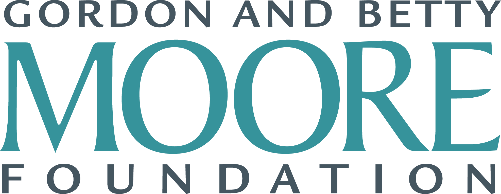

[comment]: <> ()

# Early Prediction of Sepsis from Clinical Data: The PhysioNet/Computing in Cardiology Challenge 2019

##  Announcements

__November 4, 2019:__ The [official paper describing the 2019 PhysioNet Challenge](https://www.cinc.org/archives/2019/pdf/CinC2019-412.pdf) appeared on the CinC website [here](https://cinc.org/archives/2019/) and the journal paper appeared in [Critical Care Medicine](https://journals.lww.com/ccmjournal/fulltext/2020/02000/early_prediction_of_sepsis_from_clinical_data__the.10.aspx).

__September 17, 2019:__ Official results for the 2019 PhysioNet [Challenge](/results/challenge.tsv) and [Hackathon](/results/hackathon.tsv) are now available.

__July 8, 2019:__ Thanks to our sponsors, a pre-conference hackathon at Computing in Cardiology 2019 (with prize(s)) will take place on Sunday 8th September in Singapore. Registration is required. Rules and more information can be found [here](#hackathon).

__June 23, 2019:__ Two "wild card" teams were approved for inclusion in the Challenge. We are looking forward to meeting them in Singapore!

__May 28, 2019:__ We are accepting requests for Google Cloud Credits ($500 per eligible team). Requests are due by 29 May, 2019. Please see [here](/content/challenge-2019/1.0.0/#google-cloud-credits) for more information on how to apply for them. Requests will be processed in order and sent on to Google. We cannot guarantee you will receive them, especially later in the competition.

__May 24, 2019:__ Notices of acceptance have been sent for CinC abstracts.
  By now you should have received your acceptance or rejection notices for your abstracts. If you were rejected, please do not worry - there are two more options to compete. See [here](#wildcard) and [here](/#hackathon) for more information on this.
  We have added a \`wild card' entry to allow one more team to enter the competition and be eligible for all the prizes. See [here](#wildcard) for more information on this.
  There will be an on-site hackathon revisiting the Challenge (with a separate award) on Sunday 8th September, before the conference begins in Singapore. Any team (whether previously registered for the Challenge or not) with at least one attendee at the conference, who turns up in person to register for the Hackathon, is eligible to enter. See [here](#hackathon) for more information on this.

__May 2, 2019:__ Scoring for the PhysioNet Challenge are on leaderboard. Please check the [leaderboard](https://docs.google.com/spreadsheets/d/e/2PACX-1vQ_dGi-82KYDR0lCK0YfcOeHXDRCeunRiw9U8EZdZG654wwOoJX2UTu2AsxCcxfghrBNeZe5c9RYKVV/pubhtml?gid=0&single=true&widget=true&headers=false&chrome=false) for the current Challenge scores.

__April 25, 2019:__ Now accepting Challenge submissions:
   We are now accepting submissions for the official phase of the Challenge.
   Please check the [submission instructions](#submission) for information about how to submit your entry and a FAQ with common submission issues.
   When ready, please submit your entry [here](https://forms.gle/ARfUYv5Vpsa24EaB7).

__April 22, 2019:__ Official phase of the 20th PhysioNet/Computing in Cardiology Challenge is now open.
  We have made several changes from the unofficial phase of the Challenge (see below). We invite comments and questions about these changes. We plan to accept submissions again on Thursday, 25 April at 12:01 am GMT.
  We will only use our new cloud submission system for the official phase of the Challenge. See the updated instructions ([here](https://docs.google.com/document/d/1-YCLmie2_1gM4FrpBaSfkhYt8xpYghs8l2vbPemODkw/edit)) for details. The past submission system is no longer available.
  We ask participants to write causal algorithms that make predictions using current and past (but not future) information. See the [submission instructions](#submitting) and sample prediction code ([here](https://github.com/physionetchallenges)) for details.
  Note that you will have 10 submissions in this official phase. We will score your results on a subset of the test data. At the end of the competition we will ask you to nominate your 'best' algorithm (it need not be the one that gave you the best score) and we will run it on the full test data to provide the final test score.
  Please do not submit all ten entries in the last week of the competition. Even though we can scale the computing, failures require manual intervention and feedback. We can't do this for 1000+ entries in the final week.
  Also - we will be offering up to $500 in Google Cloud credits (courtesy of the Google Cloud Team) to the best performing entries by June, so it's worth getting a good score before then!

__April 11, 2019:__ Cloud submission system for the 2019 PhysioNet Challenge: We have now implemented a cloud submission system. Instructions for the cloud submission system available here. The deadline of the unofficial phase of the competition has been extended to 11.59pm GMT on Sunday 14th April 2019. This will give you enough time to receive scores and, very importantly, submit abstracts to cinc.org before the 15th. Please [see here](/content/challenge-2019/1.0.0/#abstracts) for important hints on how to prepare a successful abstract, even if you don't receive a score.
  If you don't receive a score - don't panic - just submit an abstract to cinc.org by the deadline on the 15th April with some results - cross validated on the training data.
  The hiatus has now been moved, and starts on the 15th April and lasts until 12 midnight GMT on the 21st April. The Challenge re-opens at 12.01 am GMT on the 22 April.

__April 8, 2019:__ Deadline extended for the 2019 PhysioNet Challenge. The entry submission system is available [here](https://forms.gle/ARfUYv5Vpsa24EaB7). The deadline of the unofficial phase of the competition has been extended to 11.59pm GMT on Wednesday 10th April 2019.

__April 1, 2019:__ Expanded training dataset now available. An [expanded training database](https://archive.physionet.org/pnw/challenge-2019-request-access) is now available, containing data from a total of 40,336 subjects.

__February 8, 2019:__ The PhysioNet/Computing in Cardiology Challenge 2019 has now begun! This year's topic is prediction of sepsis from clinical data. We are delighted to announce that this year's Challenge is being sponsored by the Gordon and Betty Moore Foundation, Google and Mathworks.

__February 6, 2019:__ 20th PhysioNet/Computing Challenge in Cardiology is now open.
  This year's challenge is co-sponsored by the Gordon and Betty Moore Foundation, MathWorks, and Google.
  The PhysioNet Challenge data, examples, and scoring functions can be [downloaded here](https://archive.physionet.org/pnw/challenge-2019-request-access).
  If you have any questions or comments regarding this Challenge, then please post them directly in our [Community Discussion Forum](https://groups.google.com/group/physionet-challenges). This will increase transparency (benefiting all the competitors) and ensure that all the Challenge organizers see your question.

{: style="text-align:center"}
{:height="40px"}
{:height="40px"}&nbsp;&nbsp;&nbsp;
{:height="40px"}

{: style="text-align:center"}
{:height="120px"}

##  Abstract

Sepsis is a life-threatening condition that occurs when the body's response to infection causes tissue damage, organ failure, or death ([Singer _et al._, 2016](https://www.ncbi.nlm.nih.gov/pubmed/26903338)). In the U.S., nearly 1.7 million people develop sepsis and 270,000 people die from sepsis each year; over one third of people who die in U.S. hospitals have sepsis ([CDC](https://www.cdc.gov/sepsis/datareports/index.html)). Internationally, an estimated 30 million people develop sepsis and 6 million people die from sepsis each year; an estimated 4.2 million newborns and children are affected ([WHO](https://www.who.int/news-room/fact-sheets/detail/sepsis)). Sepsis costs U.S. hospitals more than any other health condition at $24 billion (13% of U.S. healthcare expenses) a year, and a majority of these costs are for sepsis patients that were not diagnosed at admission ([Paoli _et al._, 2018](https://www.ncbi.nlm.nih.gov/pubmed/30048332)). Sepsis costs are even greater globally with the developing world at most risk. Altogether, sepsis is a major public health issue responsible for significant morbidity, mortality, and healthcare expenses.

Early detection and antibiotic treatment of sepsis are critical for improving sepsis outcomes, where each hour of delayed treatment has been associated with roughly an 4-8% increase in mortality ([Kumar _et al._, 2006](https://www.ncbi.nlm.nih.gov/pubmed/16625125); [Seymour _et al._, 2017](https://www.ncbi.nlm.nih.gov/pubmed/28528569)). To help address this problem, clinicians have proposed new definitions for sepsis ([Singer _et al._, 2016](https://jamanetwork.com/journals/jama/fullarticle/2492881)), but the fundamental need to detect and treat sepsis early still remains, and basic questions about the limits of early detection remain unanswered. The PhysioNet/Computing in Cardiology Challenge 2019 provides an opportunity to address these questions.

##  Objective

The goal of this Challenge is the early detection of sepsis using physiological data. For the purpose of the Challenge, we define _sepsis_ according to the Sepsis-3 guidelines, i.e., a two-point change in the patient's Sequential Organ Failure Assessment (SOFA) score and clinical suspicion of infection (as defined by the ordering of blood cultures or IV antibiotics) ([Singer _et al._, 2016](https://www.ncbi.nlm.nih.gov/pubmed/26903338)).

The early prediction of sepsis is potentially life-saving, and we challenge participants to predict sepsis 6 hours before the clinical prediction of sepsis. Conversely, the late prediction of sepsis is potentially life-threatening, and predicting sepsis in non-sepsis patients (or predicting sepsis very early in sepsis patients) consumes limited hospital resources. For the challenge, we designed a utility function that rewards early predictions and penalizes late predictions as well as false alarms.

We ask participants to design and implement a working, open-source algorithm that can, based only on the clinical data provided, automatically identify a patient's risk of sepsis and make a positive or negative prediction of sepsis for every time interval. The winners of the Challenge will be the team whose algorithm gives predictions with the highest utility score for the patients in the hidden test set.

##  Challenge Data

Data used in the competition is sourced from ICU patients in three separate hospital systems. Data from two hospital systems will be publicly available; however, one data set will be censored and used for scoring. The data for each patient will be contained within a single pipe-delimited text file. Each file will have the same header and each row will represent a single hour's worth of data. Available patient co-variates consist of Demographics, Vital Signs, and Laboratory values, which are defined in the tables below.

The following time points are defined for each patient:

$$t_\text{suspicion}$$

1\. Clinical suspicion of infection identified as the earlier timestamp of IV antibiotics and blood cultures within a specified duration.

2\. If antibiotics were given first, then the cultures must have been obtained within 24 hours. If cultures were obtained first, then antibiotic must have been subsequently ordered within 72 hours.

3\. Antibiotics must have been administered for at least 72 consecutive hours to be considered.

$$t_\text{SOFA}$$

The occurrence of end organ damage as identified by a two-point deterioration in SOFA score within a 24-hour period.

$$t_\text{sepsis}$$

The onset time of sepsis is the earlier of $$t_{suspicion}$$ and $$t_\text{SOFA}$$ as long as $$t_\text{SOFA}$$ occurs no more than 24 hours before or 12 hours after $$t_\text{suspicion}$$; otherwise, the patient is not marked as a sepsis patient. Specifically, if $$t_\text{suspicion}- 24 \leq t_\text{SOFA} \leq t_\text{suspicion} + 12$$, then $$t_\text{sepsis} = \min (t_\text{suspicion}, t_\text{SOFA})$$.

Table 1: Columns in each training data file.

|__Vital signs__ |(columns 1-8)            |  
|---------------|-----------------------------------------|
| HR            | Heart rate (beats per minute)           | 
| O2Sat         | Pulse oximetry (%)                      | 
| Temp          | Temperature (Deg C)                     | 
| SBP           | Systolic BP (mm Hg)                     | 
| MAP           | Mean arterial pressure (mm Hg)          | 
| DBP           | Diastolic BP (mm Hg)                    | 
| Resp          | Respiration rate (breaths per minute)   | 
| EtCO2         | End tidal carbon dioxide (mm Hg)        |
|__Laboratory values__ | __(columns 9-34)__          |
| BaseExcess    | Measure of excess bicarbonate (mmol/L)  |
| HCO3          | Bicarbonate (mmol/L)                    |
| FiO2          | Fraction of inspired oxygen (%)         |
| pH            | N/A                                     |
| PaCO2         | Partial pressure of carbon dioxide from arterial blood (mm Hg)  |
| SaO2          | Oxygen saturation from arterial blood (%) |
| AST           | Aspartate transaminase (IU/L)           |
| BUN           | Blood urea nitrogen (mg/dL)             |
| Alkalinephos  | Alkaline phosphatase (IU/L)             |
| Calcium       | (mg/dL)                                 |
| Chloride      | (mmol/L)                                |
| Creatinine    | (mg/dL)                                 |
| Bilirubin\_direct | Bilirubin direct (mg/dL)            |
| Glucose       | Serum glucose (mg/dL)                   |
| Lactate       | Lactic acid (mg/dL)                     |
| Magnesium     | (mmol/dL)                               |
| Phosphate     | (mg/dL)                                 |
| Potassium     | (mmol/L)                                |
| Bilirubin\_total | Total bilirubin (mg/dL)              |
| TroponinI     | Troponin I (ng/mL)                      |
| Hct           | Hematocrit (%)                          |
| Hgb           | Hemoglobin (g/dL)                       |
| PTT           | partial thromboplastin time (seconds)   |
| WBC           | Leukocyte count (count\*10^3/µL)        |
| Fibrinogen    | (mg/dL)                                 |
| Platelets     | (count\*10^3/µL)                        |
| __Demographics__     | __(columns 35-40)__               |
| Age           | Years (100 for patients 90 or above)    |
| Gender        | Female (0) or Male (1)                  |
| Unit1         | Administrative identifier for ICU unit (MICU)  |
| Unit2         | Administrative identifier for ICU unit (SICU)  |
| HospAdmTime   | Hours between hospital admit and ICU admit |
| ICULOS        | ICU length-of-stay (hours since ICU admit) |
| __Outcome__               | __(column 41)__            |
| SepsisLabel   | For sepsis patients, `SepsisLabel` is 1 if $$t \geq t_\text{sepsis} - 6$$ and 0 if $$t < t_\text{sepsis} - 6$$. For non-sepsis patients, `SepsisLabel` is 0. |

## Participation

PhysioNet Challenges are open to all. Participants enter by submitting entries and receiving scores via the PhysioNet Challenge website.

### Submitting Your Entry

Entries should be submitted through the new cloud submission system for the official phase of the Challenge. Please see [here](https://docs.google.com/document/d/1-YCLmie2_1gM4FrpBaSfkhYt8xpYghs8l2vbPemODkw/edit) for detailed instructions.

Given a table of clinical measurements (columns) over time (rows), your entry must report the risk of sepsis (a real number) and a binary sepsis prediction (0 or 1) at each hour of a patient's clinical record using the current and past (but not future) data for the patient (see the [Data Description section](##data_description)). Please note that we have shifted the sepsis labels in the training data **ahead** by six hours (see the [Challenge Data section](#data)), so we are effectively asking participants to predict sepsis six hours early. We will repeat this process for $$k = 1, 2, \dots, N$$ hours, where $$N$$ is the number of hours in a given patient's recording, and for each patient in the test set. Please see the [sample prediction and evaluation code"](https://github.com/physionetchallenges/) for details.

## Data Description

The Challenge data repository contains one file per subject (e.g., `training/p00101.psv` for the training data).

### Accessing the Data

__[Click here](https://archive.physionet.org/pnw/challenge-2019-request-access) to download the complete training database (42 MB), consisting of two parts: training set A (20,336 subjects) and B (20,000 subjects).__

Each training data file provides a table with measurements over time. Each column of the table provides a sequence of measurements over time (e.g., heart rate over several hours), where the header of the column describes the measurement. Each row of the table provides a collection of measurements at the same time (e.g., heart rate and oxygen level at the same time). The table is formatted in the following way:

    HR |O2Sat|Temp|...|HospAdmTime|ICULOS|SepsisLabel
    NaN|  NaN| NaN|...|        -50|     1|          0
     86|   98| NaN|...|        -50|     2|          0
     75|  NaN| NaN|...|        -50|     3|          1
     99|  100|35.5|...|        -50|     4|          1

There are 40 time-dependent variables `HR`, `O2Sat`, `Temp` ..., `HospAdmTime`, which are described here. The final column, `SepsisLabel`, indicates the onset of sepsis according to the Sepsis-3 definition, where `1` indicates sepsis and `0` indicates no sepsis. Entries of `NaN` (not a number) indicate that there was no recorded measurement of a variable at the time interval.

_Note: spaces were added to this example to improve readability. They will not be present in the data files._

## Evaluation

Your final algorithm will be graded for its binary classification performance using a utility function that we created for the Challenge. This utility function rewards classifiers for early predictions of sepsis and penalizes them for late/missed predictions and for predictions of sepsis in non-sepsis patients.

### Scoring

We first define a score $$U(s,t)$$  for each prediction, i.e., for each patient $$s$$ and each time interval $$t$$ (each line in the data file):

$$
    U(s, t) =
    \begin{cases}
    U_\text{TP}(s, t), & \text{positive prediction at time } t \text{ for a septic patient } s, \\
    U_\text{FP}(s, t), & \text{positive prediction at time } t \text{ for a non-septic patient } s, \\
    U_\text{FN}(s, t), & \text{negative prediction at time } t \text{ for a septic patient } s, \\
    U_\text{TN}(s, t), & \text{negative prediction at time } t \text{ for a non-septic patient } s,
    \end{cases}
$$

The following figures illustrate the utility function for a sepsis patient (upper plot) with $$t_\text{sepsis} = 48$$ as an example, and a non-sepsis patient (lower plot).

This utility function rewards or penalizes classifiers using their predictions on each patient:

*   For patients that eventually have sepsis (i.e., with at least one `SepsisLabel` entry of 1), we reward classifiers that predict sepsis between 12 hours before and 3 hours after $$t_\text{sepsis}$$ , where the maximum reward is a parameter (1.0). We penalize classifiers that do not predict sepsis or predict sepsis more than 12 hours before $$t_\text{sepsis}$$ , where the maximum penalty for very early detection is a parameter (0.05) and the maximum penalty for late detection is also a parameter (-2.0).
*   For patients that do **not** eventually have sepsis (i.e., all `SepsisLabel` entries of 0), we penalize classifiers that predict sepsis, where the maximum penalty for false alarms is a parameter (0.05; equal to the very early detection penalty). We neither reward nor penalize those that do not predict sepsis.

We then compute a score for a classifier by summing $$U(s,t)$$ over each prediction, i.e., over each patient $$s$$ and each time interval $$t$$ (each line in the data file):

$$ U_\text{total}=\sum_{s \in S} \sum_{t \in T(s)} U(s,t) $$

To improve interpretability, we normalized the above classifier score so that the optimal classifier (highest possible score) receives a normalized score of 1 and that a completely inactive classifier (no positive predictions) receives a normalized score of 0:

$$ U_\text{normalized} = \frac{U_\text{total} - U_\text{no predictions}}{U_\text{optimal} - U_\text{no predictions}} $$

Each classifier receives a $$ U_\text{normalized} $$ score, and the classifier with the highest $$ U_\text{normalized} $$ score wins.

A Python implementation of the scoring metric is available [here](https://github.com/physionetchallenges).

### Sample Submission

A simple example algorithm is provided and may be used as a template for your own submission. Julia ([here](https://github.com/physionetchallenges/julia-example-2019)), MATLAB ([here](https://github.com/physionetchallenges/matlab-example-2019)), Python ([here](https://github.com/physionetchallenges/python-example-2019)), and R ([here](https://github.com/physionetchallenges/r-example-2019)) implementations are available.

####  Rules and Deadlines

Entrants may have an overall total of up to 15 submitted entries over both the unofficial and official phases of the competition (see Table 2).

All deadlines occur at **11:59pm GMT (UTC)** on the dates mentioned below. If you do not know the difference between GMT and your local time, find out what it is _before_ the deadline!

Table 2: Challenge deadlines.

|               | Start        | Entry limit |    End     |  
|---------------|--------------|-------------|------------|
| Unofficial Phase | 6 February | 5          | 14 April   |
| \[Hiatus\]    |  15 April     | 0          | 21 April   |
| Official Phase | 22 April     | 10         | 25 August  |

All official entries must be received no later than **11:59pm GMT on 25 August**. In the interest of fairness to all participants, late entries will not be accepted or scored. Entries that cannot be scored (because of missing components, improper formatting, or excessive run time) are not counted against the entry limits.

To be eligible for the **open-source award**, you must do all of the following:

1.  **Entering an Abstract to CinC**: Submit an acceptable abstract (about 300 words) on your work on the Challenge to [Computing in Cardiology](http://www.cinc.org/information-for-computing-in-cardiology-authors/) no later than **15 April**. Include the overall score for your Phase I entry in your abstract. Please select “PhysioNet/CinC Challenge” as the topic of your abstract, so it can be identified easily by the abstract review committee. You will be notified if your abstract has been accepted by email from CinC during the first week in June.
2.  Submit at least one open-source entry that can be scored during the second phase **(between 12:01am GMT on 22 April and 11:59pm GMT on 25 August)**. _Only your final entry will count for ranking._
3.  Submit a full (4-page) paper on your work on the Challenge to CinC no later than the deadline of conference paper submission.
4.  Attend CinC 2019 (**8-11 September 2019**) in Singapore and present your work there.

Please do not submit analysis of this year’s Challenge data to other Conferences or Journals until after CinC 2019 has taken place, so the competitors are able to discuss the results in a single forum. We expect a special issue from a journal to follow the conference and encourage all entrants (and those who missed the opportunity to compete or attend CinC 2019) to submit extended analysis and articles to that issue, taking into account the publications and discussions at CinC 2019.

**Non open source licenses**

Software with non open-source licenses will be scored but not ranked in the official competition. All scores will be made public. At the end of the competition, all software will be posted publicly, and therefore, automatically mirrored on several sites around the world. We have no control over these sites so cannot remove code even on request. Before the end of the competition your code is not publicly available and you can choose to withdraw from this event up until the closing date of the competition in August.

**Rules on competing in teams / collaboration**

To maintain scientific impact of the Challenges, it is important that all Challengers enter truly independent ideas. For this reason we impose the following rules on team composition/collaboration:

1.  Multiple teams from a single entity (such as a company, university or even university department) are permissible as long as the teams are truly independent, and do not share team members (at any point), code or any ideas. (Multiple teams from the same research group or unit within a company are not allowed because we do not believe true independence between teams can be maintained in circumstances where members can talk to each other face-to-face while at work / in a break room.)
2.  New team members can join as long as they have not previously been in another team that year, or have communicated with a team member from any other team at any point during the competition concerning this year's Challenge.
3.  You may use public code from another team if they posted it before the competition.
4.  You may not post your code publicly during the competition, or use other competitor's code posted during the competition, whether it was intentional or not.
5.  You may not publicly post information describing your methods (blog, code, preprint, magazine article, vlog, presentation, talk, etc.) or give a talk outside your own research group at any point during the competition that reveals the methods you have employed or will employ in the Challenge. Obviously you can talk and publish on the same methods on other data as long as you don't indicate that you have also used it on the challenge data.
6.  You must use the same team name and email address throughout the course of the competition, and the email address should be the same as the one used to submit your abstract to Computing in Cardiology. (Note that the submitter of the conference article/code does not have to be the presenter at the conference, or in any particular location in the author order on the abstract/poster/paper, but they must be a member of the team.) If your team has used multiple team names and/or email addresses top enter the Challenge, please contact the organizers immediately to avoid potential disqualification.

If evidence of the contravention of these rules are discovered, you will be ineligible for a prize and your entry publicly marked as possibly associated with another entry. Although we will contact the team(s) in question, time and resources are limited and the Organizers must use their best judgement on the matter in a short period of time. The Organizer's decision on this will be final.

####  Submitting an Abstract to the Conference

First, please think about your title very carefully. There are going to be over 100 abstracts with very similar titles, so your title must reflect the details of what you actually did. (Don't worry about the issue of your methods evolving over the competition, and making your title somewhat inappropriate - you can update it when you submit your final paper in early September.) If you use a vague title, it decreases the chances your abstract will be accepted and the organizers may modify it for the program to allow conference attendees to decide if the poster or talk will be of interest to them. For instance, 'Machine Learning for Predicting X' or 'Signal Processing Methods for Detection of Y' are not useful titles. Also, please do not use the terms 'PhysioNet', 'Challenge' or 'Computing in Cardiology' in the title. There will be an article in the proceedings which carries the same name as the competition (the title of this web page). Using any of these terms is likely to cause significant confusion when searching for the definitive article describing the Challenge and results. Please note, _when you submit to the abstract submission system please choose the track 'Physionet/CinC Challenge'_ to ensure it is reviewed by the Challenge organizers.

Please ensure you describe your exact approach in the abstract, detailing novelty and specific pre/post-processing steps that made a difference in your performance. DO NOT rationalize or describe the competition and the data - this is a waste of valuable space (you only have 300 words). Your abstract is intended as preliminary evidence that you will attend the conference and have meaningfully contributed to the unofficial phase. If you have not been successful in receiving a score from our scoring system, don't worry. Report cross validated scores on the available public data we have posted and your methods in detail. Do not describe the challenge. It's a waste of valuable words - the reviewers know what the Challenge is this year. We also know your results and your methods will change. Your final abstract (which will accompany the preprint you post to the conference in early September before the conference begins) will be very different. The point of the abstract is to decide if you have an original idea, promising/logical approaches and can express these coherently. It helps us allocate limited oral presentations and poster space to the best entries. \[If you do get rejected, there may be a 'wild card' chance to enter later on in the Challenge, but if we able to do this, it will be for an exceptional entry, so please don't rely on this.\]

####  Abstract Acceptances/Rejections

You should receive an acceptance or rejection notice by the end of May, although sometimes this is later. Some reviews will contain comments, but generally there is only a score. Although we try to include everyone, it is not possible given the limited space at the conference venue, so please take the abstract seriously. If you do not receive an email with the decision by the end of May (on the email address with which you registered for the conference), please check your spam filter. If you still can't find one, email [challenge@physionet.org](mailto:challenge@physionet.org) to obtain confirmation of the abstract acceptance/rejection. Please do not email any of the organizers directly (for any reason) - there's a good chance the email will go astray. If you email [challenge@physionet.org](mailto:challenge@physionet.org), the Challenge team will triage your email and try to address your issues. You may receive and email from the organizers indicating that we've modified your title slightly. This is to avoid confusion between abstracts that have vague or non-specific titles, and in particular mentioned the phrases 'Computing in Cardiology', 'Challenge' or PhysioNet'. You may modify this later to correct any misconceptions this may cause, or to update the content based on your evolving algorithm, but please do not re-insert the prohibited words/phrases or make the title generic once again. Your final paper will be rejection and you will be de-ranked from the leader board (since publishing a paper in the conference proceedings is part of the requirements of the competition).

####  Wild Card Submission

If you failed to have your abstract accepted, or did not enter an abstract and submission in time for the deadline, you have a chance to become the 'wild card' entry. The top scoring entry on the leader board by the end of the day (midnight GMT) on June 20th, not already with an email acceptance from the conference, will have the chance to submit an abstract for inclusion in the program and be eligible for the final prizes with everyone else. If you think you qualify, please email [challenge@physionet.org](mailto:challenge@physionet.org) by 12 \*noon\* GMT June 21st for confirmation, and your updated abstract by might night GMT June 22nd.

####  Hackathon

There will be an on-site Hackathon revisiting the Challenge (with a separate award) on Sunday 8th September, before the conference begins in Singapore. Any team with at least one attendee at the conference, who turns up in person to register, is eligible to enter. You do not have to have entered the Challenge or have an abstract in the conference before this date. Moreover, you may combine forces with other teams to produce hybrid algorithms. We suggest you peruse the conference preprints in the first week of September to find potential partners. This part of the Challenge is organized and sponsored by MathWorks and Google Cloud, so there will be hands-on help, although you are not required to use Google Cloud or Matlab for developing and entry (although we use Google Cloud to run the results). The rules and restrictions are otherwise the same.

####  Attending the Conference

If your abstract is accepted, then you must log in to the conference site and agree that you will attend. You must also submit a full article describing your results and mark it as a preprint (for others to read) by 4 September. (Don't forget that the competition deadline is noon GMT on 25 August - this deadline will _not_ be extended.)

More details about the conference will follow.

Look out for future announcements via [the community discussion forum](https://groups.google.com/group/physionet-challenges).

####  After the Challenge

We hope to run a special issue with a closing date of (to be decided). We will therefore encourage competitors (and non-competitors) to submit updates and further reworks based on the Challenge after the award ceremony at the Computing in Cardiology Conference in Singapore in September.

####  Obtaining complimentary MATLAB licenses

[MathWorks](http://www.mathworks.com/) has generously decided to sponsor this Challenge by providing complimentary licenses to all teams that wish to use MATLAB. Users can apply for a license and learn more about MATLAB support by visiting the [PhysioNet Challenge page](https://www.mathworks.com/academia/student-competitions/physionet.html) from MathWorks. If you have questions or need technical support, then please contact MathWorks at [studentcompetitions@mathworks.com](mailto:studentcompetitions@mathworks.com).

####  Google Cloud

[Google](http://cloud.google.com/) has generously agreed to provide $50,000 in Google Cloud Platform (GCP) credits for this Challenge. We will award these to the 100 top performing teams, probably in May (at a date yet to be determined). This will hopefully provide an added incentive to submit more entries earlier on, and give teams the maximum opportunity to learn **before** spending money in the cloud.

At the time of launching this Challenge, Google Cloud offers multiple services for free on a one-year trial basis and $300 in cloud credits. See [here](https://cloud.google.com/free/) for more information. Additionally, if teams are based at an educational institution in selected countries, they can access free GCP training online [here](https://docs.google.com/forms/d/e/1FAIpQLSeY-K_b7TReTVnaGxWuAsRzIpbKfKsTe9B7g27SAcPXPnyTTA/viewform).

Google Cloud credits of $500 per team will be made available to teams with both a successful entry to the official phase of the Challenge and an accepted abstract to CinC. Only one credit of exactly $500 will be provided to one email address associated with each team. The Challenge organizers, their employers, and Computing in Cardiology accept no responsibility for the loss of credits, or failure to issue credits for any reason. By providing us with this information, you are granting us permission to forward your details to Google for the distribution of credits. **Please complete [this form](https://docs.google.com/forms/d/1MbtZ69AZhZUq6DiGiL3tJ9zehRsTDVbyLzMre02F3e4) to request credits by May 29th.** _You will have until June 1st to redeem the credits and they will be valid for 90 days._

####  Pre-conference Challenge Hackathon

This year, for the first time, we are introducing a final opportunity to win a prize in the Challenge. On the Sunday morning before Computing in Cardiology starts, there will be an all-day hackathon (with on-site support from 9am-1pm local time) in Singapore, with the same objective as the current Challenge. This event is, once again, generously sponsored by the Gordon and Betty Moore Foundation, MathWorks and Google.

Most of the same rules apply, but you may form a new team for this event or even merge with an existing team. You do not need to have previously competed in the Challenge, but you must register for the event at least 4 days in advance, listing all of your hackathon team members (known at the time - you may add or remove some later, but we will be watching to check for adherence to the rules).

**Please complete [this form](https://docs.google.com/forms/d/e/1FAIpQLSf9PVvBSWq6vFTzNjOXxhEOg8wNoED0a3yiuABkoShY0civyQ/viewform?vc=0&c=0&w=1&usp=mail_form_link) for the PhysioNet/CinC 2019 Hackathon.**

Note: At least one member of each hackathon team must be physically present and register for the conference as well as the hackathon. If these details are missing from the above form, you will not be allowed to participate.

Space is limited and will be allocated on a first-come, first-served basis. If there is room, you may be able to register with less than 4 days to the event, or even on the same day as the event, but you will encounter delays at the entrance to the event, where security will check you against the registration list we sent 4 days earlier.

Please note, the event is not at the same as any other conference event, but is nearby.

*   Location of Hackathon: [1 Fusionopolis Way, #14 Connexis South, Singapore 138632](https://goo.gl/maps/Y5nRdF9k2tork3R28)
*   Date and time: Sunday, 8 September 2019 from 9:00 AM to 1:00 PM local time.
*   Refreshments and technical support will be available (and maybe some more cloud credits!).

The deadline for submitting code will be later on Sunday (exact time to be announced). Please make sure the rest of your team (who are not present) are aware of the time zone difference with their local times. You may collaborate with them remotely all day to prepare and submit your code. Due to space restrictions, a maximum on site team size of 4 is allowed. There is no limit on the team size for remote members.

You may ask: why a hackathon?

1.  Well this is no ordinary hackathon. You will have had up to 7 months to prepare for it, so we expect it to generate some novel ideas.
2.  You may collaborate with other teams from the Challenge or other teams that turn up (but only submit one entry per collaboration), thus potentially generating new and better hybrid approaches.
3.  On-site support for Google Cloud and Matlab and domain experts in clinical informatics will be present.

####  Challenge Timeline

A complete timeline of events in this Challenge is as follows:

*   6 February 2019: The 20th PhysioNet/Computing Challenge in Cardiology opens (unofficial but mandatory phase).
*   1 April 2019: An expanded training database is available, containing data from a total of 40,336 subjects.
*   10 April 2019: The deadline of the unofficial phase of the competition (11.59pm GMT) - Unofficial period of the Challenge ends and the 'hiatus' begins.
*   15 April 2019: Deadline for submission of abstracts to CinC.org.
*   22 April 2019: Official phase of the 20th PhysioNet/Computing Challenge in Cardiology opens.
*   2 May 2019: Leader board is posted.
*   18 May 2019: All abstracts reviewed and decisions on acceptance/rejection begins.
*   24 May 2019: Notifications of accepted or rejected submissions **should** have been received.
*   28 May 2019: \[Optional\] Requests for $500 in Google Cloud credits now being accepted
*   20 June 2019: \[Optional\] The highest scoring rejected abstract team appearing in the top 20 Utility scores (if one exists) will be offered the 'Wild Card' and will be accepted into the competition. A revised title and abstract will be required within 2 days.
*   25th Aug 2019: \[Mandatory\] Competition closes. You will have 24 hours to identify your 'best' submission. We will then run this on your code. You will NOT receive this score until after you present at Computing in Cardiology.
*   1st Sept 2019: \[Mandatory\] Deadline to upload preprint of paper through the conference submission system with your best score and methods related to your upcoming oral/poster presentation described in full detail. (DO NOT post a preprint on other systems or submit the work elsewhere until after your article has been accepted to the conference in full and you have the final score. If you do, you may be ineligible for a prize.)
*   2nd Sept 2019: \[Optional\] Look through preprints and reach out to other authors to partner with teams for the Hackathon on the Sunday morning of the 8th Sep. (You may also compete in the Hackathon with your original team or a completely new team, as long as one of your team is attending the conference from the Sunday morning until Wednesday late afternoon.)
*   7th Sept 2019: \[Optional\] Suggested arrival date in Singapore
*   8th Sept 2019: \[Optional\] Hackathon on-site in Singapore
*   9th-11th Sept 2019: \[Mandatory for at least one member of team\] Attend conference in Singapore.
*   11th Sept 2019: \[Mandatory\] Attend final poster and oral sessions on Challenge, plus prize ceremony, at the conference in Singapore. (Please note - if you do not attend to present and defend your work, no matter the reason, you are not eligible for a prize and you are moved to the unofficial category. You must also collect the prize in person. There will be no exceptions under any circumstances. We cannot mail or transmit prizes or certificates in digitally or otherwise. Please also note that CinC has a policy of not allowing those that are not meaningful authors of the accompanying manuscript to present on behalf of authors who could not attend, for whatever reason.)
*   16th Sept 2019: \[Mandatory\] Your final score will be provided to you on or before this date. Please insert it in the paper and submit the final version of the paper as soon as possible thereafter (You will probably still receive requests for ongoing edits if you have not followed the instructions on formatting and content).
*   23rd Sept 2019: \[Mandatory\] The final day to submit the final version of the paper. After this you are removed from the proceedings and de-ranked from the official leader board.
*   1st Feb 2020: \[Optional\] Closing date for focus issue full length articles to be submitted to PhysiologicalMeasurement.
*   ~ March 2020: Code and papers from the Challenge will be posted as close to this time as possible.

###  Acknowledgements

The organizers would like to thank the sponsors of the 2019 PhysioNet Challenge.

### Sponsors

This year's challenge is co-sponsored by the Gordon and Betty Moore Foundation, MathWorks, and Google.

{: style="text-align:center"}
{:height="40px"}
{:height="40px"}&nbsp;&nbsp;&nbsp;
{:height="40px"}

{: style="text-align:center"}
{:height="120px"}

### Conflicts of Interest

The authors have no conflicts of interest.

### Files

Total uncompressed size: 327.3 KB.

#### Access the files

*   Access the files using the Google Cloud Storage Browser [here](https://console.cloud.google.com/storage/browser/challenge-2019-1.0.0.physionet.org/). Login with a Google account is required.
*   Access the data using the Google Cloud command line tools (please refer to the [gsutil](https://cloud.google.com/storage/docs/gsutil_install) documentation for guidance):
    
        gsutil -m -u YOUR\_PROJECT\_ID cp -r gs://challenge-2019-1.0.0.physionet.org DESTINATION
    
*   Download the files using your terminal:
    
        wget -r -N -c -np https://physionet.org/files/challenge-2019/1.0.0/
