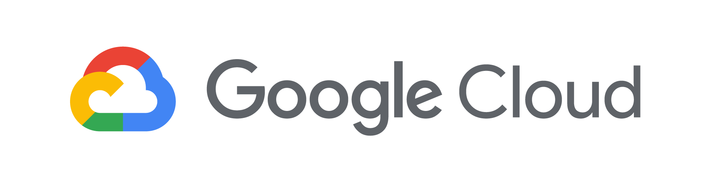
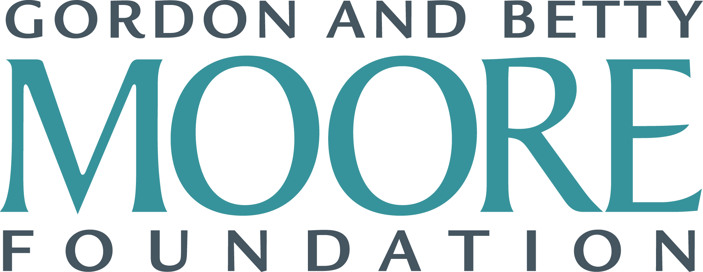

# Classification of 12-lead ECGs: the PhysioNet/Computing in Cardiology Challenge 2020

## <a name="announcements"></a> Announcements

__July 29, 2020:__ We have invited two ["wild card"](#wild-card) teams to the Challenge and increased the resources available for training your models. See the [FAQ](https://physionetchallenges.github.io/2020/faq) for details.

__July 1, 2020:__ We are now accepting entries for the official phase of the Challenge. For the first time, we are requiring teams to submit their pretrained models and code for training their models. See the [full announcement](https://groups.google.com/g/physionet-challenges/c/CS-XVt6vrVE) on the [Challenge forum](https://groups.google.com/g/physionet-challenges/) and the previous two announcements for details.

__June 24, 2020:__ We have posted an updated SNOMED CT code mapping [here](https://github.com/physionetchallenges/evaluation-2020/blob/master/dx_mapping_scored.csv) and [here](https://github.com/physionetchallenges/evaluation-2020/blob/master/dx_mapping_unscored.csv) and an updated scoring metric in Python [here](https://github.com/physionetchallenges/evaluation-2020).  See the [full announcement](https://groups.google.com/g/physionet-challenges/c/HKX8YQ36l2w) on the [Challenge forum](https://groups.google.com/g/physionet-challenges/) for details.

__June 8, 2020:__ We are releasing 4 new tranches of 12-lead ECGs with SNOMED-CT labels to complement the 2 previously released tranches. Altogether, 6 databases with 43,101 labeled recordings are now available. We will reopen the scoring system and release an updated scoring metric in the coming days. See the [full](https://groups.google.com/forum/#!topic/physionet-challenges/0ldKZgDGi0Y) on the [Challenge forum](https://groups.google.com/g/physionet-challenges/) for details.

__June 3, 2020:__ All abstract acceptances and rejections have been announced. Please check the [Google Group announcement](https://groups.google.com/forum/#!topic/physionet-challenges/xC3y-rH-EWU) for more details.

__May 27, 2020:__ The full list of diagnoses for the Challenge have now been posted [here](https://github.com/physionetchallenges/physionetchallenges.github.io/blob/master/2020/Dx_map.csv). See the full announcement on the Challenge Google Group [here](https://groups.google.com/forum/#!topic/physionet-challenges/CMBOS7USKbw).

__May 26, 2020:__ Abstract reviews are now complete and will be announced within the next week. Please see the updated [key dates/deadlines](#dates-and-deadlines) and details on the [wild card entries](#wild-card) below. See the full announcement on the Challenge Google Group [here](https://groups.google.com/forum/#!topic/physionet-challenges/KBzTLnxdwzY). 

__May 12, 2020:__ Your abstracts are under review, and we hope to release acceptances and rejections by early June. For those who missed the abstract deadline, we will provide an opportunity to qualify as a wild card participant over the summer, so please don’t give up!

__May 11, 2020:__ We have begun the official phase of the Challenge. Please find a new tranche of data posted [here](https://storage.cloud.google.com/physionet-challenge-2020-12-lead-ecg-public/PhysioNetChallenge2020_Training_2.tar.gz) with SNOMED-CT codes as diagnoses. Please note that there are some errors or debatable labels in some of the data. Part of the Challenge will be working out how to deal with these issues. In the next few weeks, we will release more data and reopen the scoring system with a new scoring metric.

__April 25, 2020:__ We have reopened the submission system for 5 more days (until 30 April 2020 at 23:59 GMT) to help teams who are able to submit bug-free entries qualify for the Challenge.

__March 31, 2020:__ The CinC abstract deadline has been extended to May 1.

__March 16, 2020:__ The [leaderboard](https://docs.google.com/spreadsheets/u/4/d/e/2PACX-1vQP88VkqNp8vZgGF5PuPFk5rb1dlDzbaHm8rrNUDz_Nbh5JOWCauGiX5m32AChYq2Q3F_TbOJmR7srE/pubhtml) is now live.

__February 7, 2020:__ The 2020 Challenge is now open! See below for details.

## <a name="introduction"></a> Introduction

The electrocardiogram (ECG) is a non-invasive representation of the electrical activity of the heart from electrodes placed on the surface of the torso. The standard 12-lead ECG has been widely used to diagnose a variety of cardiac abnormalities such as cardiac arrhythmias, and predicts cardiovascular morbidity and mortality [[1]](http://www.onlinejacc.org/content/49/10/1109.abstract). The early and correct diagnosis of cardiac abnormalities can increase the chances of successful treatments [[2]](https://www.ahajournals.org/doi/full/10.1161/strokeaha.107.181486). However, manual interpretation of the electrocardiogram is time-consuming, and requires skilled personnel with a high degree of training [[3]](https://www.magonlinelibrary.com/doi/abs/10.12968/bjca.2019.14.3.123).

Automatic detection and classification of cardiac abnormalities can assist physicians in the diagnosis of the growing number of ECGs recorded. Over the last decade, there have been increasing numbers of attempts to stimulate 12-lead ECG classification. Many of these algorithms seem to have the potential for accurate identification of cardiac abnormalities. However, most of these methods have only been tested or developed in single, small, or relatively homogeneous datasets. The PhysioNet/Computing in Cardiology Challenge 2020 provides an opportunity to address this problem by providing data from a wide set of sources.

## <a name="objective"></a> Objective
The goal of the 2020 Challenge is to identify clinical diagnoses from 12-lead ECG recordings.

We ask participants to design and implement a working, open-source algorithm that can, based only on the clinical data provided, automatically identify the cardiac abnormality or abnormalities present in each 12-lead ECG recording. The winners of the Challenge will be the team whose algorithm achieves the highest score for recordings in the hidden test set.

## <a name="data"></a> Data

The data for this Challenge are from multiple sources:

1. Southeast University, China, including the data from the China Physiological Signal Challenge 2018
2. St. Petersburg Institute of Cardiological Technics, St. Petersburg, Russia.
3. The Physikalisch Technische Bundesanstalt, Brunswick, Germany.
4. Georgia 12-Lead ECG Challenge Database, Emory University, Atlanta, Georgia, USA.

The first source is the public and unused data from the [China Physiological Signal Challenge in 2018 (CPSC2018)](http://2018.icbeb.org/), held during the 7th International Conference on Biomedical Engineering and Biotechnology in Nanjing, China. The unused data from the CPSC2018 is NOT the test data from the CPSC2018. The test data of the CPSC2018 is included in the final private database that has been sequestered. This training set consists of two sets of 6,877 (male: 3,699; female: 3,178) and 3,453 (male: 3,453, female: 1,610) of 12-ECG recordings lasting from 6 seconds to 60 seconds. Each recording was sampled at 500 Hz.

The second source set is the public dataset from [St Petersburg INCART 12-lead Arrhythmia Database](https://physionet.org/content/incartdb/1.0.0/). This database consists of 75 annotated recordings extracted from 32 Holter records. Each record is 30 minutes long and contains 12 standard leads, each sampled at 257 Hz.

The third source from the Physikalisch Technische Bundesanstalt (PTB) comprises two public databases: the [PTB Diagnostic ECG Database](https://physionet.org/content/ptbdb/1.0.0/) and the [PTB-XL](https://physionet.org/content/ptb-xl/1.0.1/), a large publicly available electrocardiography dataset. The first PTB database contains 549 records (male: 377, female: 139). Each recording was sampled at 1000 Hz. The PTB-XL contains 21,837 clinical 12-lead ECGs (male: 11,379 and female: 10,458) of 10 second length with a sampling frequency of 500 Hz.

The fourth source is a Georgia database which represents a unique demographic of the Southeastern United States. This training set contains 10,344 12-lead ECGs (male: 5,551, female: 4,793) of 10 second length with a sampling frequency of 500 Hz.

All data is provided in [WFDB format](https://www.physionet.org/physiotools/wpg/wpg_35.htm). Each ECG recording has a binary [MATLAB v4 file](https://www.mathworks.com/help/matlab/import_export/mat-file-versions.html) ([see page 27](matfile_format.pdf)) for the ECG signal data and a text file in [WFDB header format](https://www.physionet.org/physiotools/wag/header-5.htm) describing the recording and patient attributes, including the diagnosis (the labels for the recording). The binary files can be read using the [load function](https://www.mathworks.com/help/matlab/ref/load.html) in MATLAB and the [scipy.io.loadmat](https://docs.scipy.org/doc/scipy/reference/generated/scipy.io.loadmat.html) function in Python; please see our [baseline models](https://physionetchallenges.github.io/2020/#submissions) for examples of loading the data. The first line of the header provides information about the total number of leads and the total number of samples or points per lead. The following lines describe how each lead was saved, and the last lines provide information on demographics and diagnosis. Below is an example header file `A0001.hea`:
```
A0001 12 500 7500 05-Feb-2020 11:39:16
A0001.mat 16+24 1000/mV 16 0 28 -1716 0 I
A0001.mat 16+24 1000/mV 16 0 7 2029 0 II
A0001.mat 16+24 1000/mV 16 0 -21 3745 0 III
A0001.mat 16+24 1000/mV 16 0 -17 3680 0 aVR
A0001.mat 16+24 1000/mV 16 0 24 -2664 0 aVL
A0001.mat 16+24 1000/mV 16 0 -7 -1499 0 aVF
A0001.mat 16+24 1000/mV 16 0 -290 390 0 V1
A0001.mat 16+24 1000/mV 16 0 -204 157 0 V2
A0001.mat 16+24 1000/mV 16 0 -96 -2555 0 V3
A0001.mat 16+24 1000/mV 16 0 -112 49 0 V4
A0001.mat 16+24 1000/mV 16 0 -596 -321 0 V5
A0001.mat 16+24 1000/mV 16 0 -16 -3112 0 V6
#Age: 74
#Sex: Male
#Dx: 426783006
#Rx: Unknown
#Hx: Unknown
#Sx: Unknown
```

From the first line, we see that the recording number is A0001, and the recording file is `A0001.mat`. The recording has 12 leads, each recorded at 500 Hz sample frequency, and contains 7500 samples. From the next 12 lines, we see that each signal was written at 16 bits with an offset of 24 bits, the amplitude resolution is 1000 with units in mV, the resolution of the analog-to-digital converter (ADC) used to digitize the signal is 16 bits, and the baseline value corresponding to 0 physical units is 0. The first value of the signal, the checksum, and the lead name are included for each signal. From the final 6 lines, we see that the patient is a 74-year-old male with a diagnosis (Dx) of 426783006. The medical prescription (Rx), history (Hx), and symptom or surgery (Sx) are unknown.

Each ECG recording has one or more labels from different type of abnormalities in [SNOMED-CT codes](http://bioportal.bioontology.org/ontologies/SNOMEDCT). The full list of diagnoses for the challenge has been posted [here](https://github.com/physionetchallenges/physionetchallenges.github.io/blob/master/2020/Dx_map.csv) as a 3 column CSV file: Long-form description,  corresponding SNOMED-CT code, abbreviation. Although these descriptions apply to all training data there may be fewer classes in the test data, and in different proportions.  However, every class in the test data will be represented in the training data. 

The training data can be downloaded from this links (You can use the [MD5 hash](https://en.wikipedia.org/wiki/Md5sum) to verify the integrity of the `tar.gz` file.):

1. CPSC2018 training set, 6,877 recordings: [link](https://storage.cloud.google.com/physionet-challenge-2020-12-lead-ecg-public/PhysioNetChallenge2020_Training_CPSC.tar.gz); MD5-hash: `7b6b1f1ab1b4c59169c639d379575a87`
2. China 12-Lead ECG Challenge Database (unused CPSC2018 data), 3,453 recordings: [link](https://storage.cloud.google.com/physionet-challenge-2020-12-lead-ecg-public/PhysioNetChallenge2020_Training_2.tar.gz); MD5-hash: `36b409ee2b46aa6f1d2bef99b8451925`
3. St Petersburg INCART 12-lead Arrhythmia Database, 74 recordings: [link](https://storage.cloud.google.com/physionet-challenge-2020-12-lead-ecg-public/PhysioNetChallenge2020_Training_StPetersburg.tar.gz); MD5-hash: `abcdf9fd1b2f2ca8b1ff158f3b9789b0`
4. PTB Diagnostic ECG Database, 516 recordings: [link](https://storage.cloud.google.com/physionet-challenge-2020-12-lead-ecg-public/PhysioNetChallenge2020_Training_PTB.tar.gz); MD5-hash: `349316b6985cd21940210e36af9415ec`
5. PTB-XL electrocardiography Database, 21,837 recordings:[link](https://storage.googleapis.com/physionet-challenge-2020-12-lead-ecg-public/PhysioNetChallenge2020_Training_PTB-XL.tar.gz); MD5-hash: `7ae20a89ae21fd68626ddb3c6b44fdd4`
6. Georgia 12-Lead ECG Challenge Database, 10,344 recordings: [link](https://storage.cloud.google.com/physionet-challenge-2020-12-lead-ecg-public/PhysioNetChallenge2020_Training_E.tar.gz); MD5-hash: `4971a0562df4a7e2fd8f58e060927ff2`

If you are unable to use these links to access the data, or if you want to use a command-line tool to access the data through Google Colab, then you can download the training data with this command
```
wget -O PhysioNetChallenge2020_Training_CPSC.tar.gz \
https://cloudypipeline.com:9555/api/download/physionet2020training/PhysioNetChallenge2020_Training_CPSC.tar.gz/
wget -O PhysioNetChallenge2020_Training_2.tar.gz \
https://cloudypipeline.com:9555/api/download/physionet2020training/PhysioNetChallenge2020_Training_2.tar.gz/
wget -O PhysioNetChallenge2020_Training_StPetersburg.tar.gz \
https://cloudypipeline.com:9555/api/download/physionet2020training/PhysioNetChallenge2020_Training_StPetersburg.tar.gz/
wget -O PhysioNetChallenge2020_Training_PTB.tar.gz \
https://cloudypipeline.com:9555/api/download/physionet2020training/PhysioNetChallenge2020_Training_PTB.tar.gz/
wget -O PhysioNetChallenge2020_Training_PTB-XL.tar.gz \
https://cloudypipeline.com:9555/api/download/physionet2020training/PhysioNetChallenge2020_PTB-XL.tar.gz/
wget -O PhysioNetChallenge2020_Training_E.tar.gz \
https://cloudypipeline.com:9555/api/download/physionet2020training/PhysioNetChallenge2020_Training_E.tar.gz/
```
The test set comprises data from one of the training sets, and one entire new set recorded from a geographically distinct institution from the training. Therefore, while there may be a small number of ECGs from patients that are in both training and test data, there is at least one test database in which the likelihood of any patients in the training database being represented in the test data is vanishingly small (but not zero).

We are not planning to release the test data at any point, including after the end of the Challenge. Requests for the test data will not receive a response. We do not release test data to prevent overfitting on the test data and claims or publications of inflated performances. We will entertain requests to run code on the test data after the Challenge on a limited basis based on publication necessity and capacity. (The Challenge is largely staged by volunteers.)

Please note that there are bound to be some errors or debatable labels in each database. Although we have updated some of the data and labels from the unofficial period of the Challenge, many errors will persist. Part of the Challenge is to work out how to deal with these issues. Some databases have human overread machine labels, and some have single or multiple human labels, so the quality will vary, as well as the demographics and diagnoses. There will also be no more updates to the training data from this point onwards. 

## <a name="registration"></a> Registering for the Challenge and Conditions of Participation 

To participate in the Challenge, you must register [here](https://docs.google.com/forms/d/e/1FAIpQLSdZUTrpoVuotZxUTUbo23k2u-wdiOvkiZWgzorblUsQOCSnew/viewform?usp=sf_link), providing the full names, affiliations and official email addresses of your entire team. The details of all authors must be exactly the same as the details you use to submit your abstract to Computing in Cardiology. You may add (but not subtract) authors later by emailing challenge [at] physionet.org.

## <a name="algorithms"></a> Algorithms

For each 12-lead ECG recording, your algorithm must identify a set of one or more classes as well as a probability or confidence score for each class. For example, suppose that your classifier identifies atrial fibrillation (164889003) and a first-degree atrioventricular block (270492004) with probabilities of 90% and 60%, respectively, for a particular 12-lead ECG sample, but it does not identify any other rhythm types. Your code might produce the following output for a single recording (not for each lead):

```
#Record ID
164889003, 270492004, 164909002, 426783006, 59118001, 284470004,  164884008,  429622005, 164931005
  1,       1,         0,         0,         0,        0,          0,          0,         0
0.9,       0.6,       0.2,       0.05,      0.2,      0.35,       0.35,       0.1,       0.1
```

## <a name="submissions"></a> Submitting your Algorithm
We have implemented two baseline models that provide one label per recording in [MATLAB](https://github.com/physionetchallenges/matlab-classifier-2020), [Python](https://github.com/physionetchallenges/python-classifier-2020), and [R](https://github.com/physionetchallenges/r-classifier-2020). We will share implementations of baseline models in Julia soon.

The baseline classifiers are simple logistic regression models. The Python classifier uses statistical moments of RR intervals computed using [Python Online and Offline ECG QRS Detector](https://github.com/c-labpl/qrs_detector) based on the Pan-Tomkins algorithm and demographic data taken directly from the WFDB header file (the `.hea` file) as predictors The Matlab classifier uses the [PhysioNet Cardiovascular Signal Toolbox](https://github.com/cliffordlab/PhysioNet-Cardiovascular-Signal-Toolbox) and [ECGKit](https://github.com/marianux/ecg-kit) to compute [global electrical heterogeneity (GEH)](https://github.com/Tereshchenkolab/Global-Electrical-Heterogeneity) from [XYZ](https://github.com/Tereshchenkolab/Origin) median beats and demographic data taken directly from the WFDB header file (the `.hea` file) as predictors. 

Please use the code for these baseline models as a template for your submissions. Please see the [submissions instructions](https://physionetchallenges.github.io/2020/submissions.html) for detailed information about how to submit a successful Challenge entry and submit [here](https://forms.gle/PWu87SqN8frh6aKS7) when ready. We will provide feedback on your entry as soon as possible, so please wait at least __72 hours__ before contacting us about the status of your entry.

For the first time in any public competition, we will require code both for your trained model and for training your model. If we cannot reproduce your model from the training code, then you will not be eligible for ranking or a prize. Submissions of training code will begin during the official phase of the Challenge.

## <a name="scoring"></a> Scoring

For this year’s Challenge, we developed a [new scoring metric](https://github.com/physionetchallenges/evaluation-2020) that awards partial credit to misdiagnoses that result in similar treatments or outcomes as the true diagnosis as judged by our cardiologists. This scoring metric reflects the clinical reality that some misdiagnoses are more harmful than others and should be scored accordingly. Moreover, it reflects the fact that confusing some classes is much less harmful that confusing other classes. It is defined as follows:

Let _C_ = [_c_<sub>_i_</sub>] be a collection of diagnoses. We compute a multi-class confusion matrix _A_ = [_a_<sub>_ij_</sub>], where _a_<sub>_ij_</sub> is the number of recordings in a database that were classified as belonging to class _c_<sub>_i_</sub> but actually belong to class _c_<sub>_j_</sub>. We assign different weights _W_ = [_w_<sub>_ij_</sub>] to different entries in this matrix based on the similarity of treatments or differences in risks. The score _s_ is given by _s_ = &Sigma;<sub>ij</sub> _w_<sub>_ij_</sub> _a_<sub>_ij_</sub>, which is a generalized version of the traditional accuracy metric. The score _s_ is then normalized so that a classifier that always outputs the true class(es) receives a score of 1 and an inactive classifier that always outputs the normal class receives a score of 0.

The scoring metric is designed to award full credit to correct diagnoses and partial credit to misdiagnoses with similar risks or outcomes as the true diagnosis. Therefore, true positives are rewarded, false negatives are partially rewarded, and false positives are effectively penalized by receiving no credit at all, or, equivalently, by reducing the credit for true positives and false negatives. (True negatives are technically neither rewarded nor penalized by this metric.) A classifier that returns only positive outputs should now receive a negative score, i.e., a lower score than a classifier that returns only negative outputs.

See the [leaderboard](https://docs.google.com/spreadsheets/d/e/2PACX-1vQP88VkqNp8vZgGF5PuPFk5rb1dlDzbaHm8rrNUDz_Nbh5JOWCauGiX5m32AChYq2Q3F_TbOJmR7srE/pubhtml) for the current scores from the Challenge.

## <a name="rules-and-deadlines"></a> Rules and Deadlines

There are two phases for the Challenge: an unofficial phase and an official phase. The unofficial phase of the Challenge allows us to introduce and "beta test" the data, scores, and submission system before the official phase of the Challenge. Participation in the unofficial phase is mandatory for participating in the official phase of the Challenge because it helps us to improve the official phase.

Entrants may have an overall total of up to 15 scored entries over both the unofficial and official phases of the competition (see Table). All deadlines occur at 11:59pm GMT (UTC) on the dates mentioned below, and all dates are during 2020 unless indicated otherwise. If you do not know the difference between GMT and your local time, then find out what it is before the deadline! Please do not wait until the deadline to submit your entries because you will be unable to resubmit them if there are unexpected errors or issues with your submissions.

<a name="dates-and-deadlines"></a>__Key dates/deadlines__

|                 |    Start         | End              | Submissions     |
|-----------------|------------------|------------------|-----------------|
|Unofficial phase | 7 February 2020  | 30 April 2020    | 1-5 scored entries (*)|
|Hiatus           | 1 May 2020       | 10 May 2020      | N/A             |
|Abstract deadline| 1 May 2020       | 1 May 2020       | 1 abstract      |
|Official phase   | 11 May 2020      | 23 August 2020   | 1-10 scored entries (*)|
|Challengers notified of abstract accept/reject decisions|	1 June 2020|	3 June 2020|	N/A|
|Wild card deadline|	28 July 2020|	28 July 2020|	1-10 scored entries (*)|
|Wild card eligibility notification|	29 July 2020|	29 July 2020|	N/A|
|Wild card abstract submission deadline| 5 August 2020| 5 August 2020|	1 abstract|
|Hiatus           | 24 August 2020   | 12 September 2020| N/A             |
|Preprint deadline| 6 September 2020 | 6 September 2020 | One 4-page paper (**)|
|Conference       | 13 September 2020| 16 September 2020| One 4-page paper (***)|
|Final scores released| 17 September 2020| 24 September 2020| N/A            |
|Final paper submitted| 25 September 2020| 30 September 2020| One 4-page paper (***)|

(* Entries that fail to score do not count against limits.) 

(** Must includes preliminary scores.)

(*** Must include final score, your ranking in the Challenge, and any updates to your work as a result of feedback after presenting at CinC.)

To be eligible for the open-source award, you must do all the following:
1. Register for the Challenge [here](https://docs.google.com/forms/d/e/1FAIpQLSdZUTrpoVuotZxUTUbo23k2u-wdiOvkiZWgzorblUsQOCSnew/viewform?usp=sf_link).
2. Submit at least one open-source entry that can be scored during the unofficial phase (before 11:59pm GMT on 24 April).
3. [Enter an Abstract to CinC](http://www.cinc.org/information-for-computing-in-cardiology-authors/): Submit an acceptable abstract (no more than 300 words) on your work on the Challenge to Computing in Cardiology no later than 1 May. Include the overall score for your Phase I entry in your abstract. Please select "PhysioNet/CinC Challenge" as the topic of your abstract, so it can be identified easily by the abstract review committee. See [“Advice on Writing an Abstract”](#abstract-advice) below for more important information on your abstract. 
4. Submit at least one open-source entry that can be scored during the second phase (between 12:01am GMT on 8 May and 11:59pm GMT on 23 August).
5. Submit a full (4-page) paper on your work on the Challenge to CinC no later than one week before the start of the conference (6 September) and select the pre-print option.
6. One of your team must attend CinC 2020 (13-16 September) in Italy to present your work there either orally (if we select you) or as a poster. If you have a poster, then you must stand by it to defend your work. No shows (oral or poster) will be disqualified. One of your team members must also attend the closing ceremony to collect your prize. No substitutes will be allowed. Remote attendance is allowed for 2020.
7. Submit an updated 4-page paper with your final official score by 30 September. Please note that we expect the abstract to change significantly,  both in terms of results and methods. You may also update your title with the caveat that it must not be substantially similar to the title of the competition or contain the words 'physionet' 'challenge' or 'competition'. 

You must not submit analysis of this year’s Challenge data to other conferences or journals until after CinC 2020 has taken place so that the competitors can discuss the results in a single forum. If we discover evidence you have done so, then you will be disqualified and de-ranked on the website, banned from future Challenges, and the journal/conference will be contacted to request your article is withdrawn for contravention of the terms of use. The reasons for this policy are 1) Reporting results on the training data is meaningless - they will be overfit and incomparable to the real challenge results, and 2) Attempting to publish on the Challenge data before the Challengers present their results is unprofessional, and comes across as a territorial grab. This requirement stands, whether even if your abstract is rejected, although you may continue to enter the competition and receive scores. (However, unless you are accepted into the conference at a later date as a "wild card" entry, you will not be eligible to win a prize.) After the Challenge is over, and final scores have been posted (in late September), everyone may then submit their work to a journal or other conference. In particular, we expect a special issue from a journal to follow the conference and encourage all entrants (including those who missed the opportunity to compete or attend CinC 2020) to submit extended analysis and articles to that issue, taking into account the publications and discussions at CinC 2020.


## <a name="wild-card"></a> Wild Card Entries

If your abstract is rejected, or you failed to qualify during the unofficial period, then there is still a chance to win the Challenge. Two "wild card" entries have been reserved for you in the conference program (poster presentaitons only) for this purpose. On the 28 July (23:59 UTC) we will select two top scored entries, using the official scoring metric at the time, and offer the two teams the opportunity to submit an abstract directly to the Challenge organizers. The abstract will still be reviewed as thoroughly as any other abstract accepted for the conference and the team must submit an abstract of an acceptable standard. See [Advice on Writing an Abstract](#abstract-advice).  

## <a name="abstract-advice"></a> Advice on Writing an Abstract 

To improve your chances of having your abstract accepted, we offer the following advice. Make sure all the authors match your registration information and you use the same email addresses. Stick to the word limit (check [the conference website](http://www.cinc.org/cinc-conference-program-abstracts/) for updates, but it is usually between 250 and 300 words). Make sure all your co-authors agree on the abstract. Importantly, be sure to submit your abstract by the deadline, so include time for errors, internet outages, etc. When submitting, you will be asked for the topic – please select "PhysioNet/CinC Challenge" so it can be identified easily by the abstract review committee. However, do not include the words "PhysioNet" or "PhysioNet/CinC" or "Challenge" in the title – this creates confusion with the hundreds of other articles and the main descriptor of the Challenge. Although your work is bound to change, the quality of your abstract is a good indicator of the final quality of your work. We suggest you spell check, write in full sentences, and be specific about your approaches. Include cross validated training performance (using the Challenge metrics) and your score provided by the Challenge submission system. If you omit or inflate this latter score, then your abstract will be rejected. If you are unable to get the scoring system working, then you can still submit, but the work should be very high quality. Your title, abstract and author list (collaborators) can be modified in September when you submit the final paper, so do not be embarrassed by any low scores. We do not expect high scores at this stage. We are focused on the thoughtfulness of the approach and quality of the abstract. 

You will be notified if your abstract has been accepted by email from CinC in June. You may not enter more than one abstract describing your work in the Challenge. We know you may have multiple ideas, and the actual abstract will evolve over the course of the Challenge – this is OK. More information, particularly on discounts and scholarships, can be found [here](http://www.cinc.org/information-for-computing-in-cardiology-authors/). We are sorry, but the Challenge Organizers do not have extra funds to enable discounts or funding to attend the conference. 

Given the extended deadline for the unofficial phase of the Challenge, we would like to emphasize the following points.

We cannot guarantee that your code will be run in time for the [cinc.org](http://cinc.org/) abstract deadline, especially if you submit your code immediately before the deadline.

It is much more important to focus on writing a high-quality abstract describing your work and submit this to the conference by abstract deadline. Please follow [these instructions](https://physionetchallenges.github.io/2020/#abstract-advice) here carefully.

Please make sure that <ins>__all of your team members are authors on YOUR abstract__</ins>. If you need to add or subtract authors, do this at least a week before the abstract deadline (i.e., __now__). Asking us to alter team membership near or after the deadline is going to lead to confusion that could affect your score during review. It is better to be more inclusive on the abstract in terms of authorship though - if we find authors have moved between abstracts/teams without permission, this is likely to lead to disqualification. As noted above, you may change the authors/team members later in the Challenge. 

Please make sure that you include <ins>__your team name__</ins>, your __official score__ as it appears on the [leaderboard](https://docs.google.com/spreadsheets/u/4/d/e/2PACX-1vQP88VkqNp8vZgGF5PuPFk5rb1dlDzbaHm8rrNUDz_Nbh5JOWCauGiX5m32AChYq2Q3F_TbOJmR7srE/pubhtml), and <ins>__cross validation results__</ins> in your abstract <ins>__using the scoring metrics__</ins> __for this year's challenge__ (especially if you are unable to receive a score or are scoring poorly). Your score will not affect acceptance. It is the novelty of your approach and the rigor of your research that matters at this point. Please make sure you describe your technique and any novelty very specifically. General statements such as 'a 1D CNN was used' are uninformative and will score poorly in review. 

The organizers of the Challenge have no ability to help with any problems with the abstract submission system. We do not operate it. Please do not email us with issues related to the abstract submission system.

## <a name="open-source-licenses"></a> Open-Source Licenses
We encourage the use of open-source licenses for your entries.

Entries with non open-source licenses will be scored but not ranked in the official competition. All scores will be made public. At the end of the competition, all entries will be posted publicly, and therefore automatically mirrored on several sites around the world. We have no control over these sites, so we cannot remove your code even on request. Before the end of the competition, your code is not publicly available, and you can choose to withdraw it until the end of the Challenge in August. However, the Organizers reserve the right to retain and use a copy of the code for non-commercial use. This allows us to re-score if definitions change and validate any claims made by competitors.

## <a name="collaboration"></a> Rules on Competing in Teams / Collaboration

To maintain the scientific impact of the Challenges, it is important that all Challengers contribute truly independent ideas. For this reason, we impose the following rules on team composition/collaboration:

1. Multiple teams from a single entity (such as a company, university, or university department) are allowed as long as the teams are truly independent and do not share team members (at any point), code, or any ideas. Multiple teams from the same research group or company unit are not allowed because of the difficulty of maintaining independence in those situations. If there is any question on independence, the teams will be required to supply an official letter from the company that indicates that the teams do not interact at any point (socially or professionally) and work in separate facilities, as well as the location of those facilities. 
2. You can join an existing team before the abstract deadline as long as you have not belonged to another team or communicated with another team about the current Challenge. You must notify us at challenge [at] physionet.org as soon as you do, supplying your full name, affiliations, email address, and the name of the team you are joining. You must cc all team members on the email addresses they used to register their team, and have each of them reply within 24 hours to confirm the new team composition.
3. You may use public code from another team if they posted it before the competition.
4. You may not make your Challenge code publicly available during the Challenge or use any code from another Challenger that was shared, intentionally or not, during the course of the Challenge.
5. You may not publicly post information describing your methods (blog, vlog, code, preprint, presentation, talk, etc.) or give a talk outside your own research group at any point during the Challenge that reveals the methods you have employed or will employ in the Challenge. Obviously, you can talk and publish on the same methods on other data as long as you don't indicate that you used or planned to use it for the Challenge.
6. You must use the same team name and email address for your team throughout the course of the Challenge. The email address should be the same as the one used to register for the Challenge, and to submit your abstract to Computing in Cardiology. Note that the submitter of the conference article/code does not need to present at the conference or be in any particular location in the author order on the abstract/poster/paper, but they must be a contributing member of the team. If your team uses multiple team names and/or email addresses to enter the Challenge, please contact the Organizers immediately to avoid disqualification of all teams concerned. Ambiguity will result in disqualification.
7. If you participate in the Challenge as part of a class project, then please treat your class a single team — please use the same team name as other groups in your class, limit the number of submissions from your class to the number allowed for each team, and feel free to present your work within your class. If your class needs more submissions than the Challenge submission limits allow, then please perform cross-validation on the training data to evaluate your work.

If we discover evidence of the contravention of these rules, then you will be ineligible for a prize and your entry publicly marked as possibly associated with another entry. Although we will contact the team(s) in question, time and resources are limited and the Organizers must use their best judgement on the matter in a short period of time. The Organizers' decision on rule violations will be final.

## <a name="conference-attendance"></a> Conference Attendance

[CinC 2020](https://www.cinc2020.org/) will take place from 13-16 September 2020 in [Rimini, Italy](https://www.google.com/maps/place/Rimini,+Province+of+Rimini,+Italy/@44.053442,12.2945337,10z/). You must attend the whole conference to be eligible for prizes. For 2020, remote attendance is acceptable. If you send someone in your place who is not a team member or co-author you will be disqualified and your abstract will be removed from the proceedings. It is vital the presenter (oral or poster) can defend your work in person, and has an in-depth knowledge of all decisions made during the development of your algorithm. No exceptions will be made. No remote attendance will be allowed because the organizational burden for this is too high. If you require a visa to attend the conference, we strongly suggest that you apply as soon as possible.  Please contact the local [conference](https://www.cinc2020.org/visa-information/) organizing committee (not the Challenge Organizers) for any visa sponsorship letters and answer any questions concerning the conference. 

## <a name="hackathon"></a> Hackathon
Due to the uncertainties around travel, we have unfortunately decided not to run the Hackathon this year.

## <a name="sponsors"></a> Sponsors
This year's Challenge is generously co-sponsored by Google, MathWorks, and the Gordon and Betty Moore Foundation.

{:height="40px"}
{:height="40px"}&nbsp;&nbsp;&nbsp;
{:height="40px"}

### <a name="complimentary-matlab-licenses"></a> Obtaining Complimentary MATLAB Licenses
[MathWorks](http://www.mathworks.com/) has generously decided to sponsor this Challenge by providing complimentary licenses to all teams that wish to use MATLAB. Users can apply for a license and learn more about MATLAB support by visiting the [PhysioNet Challenge page](https://www.mathworks.com/academia/student-competitions/physionet.html) from MathWorks. If you have questions or need technical support, then please contact MathWorks at <studentcompetitions@mathworks.com>.

### <a name="complimentary-gcp-credits"></a> Obtaining Complimentary Google Cloud Platform Credits
[Google](http://cloud.google.com/) has generously agreed to provide Google Cloud Platform (GCP) credits for up to 40 teams for this Challenge. We will award these to the top performing teams each month. These credits should provide an added incentive to submit more entries earlier on, and give teams the maximum opportunity to learn before spending money in the cloud.

At the time of launching this Challenge, Google Cloud offers multiple services for [free](https://cloud.google.com/free/) on a one-year trial basis and $300 in cloud credits. Additionally, if teams are based at an educational institution in selected countries, then they can access free GCP training [online](https://edu.google.com/programs/credits).

Google Cloud credits of $500 per team will be made available to teams (that requested credits when registering for the Challenge) with both a successful entry to the official phase of the Challenge and an accepted abstract to CinC. Only one credit of exactly $500 will be provided to one email address associated with each team. An upper limit of $20,000 in credits will initially be made available to teams based on Challenge scores.

The Challenge Organizers, their employers, PhysioNet and Computing in Cardiology accept no responsibility for the loss of credits, or failure to issue credits for any reason. Please note, by requesting credits, you are granting us permission to forward your details to Google for the distribution of credits. You can register for these credits during the Challenge registration process.

## <a name="references"></a> References
1. [Kligfield, _et al._, 2007. _Journal of the American College of Cardiology_ 49.10: 1109-1127](http://www.onlinejacc.org/content/49/10/1109.abstract).
2. [Adams, _et al._, 2007. _Stroke_ 38.5: 1655-1711](https://www.ahajournals.org/doi/full/10.1161/strokeaha.107.181486)
3. [Bickerton and Pooler, 2019. _British Journal of Cardiac Nursing_ 14.3: 123-132](https://www.magonlinelibrary.com/doi/abs/10.12968/bjca.2019.14.3.123).

---

This year's Challenge is generously co-sponsored by Google, MathWorks, and the Gordon and Betty Moore Foundation.

{:height="40px"}
{:height="40px"}&nbsp;&nbsp;&nbsp;
{:height="40px"}

---

[Back](../index.html)
