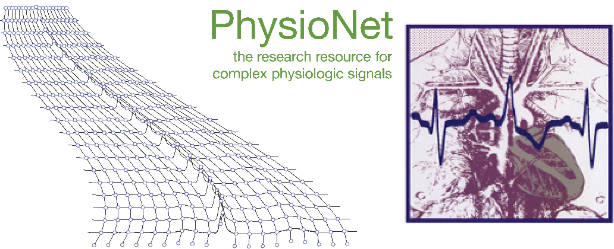
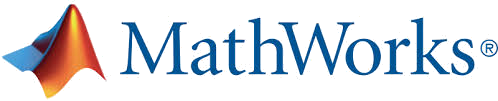

[comment]: <> ()

# Will Two Do? Varying Dimensions in Electrocardiography: The PhysioNet/Computing in Cardiology Challenge 2021

## <a name="announcements"></a> Announcements

__January 30, 2021:__ We are now accepting submissions for the 2021 Challenge! See below for [details](https://groups.google.com/g/physionet-challenges/c/7i-rTHFSSV4). Please [register](https://docs.google.com/forms/d/e/1FAIpQLSc52DgT5dy_rqZioxbEdRF5Dd2sTx-MesnK8viJP457bYiWrw/viewform?usp=sf_link) your team (even if you registered last year), check the [submission instructions](submissions/), and [submit your code](https://docs.google.com/forms/d/e/1FAIpQLSciBaEzZn04pY_8_uT3zUDmcjnfnWJALYmdqGmb43vZxIOUUA/viewform?usp=sf_link) when ready. As always, please join the [Challenge forum](https://groups.google.com/g/physionet-challenges/) to discuss this year's Challenge.

__December 24, 2020:__ The NIH-funded 2021 Challenge is now open! See below for [details](https://groups.google.com/g/physionet-challenges/c/isPy636jOMg). Please read this website for details and share questions and comments on [Challenge forum](https://groups.google.com/g/physionet-challenges/). This year's Challenge is generously co-sponsored by Google, MathWorks, and the Gordon and Betty Moore Foundation.

{: style="text-align:center"}
{:height="40px"}
{:height="40px"}&nbsp;&nbsp;&nbsp;
{:height="40px"}

{: style="text-align:center"}
{:height="120px"}

## <a name="introduction"></a> Introduction

The electrocardiogram (ECG) is a non-invasive representation of the electrical activity of the heart. Although the twelve-lead ECG is the standard diagnostic screening system for many cardiological issues, the limited accessibility of twelve-lead ECG devices provides a rationale for smaller, lower-cost, and easier to use devices. While single-lead ECGs are limiting [[1](https://pubmed.ncbi.nlm.nih.gov/9740885/)], reduced-lead ECG systems hold promise, with evidence that subsets of the standard twelve leads can capture useful information [[2](https://pubmed.ncbi.nlm.nih.gov/12539095)], [[3](https://www.sciencedirect.com/science/article/abs/pii/S0022073606005346)], [[4](https://pubmed.ncbi.nlm.nih.gov/3812249)] and even be comparable to twelve-lead ECGs in some limited contexts. In 2017 we challenged the public to classify AF from a single-lead ECG, and in 2020 we challenged the public to diagnose a much larger number of cardiac problems using twelve-lead recordings. However, there is limited evidence to demonstrate the utility of reduced-lead ECGs for capturing a wide range of diagnostic information.

In this year's Challenge, we ask the following question: __'Will two do?'__ This year's Challenge builds on [last year's Challenge](../2020/), which asked participants to classify cardiac abnormalities from twelve-lead ECGs. We are asking you to build an algorithm that can classify cardiac abnormalities from either twelve-lead, six-lead, three-lead, and two-lead ECGs. We will test each algorithm on databases of twelve-lead, six-lead, three-lead, and two-lead ECGs, and the differences in performances of the algorithms on these databases will reveal the utility of reduced-lead ECGs in comparison to standard twelve-lead EGCs.

## <a name="objective"></a> Objective

The goal of the 2021 Challenge is to identify clinical diagnoses from twelve-lead, six-lead (I, II, III, aVL, aVR, and aVF), three-lead (I, II, V2), and two-lead (II and V5) ECG recordings.

We ask participants to design and implement a working, open-source algorithm that, based only on the provided twelve-lead ECG recordings and routine demographic data, can automatically identify any cardiac abnormalities present in the recording. We will award prizes for the top performing twelve-lead, six-lead, three-lead, and two-lead algorithms.

## <a name="data"></a> Data

The training data contains twelve-lead ECGs. The validation and test data contains twelve-lead, six-lead, and two-lead ECGs:

1. Twelve leads: I, II, III, aVR, aVL, aVF, V1, V2, V3, V4, V5, V6
2. Six leads: I, II, III, aVL, aVR, aVF
3. Three leads: I, II, V2
4. Two leads: II, V5

Each ECG recording has one or more labels that describe cardiac abnormalities (and/or a normal sinus rhythm). We mapped the labels for each recording to [SNOMED-CT codes](http://bioportal.bioontology.org/ontologies/SNOMEDCT). The lists of [scored labels](https://github.com/physionetchallenges/evaluation-2021/blob/main/dx_mapping_scored.csv) and [unscored labels](https://github.com/physionetchallenges/evaluation-2021/blob/main/dx_mapping_unscored.csv) are given with the [evaluation code](https://github.com/physionetchallenges/evaluation-2021); see the [scoring section](#scoring) for details.

### Data Sources

The initial data for this Challenge are from [last year's Challenge](../2020/#data), which includes annotated twelve-lead ECG recordings from five sources in four countries across three continents. These databases included 66,361 twelve-lead ECG recordings with 43,101 ECGs shared publicly as training data, 6,630 ECGs retained privately as validation data, and 16,630 ECGs retained privately as test data:

- The first source is the [China Physiological Signal Challenge in 2018 (CPSC 2018)](http://2018.icbeb.org/), which was held during the 7th International Conference on Biomedical Engineering and Biotechnology in Nanjing, China. This source contains 13,256 ECGs (10,330 ECGs shared as training data, 1,463 retained as validation data, and 1,463 retained as test data). In particular, we shared the training set and an unused dataset from CPSC 2018 as training data, and we split the test set from CPSC 2018 into validation and test sets. Each recording is between 6 and 144 seconds long with a sampling frequency of 500 Hz.

- The second source is the [St Petersburg INCART 12-lead Arrhythmia Database](https://physionet.org/content/incartdb/1.0.0/). This source contains 75 annotated ECGs (all shared as training data) extracted from 32 Holter monitor recordings. Each recording is 30 minutes long with a sampling frequency of 257 Hz.

- The third source is the Physikalisch-Technische Bundesanstalt (PTB) and includes two public datasets: the [PTB](https://physionet.org/content/ptbdb/) and the [PTB-XL](https://physionet.org/content/ptb-xl/) databases. The source contains 22,353 ECGs (all shared as training data). Each recording is between 10 and 120 seconds long with a sampling frequency of either 500 or 1,000 Hz.

- The fourth source is a Georgia database which represents a unique demographic of the Southeastern United States. The source contains 20,678 ECGs (10,334 ECGs shared as training data, 5,167 retained as validation data, and 5,167 retained as test data). Each recording is between 5 and 10 seconds long with a sampling frequency of 500 Hz.

- The fifth source is an undisclosed American database that is geographically distinct from the Georgia database. The source contains 10,000 ECGs (all retained as test data).

Like other real-world datasets, different databases may have different proportions of cardiac abnormalities, but all of the labels in the validation or test data are represented in the training data. Moreover, while this is a curated dataset, some of the data and labels are likely to have errors, and an important part of the Challenge is to work out these issues. In particular, some of the databases have human-overread machine labels with single or multiple human readers, so the quality of the labels varies between databases.

The six-lead, three-lead, and two-lead validation data are reduced-lead versions of the twelve-lead validation data: the same recordings with the same header data but only with signal data for the relevant leads.

We are not planning to release the test data at any point, including after the end of the Challenge. Requests for the test data will not receive a response. We do not release test data to prevent overfitting on the test data and claims or publications of inflated performances. We will entertain requests to run code on the test data after the Challenge on a limited basis based on publication necessity and capacity. (The Challenge is largely staged by volunteers.)

### Data Format

All data was formatted in [WFDB format](https://www.physionet.org/physiotools/wpg/wpg_35.htm). Each ECG recording uses a [binary MATLAB v4 file](https://www.mathworks.com/help/matlab/import_export/mat-file-versions.html) ([see page 27](matfile_format.pdf)) for the ECG signal data and a plain text file in [WFDB header format](https://www.physionet.org/physiotools/wag/header-5.htm) for the recording and patient attributes, including the diagnosis, i.e., the labels for the recording. The binary files can be read using the [load function](https://www.mathworks.com/help/matlab/ref/load.html) in MATLAB and the [scipy.io.loadmat](https://docs.scipy.org/doc/scipy/reference/generated/scipy.io.loadmat.html) function in Python; see our [MATLAB](https://github.com/physionetchallenges/matlab-classifier-2021) and [Python](https://github.com/physionetchallenges/python-classifier-2021) example code for working examples. The first line of the header provides information about the total number of leads and the total number of samples or time points per lead, the following lines describe how each lead was encoded, and the last lines provide information on the demographics and diagnosis of the patient.

For example, a header file `A0001.hea` may have the following contents:
```
A0001 12 500 7500 05-Feb-2020 11:39:16
A0001.mat 16+24 1000/mV 16 0 28 -1716 0 I
A0001.mat 16+24 1000/mV 16 0 7 2029 0 II
A0001.mat 16+24 1000/mV 16 0 -21 3745 0 III
A0001.mat 16+24 1000/mV 16 0 -17 3680 0 aVR
A0001.mat 16+24 1000/mV 16 0 24 -2664 0 aVL
A0001.mat 16+24 1000/mV 16 0 -7 -1499 0 aVF
A0001.mat 16+24 1000/mV 16 0 -290 390 0 V1
A0001.mat 16+24 1000/mV 16 0 -204 157 0 V2
A0001.mat 16+24 1000/mV 16 0 -96 -2555 0 V3
A0001.mat 16+24 1000/mV 16 0 -112 49 0 V4
A0001.mat 16+24 1000/mV 16 0 -596 -321 0 V5
A0001.mat 16+24 1000/mV 16 0 -16 -3112 0 V6
#Age: 74
#Sex: Male
#Dx: 426783006
#Rx: Unknown
#Hx: Unknown
#Sx: Unknown
```

From the first line of the file, we see that the recording number is A0001, and the recording file is `A0001.mat`. The recording has 12 leads, each recorded at a 500 Hz sampling frequency, and contains 7500 samples. From the next 12 lines of the file (one for each lead), we see that each signal was written at 16 bits with an offset of 24 bits, the floating point number (analog-to-digital converter (ADC) units per physical unit) is 1000/mV, the resolution of the analog-to-digital converter (ADC) used to digitize the signal is 16 bits, and the baseline value corresponding to 0 physical units is 0. The first value of the signal (-1716, etc.), the checksum (0, etc.), and the lead name (I, etc.) are the last three entries of each of these lines. From the final 6 lines, we see that the patient is a 74-year-old male with a diagnosis (Dx) of 426783006, which is the [SNOMED-CT code](http://bioportal.bioontology.org/ontologies/SNOMEDCT) for sinus rhythm. The medical prescription (Rx), history (Hx), and symptom or surgery (Sx) are unknown. Please visit [WFDB header format](https://www.physionet.org/physiotools/wag/header-5.htm) for more information on the header file and variables.

### Data Access

The training data from the 2020 Challenge can be downloaded from these links. You can use the [MD5 hash](https://en.wikipedia.org/wiki/Md5sum) to verify the integrity of the `tar.gz` file:

1. CPSC2018 training set, 6,877 recordings: [link](https://storage.cloud.google.com/physionet-challenge-2020-12-lead-ecg-public/PhysioNetChallenge2020_Training_CPSC.tar.gz); MD5-hash: `7b6b1f1ab1b4c59169c639d379575a87`
2. China 12-Lead ECG Challenge Database (unused CPSC2018 data), 3,453 recordings: [link](https://storage.cloud.google.com/physionet-challenge-2020-12-lead-ecg-public/PhysioNetChallenge2020_Training_2.tar.gz); MD5-hash: `36b409ee2b46aa6f1d2bef99b8451925`
3. St Petersburg INCART 12-lead Arrhythmia Database, 74 recordings: [link](https://storage.cloud.google.com/physionet-challenge-2020-12-lead-ecg-public/PhysioNetChallenge2020_Training_StPetersburg.tar.gz); MD5-hash: `abcdf9fd1b2f2ca8b1ff158f3b9789b0`
4. PTB Diagnostic ECG Database, 516 recordings: [link](https://storage.cloud.google.com/physionet-challenge-2020-12-lead-ecg-public/PhysioNetChallenge2020_Training_PTB.tar.gz); MD5-hash: `349316b6985cd21940210e36af9415ec`
5. PTB-XL electrocardiography Database, 21,837 recordings:[link](https://storage.googleapis.com/physionet-challenge-2020-12-lead-ecg-public/PhysioNetChallenge2020_Training_PTB-XL.tar.gz); MD5-hash: `7ae20a89ae21fd68626ddb3c6b44fdd4`
6. Georgia 12-Lead ECG Challenge Database, 10,344 recordings: [link](https://storage.cloud.google.com/physionet-challenge-2020-12-lead-ecg-public/PhysioNetChallenge2020_Training_E.tar.gz); MD5-hash: `4971a0562df4a7e2fd8f58e060927ff2`

If you are unable to use these links to access the data, or if you want to use a command-line tool to access the data through Google Colab, then you can use these commands:
```
wget -O WFDB_CPSC2018.tar.gz \
https://pipelineapi.org:9555/api/download/physionet2020training/WFDB_CPSC2018.tar.gz/
wget -O WFDB_CPSC2018_2.tar.gz \
https://pipelineapi.org:9555/api/download/physionet2020training/WFDB_CPSC2018_2.tar.gz/
wget -O WFDB_StPetersburg.tar.gz \
https://pipelineapi.org:9555/api/download/physionet2020training/WFDB_StPetersburg.tar.gz/
wget -O WFDB_PTB.tar.gz \
https://pipelineapi.org:9555/api/download/physionet2020training/WFDB_PTB.tar.gz/
wget -O WFDB_PTBXL.tar.gz \
https://pipelineapi.org:9555/api/download/physionet2020training/WFDB_PTBXL.tar.gz/
wget -O WFDB_Ga.tar.gz \
https://pipelineapi.org:9555/api/download/physionet2020training/WFDB_Ga.tar.gz/
```

## <a name="registration"></a> Registering for the Challenge and Conditions of Participation

To participate in the Challenge, [register your team](https://docs.google.com/forms/d/e/1FAIpQLSc52DgT5dy_rqZioxbEdRF5Dd2sTx-MesnK8viJP457bYiWrw/viewform?usp=sf_link) by providing the full names, affiliations, and official email addresses of your entire team before you submit your algorithm. The details of all authors must be exactly the same as the details in your abstract submission to [Computing in Cardiology](http://www.cinc2021.org/). You may update your author list by completing [this form](https://docs.google.com/forms/d/e/1FAIpQLSc52DgT5dy_rqZioxbEdRF5Dd2sTx-MesnK8viJP457bYiWrw/viewform?usp=sf_link) again (read the form for details), but changes to your authors must not contravene [the rules](#collaboration) of the Challenge.

## <a name="algorithms"></a> Algorithms

For each ECG recording, your algorithm must identify a set of one or more classes as well as a probability or confidence score for each class. As an example, suppose that your classifier identifies atrial fibrillation (164889003) and a first-degree atrioventricular block (270492004) with probabilities of 90% and 60%, respectively, for a particular recording, but it does not identify any other rhythm types. Your code might produce the following output for the recording:

```
#Record ID
164889003, 270492004, 164909002, 426783006, 59118001, 284470004,  164884008,  429622005, 164931005
  1,       1,         0,         0,         0,        0,          0,          0,         0
0.9,       0.6,       0.2,       0.05,      0.2,      0.35,       0.35,       0.1,       0.1
```

We have implemented two example algorithms in [MATLAB](https://github.com/physionetchallenges/matlab-classifier-2021) and [Python](https://github.com/physionetchallenges/python-classifier-2021) as templates for successful submissions.

The example algorithms are classifiers that use simple logistic regression models:
- The Python classifier implements a random forest classifier that uses age, sex, and the root mean square of the ECG lead signals as features by extracting the available ECG leads and demographic data from the WFDB header file (the `.hea` file).
- The MATLAB classifier implements a linear regression model that uses age, sex, and the root mean square of the ECG lead signals as features from the available ECG leads and demographic data from the WFDB header file (the `.hea` file).

## <a name="submissions"></a> Submitting your Algorithm

Please use the above [example code](#algorithms) as templates for your submissions.

Please see the [submission instructions](submissions/) for detailed information about how to submit a successful Challenge entry. We will open scoring in January. We will provide feedback on your entry as soon as possible, so please wait at least __72 hours__ before contacting us about the status of your entry.

Like [last year's Challenge](../2020/#submissions), we will continue to require code both for your trained model and for testing your model. If we cannot reproduce your model from the training code, then you will not be eligible for ranking or a prize.

## <a name="scoring"></a> Scoring

For last year’s Challenge, we developed a new scoring metric that awards partial credit to misdiagnoses that result in similar treatments or outcomes as the true diagnosis as judged by our cardiologists. This scoring metric reflects the clinical reality that some misdiagnoses are more harmful than others and should be scored accordingly. Moreover, it reflects the fact that confusing some classes is less harmful than confusing others.

We are starting this year's Challenge with this [scoring metric](https://github.com/physionetchallenges/evaluation-2021), but we welcome [feedback](https://groups.google.com/g/physionet-challenges/). It is defined as follows:

Let _C_ = [_c_<sub>_i_</sub>] be a collection of diagnoses. We compute a multi-class confusion matrix _A_ = [_a_<sub>_ij_</sub>], where _a_<sub>_ij_</sub> is the number of recordings in a database that were classified as belonging to class _c_<sub>_i_</sub> but actually belong to class _c_<sub>_j_</sub>. We assign different weights _W_ = [_w_<sub>_ij_</sub>] to different entries in this matrix based on the similarity of treatments or differences in risks. The score _s_ is given by _s_ = &Sigma;<sub>_ij_</sub> _w_<sub>_ij_</sub> _a_<sub>_ij_</sub>, which is a generalized version of the traditional accuracy metric. The score _s_ is then normalized so that a classifier that always outputs the true class(es) receives a score of 1 and an inactive classifier that always outputs the normal class receives a score of 0.

The scoring metric is designed to award full credit to correct diagnoses and partial credit to misdiagnoses with similar risks or outcomes as the true diagnosis. A classifier that returns only positive outputs typically receives a negative score, i.e., a lower score than a classifier that returns only negative outputs.

We welcome a discussion about scoring on the [Challenge forum](https://groups.google.com/g/physionet-challenges/). We will share a leaderboard of successful submissions and their scores once we start accepting entries.

## <a name="rules-and-deadlines"></a> Rules and Deadlines

### <a name="rules"></a> Overview of rules

There are two phases for the Challenge: an unofficial phase and an official phase. The unofficial phase of the Challenge allows us to introduce and 'beta test' the data, scores, and submission system before the official phase of the Challenge. Participation in the unofficial phase is mandatory for participating in the official phase of the Challenge because it helps us to improve the official phase.

Entrants may have an overall total of up to 15 scored entries over both the unofficial and official phases of the competition (see the below table). All deadlines occur at 11:59pm GMT on the dates mentioned below, and all dates are during 2021 unless indicated otherwise. If you do not know the difference between GMT and your local time, then find it out before the deadline!

__Please__ submit your entries early to ensure that you have the most chances for success. If you wait until the last few days to submit your entries, then you may not receive feedback before the submission deadline, and you may be unable to resubmit your entries if there are unexpected errors or issues with your submissions. Every year, several teams wait until the last few days to submit their first entry and are unable to debug their work before the deadline.

### <a name="deadlines"></a> Key dates/deadlines

|                 |    Start         | End              | Submissions            |
|-----------------|------------------|------------------|------------------------|
|Unofficial phase | 24 December 2020 | 8 April 2021     | 1-5 scored entries (*) |
|Hiatus           | 9 April 2021     | 30 April 2021    | N/A                    |
|Abstract deadline| 15 April 2021    | 15 April 2021    | 1 abstract             |
|Official phase   | 1 May 2021       | 15 August 2021   | 1-10 scored entries (*)|
|Abstract decisions released|	1 June 2021 |	1 June 2021 |	N/A                    |
|Wild card entry date|	31 July 2021  |	31 July 2021    |	N/A                    |
|Hiatus           | 16 August 2021   | 10 September 2021| N/A                    |
|Preprint deadline| 1 September 2021 | 1 September 2021 | One 4-page paper (**)  |
|Hackathon        | 11 September 2021| 11 September 2021| 1-2 scored entries     |
|Conference       | 12 September 2021| 15 September 2021| One 4-page paper (***) |
|Final scores released| 16 September 2021| 16 September 2021| N/A                |
|Final paper deadline| 23 September 2021| 30 September 2021| One 4-page paper (***)|

(* Entries that fail to score do not count against limits.)

(** Must include preliminary scores.)

(*** Must include final scores, your ranking in the Challenge, and any updates to your work as a result of feedback after presenting at CinC.)

To be eligible for the open-source award, you must do all the following:

1. Register for the Challenge [here](../).
2. Submit at least one open-source entry that can be scored during the unofficial phase.
3. [Submit an abstract to CinC](http://www.cinc.org/information-for-computing-in-cardiology-authors/) by the abstract submission deadline. Include your team name and score from the unofficial phase in your abstract. Please select 'PhysioNet/CinC Challenge' as the topic of your abstract so that it can be identified easily by the abstract review committee. __Please__ read [“Advice on Writing an Abstract”](#abstracts) for important information on writing a successful abstract.
4. Submit at least one open-source entry that can be scored during the official phase.
5. [Submit a full 4-page paper](http://www.cinc.org/information-for-computing-in-cardiology-authors/) on your work to CinC by the above preprint deadline.
6. One of your team members must attend [CinC 2021](http://www.cinc2021.org/) to present your work either orally or as a poster (depending on your abstract acceptance). If you have a poster, then you must stand by it to defend your work. No shows (oral or poster) will be disqualified. One of your team members must also attend the closing ceremony to collect your prize. No substitutes will be allowed.
7. [Submit a full 4-page paper](http://www.cinc.org/information-for-computing-in-cardiology-authors/) on your work to CinC by the above final paper deadline. Please note that we expect the abstract to change significantly, both in terms of results and methods. You may also update your title with the caveat that it must not be substantially similar to the title of the competition or contain the words 'physionet' 'challenge' or 'competition'.

You must not submit analysis of this year’s Challenge data to other conferences or journals until after CinC 2021 so that we can discuss the Challenge in a single forum. If we discover evidence that you have submitted elsewhere before the end of CinC 2021, then you will be disqualified and de-ranked on the website, banned from future Challenges, and the journal/conference will be contacted to request your article be withdrawn for contravention of the terms of use. There are many reasons for this policy: 1) we do not release results on the test data before the end of CinC, and only reporting results on the training data increases the likelihood of overfitting and is not comparable to the official results on the test data, and 2) attempting to publish on the Challenge data before the Challengers present their results is unprofessional and comes across as a territorial grab. This requirement stands even if your abstract is rejected, but you may continue to enter the competition and receive scores. (However, unless you are accepted into the conference at a later date as a 'wild card' entry, you will not be eligible to win a prize.) After the Challenge is over and final scores have been posted (in late September), everyone may then submit their work to a journal or other conference. In particular, we encourage all entrants (including those who missed the opportunity to compete or attend CinC 2021) to submit extended analysis and articles to the [special issue](https://iopscience.iop.org/journal/0967-3334/page/Classification_Multilead_ECGs), taking into account the publications and discussions at CinC 2021.

## <a name="wild-card"></a> Wild Card Entries

If your abstract is rejected or if you otherwise failed to qualify during the unofficial period, then there is still a chance to present as CinC and win the Challenge. A 'wild card' entry has been reserved for a high-scoring entry from a team that was unable to submit an accepted abstract to CinC by the original abstract submission deadline. A successful entry must be submitted by the wild card entry deadline. The abstract will still be reviewed as thoroughly as any other abstract accepted for the conference, and the team must submit a acceptable abstract. See [Advice on Writing an Abstract](#abstracts).

## <a name="abstracts"></a> Advice on Writing an Abstract

To improve your chances of having your abstract accepted, we offer the following advice:

- Ensure that all of your authors agree on your abstract, and be sure that all of the author details match your registration information, including email addresses.
- Stick to the word limit and deadline on the [conference website](http://www.cinc.org/cinc-conference-program-abstracts/). Include time for errors, internet outages, etc.
- Select 'PhysioNet/CinC Challenge' as the submission topic so it can be identified easily by the abstract review committee. However, do not include the words 'PhysioNet' or 'PhysioNet/CinC' or 'Challenge' in the title because this creates confusion with the hundreds of other articles and the main descriptor of the Challenge.
- Your title, abstract and author list (collaborators) can be modified in September when you submit the final paper.
- While your work is bound to change, the quality of your abstract is a good indicator of the final quality of your work. We suggest you spell check, write in full sentences, and be specific about your approaches. Include your method's cross validated training performance (using the Challenge metrics) and your score provided by the Challenge submission system. If you omit or inflate this latter score, then your abstract will be rejected.
- Do not be embarrassed by any low scores. We do not expect high scores at this stage. We are focused on the thoughtfulness of the approach and quality of the abstract.
- If you are unable to receive a score during the unofficial phase, then you can still submit, but the work should be very high quality and you should include the cross validation results of your algorithm on training set.

You will be notified if your abstract has been accepted by email from CinC in June. You may not enter more than one abstract describing your work in the Challenge. We know you may have multiple ideas, and the actual abstract will evolve over the course of the Challenge. More information, particularly on discounts and scholarships, can be found [here](http://www.cinc.org/information-for-computing-in-cardiology-authors/). We are sorry, but the Challenge Organizers do not have extra funds to enable discounts or funding to attend the conference.

Again, we cannot guarantee that your code will be run in time for the [CinC](http://cinc.org/) abstract deadline, especially if you submit your code immediately before the deadline. It is much more important to focus on writing a high-quality abstract describing your work and submit this to the conference by abstract deadline. Please follow [these instructions](#abstracts) here carefully.

Please make sure that __all of your team members are authors on your abstract__. If you need to add or subtract authors, do this at least a week before the abstract deadline. Asking us to alter your team membership near or after the deadline is going to lead to confusion that could affect your score during review. It is better to be more inclusive on the abstract in terms of authorship, though, and if we find authors have moved between abstracts/teams without permission, then this is likely to lead to disqualification. As noted above, you may change the authors/team members later in the Challenge.

Please make sure that you include __your team name__, your __official score__ as it appears on the leaderboard, and __cross validation results__ in your abstract __using the scoring metrics for this year's Challenge__ (especially if you are unable to receive a score or are scoring poorly). The novelty of your approach and the rigor of your research is much more important during the unofficial phase. Please make sure you describe your technique and any novelty very specifically. General statements such as 'a 1D CNN was used' are uninformative and will score poorly in review.

The Organizers of the Challenge have no ability to help with any problems with the abstract submission system. We do not operate it. Please do not email us with issues related to the abstract submission system.

## <a name="open"></a> Open-Source Licenses

We encourage the use of open-source licenses for your entries.

Entries with non open-source licenses will be scored but not ranked in the official competition. All scores will be made public. At the end of the competition, all entries will be posted publicly, and therefore automatically mirrored on several sites around the world. We have no control over these sites, so we cannot remove your code even on request. Before the end of the competition, your code is not publicly available, and you can choose to withdraw it until the end of the Challenge in August. However, the Organizers reserve the right to retain and use a copy of the code for non-commercial use. This allows us to re-score if definitions change and validate any claims made by competitors.

 If no license is specified in your submission, then the license given in the example code will be added to your entry, i.e., we will assume that you have released your code under the [BSD 3-Clause license](https://opensource.org/licenses/BSD-3-Clause).

## <a name="collaboration"></a> Rules on Competing in Teams / Collaboration

To maintain the scientific impact of the Challenges, it is important that all Challengers contribute truly independent ideas. For this reason, we impose the following rules on team composition/collaboration:

1. Multiple teams from a single entity (such as a company, university, or university department) are allowed as long as the teams are truly independent and do not share team members (at any point), code, or any ideas. Multiple teams from the same research group or company unit are not allowed because of the difficulty of maintaining independence in those situations. If there is any question on independence, the teams will be required to supply an official letter from the company that indicates that the teams do not interact at any point (socially or professionally) and work in separate facilities, as well as the location of those facilities.
2. You can join an existing team before the abstract deadline as long as you have not belonged to another team or communicated with another team about the current Challenge. You may update your author list by completing [this form](../) again (check the 'Update team members' box on the form), but changes to your authors must not contravene [the rules](#collaboration) of the Challenge.
3. You may use public code from another team if they posted it before the competition.
4. You may not make your Challenge code publicly available during the Challenge or use any code from another Challenger that was shared, intentionally or not, during the course of the Challenge.
5. You may not publicly post information describing your methods (blog, vlog, code, preprint, presentation, talk, etc.) or give a talk outside your own research group at any point during the Challenge that reveals the methods you have employed or will employ in the Challenge. Obviously, you can talk about and publish the same methods on other data as long as you don't indicate that you used or planned to use it for the Challenge.
6. You must use the same team name and email address for your team throughout the course of the Challenge. The email address should be the same as the one used to register for the Challenge, and to submit your abstract to CinC. Note that the submitter of the conference article/code does not need to present at the conference or be in any particular location in the author order on the abstract/poster/paper, but they must be a contributing member of the team. If your team uses multiple team names and/or email addresses to enter the Challenge, please contact the Organizers immediately to avoid disqualification of all team members concerned. Ambiguity will result in disqualification.
7. If you participate in the Challenge as part of a class project, then please treat your class as a single team — please use the same team name as other groups in your class, limit the number of submissions from your class to the number allowed for each team, and feel free to present your work within your class. If your class needs more submissions than the Challenge submission limits allow, then please perform cross-validation on the training data to evaluate your work.

If we discover evidence of the contravention of these rules, then you will be ineligible for a prize and your entry publicly marked as possibly associated with another entry. Although we will contact the team(s) in question, time and resources are limited and the Organizers must use their best judgement on the matter in a short period of time. The Organizers' decision on rule violations will be final.

## <a name="conference-attendance"></a> Conference Attendance

[CinC 2021](https://www.cinc2021.org/) will take place from 12-15 September 2021 in [Brno, Czech Republic](https://www.google.com/maps/place/Brno,+Czechia). You must attend the whole conference to be eligible for prizes. If you send someone in your place who is not a team member or co-author you will be disqualified and your abstract will be removed from the proceedings. It is vital the presenter (oral or poster) can defend your work in person, and has an in-depth knowledge of all decisions made during the development of your algorithm. No exceptions will be made. No remote attendance will be allowed because the organizational burden for this is too high. If you require a visa to attend the conference, we strongly suggest that you apply as soon as possible.  Please contact the local [conference](https://www.cinc2020.org/visa-information/) organizing committee (not the Challenge Organizers) for any visa sponsorship letters and answer any questions concerning the conference.

## <a name="hackathon"></a> Hackathon

To be announced!

## <a name="sponsors"></a> Sponsors

This year's Challenge is generously co-sponsored by Google, MathWorks, and the Gordon and Betty Moore Foundation.

{:height="40px"}
{:height="40px"}&nbsp;&nbsp;&nbsp;
{:height="40px"}

### <a name="complimentary-matlab-licenses"></a> Obtaining Complimentary MATLAB Licenses

[MathWorks](http://www.mathworks.com/) has generously decided to sponsor this Challenge by providing complimentary licenses to all teams that wish to use MATLAB. Users can apply for a license and learn more about MATLAB support by visiting the [PhysioNet Challenge page](https://www.mathworks.com/academia/student-competitions/physionet.html) from MathWorks. If you have questions or need technical support, then please contact MathWorks at <studentcompetitions@mathworks.com>.

### <a name="complimentary-gcp-credits"></a> Obtaining Complimentary Google Cloud Platform Credits
[Google](http://cloud.google.com/) has generously agreed to provide Google Cloud Platform (GCP) credits for a limited nunber of teams for this Challenge.

At the time of launching this Challenge, Google Cloud offers multiple services for [free](https://cloud.google.com/free/) on a one-year trial basis and $300 in cloud credits. Additionally, if teams are based at an educational institution in selected countries, then they can access free GCP training [online](https://edu.google.com/programs/credits).

Google Cloud credits will be made available to teams that requested credits when registering for the Challenge. Only one credit will be provided to one email address associated with each team, and teams must have a successful entry to the official phase of the Challenge and an accepted abstract to CinC.

The Challenge Organizers, their employers, PhysioNet and Computing in Cardiology accept no responsibility for the loss of credits, or failure to issue credits for any reason. Please note, by requesting credits, you are granting us permission to forward your details to Google for the distribution of credits. You can register for these credits during the Challenge registration process.

## <a name="references"></a> References

1. [Drew, _et al._, 1998. _Am J Crit Care_ 7.5: 355-63](https://pubmed.ncbi.nlm.nih.gov/9740885).
2. [Drew, _et al._, 2002. _J Electrocardiol_ 35 Suppl:13-21](https://pubmed.ncbi.nlm.nih.gov/12539095)
3. [Green, _et al._, 2007. _Journal of Electrocardiology_ 40.3: 251-256](http://www.sciencedirect.com/science/article/pii/S0022073606005346).
4. [Aldrich, _et al._, 1987. _Am J Cardiol_ 1.59: 20-3](https://pubmed.ncbi.nlm.nih.gov/3812249).

---

This year's Challenge is generously co-sponsored by Google, MathWorks, and the Gordon and Betty Moore Foundation.

{:height="40px"}
{:height="40px"}&nbsp;&nbsp;&nbsp;
{:height="40px"}

---

Supported by the [National Institute of Biomedical Imaging and Bioengineering (NIBIB)](https://www.nibib.nih.gov/) under NIH grant R01EB030362.

[Back](../)
