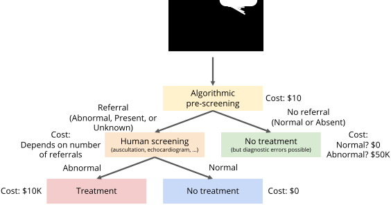

[comment]: <> ()

# Heart Murmur Detection from Phonocardiogram Recordings: The George B. Moody PhysioNet Challenge 2022

#### Matthew A. Reyna, Andoni Elola, Jorge Oliveira, Francesco Renna, Annie Gu, Nadi Sadr,  Erick A. Perez Alday, Yashar Kiarashinejad, Sandra Mattos, Miguel T. Coimbra, Reza Sameni, Ali Bahrami Rad, Gari D. Clifford

##  Announcements

 __February 1, 2022:__ The ([newly named](#2021.09.15)) NIH-funded George B. Moody PhysioNet Challenge 2022 is [now open](https://groups.google.com/g/physionet-challenges/c/uZnPlcnvqOM)! Please read this website for details and share questions and comments on [Challenge forum](https://groups.google.com/g/physionet-challenges/). This year's Challenge is generously co-sponsored by MathWorks and the Gordon and Betty Moore Foundation.

__September 15, 2021:__ In honor of the contributions of [George Moody](https://physionet.org/news/post/355) to PhysioNet and Computing in Cardiology, the Board of CinC voted to rename the Challenges to the George B. Moody PhysioNet Challenge.

{: style="text-align:center"}
{:height="40px"}&nbsp;&nbsp;&nbsp;
{:height="40px"}

{: style="text-align:center"}
{:height="120px"}

##  Citations

When using the resources on this site, please cite the following publications:

- The CirCor DigiScope Dataset:
[Oliveira, J., Renna, F., Costa, P. D., Nogueira, M., Oliveira, C., Ferreira, C., ... & Coimbra, M. T. (2022). The CirCor DigiScope Dataset: From Murmur Detection to Murmur Classification. IEEE Journal of Biomedical and Health Informatics, doi: 10.1109/JBHI.2021.3137048.](https://ieeexplore.ieee.org/document/9658215)
- The 2022 Challenge publications: To Be Announced
- The standard citation for the PhysioNet resource:
[Goldberger, A., Amaral, L., Glass, L., Hausdorff, J., Ivanov, P. C., Mark, R., ... & Stanley, H. E. (2000). PhysioBank, PhysioToolkit, and PhysioNet: Components of a new research resource for complex physiologic signals. Circulation [Online]. 101 (23), pp. e215-e220.](https://www.ahajournals.org/doi/full/10.1161/01.CIR.101.23.e215)

##  Introduction

Congenital heart diseases affect about 1% of newborns, representing an important morbidity and mortality factor for several severe conditions, including advanced heart failure [[1](#Burstein19)]. In a 2019 survey, it was estimated that congenital heart diseases affect over 500,000 children in East Africa [[2](#Jivanji19)], and about 8 in every 1000 live births [[3](#Zuhlke13)]. Acquired heart diseases include rheumatic fever and the Kawasaki disease, the former being a serious public health problem in developing regions, e.g., rural Brazil [[4](#Carvalho12)]. Several regions of developing countries have difficulties in diagnosing and treating both congenital and acquired heart conditions in children. This is mainly due to the lack of infrastructure and cardiology specialists in geographically large areas and difficulty in accessing health services. In addition, the current COVID-19 pandemic poses new difficulties in the clinical evaluation of patients by delaying important in-person patient-doctor contacts, negatively impacting screening and monitoring activities.

A non-invasive assessment of the mechanical function of the heart, performed at point-of-care settings, can provide early information regarding congenital and acquired heart diseases in children. The lack of early diagnoses of these conditions represents a major public health problem, especially in underprivileged countries with high birth rates [[5](#Tandon10), [6](#Seckeler11), [7](#Gheorghe18)]. In particular, cardiac auscultation and the analysis of the phonocardiogram (PCG) can unveil fundamental clinical information regarding heart malfunctioning caused by congenital and acquired heart disease in pediatric populations. This is achieved by detecting abnormal sound waves, or heart murmurs, in the PCG signal. Murmurs are abnormal waves generated by turbulent blood flow in cardiac and vascular structures. They are closely associated with specific diseases such as septal defects, failure of ductus arteriosus closure in newborns, and defective cardiac valves.

In contrast with the [2016 Challenge](https://physionet.org/content/challenge-2016/), which focused on classifying normal vs. abnormal heart sounds *from a single short recording from a single precordial location* [[8](#Clifford16)], this year's Challenge is devoted to detecting the presence or absence of murmurs *from multiple heart sound recordings from multiple auscultation locations*.

##  Objective

The goal of the Challenge is to identify the presence, absence, or unclear cases of murmurs in heart sound recordings collected from multiple auscultation locations on the body using a digital stethoscope.

We ask participants to design and implement a working, open-source algorithm that, based only on the provided recordings and routine demographic data, can determine whether any murmurs are audible from a patient's recordings. We have designed a scoring function that reflects the burden of algorithmic pre-screening, expert screening, treatment, and missed diagnoses. The team with the lowest score wins the Challenge.

##  Challenge Data

The Challenge data contain one or more heart sound recordings for 1568 patients as well as routine demographic information about the patients from whom the recordings were taken. The Challenge labels indicate whether an expert annotator detected the presence or absence of a murmur in a patient from the recordings, or whether the annotator was unsure about the presence or absence of a murmur.

###  Data Collection

The Challenge data were collected from a pediatric population during two mass screening campaigns conducted in Northeast Brazil in July-August 2014 and June-July 2015. The data collection was approved by the 5192-Complexo Hospitalar HUOC/PROCAPE institutional review board, under the request of the Real Hospital Portugues de Beneficencia em Pernambuco. The target population was individuals who were 21 years old or younger who presented voluntarily for screening with a signed parental or legal guardian consent form. All participants completed a sociodemographic questionnaire and subsequently underwent a clinical examination, a nursing assessment, and cardiac investigations. A detailed description of the dataset can be found in [[9](#Oliveira2022)].

Each patient in the Challenge data has one or more recordings from one or more prominent auscultation locations: pulmonary valve (PV), aortic valve (AV), mitral valve (MV), tricuspid valve (TV), and other (Phc). The recordings were collected sequentially (not simultaneously) from different auscultation locations using a digital stethoscope. The number, location, and duration of the recordings vary between patients.

###  Data Variables

The Challenge data is organized into three distinct sets: training, validation, and test sets. We have publicly released 60% of the dataset as the training set of the 2022 Challenge, and we have retained the remaining 40% as a hidden data for validation and test purposes. The hidden data will be used to evaluate the entries to the 2022 Challenge and will be released only after the end of the 2022 Challenge.

To create the training, validation, and test sets, the original dataset was partitioned patient-wise (no patient belonged to multiple sets) through stratified random sampling to provide similar proportions of patients with murmurs (present), patients without murmurs (absent), and unknown cases across the different sets. The training set contains 3163 recordings from 942 patients.

The public training set contains heart sound recordings, routine demographic information, labels (presence, absence, or unknown murmurs), annotations of the murmur characteristics (location, timing, shape, pitch, quality, and grade), and heart sound segmentations. The private validation and test sets only contain heart sound recordings and demographic information.

The following [Data Table](#data-table) shows the available information in the training, validation, and test sets of the challenge data. A detailed description of this table can be found in the [Data Description](data).

|        Variable   |    Short description (format)    | Possible values       | Training    |Validation|Test|
|-----------------|------------------|------------------|------------------------|------|------|
| Age | Age category (string)| Neonate  Infant  Child  Adolescent  Young adult |✓|✓|✓|
|Sex|Reported sex (string)|Female Male|✓|✓|✓|
|Height|Height in centimeters (number)||✓|✓|✓|
|Weight|Weight in kilograms (number)| |✓|✓|✓|
|Pregnancy status|Did the patient report being pregnant durign screening? (Boolean)| |✓|✓|✓|
|Additional ID|The second identifier for patients that participated to both screening campaigns (string)| |✓|||
|Campaign|Campaign attended by the patient (string)|CC2014  CC2015 |✓|||
|Murmur|Indicates if a murmur is present, absent or unidentifiable for the annotator; the Challenge label (string)| Present Absent Unknown|✓|||
|Murmur locations|Auscultation locations where at least one murmur has been observed (string)|Any combination of the following abbreviations, concatenated with plus (+) signs: PV, TV, AV, MV, and Phc|✓|||
|Most audible location|Auscultation location where murmurs sounded more intense for the annotator (string)| PV TV AV MV Phc|✓|||
|Systolic murmur timing|The timing of the murmur within the systolic period (string)|Early-systolic Mid-systolic Late-systolic Holosystolic|✓|||
|Systolic murmur shape|Shape of the murmur in the systolic period (string)|Crescendo Decrescendo Diamond Plateau|✓|||
|Systolic murmur pitch|Pitch of the murmur in the systolic period (string)|Low Medium High|✓|||
|Systolic murmur grading|Grading of the murmur in the systolic period according to the Levine scale [[10](#Freeman1933)] with some modification (string)|I/VI II/VI III/VI|✓|||
|Systolic murmur quality|Quality of the murmur in the systolic period (string)|Blowing Harsh Musical|✓|||
|Diastolic murmur timing|The timing of the murmur within the diastolic period (string)|Early-diastolic Mid-diastolic Holodiastolic|✓|||
|Diastolic murmur shape|Shape of the murmur in the diastolic period (string)|Decrescendo Plateau|✓|||
|Diastolic murmur pitch|Pitch of the murmur in the diastolic period (string)|Low Medium High|✓|||
|Diastolic murmur grading|Grading of the murmur in the diastolic period (string)|I/IV II/IV III/IV|✓|||
|Diastolic murmur quality|Quality of the murmur in the diastolic period (string)|Blowing Harsh|✓|||

**Note 1:** The participants are welcome and encouraged to use external PCG or audio datasets, including the [2016 PhysioNet Challenge](https://physionet.org/content/challenge-2016/) data [[8](#Clifford16)] and [PhysioNet EPHNOGRAM](https://physionet.org/content/ephnogram/) dataset [[11](#Kazemnejad2021)] for training their models or for transfer learning.

**Note 2:** The participants are encouraged to relabel the data and share new labels with us for further investigation. We may consider providing consensus labels at some point.

###  Data Format

There are four data file types in the training set:

- A wave recording file (binary `.wav` format) per auscultation location for each subject, which contains the heart sound data.
- A header file (text `.hea` format) describing the `.wav` file using the standard [WFDB format](https://physionet.org/content/wfdb/10.6.2/).
- A segmentation data file (text `.tsv` format) per auscultation location for all subjects, which contains segmentation information regarding the start and end points of the fundamental heart sounds S1 and S2.
- A subject description text file (text `.txt` format) per subject, where the name of the file corresponds to the subject ID. Demographic data such as age, sex, height, weight, and pregnancy status as well as a detailed description of any murmur events are provided in this file.

The validation and test datasets have the same structure, but the `.txt` file does not provide information about murmurs, and the `.tsv` segmentation files are not provided.

The filenames for the audio data, the header file, the segmentation annotation, and the subject description are formatted as `ABCDE_XY.wav`, `ABCDE_XY.hea`, `ABCDE_XY.tsv`, and `ABCDE.txt`, respectively. Here, `ABCDE` is a numeric subject identifier and `XY` is one of the following codes corresponding to the auscultation location where the PCG was collected on the body surface:

- PV corresponds to the pulmonary valve point;
- TV corresponds to the tricuspid valve point;
- AV corresponds to the aortic valve point;
- MV corresponds to the mitral valve point;
- Phc corresponds to any other auscultation Location.

If more than one recording exists per auscultation location, an integer index follows the auscultation location code in the file name, i.e, `ABCDE_XY_n.wav`, `ABCDE_XY_n.hea`, and `ABCDE_XY_n.tsv`, where `n` is an integer (1, 2, ...). Accordingly, each audio file has its own header and annotation segmentation file, but the subject description file `ABCDE.txt` is shared between all auscultation recordings of the same subject ID. These audio recordings were recorded sequentially, not simultaneously, and therefore may have different lengths. The sequence of signal aquisition locations is unknown and is not necessarily consisent across different subjects.

The subject description file has the following format:

- The first line indicates the subject identifier, the number of recordings, and the sampling frequency (in Hz) separated by space delimiters, respectively.
- The following lines contain information about the heart sound data files corresponding to the current subject ID, also separated by empty spaces. Here, the location of the recording (AV, PV, TV, MV, or Phc), the name of the header file, the name of the WAV file, and the name of the segmentation file are included (the segmentation files are only provided for the training data).
- The rest of the lines start with a pound/hash symbol (#) and indicate the information described in the [Data Table](#data-table).

**Example:** The subject description file `1234.txt` contains information about the subject with ID number 1234, as shown below. Accordingly, there are a total of four WAV files for this subject acquired from the locations AV, PV, TV and MV, all sampled at 4000 Hz. Each `.wav` file has its heart sound segmentation information registered in a separate `.tsv` file, with a similar base name as the corresponding `.wav` file.

    1234 4 4000
    AV 1234_AV.hea 1234_AV.wav 1234_AV.tsv
    PV 1234_PV.hea 1234_PV.wav 1234_PV.tsv
    TV 1234_TV.hea 1234_TV.wav 1234_TV.tsv
    MV 1234_MV.hea 1234_MV.wav 1234_MV.tsv
    #Age: Child
    #Sex: Female
    #Height: 123.0
    #Weight: 13.5
    #Pregnancy status: False
    #Murmur: Present
    #Murmur locations: AV+MV+PV+TV
    #Most audible location: TV
    #Systolic murmur timing: Holosystolic
    #Systolic murmur shape: Diamond
    #Systolic murmur grading: III/VI
    #Systolic murmur pitch: High
    #Systolic murmur quality: Harsh
    #Diastolic murmur timing: nan
    #Diastolic murmur shape: nan
    #Diastolic murmur grading: nan
    #Diastolic murmur pitch: nan
    #Diastolic murmur quality: nan
    #Campaign: CC2014
    #Additional ID: nan

The segmentation annotation file (with `.tsv` extension and in plain text format) is composed of three distinct columns: the first column corresponds to the time instant (in seconds) where the wave was detected for the first time, the second column corresponds to the time instant (in seconds) where the wave was detected for the last time, and the third column corresponds to an identifier that uniquely identifies the detected wave. Here, we use the following convention:

- The S1 wave is identified by the integer 1.
- The systolic period is identified by the integer 2.
- The S2 wave is identified by the integer 3.
- The diastolic period is identified by the integer 4.
- The unannotated segments of the signal are identified by the integer 0.

###  Data Access

The training data of the 2022 Challenge can be downloaded from [PhysioNet](https://physionet.org/content/circor-heart-sound/). You can also download it directly using this [link](https://physionet.org/static/published-projects/circor-heart-sound/the-circor-digiscope-phonocardiogram-dataset-1.0.1.zip) or the following command:

    wget -r -N -c -np https://physionet.org/files/circor-heart-sound/1.0.1/

##  Registering for the Challenge and Conditions of Participation

To participate in the Challenge, [register your team](https://docs.google.com/forms/d/e/1FAIpQLSdADXQw3OW9Kvhc4xay_ua3Q9_A8O1d-JbAoW_aS-a9RjWutw/viewform?usp=sf_link) by providing the full names, affiliations, and official email addresses of your entire team before you submit your algorithm. The details of all authors must be exactly the same as the details in your abstract submission to [Computing in Cardiology](http://www.cinc2022.org/). You may update your author list by completing [this form](https://docs.google.com/forms/d/e/1FAIpQLSdADXQw3OW9Kvhc4xay_ua3Q9_A8O1d-JbAoW_aS-a9RjWutw/viewform?usp=sf_link) again (read the form for details), but changes to your authors must not contravene [the rules](#collaboration) of the Challenge.

##  Challenge Algorithms

For each patient (independently of the number of recording locations), your algorithm must identify the class label (present, absent, unknown) as well as a probability or confidence score for each class per subject ID. As an example, suppose that you have four recordings in four locations on the body, your classifier needs to analyze those recordings but at the end must generate only one label (e.g., present) per subject ID with the score/probability for all classes, which are numbers between zero and one.

Your code might produce the following output for the patient ID 1234:

    #1234
    Present, Unknown, Absent
           1,      0,      0
        0.75,   0.15,    0.1

This output indicates that the classifier identified a murmur for patient 1234, and it indicates the probability of a murmur as 75%, the probability of the absence of murmurs as 10%, and the probability of an unknown status as 15%.

We have implemented two example algorithms in [MATLAB](https://github.com/physionetchallenges/matlab-classifier-2022) and [Python](https://github.com/physionetchallenges/python-classifier-2022) as templates for successful submissions:

- The MATLAB algorithm implements a random forest classifier that uses age, sex, height, weight, and pregnancy status (extracted from demographic data) and the mean, variance, and kurtosis of each PCG recording to classify the presence, absence, or unknown murmur status for each patient.
- The Python algorithm also implements a random forest classifier using the same features to classify the presence, absence, or unknown murmur status for each patient.

##  Submitting your Algorithm

See [this page](submissions) for information about how to prepare your algorithm. We will start accepting submissions in the coming weeks.

##  Challenge Scoring

For this year's Challenge, we developed a scoring metric based on the *costs for algorithmic prescreening for human experts for heart murmur identification*. We assume that algorithms can make diagnostic errors. If an algorithmic prescreening is positive (i.e., it identifies a murmur) or unknown, then the patient is referred to an expert for screening. If the algorithmic prescreening is negative (i.e., it does not identify a murmur), then there is no expert referral.

We also assume that experts do not make diagnostic errors, but an expert diagnosis may be unknown. If an expert diagnosis is positive, then the patient receives treatment. If the expert diagnosis is unknown, then the patient receives another expert screening, after which the patient receives treatment a fraction $$\alpha$$ of the time. If the expert diagnosis is negative, then the patient does not receive treatment.

Let $$n_{\text{total}}$$ be the total number of subjects, where $$n_{\text{P}}$$, $$n_{\text{U}}$$, and $$n_{\text{N}}$$ are the numbers of positive (present murmur), unknown, and negative (absent murmur) cases, respectively (considered as ground truth):

- $$n_{\text{total}} = n_{\text{P}} + n_{\text{U}} + n_{\text{N}}$$.

The following table provides a [confusion matrix](#conf-mat) for the numbers of cases that an algorithm and an expert identify as positive, unknown, and/or negative:

<table>
    <thead>
           <tr>
            <th></th>
            <th></th>
             <th colspan=3>Expert</th>
            </tr>
    </thead>
    <tbody>
     <tr>
            <th></th>
            <th></th>
                 <th>Positive</th>
           <th>Unknown</th>
            <th>Negative</th>
        </tr>
        <tr>
            <td rowspan=3><b>Classifier</b></td>
             <td><b>Positive</b></td>
         <td><i>n</i>PP </td>
         <td><i>n</i>PU</td>
         <td><i>n</i>PN  </td>
           </tr>
        <tr>
            <td><b>Unknown</b></td>
         <td><i>n</i>UP</td>
         <td><i>n</i>UU </td>
         <td><i>n</i>UN</td>
        </tr>
        <tr>
            <td><b>Negative</b></td>
         <td><i>n</i>NP </td>
         <td><i>n</i>NU</td>
         <td><i>n</i>NN</td>
        </tr>
       </tbody>
</table>

The columns marginals/sums of this matrix are $$n_{\text{P}}$$, $$n_{\text{U}}$$, and $$n_{\text{N}}$$, respectively:

- $$n_{\text{P}} = n_{\text{PP}} + n_{\text{UP}} + n_{\text{NP}}$$,
- $$n_{\text{U}} = n_{\text{PU}} + n_{\text{UU}} + n_{\text{NU}}$$,
- $$n_{\text{N}} = n_{\text{PN}} + n_{\text{UN}} + n_{\text{NN}}$$.

Let $$c_\text{algorithm}$$ be the cost of a single algorithmic prescreening, let $$c_{\text{expert}_1}$$ be the cost of a single expert screening, let $$c_{\text{expert}_2}$$ be the cost of a second expert screening, let $$c_\text{treatment}$$ be the cost of a single treatment, and let $$c_\text{error}$$ be the cost of a single diagnostic error, i.e., the cost of delayed treatment or no treatment for a heart murmur because of a late diagnosis. We assume that these costs are averaged over many subjects and define them as follows:

- $$c_\text{algorithm} = 1$$,
- $$c_{\text{expert}_1} = 250$$,
- $$c_{\text{expert}_2} = 500$$,
- $$c_\text{treatment} = 1000$$,
- $$c_\text{error} = 10000$$,
- and $$\alpha = 0.5$$.

Let

$$
c_0 = c_{\text{expert}_1} \cdot n_\text{total} + c_{\text{expert}_2} \cdot n_\text{U} + c_\text{treatment} \cdot (n_\text{P} + \alpha n_\text{U})
$$

be the total cost of only an expert for screening ***without algorithmic prescreening***, and let

$$
\begin{align*}
c_1  &=  c_\text{algorithm} \cdot n_\text{total} \\
 &+ c_{\text{expert}_1} \cdot (n_\text{PP} + n_\text{PU} + n_\text{PN} + n_\text{UP} + n_\text{UU} + n_\text{UN}) \\
 &+ c_{\text{expert}_2} \cdot (n_\text{PU} + n_\text{UU}) \\
 &+ c_\text{treatment} \cdot (n_\text{PP} + \alpha n_\text{PU} + n_\text{UP} + \alpha n_\text{UU})\\
 &+ c_\text{error} \cdot (n_\text{NP}+\alpha n_\text{NU})
\end{align*}
$$

be the total cost of using an expert for screening ***with algorithmic prescreening***.

**The mean cost $$c_1/n_\text{total}$$, i.e., the total cost divided by the number of patients, is the Challenge cost function.**

Given multiple algorithms, the algorithm with the smallest value $$c_1$$ wins as long as $$c_1 < c_0$$, i.e., algorithmic prescreening reduces costs.

The below flowchart illustrates the decision making process and cost $$c_0$$ associated with conventional screening:

{: style="text-align:center"}

The below flowchart illustrates the decision making process and cost $$c_1$$ associated with algorithmic prescreening:

{: style="text-align:center"}

We are starting this year's Challenge with this [scoring metric](https://github.com/physionetchallenges/evaluation-2022) and welcome [feedback](https://groups.google.com/g/physionet-challenges/). The [leaderboard](leaderboard) provides the Challenge scoring metric for successful submissions on the hidden validation data.

##  Challenge Rules and Deadlines

###  Overview of rules

There are two phases for the Challenge: an unofficial phase and an official phase. The unofficial phase of the Challenge allows us to introduce and 'beta test' the data, scores, and submission system before the official phase of the Challenge. Participation in the unofficial phase is mandatory for participating in the official phase of the Challenge because it helps us to improve the official phase.

Entrants may have an overall total of up to 15 scored entries over both the unofficial and official phases of the competition (see the below table). All deadlines occur at 11:59pm GMT on the dates mentioned below, and all dates are during 2022 unless indicated otherwise. If you do not know the difference between GMT and your local time, then find it out before the deadline!

__Please__ submit your entries early to ensure that you have the most chances for success. If you wait until the last few days to submit your entries, then you may not receive feedback before the submission deadline, and you may be unable to resubmit your entries if there are unexpected errors or issues with your submissions. Every year, several teams wait until the last few days to submit their first entry and are unable to debug their work before the deadline.

###  Timing and priority of entries

Although we score on a first-come-first-serve basis, please note that if you submit more than one entry in a 24-hour period, your second entry may be deprioritized compared to other teams' first entries. If you submit more than one entry in the final 24 hours before the Challenge deadline, then we may be unable to provide feedback or a score for more than one of your entries. It is unlikely that we will be able to debug any code in the final days of the Challenge.

For these reasons, we strongly suggest that you start submitting entries at least 5 days before the unofficial deadline and 10 days before the official deadline. We have found that the earlier teams enter the Challenge, the better they do because they have time to digest feedback and performance. We therefore suggest entering your submissions many weeks before the deadline to give yourself the best chance for success.

###  Key dates/deadlines

|                 | Start            | End              | Submissions            |
|-----------------|------------------|------------------|------------------------|
|Unofficial phase | 1 February 2022  | 8 April 2022     | 1-5 scored entries (*) |
|Hiatus           | 9 April 2022     | 30 April 2022    | N/A                    |
|Abstract deadline| 15 April 2022    | 15 April 2022    | 1 abstract             |
|Official phase   | 2 May 2022       | 15 August 2022   | 1-10 scored entries (*)|
|Abstract decisions released|21 June 2022|21 June 2022  | N/A                    |
|Wild card entry date| 31 July 2022  | 31 July 2022     | N/A                    |
|Hiatus           | 16 August 2022   | 3 September 2022 | N/A                    |
|Preprint deadline| 25 August 2022   | 25 August 2022   | One 4-page paper (**)  |
|Conference       | 4 September 2022| 7 September 2022  | 1 presentation (***)   |
|Final scores released| 8 September 2022| 8 September 2022| N/A                  |
|Final paper deadline| 23 September 2022| 30 September 2022| One 4-page paper (***)|

(* Entries that fail to score do not count against limits.)

(** Must include preliminary scores.)

(*** Must include final scores, your ranking in the Challenge, and any updates to your work as a result of feedback after presenting at CinC. This final paper daedline is earlier than the deadline given by CinC so that we can check these details.)

To be eligible for the open-source award, you must do all the following:

1. Register for the Challenge [here](https://docs.google.com/forms/d/e/1FAIpQLSdADXQw3OW9Kvhc4xay_ua3Q9_A8O1d-JbAoW_aS-a9RjWutw/viewform?usp=sf_link).
2. Submit at least one open-source entry that can be scored during the unofficial phase.
3. [Submit an abstract to CinC](http://www.cinc.org/information-for-computing-in-cardiology-authors/) by the abstract submission deadline. Include your team name and score from the unofficial phase in your abstract. Please select 'PhysioNet/CinC Challenge' as the topic of your abstract so that it can be identified easily by the abstract review committee. __Please__ read ["Advice on Writing an Abstract"](#abstracts) for important information on writing a successful abstract.
4. Submit at least one open-source entry that can be scored during the official phase.
5. [Submit a full 4-page paper](http://www.cinc.org/information-for-computing-in-cardiology-authors/) on your work to CinC by the above preprint deadline.
6. One of your team members must attend [CinC 2022](http://www.cinc2022.org/) to present your work either orally or as a poster (depending on your abstract acceptance). If you have a poster, then you must stand by it to defend your work. No-shows (oral or poster) will be disqualified. One of your team members must also attend the closing ceremony to collect your prize. No substitutes will be allowed. Remote attendance may be allowed depending on the policies of the conference and the state of the pandemic.
7. [Submit a full 4-page paper](http://www.cinc.org/information-for-computing-in-cardiology-authors/) on your work to CinC by the above final paper deadline. Please note that we expect the abstract to change significantly both in terms of results and methods. You may also update your title with the caveat that it must not be substantially similar to the title of the competition or contain the words 'physionet', 'challenge', or 'competition'.

You must not submit an analysis of this year's Challenge data to other conferences or journals until after CinC 2022 so that we can discuss the Challenge in a single forum. If we discover evidence that you have submitted elsewhere before the end of CinC 2022, then you will be disqualified and de-ranked on the website, banned from future Challenges, and the journal/conference will be contacted to request your article be withdrawn for contravention of the terms of use.

There are many reasons for this policy: 1) we do not release results on the test data before the end of CinC, and only reporting results on the training data increases the likelihood of overfitting and is not comparable to the official results on the test data, and 2) attempting to publish on the Challenge data before the Challengers present their results is unprofessional and comes across as a territorial grab. This requirement stands even if your abstract is rejected, but you may continue to enter the competition and receive scores. (However, unless you are accepted into the conference at a later date as a 'wild card' entry, you will not be eligible to win a prize.) Of course, any publicly available data that was available before the Challenge is exempted from this condition, but any of the novelty of the Challenge (the Challenge design, the Challenge data that you downloaded from this page because it was processed for the Challenge, the scoring function, etc.) is not exempted.

After the Challenge is over and the final scores have been posted (in late September), everyone may then submit their work to a journal or another conference.

###  Wild Card Entries

If your abstract is rejected or if you otherwise failed to qualify during the unofficial period, then there is still a chance to present as CinC and win the Challenge. A 'wild card' entry has been reserved for a high-scoring entry from a team that was unable to submit an accepted abstract to CinC by the original abstract submission deadline. A successful entry must be submitted by the wild card entry deadline. We will contact eligible teams and ask them to submit an abstract. The abstract will still be reviewed as thoroughly as any other abstract accepted for the conference. See [Advice on Writing an Abstract](#abstracts).

###  Advice on Writing an Abstract

To improve your chances of having your abstract accepted, we offer the following advice:

- Ensure that all of your authors agree on your abstract, and be sure that all of the author details match your registration information, including email addresses.
- Stick to the word limit and deadline on the [conference website](http://www.cinc.org/cinc-conference-program-abstracts/). Include time for errors, internet outages, etc.
- Select 'PhysioNet/CinC Challenge' as the submission topic so it can be identified easily by the abstract review committee. However, do not include the words 'PhysioNet' or 'PhysioNet/CinC' or 'Challenge' in the title because this creates confusion with the hundreds of other articles and the main descriptor of the Challenge.
- Your title, abstract and author list (collaborators) can be modified in September when you submit the final paper.
- While your work is bound to change, the quality of your abstract is a good indicator of the final quality of your work. We suggest you spell check, write in full sentences, and be specific about your approaches. Include your method's cross validated training performance (using the Challenge metrics) and your score provided by the Challenge submission system. If you omit or inflate this latter score, then your abstract will be rejected.
- Do not be embarrassed by any low scores. We do not expect high scores at this stage. We are focused on the thoughtfulness of the approach and quality of the abstract.
- If you are unable to receive a score during the unofficial phase, then you can still submit, but the work should be very high quality and you should include the cross validation results of your algorithm on training set.

You will be notified if your abstract has been accepted by email from CinC in June. You may not enter more than one abstract describing your work in the Challenge. We know you may have multiple ideas, and the actual abstract will evolve over the course of the Challenge. More information, particularly on discounts and scholarships, can be found [here](http://www.cinc.org/information-for-computing-in-cardiology-authors/). We are sorry, but the Challenge Organizers do not have extra funds to enable discounts or funding to attend the conference.

Again, we cannot guarantee that your code will be run in time for the [CinC](http://cinc.org/) abstract deadline, especially if you submit your code immediately before the deadline. It is much more important to focus on writing a high-quality abstract describing your work and submit this to the conference by abstract deadline. Please follow [these instructions](#abstracts) here carefully.

Please make sure that __all of your team members are authors on your abstract__. If you need to add or subtract authors, do this at least a week before the abstract deadline. Asking us to alter your team membership near or after the deadline is going to lead to confusion that could affect your score during review. It is better to be more inclusive on the abstract in terms of authorship, though, and if we find authors have moved between abstracts/teams without permission, then this is likely to lead to disqualification. As noted above, you may change the authors/team members later in the Challenge.

Please make sure that you include __your team name__, your __official score__ as it appears on the leaderboard, and __cross validation results__ in your abstract __using the scoring metrics for this year's Challenge__ (especially if you are unable to receive a score or are scoring poorly). The novelty of your approach and the rigor of your research is much more important during the unofficial phase. Please make sure you describe your technique and any novelty very specifically. General statements such as 'a 1D CNN was used' are uninformative and will score poorly in review.

The Challenge Organizers have no ability to help with any problems with the abstract submission system. We do not operate it. Please do not email us with issues related to the abstract submission system.

###  Open-Source Licenses

We encourage the use of open-source licenses for your entries.

Entries with non open-source licenses will be scored but not ranked in the official competition. All scores will be made public. At the end of the competition, all entries will be posted publicly, and therefore automatically mirrored on several sites around the world. We have no control over these sites, so we cannot remove your code even on request. Code which the organizers deem to be functional will be made publicly available after the end of the Challenge. You can request to withdraw from the Challenge, so that your entry's performance is no longer listed in the official leader board, up until a week before the end of the official phase. However, the Organizers reserve the right to publish any submitted open-source code after the official phase is over. The Organizers also retain the right to use a copy of submitted code for non-commercial use. This allows us to re-score if definitions change and validate any claims made by competitors.

If no license is specified in your submission, then the license given in the example code will be added to your entry, i.e., we will assume that you have released your code under the [BSD 3-Clause license](https://opensource.org/licenses/BSD-3-Clause).

##  Rules on Competing in Teams / Collaboration

To maintain the scientific impact of the Challenges, it is important that all Challengers contribute truly independent ideas. For this reason, we impose the following rules on team composition/collaboration:

1. Multiple teams from a single entity (such as a company, university, or university department) are allowed as long as the teams are truly independent and do not share team members (at any point), code, or any ideas. Multiple teams from the same research group or company unit are not allowed because of the difficulty of maintaining independence in those situations. If there is any question on independence, the teams will be required to supply an official letter from the company that indicates that the teams do not interact at any point (socially or professionally) and work in separate facilities, as well as the location of those facilities.
2. You can join an existing team before the abstract deadline as long as you have not belonged to another team or communicated with another team about the current Challenge. You may update your author list by completing [this form](https://docs.google.com/forms/d/e/1FAIpQLSdADXQw3OW9Kvhc4xay_ua3Q9_A8O1d-JbAoW_aS-a9RjWutw/viewform?usp=sf_link) again (check the 'Update team members' box on the form), but changes to your authors must not contravene [the rules](#collaboration) of the Challenge.
3. You may use public code from another team if they posted it before the competition.
4. You may not make your Challenge code publicly available during the Challenge or use any code from another Challenger that was shared, intentionally or not, during the course of the Challenge.
5. You may not publicly post information describing your methods (blog, vlog, code, preprint, presentation, talk, etc.) or give a talk outside your own research group at any point during the Challenge that reveals the methods you have employed or will employ in the Challenge. Obviously, you can talk about and publish the same methods on other data as long as you don't indicate that you used or planned to use it for the Challenge.
6. You must use the same team name and email address for your team throughout the course of the Challenge. The email address should be the same as the one used to register for the Challenge, and to submit your abstract to CinC. Note that the submitter of the conference article/code does not need to present at the conference or be in any particular location in the author order on the abstract/poster/paper, but they must be a contributing member of the team. If your team uses multiple team names and/or email addresses to enter the Challenge, please contact the Organizers immediately to avoid disqualification of all team members concerned. Ambiguity will result in disqualification.
7. If you participate in the Challenge as part of a class project, then please treat your class as a single team — please use the same team name as other groups in your class, limit the number of submissions from your class to the number allowed for each team, and feel free to present your work within your class. If your class needs more submissions than the Challenge submission limits allow, then please perform cross-validation on the training data to evaluate your work.

If we discover evidence of the contravention of these rules, then you will be ineligible for a prize and your entry publicly marked as possibly associated with another entry. Although we will contact the team(s) in question, time and resources are limited and the Organizers must use their best judgement on the matter in a short period of time. The Organizers' decision on rule violations will be final.

##  Conference Attendance

[CinC 2022](http://www.cinc2022.org/) will take place from 4-7 September 2022 in [Tampere, Finland](https://www.google.com/maps/place/Tampere,+Finland/). You must attend the whole conference to be eligible for prizes. If you send someone in your place who is not a team member or co-author, then you will be disqualified and your abstract will be removed from the proceedings. In particular, it is vital that the presenter (oral or poster) can defend your work and have in-depth knowledge of all decisions made during the development of your algorithm.  Due to this year's challenges, both in person and remote attendance are allowed. If you require a visa to attend the conference, we strongly suggest that you apply as soon as possible.  Please contact the local [conference](http://www.cinc2022.org/) organizing committee (not the Challenge Organizers) for any visa sponsorship letters and answer any questions concerning the conference.

##  Sponsors

This year's Challenge is generously co-sponsored by MathWorks and the Gordon and Betty Moore Foundation.

{: style="text-align:center"}
{:height="40px"}&nbsp;&nbsp;&nbsp;
{:height="40px"}

###  Obtaining Complimentary MATLAB Licenses

[MathWorks](http://www.mathworks.com/) has generously decided to sponsor this Challenge by providing complimentary licenses to all teams that wish to use MATLAB. Users can apply for a license and learn more about MATLAB support by visiting the [PhysioNet Challenge page](https://www.mathworks.com/academia/student-competitions/physionet.html) from MathWorks. If you have questions or need technical support, then please contact MathWorks at <studentcompetitions@mathworks.com>.

###  Obtaining Complimentary Google Cloud Platform Credits

At the time of launching this Challenge, Google Cloud offers multiple services for [free](https://cloud.google.com/free/) on a one-year trial basis and $300 in cloud credits. Teams can request research credits [here](https://edu.google.com/intl/ALL_us/programs/credits/research/). Additionally, if teams are based at an educational institution in selected countries, then they can access free GCP training [online](https://edu.google.com/programs/credits). The Challenge Organizers, their employers, PhysioNet and Computing in Cardiology accept no responsibility for the loss of credits, or failure to issue credits for any reason.

##  References

[1]. [D. S. Burstein, P. Shamszad, D. Dai, C. S. Almond, J. F.  Price, K. Y.  Lin, M. J. O'Connor, R. E. Shaddy, C. E. Mascio, and J. W. Rossano, "Significant mortality, morbidity and resource utilization associated with advanced heart failure in congenital heart disease in children and young adults,". American Heart Journal, vol. 209, pp. 9-19, 2019.](https://pubmed.ncbi.nlm.nih.gov/30639612/)

[2]. [S. G. Jivanji, S. Lubega, B. Reel, and S. A. Qureshi, "Congenital heart disease in East Africa," Frontiers in Pediatrics.7:250, 2019.](https://www.frontiersin.org/articles/10.3389/fped.2019.00250/full)

[3]. [L. Zühlke, M. Mirabel, and E. Marijon, "Congenital heart disease and rheumatic heart disease in Africa: Recent advances and current priorities," Heart, vol. 99, no. 21, pp. 1664-1561, 2013.](https://heart.bmj.com/content/heartjnl/99/21/1554.full.pdf)

[4]. [S. M. Carvalho, I. Dalben, J. E. Corrente, and C. S. Magalhães, "Rheumatic fever presentation and outcome: a case-series report," Revista Brasileira de Reumatologia, vol. 52, no. 2, pp. 241-246, 2012](https://www.scielo.br/j/rbr/a/hLD5Z6XrnW3WK6KzThdZb5x/?format=pdf&lang=en)

[5]. [A. Tandon, S. Sengupta, V. Shukla, and S. Danda, "Risk factors for congenital heart disease (CHD) in Vellore, India," Current Research Journal of Biological Sciences, vol. 2, no. 4, pp. 253-258, 2010.](https://www.airitilibrary.com/Publication/alDetailedMesh?docid=20410778-201007-201009060068-201009060068-253-258)

[6]. [M. D. Seckeler and T. R. Hoke, "The worldwide epidemiology of acute rheumatic fever and rheumatic heart disease," Clinical Epidemiology, vol. 3, pp. 67-84, 2011.](https://www.dovepress.com/the-worldwide-epidemiology-of-acute-rheumatic-fever-and-rheumatic-hear-peer-reviewed-fulltext-article-CLEP)

[7]. [A. Gheorghe, U. Griffiths, A. Murphy, H. Legido-Quigley, P. Lamptey, and P. Perel, "The economic burden of cardiovascular disease and hypertension in low-and middle-income countries: a systematic review," BMC Public Health, vol. 18, no. 1, 2018.](https://bmcpublichealth.biomedcentral.com/articles/10.1186/s12889-018-5806-x)

[8]. [G. D. Clifford, C. Liu, B. Moody, D. Springer, I. Silva, Q. Li, and R. G. Mark. "Classification of normal/abnormal heart sound recordings: The PhysioNet/Computing in Cardiology Challenge 2016. In 2016 Computing in Cardiology Conference (CinC)," 2016 Sep 11 (pp. 609-612).](https://www.physionet.org/files/challenge-2016/1.0.0/papers/challenge2016.pdf)]

[9]. [J. H. Oliveira et al., "The CirCor DigiScope Dataset: From Murmur Detection to Murmur Classification," IEEE Journal of Biomedical and Health Informatics, doi: 10.1109/JBHI.2021.3137048.](https://ieeexplore.ieee.org/stamp/stamp.jsp?tp=&arnumber=9658215)

[10]. [A. Freeman and S. Levine, "The clinical significance of the systolic murmur: a study of 1000 consecutive "non-cardiac" cases," Annals of Internal Medicine, vol. 6, p. 1371-1385, 1933.](https://www.acpjournals.org/doi/pdf/10.7326/0003-4819-6-11-1371)

[11]. [A. Kazemnejad, P. Gordany, and R. Sameni. "An Open-Access Simultaneous Electrocardiogram and Phonocardiogram Database," bioRxiv, 2021.](https://www.biorxiv.org/content/10.1101/2021.05.17.444563v2)

[12]. [R. Keren, M. Tereschuk, and X. Luan, "Evaluation of a novel method for grading heart murmur intensity," Archives of pediatric & adolescent medicine, vol. 159, no. 4, pp. 329-334, 2005.](https://jamanetwork.com/journals/jamapediatrics/fullarticle/485985)

[13]. [K. Williams, D. Thomson, I. Seto, D. Contopoulos-Ioannidis et al., "Standard 6: Age groups for pediatric trials," Pediatrics, vol. 129 Suppl 3, pp. S153-60, 06 2012.](https://publications.aap.org/pediatrics/article-abstract/129/Supplement_3/S153/32262/Standard-6-Age-Groups-for-Pediatric-Trials?redirectedFrom=fulltext)

[14]. [D. B. Springer, L. Tarassenko and G. D. Clifford, "Logistic Regression-HSMM-Based Heart Sound Segmentation," in IEEE Transactions on Biomedical Engineering, vol. 63, no. 4, pp. 822-832, April 2016, doi: 10.1109/TBME.2015.2475278.](refs/LR_HSMM_Segmentation_IEEE_Springer_Tarassenko_Clifford.pdf)

[15]. [J. Oliveira, F. Renna, T. Mantadelis and M. Coimbra, "Adaptive Sojourn Time HSMM for Heart Sound Segmentation," in IEEE Journal of Biomedical and Health Informatics, vol. 23, no. 2, pp. 642-649, March 2019, doi: 10.1109/JBHI.2018.2841197.](https://ieeexplore.ieee.org/abstract/document/8367820)

[16]. [F. Renna, J. Oliveira and M. T. Coimbra, "Deep Convolutional Neural Networks for Heart Sound Segmentation," in IEEE Journal of Biomedical and Health Informatics, vol. 23, no. 6, pp. 2435-2445, Nov. 2019, doi: 10.1109/JBHI.2019.2894222.](https://ieeexplore.ieee.org/document/8620278)

## Useful links

- [Current frequently asked questions (FAQ)](https://physionetchallenges.org/2022/faq/)
- [General frequently asked questions (FAQ)](https://physionetchallenges.org/faq/)

---

This year's Challenge is generously sponsored by MathWorks and the Gordon and Betty Moore Foundation

{: style="text-align:center"}
{:height="40px"}&nbsp;&nbsp;&nbsp;
{:height="40px"}

---

Supported by the [National Institute of Biomedical Imaging and Bioengineering (NIBIB)](https://www.nibib.nih.gov/) under NIH grant R01EB030362.

[Back](../)
