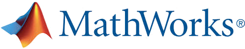

[comment]: <> ()

# Digitization and Classification of ECG Images: The George B. Moody PhysioNet Challenge 2024

## <a name="summary"></a> Summary

The George B. Moody PhysioNet Challenges are annual competitions that invite participants to develop automated approaches for addressing important physiological and clinical problems. The 2024 Challenge invites teams to develop algorithms for digitizing and classifying electrocardiograms (ECGs) captured from images or paper printouts. Despite the recent advances in digital ECG devices, physical or paper ECGs remain common, especially in the Global South. These physical ECGs document the history and diversity of cardiovascular diseases (CVDs), and algorithms that can digitize and classify these images have the potential to improve our understanding and treatment of CVDs, especially for underrepresented and underserved populations.

## <a name="announcements"></a> Announcements

- <a name="2024.03.14"></a>__March 15, 2024:__ We are delighted to announce that the [George B. Moody PhysioNet Challenges](#conference-attendance) are partnering with [Data Science Africa](https://www.datascienceafrica.org/) (DSA) and the [IEEE Signal Processing Society's Challenges and Data Collections Committee](https://signalprocessingsociety.org/publications-resources/challenges-and-data-collections) (CDCC). The [IEEE CDCC is supporting this year's Challenge](https://signalprocessingsociety.org/publications-resources/data-challenges/digitization-and-classification-ecg-images-george-b-moody) with additional cash prizes for participating teams from Africa, and the Challenge organizers will be running a [workshop at this year's annual DSA meeting in Kenya](https://www.datascienceafrica.org/dsa2024nyeri/blog/summer-school) at this year's annual DSA meeting in Kenya from June 2-5, 2024. Please note that we are also accepting (and scoring) entries, and there are two deadlines coming up: ~~April 8, 2024~~ April 10, 2024 to submit a [preliminary entry to the Challenge](submissions) and April 15, 2024 to submit a (placeholder) [abstract to CinC](https://cinc.org/inf_authors/).

- <a name="2024.02.29"></a>__February 29, 2024:__ We are [now accepting](https://groups.google.com/g/physionet-challenges/c/hhTSHmAVjAY) unofficial phase submissions for the 2024 Challenge. Please read the [submissions instructions](submissions), double check your code, and [submit](https://docs.google.com/forms/d/e/1FAIpQLScFZNXv5rc-KlBxZMBB5IX8jRWHR-hADuheOtRWs5x1XzZo4w/viewform?usp=sf_link) your code when ready.

- <a name="2024.01.25"></a>__January 25, 2024:__ The NIH-funded George B. Moody PhysioNet Challenge 2024 is [now open](https://groups.google.com/g/physionet-challenges/c/PBaLtvnwuRA)! Please read this website for details and share questions and comments on [Challenge forum](https://groups.google.com/g/physionet-challenges/). This year's Challenge is generously sponsored by [MathWorks](https://www.mathworks.com/) and [AWS](https://aws.amazon.com/).

- <a name="2024.01.11"></a>__January 11, 2024:__ The NIH-funded George B. Moody PhysioNet Challenge 2024 will open soon! Please stay tuned for more information.

## <a name="introduction"></a> Introduction

The electrocardiogram (ECG) is an essential pre-screening tool for cardiovascular diseases (CVDs). Non-invasive and painless, the ECG measures the electrical activity of the heart. In 1895, Willem Einthoven invented the first practical ECG device, culminating with the 1924 Nobel Prize in Physiology or Medicine. In 1927, General Electric introduced portable ECG devices, and by 1948, ECG devices could print ECG waveforms on paper. More recently, researchers have developed algorithmic approaches to interpreting ECG waveforms, and many companies have introduced digital ECG devices that record digital representations of the ECG waveforms. These and other developments have served to improve the accessibility of ECG-based diagnosis.  

However, while digital ECG-based approaches have the potential to improve access to ECG-based diagnoses and cardiac care, physical (paper) ECG representations have been a mainstay of cardiac care for nearly a century, and they remain common in much of the world, particularly in the Global South. While an increasing proportion of the estimated 100 to 300 million ECGs that are recorded each year are now in digital format, there are likely billions of paper ECGs around the world, particularly in the Global South<sup>[1](#ref-tison),[2](#ref-handzel),[3](#ref-ecg-image-kit-paper)</sup>. This legacy contains the variability and evolution of CVDs across demographics, geography, and time. Moreover, walled-garden proprietary systems artificially inflate access barriers to processing data. Therefore, the digitization of ECGs and access to low-cost analysis of the data is critical for capturing the diversity of representation of ECG data, and therefore the global accessibility of cardiac care.

The George B. Moody PhysioNet Challenge 2024 provides an opportunity to advance the field of ECG diagnosis by inviting teams to digitize and classify ECGs captured from images or paper printouts.

## <a name="objective"></a> Objective

For the 2024 Challenge, we ask participants to design and implement open-source algorithms that can digitize the ECG and/or classify physical ECGs. The Challenge is split into two separate events:

1. Digitize the ECGs, i.e., turn images of ECGs (scanned from paper) into waveforms (time-series data) representing the same ECGs;

2. Classify the ECGs (either from the image, or from the converted time series data) as normal or abnormal.

There are two separate prizes, and you may enter either part of the Challenge, or both. If you choose to complete both parts, then you may use the output from the first part of the Challenge in the second part, or not. The winners of each of the two parts of the Challenge will be the teams whose algorithms achieve the best performance on the hidden test set.

## <a name="data"></a> Data

The Challenge data are from various sources, including public and private databases of ECG waveforms, ECG images, and/or ECG-based diagnoses or classes. The below images are examples of ECG image.

The below image is a synthetic image that was generated from an ECG waveform. This image does not include distortions, creases, shadows, blurred or faded ink, or other artifacts that obscure the ECG waveforms in paper ECGs:


The below image is also a synthetic image that was generated from another ECG waveform, but it includes various distortions that resemble the artifacts in paper ECGs:


The below image is a real image that was generated from a photograph or a scan of a paper ECG and includes various artifacts as well as redacted information:


Your code should learn from, and must be able to recover waveforms and/or classify, a diversity of ECG images. The above images are only a few examples of the diverse synthetic and real ECG images that we will use for the Challenge.

For the initial training set, we are using the waveforms and classes from the [PTB-XL](https://www.nature.com/articles/s41597-020-0495-6) [dataset](https://physionet.org/content/ptb-xl/)<sup>[5](#ref-ptb-xl)</sup>, which has 21,799 12-lead ECG recordings. For now, we are using normal and abnormal classes as defined by the PTB-XL dataset. The teams may augment these data these additional datasets, including (but not restricted to) the following sources:

- [PTB-XL Dataset](https://physionet.org/content/ptb-xl/)<sup>[5](#ref-ptb-xl)</sup>: 21,799 12-lead ECG recordings
- [The PhysioNet Challenge 2021 Datasets](https://physionet.org/content/challenge-2021/)<sup>[6](#ref-pnc2021)</sup>: 88,253 12-lead ECG recordings
- [The CODE-15% dataset](https://zenodo.org/records/4916206)<sup>[7](#ref-code15)</sup>: 345,779 12-lead ECG recordings

If you use these or other data, then please cite them appropriately to clarify your method and provide attribution to the data contributors.

The [ECG-Image-Kit synthetic ECG image generator](https://github.com/alphanumericslab/ecg-image-kit/tree/main/codes/ecg-image-generator) augments the training set with various artifacts. Note that the teams need to create a much wider variety of the training set than the default parameters provide, e.g., adding white space at the top, moving the ECGs around, adding noise and other artifacts, changing font sizes and types, etc., to better capture the realism and diversity of ECG images.

For the initial validation set, we are using waveforms and classes (normal and abnormal) from a separate database. The held-out validation set will contain the same (or a subset of the) classes as the public training set.

For the test set, we will use waveforms and classes (normal and abnormal) from a separate database. The held-out test set will contain the same (or a subset of the) classes as the public training set.

The training, validation, and test sets will grow throughout the unofficial phase of the Challenge to include physical and synthetic ECG images. The training set is public, but the validation and test sets are hidden. We will evaluate your models on the validation set during the unofficial and official phases of the Challenge, and we will score at most one model from each team on the test set after the official phase of the Challenge.

## Data Formatting

Each ECG recording will include a [WFDB header file](https://physionet.org/physiotools/wag/header-5.htm), a [WFDB signal file](https://physionet.org/physiotools/wag/signal-5.htm), and/or one or more ECG image files.

The WFDB header file describes the ECG recording, including the sampling frequency, signal length, signal resolution, and signal names of the channels in the ECG waveform; initial and checksum values for the channels; and classes and available demographic information. The public training set provides all of this information when available. The private validation and test sets contain the sampling frequency, signal resolution, and signal names; they do not provide the initial and checksum values or the classes or (sometimes) demographic information. Your algorithm should be robust to added and missing information (such as age, date, automated diagnosis, etc.) to reflect the real world. Our test data is designed to be complex enough to reflect this type of missingness.

| | **Training set** | **Validation set** | **Test set** |
|-|-|-|-|
| **WFDB header file** | Present (full) | Present (partial) | Present (partial) |
| **WFDB signal file**  | Present | Absent | Absent |
| **Image file**  | Present | Present | Present |

For example, the [PTB-XL](https://www.nature.com/articles/s41597-020-0495-6) [dataset](https://physionet.org/content/ptb-xl/) includes the WFDB header file `00001_lr.hea` and the WFDB signal file `00001_hr.dat` for the record `00001_lr`:
```
00001_lr 12 100 1000
00001_lr.dat 16 1000.0(0)/mV 16 0 -119 1508 0 I
00001_lr.dat 16 1000.0(0)/mV 16 0 -55 723 0 II
00001_lr.dat 16 1000.0(0)/mV 16 0 64 64758 0 III
00001_lr.dat 16 1000.0(0)/mV 16 0 86 64423 0 AVR
00001_lr.dat 16 1000.0(0)/mV 16 0 -91 1211 0 AVL
00001_lr.dat 16 1000.0(0)/mV 16 0 4 7 0 AVF
00001_lr.dat 16 1000.0(0)/mV 16 0 -69 63827 0 V1
00001_lr.dat 16 1000.0(0)/mV 16 0 -31 6999 0 V2
00001_lr.dat 16 1000.0(0)/mV 16 0 0 63759 0 V3
00001_lr.dat 16 1000.0(0)/mV 16 0 -26 61447 0 V4
00001_lr.dat 16 1000.0(0)/mV 16 0 -39 64979 0 V5
00001_lr.dat 16 1000.0(0)/mV 16 0 -79 832 0 V6
```

The provided scripts expand the WFDB header file `00001_lr.hea` to include the provided demographic and diagnostic information to create a synthetic ECG image file [`00001_lr-0.png`](https://github.com/alphanumericslab/ecg-image-kit/blob/f50c8d1e916fbaf973bd677c1a297d67d1c3173d/codes/ecg-image-generator/SampleData/PTB_XL_op/00001_lr-0.png?raw=True) for the record `00001_lr`. The classes in the `Dx` field indicate whether the recording was labeled as normal or abnormal, and the images are synthetic ECG images:

```
00001_lr 12 100 1000 09:17:34 09/11/1984
00001_lr.dat 16 1000.0(0)/mV 16 0 -119 1508 0 I
00001_lr.dat 16 1000.0(0)/mV 16 0 -55 723 0 II
00001_lr.dat 16 1000.0(0)/mV 16 0 64 64758 0 III
00001_lr.dat 16 1000.0(0)/mV 16 0 86 64423 0 AVR
00001_lr.dat 16 1000.0(0)/mV 16 0 -91 1211 0 AVL
00001_lr.dat 16 1000.0(0)/mV 16 0 4 7 0 AVF
00001_lr.dat 16 1000.0(0)/mV 16 0 -69 63827 0 V1
00001_lr.dat 16 1000.0(0)/mV 16 0 -31 6999 0 V2
00001_lr.dat 16 1000.0(0)/mV 16 0 0 63759 0 V3
00001_lr.dat 16 1000.0(0)/mV 16 0 -26 61447 0 V4
00001_lr.dat 16 1000.0(0)/mV 16 0 -39 64979 0 V5
00001_lr.dat 16 1000.0(0)/mV 16 0 -79 832 0 V6
#Age: 56
#Sex: Female
#Height: Unknown
#Weight: 63
#Dx: Normal
#Image: 00001_lr-0.png
```


In the training set, these files will be available to your code. In the validation and test sets, the WFDB header file would be abbreviated to remove most information about the waveform, demographics, and classes, and the WFDB signal file would be removed to remove the waveform, but the image file would still be available:

```
00001_lr 12 100 1000
00001_lr.dat 16 1000.0(0)/mV 16 0    I
00001_lr.dat 16 1000.0(0)/mV 16 0    II
00001_lr.dat 16 1000.0(0)/mV 16 0    III
00001_lr.dat 16 1000.0(0)/mV 16 0    AVR
00001_lr.dat 16 1000.0(0)/mV 16 0    AVL
00001_lr.dat 16 1000.0(0)/mV 16 0    AVF
00001_lr.dat 16 1000.0(0)/mV 16 0    V1
00001_lr.dat 16 1000.0(0)/mV 16 0    V2
00001_lr.dat 16 1000.0(0)/mV 16 0    V3
00001_lr.dat 16 1000.0(0)/mV 16 0    V4
00001_lr.dat 16 1000.0(0)/mV 16 0    V5
00001_lr.dat 16 1000.0(0)/mV 16 0    V6
#Image: 00001_lr-0.png
```

The goal is to digitize the ECG image, i.e., to extract the ECG waveform from the ECG image and reconstruct the WFDB header and signal files, and/or to classify the ECG image.

## Data Processing

Patient information includes available demographic and class information. To protect patient [privacy](https://www.hhs.gov/hipaa/for-professionals/privacy/special-topics/de-identification/index.html), potential identifiers on ECG images were redacted, and all ages above 89 years were aggregated into a single category and encoded as "90" for data shared as part of the Challenge. 

## Loading the Data

Patient files are in [WFDB](https://wfdb.io/) format. These files can be opened in either MATLAB or Python. We provide [example code](#algorithms) for loading and processing the data.

## <a name="accessing-data"></a> Accessing the Data

The initial training set can be downloaded from [PhysioNet.org](https://physionet.org/content/ptb-xl/#files). You can download the data by clicking on the link or running the `wget` command on the page.

## Registering for the Challenge and Conditions of Participation

To participate in the Challenge, [register your team](https://forms.gle/baopm4U2Z2dmju777) by providing the full names, affiliations, and official email addresses of your entire team before you submit your algorithm. The details of all authors must be exactly the same as the details in your abstract submission to [Computing in Cardiology](http://www.cinc2024.org/). You may update your author list by completing [this form](https://forms.gle/baopm4U2Z2dmju777) again (read the form for details), but changes to your authors must not contravene [the rules](#rules) of the Challenge.

## <a name="algorithms"></a> Algorithms

For each ECG recording, your algorithm must digitize ECG image, i.e., reconstruct the ECG waveform from the ECG image, and/or to classify the ECG image. Teams can choose to complete either task or both tasks.

We implemented example algorithms in [MATLAB](https://github.com/physionetchallenges/matlab-example-2024) and [Python](https://github.com/physionetchallenges/python-example-2024). Other implementation languages will be considered upon request. The code repositories contain details for the examples and other helpful scripts and functions. These examples were not designed to perform well but to provide minimal working examples of how to work with the data for the Challenge task.

Given the computational complexity of generating and training on large numbers of synthetic ECG images, we are asking you to submit your complete code base, including your training code, along with a pre-trained model. We will run your training code on a small subset of the training set to check it for errors, but we will score your pre-trained model on the validation set. At the end of the Challenge, we will re-run your training code on the full training set and score the resulting model on the test set.

## Submitting your Algorithm

Please use the above [example code](#algorithms) as templates for your submissions.

Please see the [submission instructions](submissions) for detailed information about how to submit a successful Challenge entry, double check your code (we cannot debug your code for you), and submit your algorithm after we begin accepting code submissions.  We will provide feedback on your entry as soon as possible, so please wait at least **72 hours** before contacting us about the status of your entry.

Please note that you remain the [owners](#ip) of any code that you submit, and we encourage you to use an [open-source license](#open).

## <a name="scoring"></a> Scoring

For the unofficial phase of the Challenge, the evaluation metric for the digitization task is the signal-noise ratio (SNR) of the reconstructed signal, and the evaluation metric for the classification task is the *F*-measure. Higher values of both evaluation metrics are better. The team with the highest SNR wins the digitization task, and the team with the highest *F*-measure wins the classification tasks.

These metrics are [implemented](https://github.com/physionetchallenges/evaluation-2024) in the `evaluate_model` script. We invite feedback about these metrics.

## <a name="rules"></a> Overview of rules

There are two phases for the Challenge: an unofficial phase and an official phase. The unofficial phase of the Challenge allows us to introduce and "beta test" the data, scores, and submission system before the official phase of the Challenge. Participation in the unofficial phase is mandatory for participating in the official phase of the Challenge because it helps us to improve the official phase.

Entrants may have an overall total of up to 15 scored entries over both the unofficial and official phases of the competition (see the below table). We will evaluate these entries on the validation set during the unofficial and official phases, and we will evaluate at most on successful official phase entry from each team on the test set after the official phase. All deadlines occur at 11:59pm GMT on the dates mentioned below, and all dates are during 2024 unless indicated otherwise. If you do not know the difference between GMT and your local time, then find it out before the deadline!

__Please__ submit your entries early to ensure that you have the most chances for success. If you wait until the last few days to submit your entries, then you may not receive feedback before the submission deadline, and you may be unable to resubmit your entries if there are unexpected errors or issues with your submissions. Every year, several teams wait until the last few days to submit their first entry and are unable to debug their work before the deadline.

### Timing and priority of entries

Although we score on a first-come-first-serve basis, please note that if you submit more than one entry in a 24-hour period, your second entry may be deprioritized compared to other teams' first entries. If you submit more than one entry in the final 24 hours before the Challenge deadline, then we may be unable to provide feedback or a score for more than one of your entries. It is unlikely that we will be able to debug any code in the final days of the Challenge.

For these reasons, we strongly suggest that you start submitting entries at least 5 days before the unofficial deadline and 10 days before the official deadline. We have found that the earlier teams enter the Challenge, the better they do because they have time to digest feedback and performance. We therefore suggest entering your submissions many weeks before the deadline to give yourself the best chance for success.

### <a name="key-dates-deadlines"></a> Key dates/deadlines

|                                            | Start              | End                               | Submissions                          |
|--------------------------------------------|--------------------|-----------------------------------|--------------------------------------|
| Unofficial phase                           | 25 January 2024   | 10 April 2024                     | 1-5 scored entries ([\*](#1ast))     |
| Hiatus                                     | 11 April 2024      | 29 April 2024                       | N/A                                  |
| Abstract deadline                          | 15 April 2024         | 15 April 2024                        | 1 abstract                           |
| Official phase                             | 10 May 2024        | 19 August 2024 ([\*\*](#1ast))  | 1-10 scored entries ([\*](#1ast))    |
| Abstract decisions released                | Mid-June 2024     | Mid-June 2024                    | N/A                                  |
| Wild card entry date                       | 31 July 2024       | 31 July 2024                      | N/A                                  |
| Hiatus                                     | 20 August 2024   | 7 September 2024                 | N/A                                  |
| Deadline to choose algorithm for test data | 26 August 2024  | 26 August 2024                 | N/A                                  |
| Preprint deadline                          | August 2024  | August 2024                 | One 4-page paper ([\*\*\*](#2ast))   |
| Conference                                 | 8 September 2024     | 11 September 2024                    | 1 presentation ([\*\*\*\*](#3ast))   |
| Final scores released                      | Mid-September 2024 | Mid-September 2024                | N/A                                  |
| Final paper deadline                       | ? ? 2024    | ? ? 2024                   | One 4-page paper ([\*\*\*\*](#3ast)) |

<a name="1ast"></a>(\* Entries that fail to score do not count against limits.)

<a name="4ast"></a>(\*\* In your time zone.)

<a name="2ast"></a>(\*\*\* Must include preliminary scores.)

<a name="3ast"></a>(\*\*\*\* Must include final scores, your ranking in the Challenge, and any updates to your work as a result of feedback after presenting at CinC. This final paper deadline is earlier than the deadline given by CinC so that we can check these details.)

To be eligible for the open-source award, you must do all the following:

1. Register for the Challenge [here](https://forms.gle/baopm4U2Z2dmju777).
2. Submit at least one open-source entry that can be scored during the unofficial phase.
3. [Submit an abstract to CinC](https://cinc.org/inf_authors/) by the abstract submission deadline. Include your team name and score from the unofficial phase in your abstract. Please select "PhysioNet/CinC Challenge" as the topic of your abstract so that it can be identified easily by the abstract review committee. __Please__ read ["Advice on Writing an Abstract"](#abstracts) for important information on writing a successful abstract.
4. Submit at least one open-source entry that can be scored during the official phase.
5. [Submit a full 4-page paper](https://cinc.org/inf_authors/) on your work to CinC by the above preprint deadline.
6. One of your team members must attend [CinC 2024](http://www.cinc2024.org/) to present your work either orally or as a poster (depending on your abstract acceptance). If you have a poster, then you must stand by it to defend your work. No-shows (oral or poster) will be disqualified. One of your team members must also attend the closing ceremony to collect your prize. No substitutes will be allowed. If the conference permits remote attendance, then you will be eligible for ranking if you attend remotely (and fulfill the other required criteria), but teams must attend in person for prize eligibility.
7. [Submit a full 4-page paper](https://cinc.org/inf_authors/) on your work to CinC by the above final paper deadline. Please note that we expect the abstract to change significantly both in terms of results and methods. You may also update your title with the caveat that it must not be substantially similar to the title of the competition or contain the words "physionet," "challenge," or "competition."

You must not submit an analysis of this year's Challenge data to other conferences or journals until after CinC 2024 so that we can discuss the Challenge in a single forum. If we discover evidence that you have submitted elsewhere before the end of CinC 2024, then you will be disqualified and de-ranked on the website, banned from future Challenges, and the journal/conference will be contacted to request your article be withdrawn for contravention of the terms of use.

There are many reasons for this policy: (1) we do not release results on the test data before the end of CinC, and only reporting results on the training data increases the likelihood of overfitting and is not comparable to the official results on the test data, and (2) attempting to publish on the Challenge data before the Challengers present their results is unprofessional and comes across as a territorial grab. This requirement stands even if your abstract is rejected, but you may continue to enter the competition and receive scores. (However, unless you are accepted into the conference at a later date as a "wild card" entry, you will not be eligible to win a prize.) Of course, any publicly available data that was available before the Challenge is exempted from this condition, but any of the novelty of the Challenge (the Challenge design, the Challenge data that you downloaded from this page because it was processed for the Challenge, the scoring function, etc.) is not exempted.

After the Challenge is over and the final scores have been posted (in late September), everyone may then submit their work to a journal or another conference.

### <a name="wild-card"></a> Wild Card Entries

If your abstract is rejected or if you otherwise failed to qualify during the unofficial period, then there is still a chance to present as CinC and win the Challenge. A "wild card" entry has been reserved for a high-scoring entry from a team that was unable to submit an accepted abstract to CinC by the original abstract submission deadline. A successful entry must be submitted by the wild card entry deadline. We will contact eligible teams and ask them to submit an abstract. The abstract will still be reviewed as thoroughly as any other abstract accepted for the conference. See [Advice on Writing an Abstract](#abstracts).

### <a name="abstracts"></a> Advice on Writing an Abstract

To improve your chances of having your abstract accepted, we offer the following advice:

- Ensure that all of your authors agree on your abstract, and be sure that all of the author details match your registration information, including email addresses.
- Stick to the word limit and deadline on the [conference website](http://www.cinc.org/cinc-conference-program-abstracts/). Include time for errors, internet outages, etc.
- Select "PhysioNet/CinC Challenge" as the submission topic so it can be identified easily by the abstract review committee. However, do not include the words "PhysioNet" or "PhysioNet/CinC" or "Challenge" in the title because this creates confusion with the hundreds of other articles and the main descriptor of the Challenge.
- Your title, abstract and author list (collaborators) can be modified in September when you submit the final paper.
- While your work is bound to change, the quality of your abstract is a good indicator of the final quality of your work. We suggest you spell check, write in full sentences, and be specific about your approaches. Include your method's cross validated training performance (using the Challenge metrics) and your score provided by the Challenge submission system. If you omit or inflate this latter score, then your abstract will be rejected.
- Do not be embarrassed by any low scores. We do not expect high scores at this stage. We are focused on the thoughtfulness of the approach and quality of the abstract.
- If you are unable to receive a score during the unofficial phase, then you can still submit, but the work should be of very high quality and you should include the cross validation results of your algorithm on the training set.

You will be notified if your abstract has been accepted by email from CinC in June. You may not enter more than one abstract describing your work in the Challenge. We know you may have multiple ideas, and the actual abstract will evolve over the course of the Challenge. More information, particularly on discounts and scholarships, can be found [here](http://www.cinc.org/information-for-computing-in-cardiology-authors/). We are sorry, but the Challenge Organizers do not have extra funds to enable discounts or funding to attend the conference.

Again, we cannot guarantee that your code will be run in time for the [CinC](http://cinc.org/) abstract deadline, especially if you submit your code immediately before the deadline. It is much more important to focus on writing a high-quality abstract describing your work and submit this to the conference by abstract deadline. Please follow [these instructions](#abstracts) here carefully.

Please make sure that __all of your team members are authors on your abstract__. If you need to add or subtract authors, do this at least a week before the abstract deadline. Asking us to alter your team membership near or after the deadline is going to lead to confusion that could affect your score during review. It is better to be more inclusive on the abstract in terms of authorship, though, and if we find authors have moved between abstracts/teams without permission, then this is likely to lead to disqualification. As noted above, you may change the authors/team members later in the Challenge.

Please make sure that you include __your team name__, your __official score__ as it appears on the leaderboard, and __cross validation results__ in your abstract __using the scoring metrics for this year's Challenge__ (especially if you are unable to receive a score or are scoring poorly). The novelty of your approach and the rigor of your research is much more important during the unofficial phase. Please make sure you describe your technique and any novelty very specifically. General statements such as "a 1D CNN was used" are uninformative and will score poorly in review.

The Challenge Organizers have no ability to help with any problems with the abstract submission system. We do not operate it. Please do not email us with issues related to the abstract submission system.

### <a name="ip"></a><a name="open"></a> Intellectual Property and Open-Source Licenses

Please note that each team remains the owners of their code and retain the intellectual property (IP) of their code. We encourage the use of open-source licenses for your entries.

Entries with non open-source licenses will be scored but not ranked in the official competition. All scores will be made public. At the end of the competition, all entries will be posted publicly, and therefore automatically mirrored on several sites around the world. We have no control over these sites, so we cannot remove your code even on request. Code which the organizers deem to be functional will be made publicly available after the end of the Challenge. You can request to withdraw from the Challenge, so that your entry's performance is no longer listed in the official leaderboard, up until a week before the end of the official phase. However, the Organizers reserve the right to publish any submitted open-source code after the official phase is over. The Organizers also retain the right to use a copy of submitted code for non-commercial use. This allows us to re-score if definitions change and validate any claims made by competitors.

If no license is specified in your submission, then the license given in the example code will be added to your entry, i.e., we will assume that you have released your code under the [BSD 3-Clause license](https://opensource.org/licenses/BSD-3-Clause).

## <a name="collaboration"></a> Rules on Competing in Teams / Collaboration

To maintain the scientific impact of the Challenges, it is important that all Challengers contribute truly independent ideas. For this reason, we impose the following rules on team composition/collaboration:

1. Multiple teams from a single entity (such as a company, university, or university department) are allowed as long as the teams are truly independent and do not share team members (at any point), code, or any ideas. Multiple teams from the same research group or company unit are not allowed because of the difficulty of maintaining independence in those situations. If there is any question on independence, the teams will be required to supply an official letter from the company that indicates that the teams do not interact at any point (socially or professionally) and work in separate facilities, as well as the location of those facilities.
2. You can join an existing team before the abstract deadline as long as you have not belonged to another team or communicated with another team about the current Challenge. You may update your author list by completing [this form](https://forms.gle/baopm4U2Z2dmju777) again (check the "Update team members" box on the form), but changes to your authors must not contravene [the rules](#collaboration) of the Challenge.
3. You may use public code from another team if they posted it before the competition.
4. You may not make your Challenge code publicly available during the Challenge or use any code from another Challenger that was shared, intentionally or not, during the course of the Challenge.
5. You may not publicly post information describing your methods (blog, vlog, code, preprint, presentation, talk, etc.) or give a talk outside your own research group at any point during the Challenge that reveals the methods you have employed or will employ in the Challenge. Obviously, you can talk about and publish the same methods on other data as long as you don't indicate that you used or planned to use it for the Challenge.
6. You must use the same team name and email address for your team throughout the course of the Challenge. The email address should be the same as the one used to register for the Challenge, and to submit your abstract to CinC. Note that the submitter of the conference article/code does not need to present at the conference or be in any particular location in the author order on the abstract/poster/paper, but they must be a contributing member of the team. If your team uses multiple team names and/or email addresses to enter the Challenge, then please contact the Organizers immediately to avoid disqualification of all team members concerned. Ambiguity will result in disqualification.
7. If you participate in the Challenge as part of a class project, then please treat your class as a single team — please use the same team name as other groups in your class, limit the number of submissions from your class to the number allowed for each team, and feel free to present your work within your class. If your class needs more submissions than the Challenge submission limits allow, then please perform cross-validation on the training data to evaluate your work.

If we discover evidence of the contravention of these rules, then you will be ineligible for a prize and your entry publicly marked as possibly associated with another entry. Although we will contact the team(s) in question, time and resources are limited and the Organizers must use their best judgment on the matter in a short period of time. The Organizers' decision on rule violations will be final.

Similarly, no individual who is affiliated with the same research group, department, or similar organization unit (academic or industry) as one or more of the Organizers of that year's Challenge researchers may officially participate in the Challenge for that year, even if they do not collaborate with Organizers. If you are uncertain if your shared affiliation disallows you from officially participating, then please contact the Challenge Organizers for clarification. This rule is to prevent concerns about independence or favoritism.

## Checking Your Code to Avoid Disqualification

Please note, as we do every year, we will perform some simple tests on your code to ensure it is more usable and reusable. We suggest you also try these similar approaches, including:

1. Change the data and/or labels in the training set. Does your code work with missing, unknown, non-physiological values in the data? Does your code work if you change the prevalence rates of the classes or remove one of the classes? (It will probably have a slightly different performance, but that is to be expected.)
2. Change the size of the training set. You can extract a subset of the training set or duplicate the training set. Does your code work with a training set that is 15% or 150% of the size of the original training set? (Again, your performance will differ, but the code should still execute.)
3. Run your training code on the modified training set. If your training code fails, then your code is too sensitive to the changes in the training set, and you should update your code until it works as expected.
4. Score the resulting model on part of the unmodified training set — ideally, data that you did not use to train your model. If your code fails, or if the model trained on the modified training set receives the same scores or almost the same scores as the model trained on the unmodified training set, then your training code didn' t learn from the training set, and you should update your code until it works as expected.

Again, this is a simplified process, and we may change how we stress test your code in future tests (such as randomizing the labels), so please think about how you can ensure that your code isn't dependent on a single set of data and labels or a single test for robustness. Of course, you should also try similar steps to check the rest of your code as well.

All of this work is in service of protecting your scientific contributions over the course of the Challenge, and we appreciate, as always, your feedback and help.

## <a name="conference"></a>Conference Attendance

[CinC 2024](https://cinc2024.org/) will take place from 8-11 September 2024 in Karlsruhe, Germany. You must attend the whole conference to be eligible for prizes. If you send someone in your place who is not a team member or co-author, then you will be disqualified and your abstract will be removed from the proceedings. In particular, it is vital that the presenter (oral or poster) can defend your work and have in-depth knowledge of all decisions made during the development of your algorithm. Due to this year's challenges, both in-person and remote attendance are allowed, but only in-person attendees are eligible for prize money. If you require a visa to attend the conference, we strongly suggest that you apply as soon as possible. Please contact the local [conference](https://cinc2024.org/) organizing committee (not the Challenge Organizers) for any visa sponsorship letters and answer any questions concerning the conference.

To increase engagement from African researchers, the [IEEE Signal Processing Society's Challenges and Data Collections Committee](https://signalprocessingsociety.org/publications-resources/data-challenges/digitization-and-classification-ecg-images-george-b-moody) is supporting this year's Challenge with additional cash prizes for participating teams from Africa. In addition, the organizers will be hosting a workshop on the topic at the annual [Data Science Africa](https://www.datascienceafrica.org/dsa2024nyeri/blog/summer-school) meeting in June, in Kenya. Please note that you do not need to attend the DSA meeting in June to enter the Challenge, and you do not need to travel to the final prize ceremony to be eligible for an award (if your team is based in Africa).

Please join us in shaping the future of cardiovascular health!

## <a name="sponsors"></a> Sponsors

This year's Challenge is generously sponsored by [MathWorks](https://www.mathworks.com/) and [AWS](https://aws.amazon.com/).

### Obtaining Complimentary MATLAB Licenses

[MathWorks](http://www.mathworks.com/) has generously decided to sponsor this Challenge by providing complimentary licenses to all teams that wish to use MATLAB. Users can apply for a license and learn more about MATLAB support by visiting the [PhysioNet Challenge page](https://www.mathworks.com/academia/student-competitions/physionet.html) from MathWorks. If you have questions or need technical support, then please contact MathWorks at studentcompetitions@mathworks.com.

## <a name="acknowledgements"></a> Acknowledgements

Supported by the [National Institute of Biomedical Imaging and Bioengineering](https://www.nibib.nih.gov/) (NIBIB) under NIH grant R01EB030362.

## References

1. <a name="ref-tison"></a>  Geoffrey H. Tison, Jeffrey Zhang, Francesca N. Delling and Rahul C. Deo. Automated and Interpretable Patient ECG Profiles for Disease Detection, Tracking, and Discovery Circulation: Cardiovascular Quality and Outcomes. 2019;12:e005289, Originally published 5 Sep 2019. Online at: [https://doi.org/10.1161/CIRCOUTCOMES.118.005289](https://doi.org/10.1161/CIRCOUTCOMES.118.005289)

2. <a name="ref-handzel"></a> Sarah Handzel, Retrospective Analysis of ECG Data Supports Cardiologists' Clinical Judgment, GE HealthCare. 9 Feb 2023. Online at: [https://www.gehealthcare.com/insights/article/retrospective-analysis-of-ecg-data-supports-cardiologists'-clinical-judgment](https://www.gehealthcare.com/insights/article/retrospective-analysis-of-ecg-data-supports-cardiologists'-clinical-judgment)

3. <a name="ref-ecg-image-kit-paper"></a> Kshama Kodthalu Shivashankara, Afagh Mehri Shervedani, Matthew A. Reyna, Gari D. Clifford, Reza Sameni (2023). A Synthetic Electrocardiogram (ECG) Image Generation Toolbox to Facilitate Deep Learning-Based Scanned ECG Digitization. arXiv. Online at: [https://doi.org/10.48550/ARXIV.2307.01946](https://doi.org/10.48550/ARXIV.2307.01946)

4. <a name="ref-ecg-image-kit"></a> ECG-Image-Kit: A Toolkit for Synthesis, Analysis, and Digitization of Electrocardiogram Images, January 2024, Online at: [https://github.com/alphanumericslab/ecg-image-kit](https://github.com/alphanumericslab/ecg-image-kit)

5. <a name="ref-ptb-xl"></a> Patrick Wagner, Nils Strodthoff, Ralf-Dieter Bousseljot, Dieter Kreiseler, Fatima I. Lunze, Wojciech Samek and Tobias Schaeffter. PTB-XL: A Large Publicly Available ECG Dataset. Sci Data 7, 154 (2020). Online at: [https://doi.org/10.1038/s41597-020-0495-6](https://doi.org/10.1038/s41597-020-0495-6)

6. <a name="ref-pnc-2021"></a> Matthew A. Reyna, Nadi Sadr, Erick A.P. Alday, Annie Gu, Amit J. Shah, Chad Robichaux, Ali Bahrami Rad, Andoni Elola, Salman Seyedi, Sardar Ansari, Hamad Ghanbari, Qiao Li, Ashish Sharma, Gari D. Clifford. Issues in the automated classification of multilead ECGs using heterogeneous labels and populations. Physiol. Meas. 43, 8 (2021), 084001. Online at: [https://doi.org/10.1088/1361-6579/ac79fd](https://doi.org/10.1088/1361-6579/ac79fd)

7. <a name="ref-code15"></a> Antônio H. Ribeiro, Gabriela Paixao, Emilly Lima, Manoel Horta Ribeiro, Marcelo Pinto Filho, Paulo Gomes,  
Derick Oliveira Wagner Meira Jr, Thömas Schon, Antonio Luiz Ribeiro. CODE-15%: a large scale annotated dataset of 12-lead ECGs. Zenodo (2021). Online at: [https://doi.org/10.5281/zenodo.4916206](https://doi.org/10.5281/zenodo.4916206)

---

This year's Challenge is generously sponsored by [MathWorks](https://www.mathworks.com/), [AWS](https://aws.amazon.com/), and the [IEEE SPS](https://signalprocessingsociety.org/publications-resources/data-challenges/digitization-and-classification-ecg-images-george-b-moody).

{: style="text-align:center"}
{:height="35px"}&nbsp;&nbsp;&nbsp;
{:height="40px"}&nbsp;&nbsp;&nbsp;
{:height="50px"}
