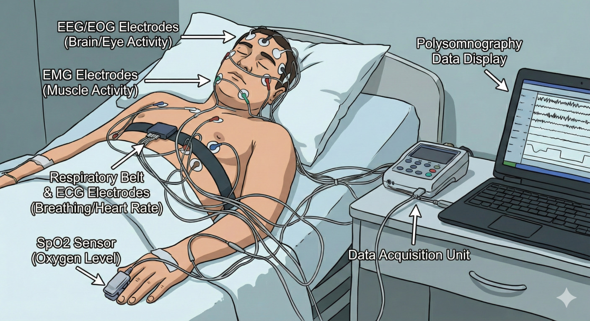

[comment]: <> ()

# Screening for Cognitive Impairment During Sleep Studies: The George B. Moody PhysioNet Challenge 2026

## <a name="summary"></a> Summary

Sleep is a fundamental physiological process that is deeply intertwined with human health. Traditionally, clinicians use sleep studies to diagnose obstructive sleep apnea, insomnia, and other sleep disorders. However, sleep studies can also reveal other chronic conditions that cause, are caused by, or are correlated with physiological changes in sleep. These findings can provide context to sleep disorders and inform the early diagnosis and treatment of other health conditions. The George B. Moody PhysioNet Challenge 2026 invites teams to develop algorithmic approaches for using polysomnography (PSG), which records various physiological signals during sleep studies, to predict future diagnoses of cognitive impairment. 

## <a name="announcements"></a> Announcements

- <a name="2026.02.10"></a>__February 10, 2026:__ The NIH-funded George B. Moody PhysioNet Challenge 2026 is [now open](https://groups.google.com/g/physionet-challenges/)! Please read this website for details and share questions and comments on [Challenge forum](https://groups.google.com/g/physionet-challenges/).

## <a name="introduction"></a> Introduction

Sleep is a vital physiological process that offers a unique window into brain, cardiovascular, metabolic, immune, and mental health. Quality sleep supports cognitive function, cardiovascular regulation, and overall well-being, while disrupted or insufficient sleep can both signal and contribute to a wide range of illnesses<sup>[1](#ref-ramar)</sup>. Polysomnography (PSG), which records multiple physiological signals during sleep, is traditionally used to diagnose disorders such as obstructive sleep apnea and insomnia. However, the value of PSG extends far beyond sleep-specific diagnoses: subtle changes in brain activity, heart rate, respiration, and other signals during sleep can reveal underlying or emerging chronic neurological, cardiovascular, and respiratory conditions<sup>[2](#ref-miller)</sup>. By capturing these patterns, sleep studies provide not only a snapshot of sleep health but also an early-warning system for broader physiological and neurological dysfunction. The George B. Moody PhysioNet Challenge 2026 leverages this potential by inviting teams to analyze PSG recordings to identify individuals at risk for future cognitive impairment, opening a path toward earlier intervention and improved long-term outcomes.

## <a name="objective"></a> Objective

For the 2026 Challenge, we ask participants to develop and implement open-source algorithms for using PSGs to predict future diagnoses of cognitive impairment. The winners of the Challenge will be the team with the highest score on the hidden test set.

## <a name="data"></a> Data

The 2026 Challenge data are from the [Human Sleep Project](https://bdsp.io/content/hsp/) database and include clinical PSG data from five different U.S. institutions: Beth Israel Deaconess Medical Center (BIDMC), Emory University, Kaiser Permanente, Massachusetts General Brigham (MGB), and Stanford University<sup>[3](#ref-sun)</sup>. Each study includes synchronized physiological signals and human and automated annotations of sleep stages, arousals, and respiratory and limb movement events. All data were de-identified following the HIPAA Safe Harbor standard and made publicly accessible (bdsp.io) under an approved IRB protocol (BIDMC IRB #2022P000417), which granted a waiver of informed consent. Each contributing site was assigned a unique identifier (S0001, I0002, I0004, I0006, 10007) to protect participant privacy.

The data were de-identified by replacing personal identifiers with random identifiers, replacing ages above 89 with a single category of "90", and shifting sleep study and diagnosis dates by randomly chosen integers between ±365 days for each patient. For participants with multiple sessions, only the first session was shared. Beyond these steps, the data remain as originally acquired, preserving the natural heterogeneity of real-world sleep studies.

We provide example code for preparing, loading, and processing the data in Python; see the [Algorithms section](#algorithms).

### <a name="physiological-signals"></a> Physiological Signals

The dataset contains raw polysomnography (PSG) recordings stored in the European Data Format (EDF). These recordings include multiple physiological modalities as illustrated in [Figure 1](#sleep-study-figure).

Since sleep studies utilize varied equipment and involve diverse patient cohorts, the signals are subject to differences in available channels, filter settings, analog-to-digital resolution, and noise levels. These discrepancies occur not only between different recording sites and individual patients but also between different signals within the same recording. Moreover, the availability, sampling rates, and representations of physiological channels exhibit significant variability both between and within different data sources. Tables [S0001](channel_fs_inventory_summary_S0001.csv), [I0002](channel_fs_inventory_summary_I0002.csv), [I0006](channel_fs_inventory_summary_I0006.csv) provide a comprehensive summary of these data characteristics for the training cohorts. A primary objective of this Challenge is the development of robust models capable of effectively utilizing these diverse representations and generalizing across inconsistent data structures.

- __Electroencephalography (EEG):__
EEG records the electrical activity of the brain via sensors placed on the scalp to reflect states such as alertness, light sleep, and deep sleep. These signals are central to understanding how brain activity evolves throughout the night. EEG channels in this dataset may be unipolar, referenced to a single electrode, or bipolar, representing the differential between electrodes. All EEG leads are provided as originally recorded and have not been re-referenced.

- __Electrooculography (EOG):__
Measures eye movements and saccades using electrical signals around the eyes. These signals help identify periods of rapid eye movement (REM) sleep and transitions between different brain states.

- __Electromyography (EMG):__
Captures electrical activity produced by muscles, typically measured from the chin or lower limbs. EMG provides information about muscle tone and movement, which changes systematically across sleep stages and can indicate abnormal motor activity during sleep.

- __Electrocardiography (ECG):__
ECG tracks the heart's electrical activity, allowing assessment of heart rate, heart rate variability, morphology and ectopic beats. These measures reflect autonomic nervous system function and can reveal cardiovascular stress or dysregulation during sleep.

- __Chest and abdominal respiratory effort sensors:__
Measure chest and abdominal movements. Can be used to estimate breathing effort and rhythm, helping characterize respiratory patterns and identify breathing disruptions.

- __Thermal or pressure-based airflow sensors:__
Measure airflow through the nose and mouth to assess the volume of air moving in and out of the lungs; when combined with respiratory effort signals, can help distinguish normal breathing from obstructive or reduced airflow events.

|<a name="sleep-study-figure"></a>|
|:--:|
|__Figure 1.__ A typical PSG recording scenario. Not all of the displayed modalities are present in all recordings, and the devices can vary from recording to recording.|

To control file sizes, only the signal channels listed in this [table](https://github.com/physionetchallenges/python-example-2025/blob/main/channel_table.csv) were retained; all others were discarded.

### <a name="algorithmic-annotations"></a> Algorithmic Annotations

The sleep stages and clinical event markers in this dataset were generated by the [Complete AI Sleep Report (CAISR)](https://pubmed.ncbi.nlm.nih.gov/40554678/), a comprehensive automated framework designed for high-fidelity sleep analysis<sup>[4](#ref-nasiri)</sup>. These markers are stored in EDF format and serve as the algorithmic annotations for the Challenge. CAISR annotations are available for training, validation, and test data. 
These markers include:

- __Sleep Stages:__
Sleep is categorized into distinct stages based on brain activity (EEG), eye movements (EOG), and muscle tone (EMG). The categories below follow the [American Academy of Sleep Medicine (AASM) standards](https://aasm.org/wp-content/uploads/2017/11/Summary-of-Updates-in-v2.0-FINAL.pdf)<sup>[5](#ref-grigg-damberger)</sup>:
    - __Wake (W):__ Represents the state ranging from full alertness to early drowsiness. EEG activity is characterized by alpha rhythms (8–13 Hz) over the occipital region when eyes are closed. If eyes are open, the EEG shows low-amplitude, mixed-frequency activity. An epoch is scored as Stage W if alpha rhythm is present for more than 50% of the duration.
    - __N1 (Non-REM 1):__ A transition stage where EEG shows low-amplitude, mixed-frequency activity (predominantly 4–7 Hz). It is characterized by slow, sinusoidal eye movements and a reduction in chin muscle tone compared to wakefulness.
    - __N2 (Non-REM 2):__ Represents stable sleep and is the most common stage in adults. This stage is defined by the presence of K-complexes (sharp negative waves followed by a positive component) and sleep spindles (11–16 Hz bursts).
    - __N3 (Non-REM 3):__ Deep sleep or "slow-wave sleep." High-amplitude, low-frequency EEG waves dominate this stage. It is considered the most restorative stage, essential for physical recovery and memory consolidation.
    - __REM (Rapid Eye Movement):__ A stage where brain activity resembles wakefulness, but muscle tone is at its lowest (atonia). This is the stage where most dreaming occurs and is vital for emotional regulation.

- __Clinical Event Markers:__
Beyond sleep stages, the dataset identifies specific events that disrupt sleep:

     - __Arousals__ are brief episodes of cortical activation during sleep, typically detected via EEG and sometimes supported by EMG or ECG.
    - __Respiratory events__, including __apneas__, are characterized by a complete pause in airflow during sleep lasting at least 10 seconds. In this dataset, categories include: 

        - __Obstructive Apnea:__ Complete pause in airflow despite continued breathing effort, caused by a blocked airway.
        _ __Central Apnea:__ Complete pause in airflow due to lack of respiratory effort from the brain.
        - __Mixed Apnea:__ Combination of central and obstructive apnea within a single event.
        - __Hypopnea:__ Partial reduction in airflow accompanied by oxygen desaturation or arousal.
        - __RERA (Respiratory Effort-Related Arousal):__ Increased breathing effort that leads to arousal without meeting apnea or hypopnea criteria.

    - __Limb movements__ are phasic movements of the arms or legs during sleep, typically detected via EMG. While isolated limb movements may be occasional, periodic limb movements occur in a repeated, rhythmic pattern and can fragment sleep or trigger brief arousals, affecting sleep quality.

The CAISR framework<sup>[4](#ref-nasiri)</sup> provides a granular, multi-modal analysis of sleep by mirroring the rigorous standards of manual clinical scoring<sup>[5](#ref-grigg-damberger)</sup>. To achieve this, CAISR integrates advanced deep learning architectures with expert rule-based logic across four primary domains:

- __Sleep Staging:__ CAISR uses a Graph Neural Network (GNN) to classify 30-second epochs into Wake, N1, N2, N3, and REM stages by capturing the complex relationships between physiological channels (EEG, EOG, and EMG). Following AASM guidelines<sup>[5](#ref-grigg-damberger)</sup>, the dataset provides the predicted sleep stage for each epoch along with the softmax probabilities, which indicate the model's confidence. Sleep stages are encoded as: 1 = N3, 2 = N2, 3 = N1, 4 = REM, and 5 = Wake, 9 = Unavailable. 
- __Arousal Detection:_ Brief cortical activations that disrupt sleep are identified using ArousalNet, a specialized model based on the U-Net architecture. This model detects transient changes in signal frequency and amplitude that indicate micro-awakenings. CAISR Arousal annotations are provided at 0.5-second resolution. For each 0.5-second interval, the dataset includes the predicted class and the softmax probabilities, reflecting the model's confidence with 0 indicating no arousal and 1 indicating arousal.
- __Respiratory Event Identification:__ The framework detects and classifies respiratory events, including obstructive, central, and mixed apneas, as well as hypopneas, using deterministic rule-based algorithms that strictly follow AASM scoring criteria<sup>[5](#ref-grigg-damberger)</sup>. This ensures clinical consistency across different sites and recording equipment. CAISR respiration annotations are provided at 1-second resolution, with the predicted class for each interval. Prediction probabilities are not available since the model is rule-based. Classes are mapped as follows: 0 = No Event, 1 = OA (Obstructive Apnea), 2 = CA (Central Apnea), 3 = MA (Mixed Apnea), 4 = HY (Hypopnea), 5 = RERA.
- __Limb Movement Analysis:__ CAISR performs automated detection of isolated and periodic limb movements using left and right EMG signals. The system applies rule-based logic following AASM scoring criteria<sup>[5](#ref-grigg-damberger)</sup> to distinguish incidental movements from rhythmic patterns that may disrupt sleep. Limb movement annotations are provided at 1-second resolution, with the predicted class for each interval. Prediction probabilities are not available since the model is rule-based. Classes are mapped as follows: 0 = No Event, 1 = Isolated Limb Movement, 2 = Periodic Limb Movement.

Note: If PSG lacks the necessary input channels for CAISR, the corresponding automated annotations will be omitted from that file.

### <a name="human-annotations"></a> Human Annotations

The training datasets also include sleep stages and clinical events annotated by trained sleep technicians following AASM guidelines<sup>[5](#ref-grigg-damberger)</sup>. Each PSG was fully reviewed from start to finish by a single human rater, although different recordings may have been annotated by different raters.

- __Sleep Stages:__ Sleep stages were scored by a human rater every 30 seconds, following AASM guidelines<sup>[5](#ref-grigg-damberger)</sup> into Wake, N1, N2, N3, and REM. Sleep stages are encoded as: 1 = N3, 2 = N2, 3 = N1, 4 = REM, and 5 = Wake, 9 = Unavailable. 
- __Arousal Events:__ Human raters marked the start and end times of arousals, rather than using fixed intervals. Classes are mapped as follows: 0 = No event, 1 = Arousal.
- __Respiratory Events:__ Human raters marked start and stop times for each respiratory event. Original event types include: 0 = No Event, 1 = Obstructive Apnea, 2 = Central Apnea, 3 =Mixed Apnea, 4 = Obstructive Hypopnea, 5 = Central Hypopnea, 6 = Mixed Hypopnea, 7 = RERA, 8 = Apnea (unspecified), 9 = Hypopnea (unspecified).

    To simplify analysis and enable comparison with CAISR outputs, participants can merge the original respiratory event classes as follows: 0 = No Event; 1 = Obstructive Apnea (OA), combining the original Obstructive Apnea (class 1) and unspecified Apnea (class 8); 2 = Central Apnea (CA); 3 = Mixed Apnea (MA); 4 = Hypopnea (HY), including all types of Hypopneas, Obstructive Hypopneas, Central Hypopneas, Mixed Hypopneas, and unspecified Hypopneas (classes 4, 5, 6, 9); and 5 = RERA. This grouping combines similar events into physiologically meaningful categories, reduces complexity, and facilitates downstream analysis and comparison with CAISR.

- __Limb Movement Events:__ Human raters marked the start and stop times for limb movements. Original labels include: 0 = No Event, 1 = Limb Movement, 2 = Periodic Limb Movement (PLM), 3 = Left Leg, 4 = Right Leg, 5 = Left Leg Flex, 6 = Right Leg Flex, 7 = Both Legs, 8 = Left Leg with Arousal, 9 = Right Leg with Arousal, 10 = Generic Movement, 11 = Left Foot Pointing/Flexing, and 12 = Right Foot Pointing/Flexing. 
Similar to respiratory events, to simplify analysis and enable comparison with CAISR outputs, participants can merge these classes into three categories: 0 = No Event, 2 = Periodic Limb Movement (PLM), and 1 = Isolated Limb Movement, where all other movement types (classes 1, 3–12), including leg movements, foot movements, flexes, generic movements, and movements with arousal, are grouped together.

### <a name="metadata"></a> Metadata

We provide patient demographic and diagnostic data for the training sets. The `demographics.csv` file, located under each partition, serves as the primary reference for linking physiological data files to clinical outcomes and patient characteristics. The metadata files include the following information:

- `SiteID`: Identifier of the data collection site where the sleep study was conducted.
- `BDSPPatientID`: Unique patient identifier on the [Brain Data Science Platform (BDSP)](https://bdsp.io/).
- `CreationTime`: Timestamp indicating when the record was first created in the database.
- `BidsFolder`: Standardized [Brain Imaging Data Structure (BIDS)](https://www.nature.com/articles/s41597-019-0104-8) directory name linking metadata to physiological data files.
- `SessionID`: Identifier for the specific sleep study session/visit for a patient.
- `Age`: Patient age (in years) at the time of the sleep study.
- `Sex`: Sex of the patient as recorded in the clinical data.
- `Race`: Patient-reported race category. Categories include Asian, Black, White, Others, Unavailable.
- `Ethnicity`: Patient-reported ethnicity or ethnic background. Categories include Hispanic, Not Hispanic, Unavailable.
- `BMI`: Body mass index (BMI) extracted from available clinical measurements around the time of the sleep study.
- `Time_to_Event`: Time (in days) from the PSG to the first recorded cognitive impairment diagnosis; empty if no diagnosis occurred. This variable will only be available in the training set.
- `Cognitive_Impairment`: Binary indicator of cognitive-impairment outcome. `TRUE` indicates that the patient developed and was diagnosed with cognitive impairment (mild cognitive impairment, Alzheimer's disease, or dementia), defined as having at least two qualifying ICD-9/ICD-10 codes with both at least 3 years and one no more than 7 years after the sleep study with at least one week between the diagnoses, see [Scoring](#scoring) for details. `FALSE` indicates that the patient had no cognitive impairment diagnoses and had at least 7 years of follow-up data (6 years for site I0002). This variable will only be available in the training set.
- `Last_Known_Visit_Date`: Date of the patient's most recent clinical follow-up. This variable will only be available in the training set.
Time_to_Last_Visit: Follow-up duration (in days) from the PSG to the last known visit for the patient. This variable will only be available in the training set.

Please note that diagnosis information is extracted based on ICD-9 and ICD-10 codes. This [table](ICD_codes.csv) summarizes the ICD codes used to define mild cognitive impairment, Alzheimer's disease, and dementia.

### <a name="splits"></a> Training, Validation, and Test Sets

We partitioned the Challenge data into training, validation, and test sets:

- __Training set:__ The training set is publicly available. It includes 780 recordings (totaling 5,913 hours, with an average of 7.58 hours per recording) from three sources (S0001, I0002, I0006) with PSG data, algorithmic annotations, human annotations, metadata, and diagnoses. To reduce file sizes, this dataset is artificially balanced to include approximately equal numbers of participants with and without cognitive impairment diagnoses.
- __Validation set:__ The validation set is hidden so that we can evaluate teams on it during the Challenge. It includes recordings from one source with PSG data, algorithmic annotations, and metadata; human annotations and diagnoses are not included in the validation set. The data source is different from the data sources for the training and test sets. Unlike the training set, this dataset was not artificially balanced, and it has a prevalence rate of 5%-15% for cognitive impairment.
- __Test set:__ The test set is hidden so that we can evaluate teams on it once after the Challenge. It includes recordings from one source with PSG data, algorithmic annotations, and metadata; human annotations and diagnoses are not included in the test set. The data source is different from the data sources for the training and validation sets.  Unlike the training set, this dataset was not artificially balanced, and it has a prevalence rate of 5%-15% for cognitive impairment.
- __Supplementary Set:__ We have included 10 examples from each of the sources of the validation and test sets to illustrate signal properties, channel naming conventions, and file structures. These recordings are not parts of the validation or test sets. These recordings do not include any other information.

### <a name="structure"></a> Directory Structure and Data Types

Each data partition follows a consistent sub-folder structure:

- `physiological_data/`: Raw physiological signals in European Data Format (EDF)[https://www.edfplus.info/specs/edf.html] format.
- `algorithmic_annotations/`: Automated sleep/event annotations generated by the CAISR pipeline.
- `human_annotations/`: Gold-standard clinical annotations from sleep experts (only available in `training set`).
- `demographics.csv`: A centralized mapping file containing clinical labels (e.g., `Cognitive_Impairment`) and demographics.

The folders are organized as follows:

```
training_set/
├── physiological_data/
│   ├── S0001/ (572 records) | I0002/ (54 records) | I0006/ (154 records)
├── algorithmic_annotations/
│   ├── S0001/ (566 records) | I0002/ (54 records) | I0006/ (146 records)
├── human_annotations/
│   ├── S0001/ (572 records) | I0002/ (54 records) | I0006/ (154 records)
└── demographics.csv

validation_set/
├── physiological_data/
│   └── I0004/
├── algorithmic_annotations/
│   └── I0004/
└── demographics.csv

test_set/
├── physiological_data/
│   └── I0007/
├── algorithmic_annotations/
│    └── I0007/
└── demographics.csv

supplementary_set/
├── physiological_data/
│   └── I0004/ (10 records) | I0007/ (10 records)
└── demographics.csv
```

To link metadata to signal files, use the `BidsFolder`and `SessionID`. For example, a metadata entry with BidsFolder `sub-S0001111197789` and SessionID `2` corresponds to `training_set/physiological_data/S0001/sub-S0001111197789-ses2.edf`.

### <a name="data-access"></a> Data Access

The original data are stored on the [Brain Data Science Platform](https://bdsp.io/content/hsp/). The challenge dataset represents a curated subset of the original data and is publicly available on [Kaggle](https://www.kaggle.com/datasets/physionet/physionetchallenge2026data/).

## <a name="registration"></a>Registering for the Challenge and Conditions of Participation

To participate in the Challenge, [register your team](https://forms.gle/hQPUQ8w4hb1MmGHa7) by providing the full names, affiliations, and official email addresses of your entire team before you submit your code. The details of all authors must be exactly the same as the details in your abstract submission to [Computing in Cardiology](http://www.cinc2026.org/). You may update your author list by completing [this form](https://forms.gle/hQPUQ8w4hb1MmGHa7) again (read the form for details), but changes to your authors must not contravene [the rules](#rules) of the Challenge.

## <a name="algorithms"></a> Algorithms

Each team must develop and implement an algorithm that, given a PSG and basic demographic data, predicts whether the patient will be diagnosed with cognitive impairment diagnosis in the future.

We implemented an example algorithm in [Python](https://github.com/physionetchallenges/python-example-2026). Other implementation languages will be considered upon request. The code repository contains details for the examples and other helpful scripts and functions. These examples were not designed to perform well but to provide minimal working examples of how to work with the Challenge data for the Challenge task.

Teams submit their code, including working training code, in a GitHub or GitLab repository by submitting a form. During the Challenge, we will train each entry on the training set and evaluate it on the validation set. After the Challenge, we will train entries on the training set and evaluate them on the test set. We try to provide feedback about the entry (a score on the validation set for successful entries and an error message for unsuccessful entries) within 72 hours of submission.

Please see the [submission instructions](submissions) for detailed information about how to submit a successful Challenge entry, double check your code (we cannot debug your code for you), and submit your algorithm when ready. We will provide feedback on your entry as soon as possible, so please wait at least **72 hours** before contacting us about the status of your entry.

Please note that you remain the [owners](#ip) of any code that you submit, and we encourage you to use an [open-source license](#open).

## <a name="scoring"></a> Scoring

Each team must develop and implement an algorithm that, given a PSG and basic demographic data, predicts the time to a cognitive impairment diagnosis, or if the patient will not be diagnosed with cognitive impairment.

To that end, we define three groups of patients:

1. Patients with future cognitive impairment diagnoses, i.e., two or more diagnoses from this [table](ICD_codes.csv) with one diagnosis at least 3 years and no more than 7 years after the sleep study with at least one week between the diagnoses.
2. Patients without cognitive impairment diagnoses and at least 7 years of data, i.e., no diagnoses from this [table](ICD_codes.csv) at any time, unless the dataset had fewer years of data after diagnosis. 
3. All other patients, including
    - patients with two or more diagnoses from this [table](ICD_codes.csv) with a diagnosis less than 3 years after the sleep study;
    - patients with one or more diagnoses from this [table](ICD_codes.csv) but not for at least 3 years.
    - patients with less than 7 years of data, e.g., patients who died or left the healthcare system but would have or may have had a cognitive impairment diagnosis, unless the dataset had fewer years of data after diagnosis.

We compute the area under the receiver-operating characteristic curve (AUROC) between patients in Group 1 and Group 2.

This metric and other traditional metrics are [implemented](https://github.com/physionetchallenges/python-example-2026) in the `evaluate_model` script.

## <a name="rules"></a> Overview of rules

There are two phases for the Challenge: an unofficial phase and an official phase. The unofficial phase of the Challenge allows us to introduce and "beta test" the data, tasks, evaluation metrics, and submission system before the official phase of the Challenge. Participation in the unofficial phase is mandatory for rankings and prizes because it helps us to improve the official phase.

Entrants may have an overall total of up to 15 scored entries over both the unofficial and official phases of the competition (see the below table). We will evaluate these entries on the validation set during the unofficial and official phases, and we will evaluate at most one successful official phase entry from each team on the test set after the official phase. All deadlines occur at 11:59pm GMT on the dates mentioned below, and all dates are during 2026 unless indicated otherwise. If you do not know the difference between GMT and your local time, then find it out before the deadline!

__Please__ submit your entries early to ensure that you have the most chances for success. If you wait until the last few days to submit your entries, then you may not receive feedback before the submission deadline, and you may be unable to resubmit your entries if there are unexpected errors or issues with your submissions. Every year, several teams wait until the last few days to submit their first entry and are unable to debug their work before the deadline.

### Timing and priority of entries

Although we score on a first-come-first-serve basis, please note that if you submit more than one entry in a 24-hour period, your second entry may be deprioritized compared to other teams' first entries. If you submit more than one entry in the final 24 hours before the Challenge deadline, then we may be unable to provide feedback or a score for more than one of your entries. It is unlikely that we will be able to debug any code in the final days of the Challenge.

For these reasons, we strongly suggest that you start submitting entries at least 5 days before the unofficial deadline and 10 days before the official deadline. We have found that the earlier teams enter the Challenge, the better they do because they have time to digest feedback and performance. We therefore suggest entering your submissions many weeks before the deadline to give yourself the best chance for success.

### <a name="key-dates-deadlines"></a> Key dates/deadlines

|                                            | Start               | End                               | Submissions                          |
|--------------------------------------------|---------------------|-----------------------------------|--------------------------------------|
| Unofficial phase                           | 10 February 2026    | 09 April 2026                     | 1-5 scored entries ([\*](#1ast))     |
| Hiatus                                     | 10 April 2026       | 10 May 2026                       | N/A                                  |
| Abstract deadline                          | 15 April 2026       | 15 April 2026                     | 1 abstract                           |
| Official phase                             | 11 May 2026         | Late August 2026                  | 1-10 scored entries ([\*](#1ast))    |
| Abstract decisions released                | Mid-June 2026       | Mid-June 2026                     | N/A                                  |
| Wild card entry date                       | 31 July 2026        | 31 July 2026                      | N/A                                  |
| Hiatus                                     | Late August 2026    | Late September 2026               | N/A                                  |
| Deadline to choose algorithm for test data | Late August 2026    | Late August 2026                  | N/A                                  |
| Preprint deadline                          | Late August 2026    | Late August 2026                  | One 4-page paper ([\*\*](#2ast))     |
| Conference                                 | 20 September 2026   | 23 September 2026                 | 1 presentation ([\*\*](#2ast))       |
| Final scores released                      | Late September 2026 | Late September 2026                | N/A                                  |
| Final paper deadline                       | Early October 2026  | Early October 2026                | One 4-page paper ([\*\*\*](#3ast))   |

<a name="1ast"></a>(\* Entries that fail to score do not count against limits.)

<a name="2ast"></a>(\*\* Must include preliminary scores.)

<a name="3ast"></a>(\*\*\* Must include final scores, your ranking in the Challenge, and any updates to your work as a result of feedback after presenting at CinC. This final paper deadline is earlier than the deadline given by CinC so that we can check these details.)

To be eligible for the open-source award, you must do all the following:

1. Register for the Challenge [here](https://forms.gle/hQPUQ8w4hb1MmGHa7).
2. Submit at least one open-source entry that can be scored during the unofficial phase.
3. [Submit an abstract to CinC](https://cinc.org/inf_authors/) by the abstract submission deadline. Include your team name and score from the unofficial phase in your abstract. Please select "PhysioNet/CinC Challenge" as the topic of your abstract so that it can be identified easily by the abstract review committee. __Please__ read ["Advice on Writing an Abstract"](#abstracts) for important information on writing a successful abstract.
4. Submit at least one open-source entry that can be scored during the official phase.
5. [Submit a full 4-page paper](https://cinc.org/inf_authors/) on your work to CinC by the above preprint deadline.
6. One of your team members must attend [CinC 2026](http://www.cinc2026.org/) to present your work either orally or as a poster (depending on your abstract acceptance). If you have a poster, then you must stand by it to defend your work. No-shows (oral or poster) will be disqualified. One of your team members must also attend the closing ceremony to collect your prize. No substitutes will be allowed. If the conference permits remote attendance, then you will be eligible for ranking if you attend remotely (and fulfill the other required criteria), but teams must attend in person for prize eligibility.
7. [Submit a full 4-page paper](https://cinc.org/inf_authors/) on your work to CinC by the above final paper deadline. Please note that we expect the abstract to change significantly both in terms of results and methods. You may also update your title with the caveat that it must not be substantially similar to the title of the competition or contain the words "physionet," "challenge," or "competition."

You must not submit an analysis of this year's Challenge data to other conferences or journals until after CinC 2026 so that we can discuss the Challenge in a single forum. If we discover evidence that you have submitted elsewhere before the end of CinC 2026, then you will be disqualified and de-ranked on the website, banned from future Challenges, and the journal/conference will be contacted to request your article be withdrawn for contravention of the terms of use.

There are many reasons for this policy: (1) we do not release results on the test data before the end of CinC, and only reporting results on the training data increases the likelihood of overfitting and is not comparable to the official results on the test data, and (2) attempting to publish on the Challenge data before the Challengers present their results is unprofessional and comes across as a territorial grab. This requirement stands even if your abstract is rejected, but you may continue to enter the competition and receive scores. (However, unless you are accepted into the conference at a later date as a "wild card" entry, you will not be eligible to win a prize.) Of course, any publicly available data that was available before the Challenge is exempted from this condition, but any of the novelty of the Challenge (the Challenge design, the Challenge data that you downloaded from this page because it was processed for the Challenge, the scoring function, etc.) is not exempted.

After the Challenge is over and the final scores have been posted (in late September), everyone may then submit their work to a journal or another conference.

### <a name="wild-card"></a> Wild Card Entries

If your abstract is rejected or if you otherwise failed to qualify during the unofficial period, then there is still a chance to present as CinC and win the Challenge. A "wild card" entry has been reserved for a high-scoring entry from a team that was unable to submit an accepted abstract to CinC by the original abstract submission deadline. A successful entry must be submitted by the wild card entry deadline. We will contact eligible teams and ask them to submit an abstract. The abstract will still be reviewed as thoroughly as any other abstract accepted for the conference. See [Advice on Writing an Abstract](#abstracts).

### <a name="abstracts"></a> Advice on Writing an Abstract

To improve your chances of having your abstract accepted, we offer the following advice:

- Ensure that all of your authors agree on your abstract, and be sure that all of the author details match your registration information, including email addresses.
- Stick to the word limit and deadline on the [conference website](http://www.cinc.org/cinc-conference-program-abstracts/). Include time for errors, internet outages, etc.
- Select "PhysioNet/CinC Challenge" as the submission topic so it can be identified easily by the abstract review committee. However, do not include the words "PhysioNet" or "PhysioNet/CinC" or "Challenge" in the title because this creates confusion with the hundreds of other articles and the main descriptor of the Challenge.
- Your title, abstract and author list (collaborators) can be modified in September when you submit the final paper.
- While your work is bound to change, the quality of your abstract is a good indicator of the final quality of your work. We suggest you spell check, write in full sentences, and be specific about your approaches. Include your method's cross validated training performance (using the Challenge metrics) and your score provided by the Challenge submission system. If you omit or inflate this latter score, then your abstract will be rejected.
- Do not be embarrassed by any low scores. We do not expect high scores at this stage. We are focused on the thoughtfulness of the approach and quality of the abstract.
- If you are unable to receive a score during the unofficial phase, then you can still submit, but the work should be of very high quality and you should include the cross validation results of your algorithm on the training set.

You will be notified if your abstract has been accepted by email from CinC in June. You may not enter more than one abstract describing your work in the Challenge. We know you may have multiple ideas, and the actual abstract will evolve over the course of the Challenge. More information, particularly on discounts and scholarships, can be found [here](https://cinc.org/inf_authors/). We are sorry, but the Challenge Organizers do not have extra funds to enable discounts or funding to attend the conference.

Again, we cannot guarantee that your code will be run in time for the [CinC](http://cinc.org/) abstract deadline, especially if you submit your code immediately before the deadline. It is much more important to focus on writing a high-quality abstract describing your work and submit this to the conference by abstract deadline. Please follow [these instructions](#abstracts) here carefully.

Please make sure that __all of your team members are authors on your abstract__. If you need to add or subtract authors, do this at least a week before the abstract deadline. Asking us to alter your team membership near or after the deadline is going to lead to confusion that could affect your score during review. It is better to be more inclusive on the abstract in terms of authorship, though, and if we find authors have moved between abstracts/teams without permission, then this is likely to lead to disqualification. As noted above, you may change the authors/team members later in the Challenge.

Please make sure that you include __your team name__, your __official score__ as it appears on the leaderboard, and __cross validation results__ in your abstract __using the scoring metrics for this year's Challenge__ (especially if you are unable to receive a score or are scoring poorly). The novelty of your approach and the rigor of your research is much more important during the unofficial phase. Please make sure you describe your technique and any novelty very specifically. General statements such as "a 1D CNN was used" are uninformative and will score poorly in review.

The Challenge Organizers have no ability to help with any problems with the abstract submission system. We do not operate it. Please do not email us with issues related to the abstract submission system.

### <a name="ip"></a><a name="open"></a> Intellectual Property and Open-Source Licenses

Please note that each team remains the owners of their code and retain the intellectual property (IP) of their code. We encourage the use of open-source licenses for your entries.

Entries with non open-source licenses will be scored but not ranked in the official competition. All scores will be made public. At the end of the competition, all entries will be posted publicly, and therefore automatically mirrored on several sites around the world. We have no control over these sites, so we cannot remove your code even on request. Code which the organizers deem to be functional will be made publicly available after the end of the Challenge. You can request to withdraw from the Challenge, so that your entry's performance is no longer listed in the official leaderboard, up until a week before the end of the official phase. However, the Organizers reserve the right to publish any submitted open-source code after the official phase is over. The Organizers also retain the right to use a copy of submitted code for non-commercial use. This allows us to re-score if definitions change and validate any claims made by competitors.

If no license is specified in your submission, then the license given in the example code will be added to your entry, i.e., we will assume that you have released your code under the [BSD 3-Clause license](https://opensource.org/licenses/BSD-3-Clause).

## <a name="collaboration"></a> Rules on Competing in Teams / Collaboration

To maintain the scientific impact of the Challenges, it is important that all Challengers contribute truly independent ideas. For this reason, we impose the following rules on team composition/collaboration:

1. Multiple teams from a single entity (such as a company, university, or university department) are allowed as long as the teams are truly independent and do not share team members (at any point), code, or any ideas. Multiple teams from the same research group or company unit are not allowed because of the difficulty of maintaining independence in those situations. If there is any question on independence, the teams will be required to supply an official letter from the company that indicates that the teams do not interact at any point (socially or professionally) and work in separate facilities, as well as the location of those facilities.
2. You can join an existing team before the abstract deadline as long as you have not belonged to another team or communicated with another team about the current Challenge. You may update your author list by completing [this form](https://forms.gle/hQPUQ8w4hb1MmGHa7) again (check the "Update team members" box on the form), but changes to your authors must not contravene [the rules](#collaboration) of the Challenge.
3. You may use public code from another team if they posted it before the competition.
4. You may not make your Challenge code publicly available during the Challenge or use any code from another Challenger that was shared, intentionally or not, during the course of the Challenge.
5. You may not publicly post information describing your methods (blog, vlog, code, preprint, presentation, talk, etc.) or give a talk outside your own research group at any point during the Challenge that reveals the methods you have employed or will employ in the Challenge. Obviously, you can talk about and publish the same methods on other data as long as you don't indicate that you used or planned to use it for the Challenge.
6. You must use the same team name and email address for your team throughout the course of the Challenge. The email address should be the same as the one used to register for the Challenge, and to submit your abstract to CinC. Note that the submitter of the conference article/code does not need to present at the conference or be in any particular location in the author order on the abstract/poster/paper, but they must be a contributing member of the team. If your team uses multiple team names and/or email addresses to enter the Challenge, then please contact the Organizers immediately to avoid disqualification of all team members concerned. Ambiguity will result in disqualification.
7. If you participate in the Challenge as part of a class project, then please treat your class as a single team — please use the same team name as other groups in your class, limit the number of submissions from your class to the number allowed for each team, and feel free to present your work within your class. If your class needs more submissions than the Challenge submission limits allow, then please perform cross-validation on the training data to evaluate your work.

If we discover evidence of the contravention of these rules, then you will be ineligible for a prize and your entry publicly marked as possibly associated with another entry. Although we will contact the team(s) in question, time and resources are limited and the Organizers must use their best judgment on the matter in a short period of time. The Organizers' decision on rule violations will be final.

Similarly, no individual who is affiliated with the same research group, department, or similar organization unit (academic or industry) as one or more of the Organizers of that year's Challenge researchers may officially participate in the Challenge for that year, even if they do not collaborate with Organizers. If you are uncertain if your shared affiliation disallows you from officially participating, then please contact the Challenge Organizers for clarification. This rule is to prevent concerns about independence or favoritism.

## Checking Your Code to Avoid Disqualification

Please note, as we do every year, we will perform some simple tests on your code to ensure it is more usable and reusable. We suggest you also try these similar approaches, including:

1. Change the data and/or labels in the training set. Does your code work with missing, unknown, non-physiological values in the data? Does your code work if you change the prevalence rates of the classes or remove one of the classes? (It will probably have a slightly different performance, but that is to be expected.)
2. Change the size of the training set. You can extract a subset of the training set or duplicate the training set. Does your code work with a training set that is 15% or 150% of the size of the original training set? (Again, your performance will differ, but the code should still execute.)
3. Run your training code on the modified training set. If your training code fails, then your code is too sensitive to the changes in the training set, and you should update your code until it works as expected.
4. Score the resulting model on part of the unmodified training set — ideally, data that you did not use to train your model. If your code fails, or if the model trained on the modified training set receives the same scores or almost the same scores as the model trained on the unmodified training set, then your training code didn't learn from the training set, and you should update your code until it works as expected.

Again, this is a simplified process, and we may change how we stress test your code in future tests (such as randomizing the labels), so please think about how you can ensure that your code isn't dependent on a single set of data and labels or a single test for robustness. Of course, you should also try similar steps to check the rest of your code as well.

All of this work is in service of protecting your scientific contributions over the course of the Challenge, and we appreciate, as always, your feedback and help.

## <a name="conference"></a>Conference Attendance

[CinC 2026](https://cinc2026.org/) will take place over 20-23 September 2026 in Madrid, Spain. You must attend the whole conference to be eligible for prizes. If you send someone in your place who is not a team member or co-author, then you will be disqualified and your abstract will be removed from the proceedings. In particular, it is vital that the presenter (oral or poster) can defend your work and have in-depth knowledge of all decisions made during the development of your algorithm. Only in-person attendees are eligible for prize money. If you require a visa to attend the conference, we strongly suggest that you apply as soon as possible. Please contact the local [conference](https://cinc2026.org/) organizing committee (not the Challenge Organizers) for any visa sponsorship letters and answer any questions concerning the conference.

### Obtaining Complimentary MATLAB Licenses

[MathWorks](http://www.mathworks.com/) has generously offered to provide complimentary MATLAB licenses to all teams that wish to use MATLAB. Users can apply for a license and learn more about MATLAB support by visiting the [this page](https://www.mathworks.com/academia/academic-support/student-competition-individual-team.html) from MathWorks. If you have questions or need technical support, then please contact MathWorks at studentcompetitions@mathworks.com.

## <a name="acknowledgements"></a> Acknowledgements

Supported by the [National Institute of Biomedical Imaging and Bioengineering](https://www.nibib.nih.gov/) (NIBIB) under NIH grant R01EB030362.

## References

1. <a name="ref-ramar"></a> Ramar K, Malhotra RK, Carden KA, Martin JL, Abbasi-Feinberg F, Aurora RN, Kapur VK, Olson EJ, Rosen CL, Rowley JA, Shelgikar AV, Trotti LM. Sleep is essential to health: an American Academy of Sleep Medicine position statement. J Clin Sleep Med. 2021 Oct 1;17(10):2115-2119. doi: [10.5664/jcsm.9476](https://doi.org/10.5664/jcsm.9476).
2. <a name="ref-miller"></a> Miller MA. "The Role of Sleep and Sleep Disorders in the Development, Diagnosis, and Management of Neurocognitive Disorders." Frontiers in Neurology, vol. 6, 2015, doi: [10.3389/fneur.2015.00224](10.3389/fneur.2015.00224).
3. <a name="ref-sun"></a> Sun H, Ganglberger W, Nasiri S, Gupta A, Ghanta M, Moura VJ, Cash S, Stone K, Zhang Z, Ganjoo G, Nassi TE, Wei R, Meulenbrugge E, Au R, Clifford G, Trotti LM, Hwang D, Mignot E, Katwa U, Westover, MB (2023). The Human Sleep Project (version 2.0). Brain Data Science Platform. doi: [doi.org/10.60508/qjbv-hg78](https://doi.org/10.60508/qjbv-hg78).
4. <a name="ref-nasiri"></a> Nasiri S, Ganglberger W, Nassi T, Meulenbrugge EJ, Moura Junior V, Ghanta M, Gupta A, Stone KL, Kjaer MR, Sum-Ping O, Mignot E, Hwang D, Trotti LM, Clifford GD, Katwa U, Sun H, Thomas RJ, Westover MB. CAISR: achieving human-level performance in automated sleep analysis across all clinical sleep metrics. Sleep. 2025 Aug 14;48(8):zsaf134. doi: [10.1093/sleep/zsaf134](https://doi.org/10.1093/sleep/zsaf134).
5. <a name="ref-grigg-damberger"></a> Grigg-Damberger, MM. "The AASM Scoring Manual four years later." Journal of Clinical Sleep Medicine 8, no. 3 (2012): 323-332. doi: [10.5664/jcsm.1928](https://doi.org/10.5664/jcsm.1928).
